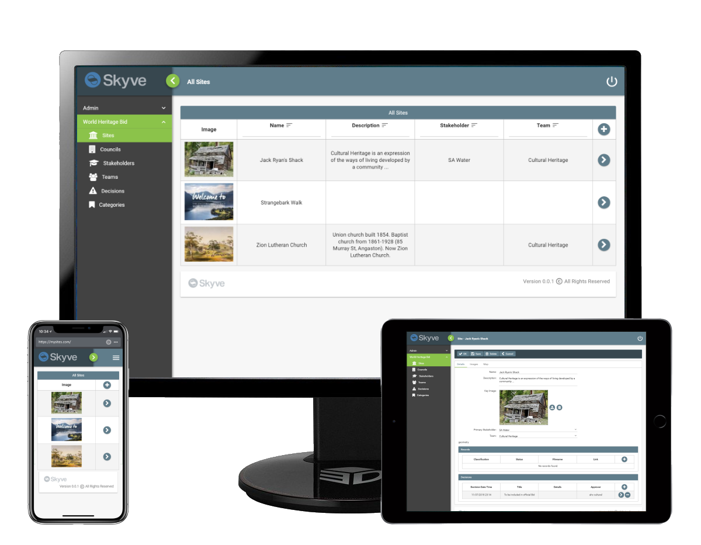

  

  

## Introduction

### Contents

* [Section 1: Introduction](#introduction)
  * **[Note to Readers](#note-to-readers)**
  * **[What is Skyve?](#what-is-skyve)**
  * **[Architectural Overview](#architectural-overview)**
    * [Technical description](#technical-description)
    * [General Approach and Design Principles](#general-approach-and-design-principles)
    * [Use of SQL](#use-of-sql)
    * [Multi-tenant Mass-Customisation](#multi-tenant-mass-customisation)
    * [Open-source Inclusions ](#open-source-inclusions)
  * [Concepts](_pages/concepts.md)
  * [Security, Persistence and Access control](_pages/security-persistence-and-access-control.md)
  * [Exception Handling](_pages/exception-handling.md)
* [Section 2: Building Applications](_pages/building-applications.md)
  * [Customers](_pages/customers.md)
  * [Modules](_pages/modules.md)
  * [Documents](_pages/documents.md)
  * [Converters](_pages/converters.md)
  * [Bizlets](_pages/bizlets.md)
  * [Views](_pages/views.md)
  * [Actions](_pages/actions.md)
  * [Reports](_pages/reports.md)
  * [Jobs](_pages/jobs.md)
  * [Utility Classes](_pages/utility-classes.md)
  * [Common Patterns](_pages/common-patterns.md)
  * [Skyve Persistence Mechanisms](_pages/skyve-persistence-mechanisms.md)
* [Platform Tools](_pages/maven-targets.md)
  * [Maven Targets](_pages/maven-targets.md)
  * [Content Repository Tools](_pages/content-repository-tools.md)
  * [Bizport](_pages/bizport.md)
  * [Wildcat Conversion Tool](_pages/wildcat-conversion-tool.md)
  * [Automated Unit Testing](_pages/automated-unit-testing.md)
* [Section 5: Appendix](_pages/appendix.md)
  * [Appendix 1: Deploying a Skyve Application](_pages/appendix.md)
  * [Appendix 2: Installing and configuring the Skyve Development Environment](_pages/appendix.md)
  * [Appendix 3: Example Deployment Instructions with Single Sign-on](_pages/appendix.md)
  * [Appendix 4: Example Deployment Problems caused by problems in the .json file](_pages/appendix.md)
  * [Appendix 5: Installing Skyve in Production](_pages/appendix.md)

## What is Skyve?

Skyve is an open-source low-code platform that gives you access to all of the key capabilities needed to build sophisticated, robust and scalable cloud solutions. 

Skyve is platform/operating-system independent, works with all common database types, and is accessible through all common browsers and devices.

By incorporating and integrating a range of other open-source technologies to handle persistence, rich UI, security, navigation, reporting, jobs, content, spatial, mobile integration; Skyve provides a platform with all the technology specific areas required to support the Skyve standard for enterprise applications.

Skyve also provides sophisticated validation and a high-level API so that you can build powerful enterprise SaaS solutions today.

At any time, branch out into "traditional" development without restriction, but will all the benefits of the API and integrated platform.

Skyve supports spatial concepts natively with MySQL, SQL Server and H2 - Oracle and Postgres coming soon. Otherwise, pretty much anything supported by Hibernate should work (but we haven't tested them all!).

For more details on the framework and its capabilities, please check out the platform homepage - [www.skyve.org](https://skyve.org/).

## Note to Readers

This reference guide assumes familiarity with Web technology and
architecture, Java EE concepts, the Java language and the use of common
development tools like Eclipse.

Skyve makes the job of developers simpler and more robust, however it is
not intended as a replacement for software development experience.

Skyve is focused on making developers more productive and
lowering the costs associated with building sophisticated enterprise
solutions.

### User Guide

The user guide is available at [https://skyvers.github.io/skyve-user-guide/](https://skyvers.github.io/skyve-user-guide/). The user guide is for end users of Skyve applications and describes how to navigate around the user interface and make use of the built in functions that ship with Skyve.

### Skyve Cookbook

The Skyve Cookbook is available at [github.com/skyvers/skyve-cookbook](https://github.com/skyvers/skyve-cookbook). This contains code samples of advanced usage such as REST API configuration and troubleshooting advice.

### Skyve Readme

The skyve project contains a Readme at [github.com/skyvers/skyve](https://github.com/skyvers/skyve) with useful information for getting started, configuring Spring security and other steps to get you started.

## Architectural Overview

Skyve is an open-source low-code Enterprise Platform both for
development and runtime.

Skyve integrates more than 50 other open-source frameworks and libraries
as well as our own original intellectual property (now also open-source)
and we are regularly adding more and updating those included. Skyve
provides a high level abstraction API of all of these to the developer,
giving them the ability to create high quality applications spanning
technologies which they would be unlikely to gain enough expertise in to
use in a robust solution. This means that Skyve enables smaller
development teams to match the output of large teams with specific
expertise groupings.

As a runtime engine, Skyve enforces a declarative security model,
performant persistence interactions, optimises packet sizes for
interactions, thread-safe types and provides a pluggable rendering
architecture, routing control and sophisticated administration and data
maintenance tools.

As a low-code platform, for most applications Skyve requires only small
amounts of very high level Java code, compared to traditional
development platform - for example most applications developers will not
need to create any SQL, HTML or Javascript - but will be able to create
enterprise scale applications which automatically render for most
devices and browsers, include mapping and spatial queries, allow
attachment and uploading of various files and content, provide federated
text searching across both modelled database rows and file attachments.

In many cases, significant proportions of capability can be created
declaratively - with no programming code and Skyve automatically has a
declarative approach to security, menus and navigation,
create-read-update-delete activities, sophisticated n-level
transactional demarcation, automatic database creation and manipulation
along with the usual searching, filtering and reporting capabilities.

Behaviours required for navigation and to maintain, filter and report
data are created automatically by Skyve but can be extended and
customised where necessary. To extend the application, actions
(behaviours) can be written in Java or Groovy, hooking into a predefined
event lifecycle.

Skyve provides a high level programming interface (API), incorporating
thread-safe business types, a simple binding mechanism and persistence
utilities - significantly reducing the amount and complexity of
Developer code and avoiding common security and threading issues.

For example, Skyve has the ability to automatically generate a
consistent and highly usable UI layout to suit the domain model and user
interactions. Even where a more tailored layout is required, this is
done at a high level of abstraction so that the UI can be interpreted
and rendered for phones and tablets and support resizing and zoom for
accessibility.

Uniquely, skyve provides thorough domain validation on a continual basis
for developers - maintaining the code base in a production ready state
and immediately identifying change impact analysis as the developer
works.

A side benefit of this approach is very rapid development - and always
in a production-ready state - secure, robust and scalable from the very
first build.

Skyve applications are developed independent of any specific operating
system, device, browser or database technology. It is quite common for
Skyve development teams to be using a range of different development
environments while working on the same project - as developers may have
their own preferences for their own development environment.

Skyve also provides a revolutionary database independent backup and
restore facility for the combined relational ("SQL") and "non-SQL" data store -
which means support teams can backup from production instances running
on different operating systems and database technologies and restore to
another environment seamlessly.

Skyve applications may be created from legacy applications using the
WILDCAT Conversion Tool (WCT), which combines Extract-Transform-Load
(ETL) with metadata generation and code generation capabilities.

### Technical description

Technically, Skyve is an open-source ***meta-data driven data-centric
business component application platform*** designed for rapid
development of high-quality, secure Web applications.

***'Meta-data driven'*** means that applications are controlled by
high-level specification of requirements (meta-data) rather than by
programming code.

***'Data-centric'*** reflects an approach which recognises that the
nature of the data being maintained implies the functionality required
to maintain it.

***'Business component platforms'*** organise all information relating
to a business concept in a single location - to reduce the risks arising
from changes or enhancements to the business requirements and to ensure
consistency.

Skyve is developed in Java and integrates a range of open-source
frameworks including Hibernate and Jasper reports.

### General Approach and Design Principles

The Skyve Enterprise Platform was created in reaction to problems
experienced with applications built using traditional approaches, and
Skyve is designed specifically to assist developers avoid these
problems.

Skyve is created from the following design principles:

  Principle | Description | In Simple Terms
  --------- | ----------- | ----------------
  Parsimony | Only the minimum amount of information required to declare a system should be required to build the system.  This principle implies the provision of implicit functionality and features - but with the ability for developers to override these without restriction where required. | Developers shouldn't need to spend effort to create aspects of the system which are implicit.
  Authority | Each element of system declaration should be authoritative. This principle implies that each element of declaration must be in only one location. | Developers should be able to declare each system concept once, without the possibility of contradiction or confusion.
  Independence | The effort required to build a system should be reusable across different technologies and therefore independent from any specific implementation. This principle implies human-readable platform independent formats for application declaration. | Developers should be able to reuse development effort when technology changes or updates.
  Security | Best-practice security must not be able to be compromised by simple error or omission. This principle implies the provision of transparent security, with user permissions assigned declaratively rather programmatically. | Developers should not be able to accidentally compromise system security.
  Scalability | The declaration of a system should not impact the ability to grow the system. This principle implies the transparent provision of best-practice information techniques. | Developers should be able to devise functionality of systems without limiting future capability.
  Maintainability | The declaration of a system must be able to be changed with minimum effort and risk. In addition to the parsimonious implication that changes be made with the minimum information required to declare the change, this principle implies the provision of extensive validation of the system declaration to mitigate the risk of introducing errors. | Developers should be able to make changes to the system with confidence that the change they are making is conceptually correct and will not result in system failure.   
  Exit | By the principle of independence, the declaration of a system must be reusable at the end-of-life either for replacement or incorporation into other systems. In addition to the implications from parsimony and independence, this principle implies that the format of system declaration correlates clearly and obviously to the requirements of the system. | The system declaration must be self-describing so that it can inform (or be reused in) other systems. Data must be accessible via a range of technologies and always exist in a valid state.

_Skyve design principles_

***Unless an application complies with these principles, it represents a
significant risk to the organisation in terms of usability,
maintainability, scalability, integrity, security, cost, lifetime and/or
ability to exit.***

The implications of these principles, as expressed as high level
requirements, are as follows:

  Principle | Implication
  --------- | -----------
  Parsimony | Skyve shall allow developers to define applications using the smallest amount of information possible.  The application specification shall be declared in XML rather than programming code. Skyve shall always refers back to this declaration, reducing the possibility of programming errors and inconsistencies.  Skyve metadata shall be comprehensive - covering menus, security roles, queries, reports, document attributes, relationships, textual indexes, enumerations, constraints, conditions and views.  Skyve shall offer default functionality and behaviours where these can be implied, i.e. intelligent defaults. Where highly-custom application behaviours are required, default behaviours must be able to be overridden without restriction.  Skyve shall provide the ability to customise user experience at all definable levels, e.g. by user, by role, by department, by organisation, even where applications exist in a shared multi-tenant environment.
  Authority | Skyve shall conform to (and encourage developers to conform to) the Business Component design principle of having a single-point of reference for all application concepts, and locating all related artefacts together.
  Independence | Skyve applications shall be independent of platform, device, browser and database technologies - so that organisations are not locked into any particular vendor and can move applications with minimal technical risk and without refactoring.
  Security | Skyve applications shall not allow developers to contravene best-practice security by simple error or omission.
  Scalability | Skyve applications shall support scalability, so that implementation decisions by the developer do not become limiting as applications grow.
  Maintainability | Skyve applications shall be easily maintainable via human-readable metadata and where code is required, using a high level API. Generated code shall never be required to be maintained by developers.
  Exit | Skyve shall maintain a viable exit path for data and modelling so that organisations are not confined by the application. Skyve will use (wherever possible) open human-readable standards and formats.

Skyve has extensive validation routines to ensure applications are
comply with these principles throughout the software development life
cycle.

### Use of SQL

According to the Skyve principles, Skyve applications should avoid the
creation of SQL artefacts (triggers, procedures and views) where
possible. This is because SQL is inevitably implementation-specific.
Depending on approaches, SQL is not strongly typed and without carefully
coding is not thread safe and may expose security vulnerabilities.
Additionally, locating part of the business logic in the data-tier
contravenes the business component principle, and potentially increases
maintenance effort and costs.

Skyve provides an object data source which can be used by application
reports, further reducing the need for SQL. In some situations using
implementation-specific SQL is necessary for performance or to integrate
with 3rd party systems and the Skyve API provides an execute method for
insecure SQL, i.e. SQL which is not within the Skyve security
architecture.

Remembering that schema object creation is handled automatically by
Skyve via Hibernate, scripts for table creation are not only unnecessary
but introduce the potential for conflict with the automatic schema
update. However, the Skyve administration module provides facilities for
database scheme comparison and will generate DDL scripts for manual
review if this is preferred to automatic database manipulation.

If SQL artefacts are created, it is recommended that developers locate
creation scripts (or a single creation script) for all SQL artefacts
within the Skyve code package, e.g. in a folder called SQL (or similar).
That way, searches for identifiers within the IDE workspace won't
inadvertently miss references within SQL artefacts, supporting the
common tasks of refactoring, deprecation and change impact analysis.

### Multi-tenant Mass-Customisation

Skyve supports multi-tenant applications concepts out of the box- when a
Skyve application is created, it is ready to support multiple customers
(tenants) from a single "production" instance, as a distribution
mechanism for a mass-customised approach to software. Skyve
multi-tenanting supports highly-tailored experiences for each
customer/tenant and with distinct data and security controls.

Skyve also provides sophisticated routing control to allow different
rendering options for each customer.

Customer access to application modules is defined via a `customer.xml`
file declaring which application modules the customer has access to.
User and group security is managed within an administration module
included in the platform.

Skyve is designed around the concept of "Minimum Viable Product" (MVP) -
at a basic level, Skyve supports the minimum application specification
possible and assumes intelligent defaults for the rest until specified.

For example, if no view definition has been provided, Skyve will
generate a default view (applying security and data validation rules).
However, these defaults can be overridden by providing a view
specification. From this point on, the specified view overrides the
default view.

Within Skyve, overriding per customer can also be done for any single
piece of the application specification. The custom piece is located in
the Customer specification folder and is used in place of the generic
piece.

This capability is supported by extensive domain model validation and
compilation which confirms the validity of the application specification
even where this has been overridden. Persistence of the overridden model
is facilitated by type coercion to the broadest type required.

Application code is generated once the overridden domain model has been
thoroughly validated. Once the application code has been deployed, user
interfaces are generated on-the-fly using Web 2.0 with piecemeal
downloads for improved performance. Web, Mobile/PDA or exe type clients
can be generated without additional development effort.

### Open-source Inclusions

Skyve takes advantage of a number of open-source and LGPL frameworks
which are either distributed with the platform, required to be present
for operation or deployment, or recommended.

These include:

- Hibernate™ Object Relational Mapping framework -
    <http://www.hibernate.org/>
- Spring Security - <https://spring.io/projects/spring-security>
- SmartClient Ajax Framework - <http://www.smartclient.com/>
- Elastic™ content repository - <https://www.elastic.co/>
- Google maps - <http://www.google.com>
- Jasper Reports™ report library -
    <http://www.jaspersoft.com/jasperreports>
- Apache Lucene™ textual indexing engine - <http://lucene.apache.org/>
- iText and PDFBox generation and content libraries,
- Apache POI and JXL office interoperability support,and
- JBoss™ Wildfly Application Server - <http://www.jboss.org/>
- Eclipse™ Integrated Development Environment -
    <http://www.eclipse.org/>
- iReport report designer - <http://jasperforge.org/projects/ireport>
- Eve lightweight JVM for mobile platforms- <http://www.ewesoft.com>

Because Skyve is open-source, developers are at liberty to create customised versions of the platform to integrate
deeply with other 3rd party packages or custom architectural elements.

**[⬆ back to top](#contents)**

---
**Next [Chapter 2: Concepts](_pages/concepts.md)**  
