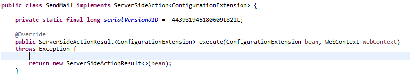

## Actions

Skyve offers the following action types:

  Action Type | Description
  ----------- | -----------------------------------------------
  action      | a custom action created by the developer which implements org.skyve.metadata.controller.ServerSideAction
  add         | the implicit Skyve action to add a member to the dataGrid/collection (deprecated)
  cancel      | the implicit Skyve action to cancel editing of the current view
  defaults    | the collection of implicit Skyve actions - specific actions will be determined by user access privileges and context (for example whether zoomed in from a dataGrid or listGrid, or "pinned"/navigated to directly)
  delete      | the implicit Skyve action to delete a document instance (not relevant for a dataGrid/collection member, not relevant unless the user has _Delete_ privileges)
  download    | a special case of the custom action that extends org.skyve.metadata.controller.DownloadAction, capable of delivery of an artefact/files to the user
  import      | a special case of custom action using Skyve's bizport capability to import and process data
  export      | a special case of custom action using Skyve's bizport capability to export data
  new         | the implicit Skyve action to create a new document instance (not relevant for dataGrid/collection member, not relevant unless the user has _Create_ privileges)
  ok          | the implicit Skyve action to *Save and return* to the list context (not relevant unless the user has _Update_ privileges)
  print       | calls the Skyve report generator to layout the view as a report
  remove      | the implicit Skyve action to remove the current document instance from the collection (relevant for dataGrid/collections, not relevant unless the user has _Delete_ privileges)
  report      | run a report (for example using the Jasper report framework)
  save        | the implicit Skyve action to *save* the current document instance (not relevant unless the user has _Update_ privileges)
  upload      | a special case of custom action that extends org.skyve.metadata.controller.UploadAction, capable of receiving (and processing) a file uploaded by the user
  zoomOut     | the implicit Skyve action to return from a collection member to the bean that owns the collection (relevant for dataGrid/collection members, not relevant unless the user has _Update_ privileges)

Skyve will hide actions which are declared inappropriately (for example, if the *new* action is declared, 
but a user's privileges do not include the _create_ privelege for the relevant document).

Typically, scaffolded views contain the _<defaults/>_ action which represents the group of actions Skyve deems to be valid in the specific context given the user's privileges. Alternatively, default actions can be declared individually (e.g. *OK*,
*Save*, *Cancel* etc.).

Note that actions can be located either in the *ActionPanel* or using the _<button/>_ widget within a view _form_, however the action is declared
in the _<actions/>_ section, whether or not the action
button will be displayed in the *ActionPanel* or elsewhere .

*Implicit Actions* are actions which are provided by Skyve by default based on the context of the current user gesture. By default, a Skyve view will contain a default collection of Implicit actions.

In addition to implicit actions provided by Skyve, developers can create Custom actions, or override Implicit action behaviour in the document *Bizlet*.

To create a new action behaviour, developers create an action class and set permissions to execute the action within the role definitions section of the *module.xml* file.

When a user has access to execute an action (declared via role permissions) Skyve will generate a button by default in the detail view. When a view definition is supplied the view definition will control visibility and other properties of the action button.

The trivial *ServerSideAction* causes the view to be refreshed.

Action classes implement *ServerSideAction* and are located within the actions folder in a document package and correlate to action buttons in the user interface.



Note that actions can also be triggered by declaring onChangeHandlers for a specific widget in a view.

When a view declaration is supplied, the action must be declared in the
*actions* section of the *view.xml*.

```xml
  <actions>
    <action displayName="PreviousPeriod" className="PreviousPeriod" inActionPanel="true" />
    <action displayName="NextPeriod" className="NextPeriod" inActionPanel="true" />
    <action displayName="Calculate" className="Calculate" inActionPanel="true" />
    <action displayName="Update" className="Update" inActionPanel="false" />
  </actions>
</view>
```

_Example action section of a view definition_

The action element of the view definition indicates the *className* of
the action as well as the *displayName* (button text). Action properties
are explained in full in the previous chapter.

Note that the action section of a view definition also includes implicit
actions.

```java
/**
 * Standardise the contact on press of Save button.
 */
@Override
public Contact preExecute(ImplicitActionName actionName, Contact bean, WebContext webContext) throws Exception {
  if(ImplicitActionName.Save.equals(actionName)) {
    AdminUtil.standardiseContact(bean);
  }

  return bean;
}
```

_Example customisation of the Save implicit action_

In the above example, the *Implicit* action *Save* (i.e. when the user
presses the *Save* button) is customised to determine and set the state
of the *eligibility* attribute. This code will be executed prior to the
usual *Implicit Save* behaviour.

Note that the behaviour above is initiated by the use of the Save button
in the view, and this is a separate event to the bean’s preSave.

### OnChange Event Actions (Client-side Events)

Skyve provides a number of client-side events actions which can be
assigned to widgets. Details of *OnChange* event actions are provided in
Table 14 (above).

**[⬆ back to top](#contents)**

---
**Next [Reports](./../_page/reports.md)**  
**Previous [Views](./../_page/views.md)**
