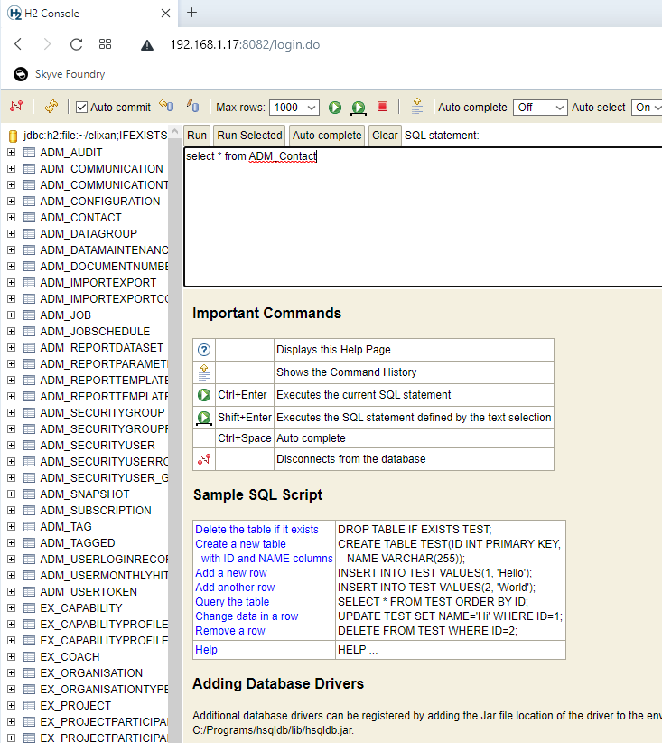
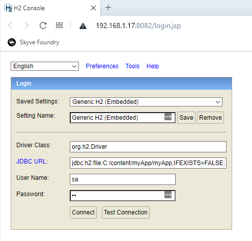

## Changing database dialect

One of the great things about Skyve is how easy it is to change between different database providers AND KEEP YOUR DATA. Skyve provides a platform-independent Backup format that can be restored to a different database technology without issue.

_NOTE: Before you begin - backup your data (using the Skyve backup feature in the admin module->Dev Ops->Data Maintenance)_

The steps to change database are:
1. If you are changing to MySQL, MSSQL, POSTGRES you will need to create a new empty database schema for your project
2. Update the datasource connection in the `-ds.xml` file (in ../wildfly/standalone/deployments/)
3. Ensure you have loaded and configured Wildfly for the new database dialect (detailed instructions are below)
4. Update the dialect in the `json` settings file for the new dialect (in ../wildfly/standalone/deployments/)
5. Update the dialect setting in the pom.xml, and use the `generate domain` target to update your project for the new dialect

Then, to restore your data to the new environment:
* Set the environment identifier to a non-null value (e.g. "dev"), deploy and log in with the bootstrap user
* Restore your backup - from the admin module->Dev Ops->Data Maintenance. (Select the backup zip, and choose the appropriate pre-process setup - usually "Delete existing table data using metadata").
* Once the restore is complete, change the instance identifier in the `json` settings file back to the previous value and redeploy your application.	

More information on backup and restore are available at the [User Guide](https://skyvers.github.io/skyve-user-guide/backup-restore/)

### Available dialects

The currently supported dialects are:
* H2
* MySQL
* MSSQL
* POSTGRES

The Oracle dialect is not currently available as part of the open-source platform. Please contact us if you require Oracle support.

For project generation (i.e. the setting in the `pom.xml`), there are some additional options:

Dialect Option | Description | dataStoreIndexForeignKeys (boolean) | dataStoreIndexNamesInGlobalNamespace (boolean) | dataStoreIdentifierCharacterLimit (int) | dataStoreBizKeyLength (int)
-------|--------|-------------|------------|-----------------|----------------------------------
H2 | H2 | true | false | 0 | 1024  
H2_NO_INDEXES | H2 without indexes | false | false | 0 | 1024 //Indexes in H2 generate warnings, this option gives you a cleaner log but no indexes
MYSQL_5 | MySQL 5 | true | false | 64 | 1024
MYSQL_5_4_BYTE_CHARSET | MySQL 5 | true | false | 64 | 768
MYSQL_8 | MySQL 8 | true | false | 64 | 1024
MYSQL_8_4_BYTE_CHARSET | MySQL 8 | true | false | 64 | 768
MSSQL_2014 | SQL Server up to 2014 | true | true | 0 | 900 // SQL Server 2014 and below limits indexes to 900
MSSQL_2016 | SQL Server 2016+ | true | true | 0 | 1024
POSTGRESQL | PostgreSQL | true | true | 63 | 1024

For the `json` file `dialect` setting, choose the appropriate dialect class:
 
`org.skyve.impl.persistence.hibernate.dialect.H2SpatialDialect`
`org.skyve.impl.persistence.hibernate.dialect.MySQL5InnoDBSpatialDialect`
`org.skyve.impl.persistence.hibernate.dialect.MySQL56InnoDBSpatialDialect`
`org.skyve.impl.persistence.hibernate.dialect.MySQL8InnoDBSpatialDialect`
`org.skyve.impl.persistence.hibernate.dialect.PostgreSQL9SpatialDialect`
`org.skyve.impl.persistence.hibernate.dialect.PostgreSQL91SpatialDialect`
`org.skyve.impl.persistence.hibernate.dialect.PostgreSQL92SpatialDialect`
`org.skyve.impl.persistence.hibernate.dialect.PostgreSQL93SpatialDialect`
`org.skyve.impl.persistence.hibernate.dialect.PostgreSQL94SpatialDialect`
`org.skyve.impl.persistence.hibernate.dialect.PostgreSQL95SpatialDialect`
`org.skyve.impl.persistence.hibernate.dialect.SQLServer2008SpatialDialect`
`org.skyve.impl.persistence.hibernate.dialect.SQLServer2012SpatialDialect`

_Note: as mentioned above, if you require support for Oracle or other dialects, please contact us._

### Using H2

From Skyve 9+, Skyve no longer uses a `JNDI` name and the H2 datasource is configured directly in the project `.json` settings file, and no project `-ds.xml` is required in the `wildfly` deployments folder.

An example H2 datasource configuration is 

```json
...
  // Datastore definitions
	dataStores: {
		// Skyve data store
		"skyve": {
			// Connection
			"driver": "org.h2.Driver",
			"url": "jdbc:h2:file:C:/_/content/myApp/myAppDB;IFEXISTS=FALSE;IGNORECASE=TRUE;AUTO_SERVER=TRUE",
			"user": "sa",
			"password": "sa",
			// Dialect
			dialect: "org.skyve.impl.persistence.hibernate.dialect.H2SpatialDialect",
			// Timeout for data store connections employed in general UI/forms processing - 0 indicates no timeout
			oltpConnectionTimeoutInSeconds: 30,
			// Timeout for data store connections employed when running jobs and background tasks - 0 indicates no timeout
			asyncConnectionTimeoutInSeconds: 300
		}
	},
	...
```

In this case `myAppDB` will be the name of the H2 database file created in `C:/_/content/myApp/`

Note that we recommend, for consistency, locating the H2 database file within the application content folder (in the above example the H2 database file `C:/content/myApp/myApp.mv.db` will be created automatically when first deployed if it does not exist.

For other datasource types, continue to use the `JNDI` name matching the name in the`-ds.xml` file in the `wildfly` deployments folder.

#### Accessing the H2 database console

Using the H2 database console directly can be useful for debugging. You can enable the database console by uncommenting the sevlet section of the `/src/main/web/WEB-INF/web.xml` file:

```xml
	<!-- Uncomment the following to allow access to the H2 web console. -->
	<servlet>
		<servlet-name>H2Console</servlet-name>
		<servlet-class>org.h2.server.web.JakartaWebServlet</servlet-class>
	</servlet>
	<servlet-mapping>
		<servlet-name>H2Console</servlet-name>
		<url-pattern>/h2/*</url-pattern>
	</servlet-mapping>
```

NOTE that this servlet is commented out by default.

Once uncommented/enabled and deployed, you can access the console in your browser at a similar location to your application, for example:

```
https://localhost:8080/myApp/h2/
```

When accessing the console, use the same connection path and credentials as you configured above in the `.json` settings file.

You can then access the H2 database directly with SQL.



#### Alternative approach for the H2 console

Alternatively, you can download and run the installer from <a href="http://www.h2database.com/html/download.html">http://www.h2database.com/html/download.html</a> (this has been tested with "Version 1.4.199 (2019-03-13), Last Stable")

Once installed run 'H2 Console' from the start menu; the H2 console should open in your browser.

When prompted use the same connection-url and credentials as the deployed `.json` project settings file (or in the `-ds.xml` file for older versions of Skyve before 9.0).



You can then access the H2 database directly with SQL.


### Configuring Wildfly for different dialects

Refer to other Wildfly documentation for detailed information, but the basic steps are as follows.

1. Place the appropriate jdbc driver into your `\wildfly-x\modules\system\layers\base\` folder.
2. Add the driver to the `drivers` stanza in the wildfly configuration in `\wildfly-x\standalone\configuration/standalone.xml`


#### Wildfly driver configuration for MSSQL

Place the appropriate jdbc driver into your `\wildfly-x\modules\system\layers\base\` folder.

For Microsoft SQL Server, you should have the following files in `\wildfly-x\modules\system\layers\base\com\microsoft\sqlserver\main\`:

* module.xml
* sqljdbc_auth.dll (if you use windows authentication)
* sqljdbc{version}.jar

An example module.xml file is:

```xml
<?xml version="1.0" encoding="utf-8"?> 
<module xmlns="urn:jboss:module:1.3" name="com.microsoft.sqlserver"> 
  <resources> 
    <resource-root path="sqljdbc42.jar"/> 
  </resources> 
  <dependencies> 
    <module name="javax.api"/> 
    <module name="javax.transaction.api"/>
	<module name="javax.xml.bind.api"/>
  </dependencies> 
</module>
```

Ensure that the driver matches the version of your jar 

```xml    
<resource-root path="sqljdbc{version}.jar"/>
``` 

Add the driver to the `drivers` stanza in the wildfly configuration, for example in `\wildfly-x\standalone\configuration/standalone.xml`

```xml
<drivers>
    <driver name="sqlserver" module="com.microsoft.sqlserver">
        <xa-datasource-class>com.microsoft.sqlserver.jdbc.SQLServerXADataSource</xa-datasource-class>
    </driver>      
...
```

*NOTE: Also ensure that you have the following settings on your MSSQL database rather than the defaults.*

```sql
ALTER DATABASE ${projectName} SET ALLOW_SNAPSHOT_ISOLATION ON
GO
ALTER DATABASE ${projectName} SET READ_COMMITTED_SNAPSHOT ON
GO
ALTER DATABASE ${projectName} SET AUTO_CLOSE OFF WITH NO_WAIT
GO
ALTER DATABASE ${projectName} SET RECOVERY SIMPLE WITH NO_WAIT
GO
```
##### Updating the JSON file for MS SQL

When changing to MS SQL, ensure that you specify the catalog in the project `.json` file, for example:

```JSON
...
catalog: "myApp",
schema: "dbo",
...
```

where `catalog` represents the _database_ name and `schema` is the namespace - this appears to contradict the naming used in the MySQL Workbench however, it corresponds to the JDBC specification - the mismatch is in the databases implementation of the <a href="https://stackoverflow.com/questions/7942520/relationship-between-catalog-schema-user-and-database-instance">JDBC specification</a>.

*NOTE* - don't forget to also update the project `pom.xml` file for the chosen dialect and update the project `-ds.xml` file accordingly.

#### Wildfly driver configuration for MySQL

Download and place the appropriate jdbc driver into your `/wildfly-x.x.x/modules/system/layers/base/com/mysql/main` folder, e.g. `mysql-connector-j-8.0.33.jar`.

For MySQL you should have the following files in `/wildfly-x.x.x/modules/system/layers/base/com/mysql/main/`:

* module.xml
* mysql-connector-java-8.{version}.jar

An example `module.xml` file is:

```xml
<?xml version="1.0" encoding="utf-8"?> 
<module xmlns="urn:jboss:module:1.3" name="com.mysql">
    <resources>
        <resource-root path="mysql-connector-j-8.0.33.jar" />
    </resources>
    <dependencies>
        <module name="javax.api"/>
        <module name="javax.transaction.api"/>
    </dependencies>
</module>
```

Ensure that the driver matches the version of your jar 

```xml    
<resource-root path="mysql-connector-java-{version}.jar"/>
``` 

Add the driver to the `drivers` stanza in the wildfly configuration, for example in `/wildfly-x.x.x/standalone/configuration/standalone.xml`

```xml
<drivers>
	<driver name="mysql" module="com.mysql">
	    <driver-class>com.mysql.jdbc.Driver</driver-class>
	</driver>
...
```

##### Updating the JSON file for MySQL

When changing to MySQL, ensure that you specify the catalog in the project `.json` file, for example:

```JSON
...
catalog: "myApp",
schema: null,
...
```

where `catalog` represents the _database_ name and `schema` is the namespace - this appears to contradict the naming used in the MySQL Workbench however, it corresponds to the JDBC specification - the mismatch is in the databases implementation of the <a href="https://stackoverflow.com/questions/7942520/relationship-between-catalog-schema-user-and-database-instance">JDBC specification</a>.

*NOTE* - don't forget to also update the project `pom.xml` file for the chosen dialect and update the project `-ds.xml` file accordingly.

##### Create a new schema in MySQL

Unlike H2, MySQL requires a schema to be created before it can be used. To create a new schema in MySQL, use the following SQL:

```sql
CREATE DATABASE /*!32312 IF NOT EXISTS*/ <schemaName> CHARACTER SET utf8 COLLATE utf8_general_ci;
```

Replacing `<schemaName>` with the name of the schema you wish to create, which should match your `ds.xml` and json `catalog` settings.

#### Problems with utf8 - character sets for other languages - MySQL
If your Skyve application is not storing utf8 chars correctly, and you're using MySQL, check that MySQL is configured for utf8. Check the charset of the DB and tables, e.g. the default  is 'latin1'.

In the my.cnf file (for MySQL), check that you have the following:
```
[client]
default-character-set=utf8

[mysql]
default-character-set=utf8

[mysqld]
collation-server = utf8_unicode_ci
init-connect='SET NAMES utf8'
character-set-server = utf8
```

To keep an existing database once this change has been made, export the schema from MySQL workbench, use text edit change latin1 to utf8, then drop your schema and import the edited one.

If you don't need to keep existing data, then after the my.cnf changes above, drop your schema, create a new one, then use Skyve bootstrap (in the json settings file) to sign in and let Skyve create the new schema for you.

#### Wildfly driver configuration for PostgreSQL 

Place the appropriate jdbc driver into your `/wildfly-x/modules/system/layers/base/` folder.

For Postgres, you should have the following files in `/wildfly-x/modules/system/layers/base/org/postgresql/main/`:

* postgresql-{version}.jar
* module.xml

An example module.xml file is:

```xml
<?xml version="1.0" encoding="utf-8"?> 
<module xmlns="urn:jboss:module:1.1" name="org.postgresql">

    <resources>
    	<!--the name of your driver -->
        <resource-root path="postgresql-42.2.6.jar"/>
    </resources>

    <dependencies>
        <module name="javax.api"/>
        <module name="javax.transaction.api"/>
    </dependencies>
</module>
```

Ensure that the driver matches the version of your jar 

```xml    
<resource-root path="postgresql-{version}.jar"/>
```

Add the driver to the `drivers` stanza in the wildfly configuration, for example in `/wildfly-x/standalone/configuration/standalone.xml`

```xml
<drivers>
    <driver name="postgresql" module="org.postgresql">
        <driver-class>org.postgresql.Driver</driver-class>
    </driver>              
...
```

**[⬆ back to top](#changing-database-dialect)**


<div style="padding-bottom: 100px"></div>
