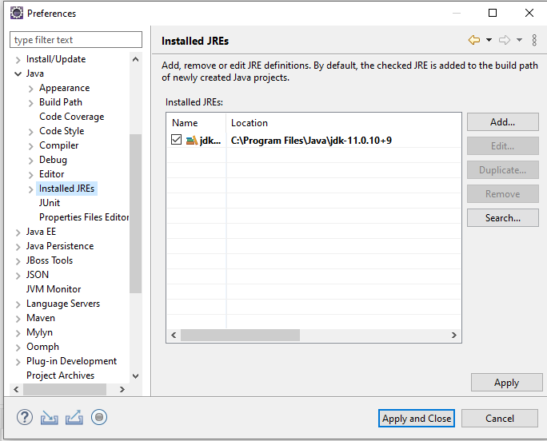
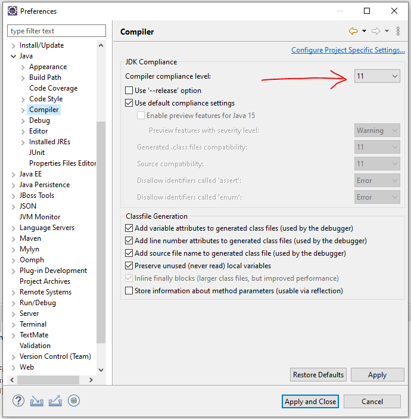
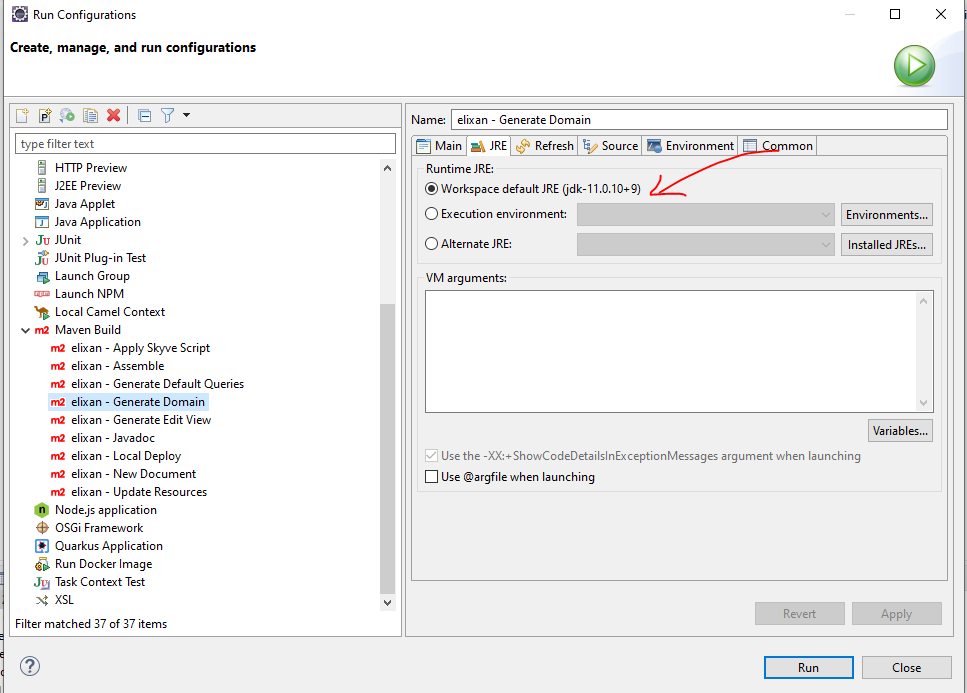

## Deployment Problem solver

### Problems building your app

* Check that you have Java 11+ (jdk11) available in your IDE.

For example, in Eclipse, right-click your project and choose _Properties_->_Java Build Path_
Change to the _Libraries_ tab, select the JRE Library and click _Edit_
Click _Installed JREs_
Add or select Java 11 (jdk11)



* Check that you have Java 11 (jdk11) selected for compiler compliance in your IDE.

For example, in Eclipse, right-click your project and choose _Properties_->_Java Compiler_->_Configure Workspace Settings_



Alternatively, select _Enable project specific settings_ and set the project compliance level.

* Check that you have the Java 11 (jdk11) selected for the Runtime JRE.

For example, in Eclipse, right-click your project and choose _Run As_->_Run Configurations..._



* Check that you have successfully built your project using the Generate Domain task.

In your project _config_ folder, right-click the _MyAppName - Generate Domain.launch_ task and choose 
_Run As_->_MyAppName - Generate Domain_

### Problems deploying your app

* If you're using the collaboration option in [Skyve Foundry](https://foundry.skyve.org/foundry), or have exported your project, check that you selected the `Default` theme first. 

If your project has a _paid theme_ selected we can't provide the theme files for your other environments.

You should change your theme to the free `Default` theme on the <em>Customise</em> tab in [Skyve Foundry](https://foundry.skyve.org/foundry) before you start collaboration (or export), OR you can proceed and collaborate (or export) with this theme selected, but we can't include the theme files in your code repository (or download). You will need to purchase your own licence to use the paid theme for local development.

### Problems finding your app

* Check the URL settings in the project `.json` file for the URL and context. 

For example, if you project has the following:

```json
	// URL settings - various SKYVE URL/URI fragments - useful for linking and mailing
url: {
        // server URL
        server: "${SKYVE_URL:http://localhost:8080}",
        // web context path
        context: "${SKYVE_CONTEXT:/helloWorld}",
        // home path
        home: "/"
    },
```

Then you can access your app at

[http://localhost:8080/helloWorld](http://localhost:8080/helloWorld)

See more at [Changing the project URL](./../_pages/appendix_skyve_application_configuration/#changing-the-project-url)

### Problems signing in for the first time

As a way to get started with a new environment, Skyve provides a bootstrap capability that inserts a user credential into your database for your first sign in (normally into an empty database). 

If the bootstrap option is used, the user record will be inserted into your database so that you can sign in, however this will only occur if the username does NOT already exist, and if the environment identifier indicates that the environment is NOT a _Production_ environment.

You can change the bootstrap settings in the project `.json` file, however, once the username exists in the database, changing the bootstrap user or password will have no effect unless a different username is used or the user record is removed.

To ensure the bootstrap user is inserted for your first sign in:

* Check the _environment identifier_ setting in the project `.json` file, and check that it is not `null` (i.e. this is not _Production_ environment).

For example, if you have the following:

```json
	// Environment settings
	environment: {
		// test, sit, uat, dev etc: null = prod
		identifier: null,
	...
```

Change this to a specific environment setting such as 

```json
	// Environment settings
	environment: {
		// test, sit, uat, dev etc: null = prod
		identifier: "dev",
	...
```

Then restart your app server (e.g. Wildfly).

When you are ready to go live into Production, change the identifier value back to `null` and restart Wildfly.

* Check that you are using the bootstrap credentials as set in the project `.json` properties file.

For example, if you have the following:

```json
	// bootstrap user settings - creates a user with all customer roles assigned, if the user does not already exist
	bootstrap: {
        customer: "skyve",
        user: "${BOOTSTRAP_USERNAME:setup}",
        email: "info@skyve.org",
        password: "${BOOTSTRAP_PASSWORD:setup}"
    }
```

Then your bootstrap credentials will be:

user: `setup`

password: `setup`


* If you still have problems, ensure that the bootstrap `customer` setting matches the environment default `customer` setting and that the environment identifier is not `null` (for example, you may switch the identifier to `config` to indicate the system is being configured, or `dev` for developer mode etc.)

For example, if you have the following:

```json
	// Environment settings
	environment: {
		// test, sit, uat, dev etc: null = prod
		identifier: "dev",
		// Dev Mode does not cache the view metadata allowing the effects of view changes to be observed without redeploying
		devMode: true,
		// Customer Default
		customer: "skyve",
		// Run the jobs scheduled in the data store or not - set false for slave skyve instances
		jobScheduler: true,
		// Password hashing algorithm - usually MD5 (obsolete) or SHA1 etc
		passwordHashingAlgorithm: "MD5"
	},
	// bootstrap user settings - creates a user with all customer roles assigned, if the user does not already exist
	bootstrap: {
		customer: "skve",
		user: "setup",
		email: "info@skyve.org",
		password: "setup"
	}
```

If you set the `environment.customer` to null, the Skyve sign in page will require you to specify the _customer_ as well as the _username_ and _password_.

If you specify an `environment.customer`, make sure it matches the `bootstrap.customer` or your sign in will fail.

### Example deployment problems
Key problems in the `myApplication.json` configuration file block your project from deploying successfully and sometime yield non-obvious errors or stack output. The following provides three common examples.

### Example output for incorrect content or addins folder
Incorrect content folder - the folder doesn't exist:

```json
	// Content settings
	"content": {
		// directory path
		"directory": "C:/skyve/content/", 
		// CRON Expression for CMS Garbage Collection job - run at 7 past the hour every hour
		"gcCron": "0 7 0/1 1/1 * ? *", 
		// Attachments stored on file system or inline
		"fileStorage": true
	},
  // Add-ins settings
	"addins": {
		// Where to look for add-ins - defaults to <content.directory>/addins/
		"directory": null
	},
```

In this case, the folder `C:/skyve/content/` doesn't exist or the name is incorrect.

Attempting to deploy in this case yields results such as the following:
```
15:51:09,837 ERROR [org.jboss.msc.service.fail] (ServerService Thread Pool -- 61) MSC000001: Failed to start service jboss.undertow.deployment.default-server.default-host./phweb: org.jboss.msc.service.StartException in service jboss.undertow.deployment.default-server.default-host./phweb: java.lang.RuntimeException: java.lang.IllegalStateException: content.directory C:/skyve/content/ does not exist.
	at org.wildfly.extension.undertow.deployment.UndertowDeploymentService$1.run(UndertowDeploymentService.java:85)
	at java.util.concurrent.Executors$RunnableAdapter.call(Executors.java:511)
	at java.util.concurrent.FutureTask.run(FutureTask.java:266)
	at java.util.concurrent.ThreadPoolExecutor.runWorker(ThreadPoolExecutor.java:1149)
	at java.util.concurrent.ThreadPoolExecutor$Worker.run(ThreadPoolExecutor.java:624)
	at java.lang.Thread.run(Thread.java:748)
	at org.jboss.threads.JBossThread.run(JBossThread.java:320)
Caused by: java.lang.RuntimeException: java.lang.IllegalStateException: *content.directory C:/skyve/content/ does not exist.*
	at io.undertow.servlet.core.DeploymentManagerImpl.deploy(DeploymentManagerImpl.java:236)
	at org.wildfly.extension.undertow.deployment.UndertowDeploymentService.startContext(UndertowDeploymentService.java:100)
	at org.wildfly.extension.undertow.deployment.UndertowDeploymentService$1.run(UndertowDeploymentService.java:82)
	... 6 more
Caused by: java.lang.IllegalStateException: content.directory C:/skyve/content/ does not exist.
	at org.skyve.impl.web.SkyveContextListener.contextInitialized(SkyveContextListener.java:102)
	at io.undertow.servlet.core.ApplicationListeners.contextInitialized(ApplicationListeners.java:187)
	at io.undertow.servlet.core.DeploymentManagerImpl$1.call(DeploymentManagerImpl.java:200)
	at io.undertow.servlet.core.DeploymentManagerImpl$1.call(DeploymentManagerImpl.java:171)
	at io.undertow.servlet.core.ServletRequestContextThreadSetupAction$1.call(ServletRequestContextThreadSetupAction.java:42)
	at io.undertow.servlet.core.ContextClassLoaderSetupAction$1.call(ContextClassLoaderSetupAction.java:43)
	at io.undertow.servlet.api.LegacyThreadSetupActionWrapper$1.call(LegacyThreadSetupActionWrapper.java:44)
	at io.undertow.servlet.api.LegacyThreadSetupActionWrapper$1.call(LegacyThreadSetupActionWrapper.java:44)
	at io.undertow.servlet.api.LegacyThreadSetupActionWrapper$1.call(LegacyThreadSetupActionWrapper.java:44)
	at io.undertow.servlet.api.LegacyThreadSetupActionWrapper$1.call(LegacyThreadSetupActionWrapper.java:44)
	at io.undertow.servlet.api.LegacyThreadSetupActionWrapper$1.call(LegacyThreadSetupActionWrapper.java:44)
	at io.undertow.servlet.core.DeploymentManagerImpl.deploy(DeploymentManagerImpl.java:234)
	... 8 more
```

A similar error occurs if the `addins` directory is not found:

```
org.jboss.msc.service.StartException in service jboss.deployment.unit."jobManager.war".undertow-deployment: java.lang.RuntimeException: java.lang.IllegalStateException: addins.directory C:/skyve/content/addins/ does not exist.
```

Manually create an `addins` directory inside the content directory specified for your project. This is where Skyve will look for the addins directory by default if no path is specified in the json.

### Example incorrect/invalid customer in bootstrap stanza
Incorrect customer in the bootstrap- there is no such customer defined:

```json
// bootstrap user settings - creates a user with all customer roles assigned, if the user does not already exist
bootstrap: {
	customer: "skyve",
	user: "admin",
	password: "admin"
}
```

In this case, there is no _skyve_ customer declaration file within the _customer_ folder.

Attempting to deploy in this case yields results such as the following:

```
15:48:03,814 ERROR [stderr] (ServerService Thread Pool -- 68) org.skyve.metadata.MetaDataException: A problem was encountered.
15:48:03,814 ERROR [stderr] (ServerService Thread Pool -- 68) 	at org.skyve.impl.metadata.repository.LocalDesignRepository.getCustomer(LocalDesignRepository.java:174)
15:48:03,814 ERROR [stderr] (ServerService Thread Pool -- 68) 	at org.skyve.impl.metadata.user.UserImpl.getCustomer(UserImpl.java:198)
15:48:03,814 ERROR [stderr] (ServerService Thread Pool -- 68) 	at org.skyve.impl.metadata.user.SuperUser.getAccessibleModuleNames(SuperUser.java:85)
15:48:03,814 ERROR [stderr] (ServerService Thread Pool -- 68) 	at org.skyve.impl.persistence.hibernate.AbstractHibernatePersistence.resetDocumentPermissionScopes(AbstractHibernatePersistence.java:528)
15:48:03,814 ERROR [stderr] (ServerService Thread Pool -- 68) 	at org.skyve.impl.persistence.hibernate.AbstractHibernatePersistence.setUser(AbstractHibernatePersistence.java:500)
15:48:03,814 ERROR [stderr] (ServerService Thread Pool -- 68) 	at org.skyve.impl.web.SkyveContextListener.contextInitialized(SkyveContextListener.java:276)
15:48:03,814 ERROR [stderr] (ServerService Thread Pool -- 68) 	at io.undertow.servlet.core.ApplicationListeners.contextInitialized(ApplicationListeners.java:187)
15:48:03,814 ERROR [stderr] (ServerService Thread Pool -- 68) 	at io.undertow.servlet.core.DeploymentManagerImpl$1.call(DeploymentManagerImpl.java:200)
15:48:03,815 ERROR [stderr] (ServerService Thread Pool -- 68) 	at io.undertow.servlet.core.DeploymentManagerImpl$1.call(DeploymentManagerImpl.java:171)
15:48:03,815 ERROR [stderr] (ServerService Thread Pool -- 68) 	at io.undertow.servlet.core.ServletRequestContextThreadSetupAction$1.call(ServletRequestContextThreadSetupAction.java:42)
15:48:03,815 ERROR [stderr] (ServerService Thread Pool -- 68) 	at io.undertow.servlet.core.ContextClassLoaderSetupAction$1.call(ContextClassLoaderSetupAction.java:43)
15:48:03,815 ERROR [stderr] (ServerService Thread Pool -- 68) 	at io.undertow.servlet.api.LegacyThreadSetupActionWrapper$1.call(LegacyThreadSetupActionWrapper.java:44)
15:48:03,815 ERROR [stderr] (ServerService Thread Pool -- 68) 	at io.undertow.servlet.api.LegacyThreadSetupActionWrapper$1.call(LegacyThreadSetupActionWrapper.java:44)
15:48:03,815 ERROR [stderr] (ServerService Thread Pool -- 68) 	at io.undertow.servlet.api.LegacyThreadSetupActionWrapper$1.call(LegacyThreadSetupActionWrapper.java:44)
15:48:03,815 ERROR [stderr] (ServerService Thread Pool -- 68) 	at io.undertow.servlet.api.LegacyThreadSetupActionWrapper$1.call(LegacyThreadSetupActionWrapper.java:44)
15:48:03,815 ERROR [stderr] (ServerService Thread Pool -- 68) 	at io.undertow.servlet.api.LegacyThreadSetupActionWrapper$1.call(LegacyThreadSetupActionWrapper.java:44)
15:48:03,815 ERROR [stderr] (ServerService Thread Pool -- 68) 	at io.undertow.servlet.core.DeploymentManagerImpl.deploy(DeploymentManagerImpl.java:234)
15:48:03,815 ERROR [stderr] (ServerService Thread Pool -- 68) 	at org.wildfly.extension.undertow.deployment.UndertowDeploymentService.startContext(UndertowDeploymentService.java:100)
15:48:03,816 ERROR [stderr] (ServerService Thread Pool -- 68) 	at org.wildfly.extension.undertow.deployment.UndertowDeploymentService$1.run(UndertowDeploymentService.java:82)
15:48:03,816 ERROR [stderr] (ServerService Thread Pool -- 68) 	at java.util.concurrent.Executors$RunnableAdapter.call(Executors.java:511)
15:48:03,816 ERROR [stderr] (ServerService Thread Pool -- 68) 	at java.util.concurrent.FutureTask.run(FutureTask.java:266)
15:48:03,816 ERROR [stderr] (ServerService Thread Pool -- 68) 	at java.util.concurrent.ThreadPoolExecutor.runWorker(ThreadPoolExecutor.java:1149)
15:48:03,816 ERROR [stderr] (ServerService Thread Pool -- 68) 	at java.util.concurrent.ThreadPoolExecutor$Worker.run(ThreadPoolExecutor.java:624)
15:48:03,816 ERROR [stderr] (ServerService Thread Pool -- 68) 	at java.lang.Thread.run(Thread.java:748)
15:48:03,816 ERROR [stderr] (ServerService Thread Pool -- 68) 	at org.jboss.threads.JBossThread.run(JBossThread.java:320)
15:48:03,816 ERROR [stderr] (ServerService Thread Pool -- 68) Caused by: org.skyve.metadata.MetaDataException: Could not unmarshal customer at /C:/_/pgibsa/Phylloxera/javaee/pgibsa.ear/apps.jar/customers/skyve/skyve.xml
15:48:03,816 ERROR [stderr] (ServerService Thread Pool -- 68) 	at org.skyve.impl.util.XMLMetaData.unmarshalCustomer(XMLMetaData.java:185)
15:48:03,816 ERROR [stderr] (ServerService Thread Pool -- 68) 	at org.skyve.impl.metadata.repository.LocalDesignRepository.getCustomer(LocalDesignRepository.java:164)
15:48:03,817 ERROR [stderr] (ServerService Thread Pool -- 68) 	... 24 more
15:48:03,817 ERROR [stderr] (ServerService Thread Pool -- 68) Caused by: java.io.FileNotFoundException: C:\_\pgibsa\Phylloxera\javaee\pgibsa.ear\apps.jar\customers\skyve\skyve.xml (The system cannot find the path specified)
15:48:03,817 ERROR [stderr] (ServerService Thread Pool -- 68) 	at java.io.FileInputStream.open0(Native Method)
15:48:03,817 ERROR [stderr] (ServerService Thread Pool -- 68) 	at java.io.FileInputStream.open(FileInputStream.java:195)
15:48:03,817 ERROR [stderr] (ServerService Thread Pool -- 68) 	at java.io.FileInputStream.<init>(FileInputStream.java:138)
15:48:03,817 ERROR [stderr] (ServerService Thread Pool -- 68) 	at java.io.FileInputStream.<init>(FileInputStream.java:93)
15:48:03,817 ERROR [stderr] (ServerService Thread Pool -- 68) 	at org.skyve.impl.util.XMLMetaData.unmarshalCustomer(XMLMetaData.java:173)
15:48:03,817 ERROR [stderr] (ServerService Thread Pool -- 68) 	... 25 more
```

### Missing comma or badly formed json file

Missing comma or badly formed json file:

```json
	// bootstrap user settings - creates a user with all customer roles assigned, if the user does not already exist
	bootstrap: {
		customer: "skyve",
		user: "admin",
		password: "admin"
	} 
	// When taking photos or uploading images they will be compressed to within the size below (if possible)
	maxUploadedFileSizeInBytes: 1000000 // 10 MB
}
```

For example, should have been a comma after the bootstrap stanza.

Attempting to deploy in this case yields results such as the following:

```
15:40:16,947 ERROR [org.jboss.msc.service.fail] (ServerService Thread Pool -- 69) MSC000001: Failed to start service jboss.undertow.deployment.default-server.default-host./phweb: org.jboss.msc.service.StartException in service jboss.undertow.deployment.default-server.default-host./phweb: java.lang.RuntimeException: java.lang.ClassCastException: java.lang.Long cannot be cast to java.util.Map
	at org.wildfly.extension.undertow.deployment.UndertowDeploymentService$1.run(UndertowDeploymentService.java:85)
	at java.util.concurrent.Executors$RunnableAdapter.call(Executors.java:511)
	at java.util.concurrent.FutureTask.run(FutureTask.java:266)
	at java.util.concurrent.ThreadPoolExecutor.runWorker(ThreadPoolExecutor.java:1149)
	at java.util.concurrent.ThreadPoolExecutor$Worker.run(ThreadPoolExecutor.java:624)
	at java.lang.Thread.run(Thread.java:748)
	at org.jboss.threads.JBossThread.run(JBossThread.java:320)
Caused by: java.lang.RuntimeException: java.lang.ClassCastException: java.lang.Long cannot be cast to java.util.Map
	at io.undertow.servlet.core.DeploymentManagerImpl.deploy(DeploymentManagerImpl.java:236)
	at org.wildfly.extension.undertow.deployment.UndertowDeploymentService.startContext(UndertowDeploymentService.java:100)
	at org.wildfly.extension.undertow.deployment.UndertowDeploymentService$1.run(UndertowDeploymentService.java:82)
	... 6 more
Caused by: java.lang.ClassCastException: java.lang.Long cannot be cast to java.util.Map
	at org.skyve.impl.web.SkyveContextListener.getObject(SkyveContextListener.java:378)
	at org.skyve.impl.web.SkyveContextListener.contextInitialized(SkyveContextListener.java:253)
	at io.undertow.servlet.core.ApplicationListeners.contextInitialized(ApplicationListeners.java:187)
	at io.undertow.servlet.core.DeploymentManagerImpl$1.call(DeploymentManagerImpl.java:200)
	at io.undertow.servlet.core.DeploymentManagerImpl$1.call(DeploymentManagerImpl.java:171)
	at io.undertow.servlet.core.ServletRequestContextThreadSetupAction$1.call(ServletRequestContextThreadSetupAction.java:42)
	at io.undertow.servlet.core.ContextClassLoaderSetupAction$1.call(ContextClassLoaderSetupAction.java:43)
	at io.undertow.servlet.api.LegacyThreadSetupActionWrapper$1.call(LegacyThreadSetupActionWrapper.java:44)
	at io.undertow.servlet.api.LegacyThreadSetupActionWrapper$1.call(LegacyThreadSetupActionWrapper.java:44)
	at io.undertow.servlet.api.LegacyThreadSetupActionWrapper$1.call(LegacyThreadSetupActionWrapper.java:44)
	at io.undertow.servlet.api.LegacyThreadSetupActionWrapper$1.call(LegacyThreadSetupActionWrapper.java:44)
	at io.undertow.servlet.api.LegacyThreadSetupActionWrapper$1.call(LegacyThreadSetupActionWrapper.java:44)
	at io.undertow.servlet.core.DeploymentManagerImpl.deploy(DeploymentManagerImpl.java:234)
	... 8 more
```


### Still having problems?

Join us on [Slack](https://join.slack.com/t/skyveframework/shared_invite/enQtNDMwNTcyNzE0NzI2LWNjMTBlMTMzNTA4YzBlMzFhYzE0ZmRhOWIzMWViODY4ZTE1N2QzYWM1MTdlMTliNDIyYTBkOWZhZDAxOGQyYjQ) and ask our friendly team. 

**[⬆ back to top](#deployment-problem-solver)**

---
**Next [Changing database dialect](./../_pages/appendix-changing-database-dialect.md)**<br>
**Previous [Backup and restore](./../_pages/backup-restore.md)**
