These instructions describe the process required to install and configure the 
development environment for Skyve. These instructions assume that you are 
using Windows and SQL Server. Some changes will need to be made if using a 
different operating system or database.

### Download and Install Eclipse and JDK

#### Download and Install Eclipse

For this section, we have chosen to show how to use Eclipse as the development environment, however, if you prefer, you can use other development environment tools such as IntelliJ, NetBeans, Visual Studio Code, etc. However, if you're not completely familiar with these, use Eclipse so that you can follow the steps below.

NOTE: do not use the Eclipse EE9 preview, you will need the Jakarta EE Full & Web Distribution

  - Click here to [Download Eclipse](https://www.eclipse.org/downloads/packages/)
  - Next, Click on Eclipse IDE for Enterprise Java Developers

  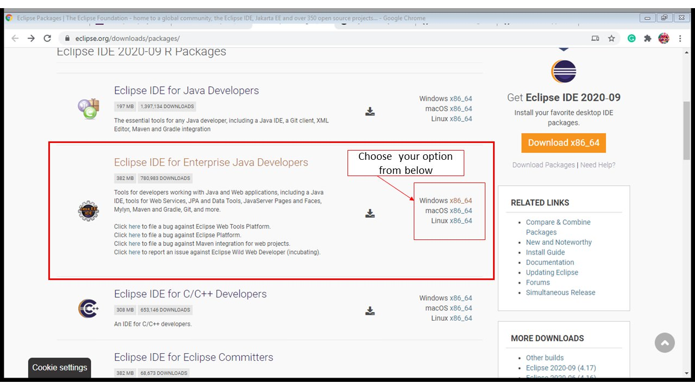

  - Click on download
  - Then, install Eclipse in your system

#### Download and Install JDK

  - Install an OpenJDK 17 version (JDK version 21 is also supported) from [AdoptOpenJDK](https://adoptium.net/temurin/releases/?package=jdk&version=17) (or an alternative OpenJDK of your choice)

## Install and Configure Wildfly Server

We need an application server to be able to access the application through our browser. For this we will demonstrate using Red Hat's Wildfly application server plugin. Skyve apps can be deployed on recent versions of Wildfly (27+).

### Install Wildfly Server

You can skip this step if WildFly Server is already installed on your system.

Before installing WildFly Server, make sure JBoss Tools is installed on your system.

To install JBoss Tools, click on Help, then click Eclipse Marketplace.

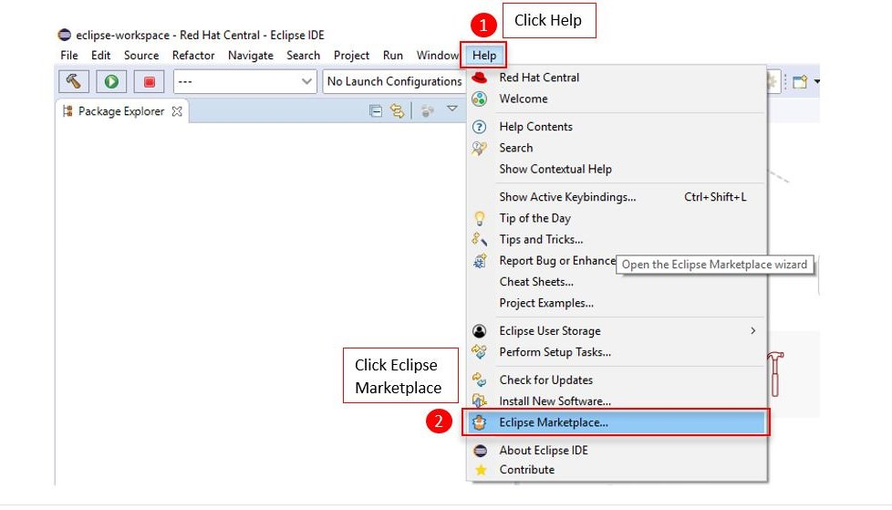

In the search bar, enter 'jboss', then search.

Select the JBoss Tools version that the search returns, and click Install.

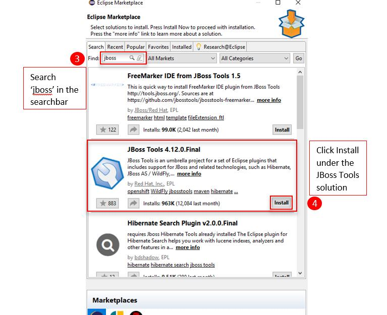

Select the list as shown below

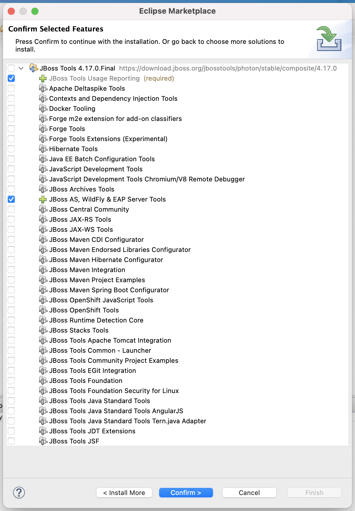

To check if JBoss Tools is installed properly, click on Help, then click Eclipse Marketplace.

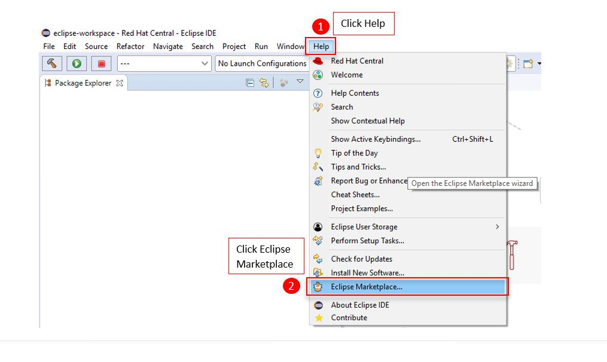

Change to the `Installed` tab.

If the JBoss Tools plugin is present, you are ready to continue.

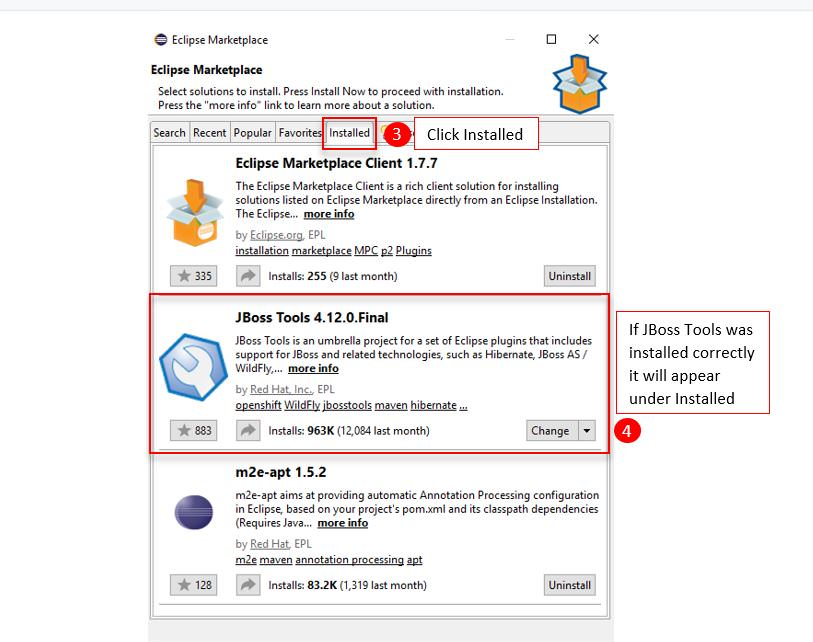

After JBoss Tools is installed properly, follow these steps to install WildFly Server.

1. Once Eclipse is opened, right-click under the Project Explorer tab and highlight New, then from the pop-out, click on Other

   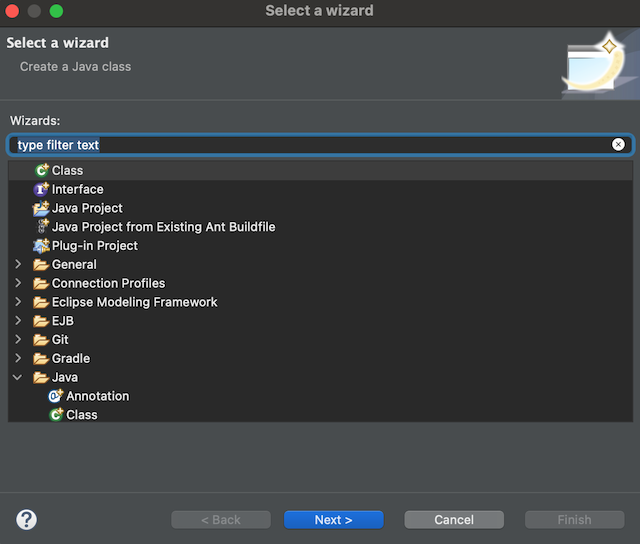
   
2. Enter text `server` in the `type filter text` field, select `Server` and click the Next button.

   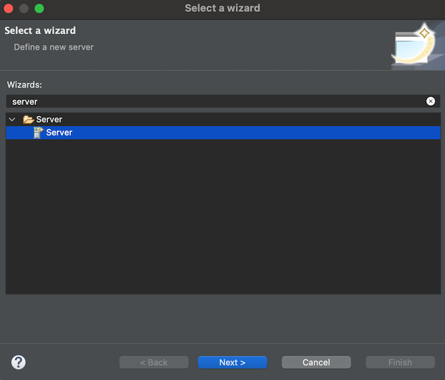

2. Select the WildFly version you wish to work with and click Next (Skyve currently supports versions 27+)

   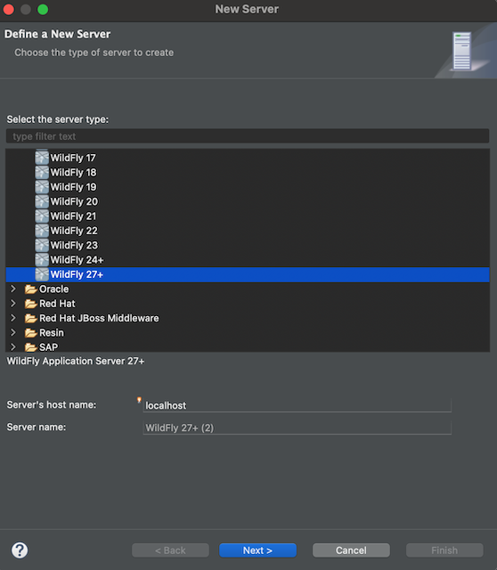

3. Click Next again

   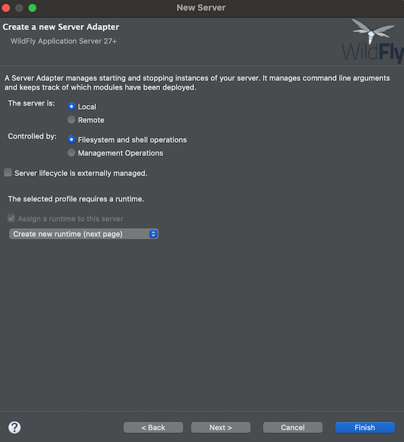

4. Click on the Download and install runtime link

   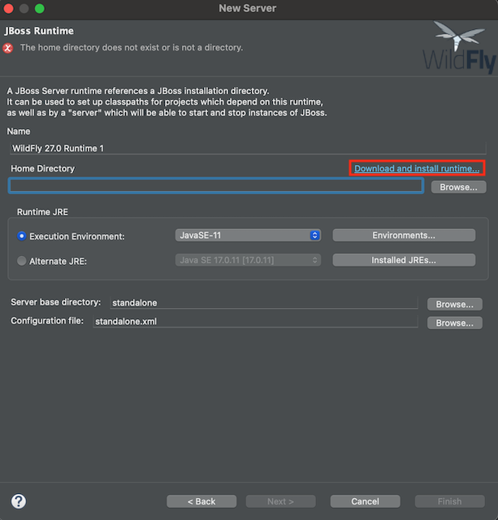

5. Select the latest version of WildFly, then click Next

   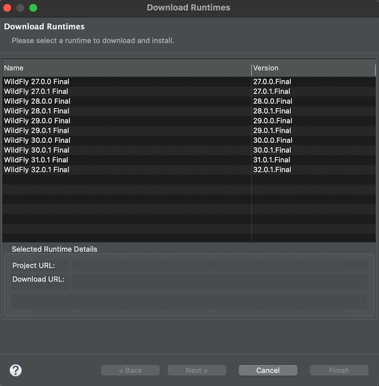

6. Once you have read the terms of the licence agreement, check the box to accept the terms, and click Next

   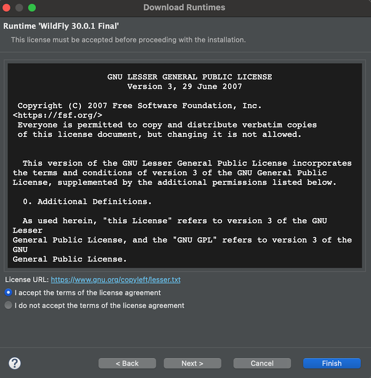

7. Finally, select the path for where you wish your download and install locations to be found, select the appropriate runtime JRE and then click `Finish` to complete the installation

   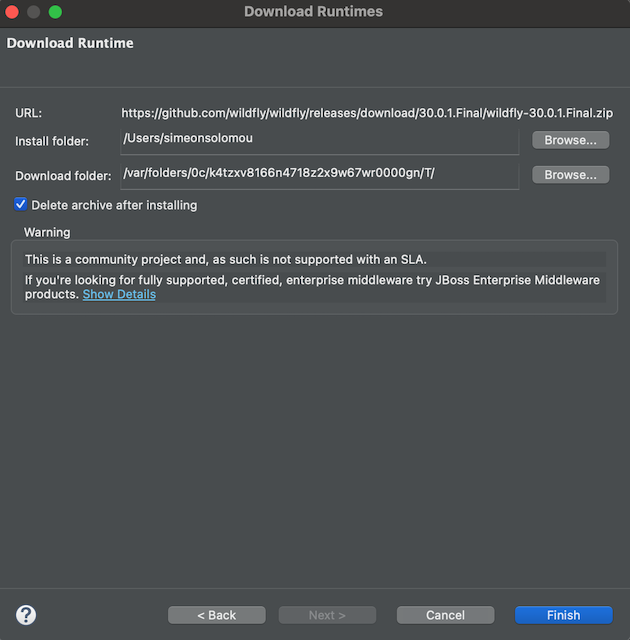
   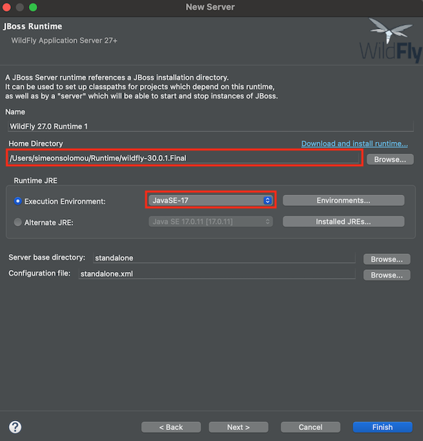

8.  Wait for Eclipse to complete the download and installation process before moving on to the next step

## Configuring the IDE (Windows example)

* Create `C:\workspace\` (go to `C:\` -> right click -> New Folder then type `workspace` as the 
folder name). You may use any folder for you workspace in Eclipse, just make sure you remember 
the folder you've chosen and try to ensure that the folder name has no spaces to avoid 
any issues with Java paths and spaces.
* Start Eclipse using Eclipse.exe and select `C:\workspace\` as workspace, tick 'Use as 
default option - do not ask again', Cancel the welcome wizard and Close the welcome 
tab in the editor frame.
* Change compiler compliance level to 17 (Window -> Preferences -> Java -> Compiler) 
press 'Apply' - press Yes for full build, and then press OK.
  
See additional details in [Setting up a Skyve instance](./../pages/appendix_setting-up-a-skyve-instance)

We also recommend you:
* load an RDBMS like MySQL, Postgres or MS SQL that is supported by Hibernate ([www.hibernate.org](http://www.hibernate.org)) - ensure you record the
  administrator username and password (if you're unable to do this, you can use H2 file-based database which requires no install).
* register for an account with GitHub, GitLab or BitBucket (or other git-based repository)
* register for an account on [Skyve Foundry](https://foundry.skyve.org/foundry)
* register on our [public Slack account in case you have questions](https://join.slack.com/t/skyveframework/shared_invite/enQtNDMwNTcyNzE0NzI2LTRkMWUxZDBlZmFlMmJkMjQzYWMzYWQxMmQzYWQ1ZTdlODNkNjRlYzVhYjFmMmQ4NTlhYWY4MjNhMGVkZGNlMjY)

For this example, to use Microsoft SQL Server as the database for the Skyve project:
* If you do not already have SQL Server installed:
  * download and install the latest version of the Developer or Express edition for your platform from the [Microsoft website](https://www.microsoft.com/en-au/sql-server/sql-server-downloads)
  * you will also need to download and install a copy of [SQL Server Management Studio](https://docs.microsoft.com/en-us/sql/ssms/download-sql-server-management-studio-ssms) to connect you your database and execute scripts
* Open SQL Server Management Studio, choose Authentication as Windows Authentication and click the 'Connect' button.
* Create a db named 'skyve', right click Databases->New Databases... and leave everything as is and click the _OK_ button.
* Create a user for skyve db in SQL Server Management Studio, right click Security->New->Login...
* Create a Login name (remember this login name as you will need it later), choose 
  SQL Server authentication and enter your password. Remember that SQL Server policy 
  requires a 'strong' password (remember this password as you will need it later), 
  untick the 'Enforce password expiration' and the 'User must change password at 
  next login'
* On the same dialog box, choose Default database as 'skyve', now go to Server Roles 
  on left hand pane and tick 'sysadmin', then go to User Mapping and tick 'skyve' 
  and finally, click the _OK_ button down the bottom right.
* If you've just installed SQL server, you will need to specify the port for this 
  database, see instructions [here](https://community.spiceworks.com/how_to/124598-find-the-port-sql-server-is-using-and-change-a-dynamic-port-to-static), 
  again, remember the port number you've entered.

## Importing an existing Skyve project from Git

*Note: These instructions are for the Eclipse IDE, you will need to locate instructions for your IDE if not using Eclipse.*

In Eclipse, 

* choose File -> Import... -> Git -> Projects from Git -> Next -> Clone URI and set the URI (for example type in https://github.com/skyvers/skyve.git as URI),
* then click the _Next_ button, 
* choose the master and click the _Next_ button. 
* Choose your destination directory, in this example, we have chosen `C:\\_\ directory`.
* Then click the _Next_ button. 
* The import wizard should be displayed and cloning the Skyve project.

After cloning the master, go to Project -> Clean - Select clean all projects and press OK - wait for activity to cease in bottom right corner of the Eclipse window.

## Starting the server

### Development environment
Skyve provides a bootstrap user configuration (specified in the `.json` file) - this will insert a user with all module roles as a way to get started. The bootstrap configuration is disabled if the instance is a production instance.

### Other environments
In UAT and PROD environments, Wildfly should be configured as a service. Refer to Wildfly documentation for detailed instructions.

### Connecting to your local instance from a mobile device

It is useful to be able to test your Skyve application from your own mobile devices as you develop locally. For example, if you connect your developer PC and mobile device to the same network (for example, your phone's hotspot) use IP address assigned to your PC for the URL in your `.json` settings file - then connect from your phone to your developer PC.

To find the IP address assigned to your dveloper PC in Windows, in a `cmd` window, run:

```
ipconfig
```


Then set the `server url` setting in the `.json` properties file to match the assigned address, for example `http://192.168.43.182:8080/` (matching your port settings etc) and keep your existing context setting, e.g. `/myapp`.

You will also need to set Wildfly to be able to serve clients other than localhost. To do this double click on your Wildfly server from eclipse to open the configuration and change the standalone arguments to include `-b 0.0.0.0` (note this can also be done directly in the `standalone.xml` file).

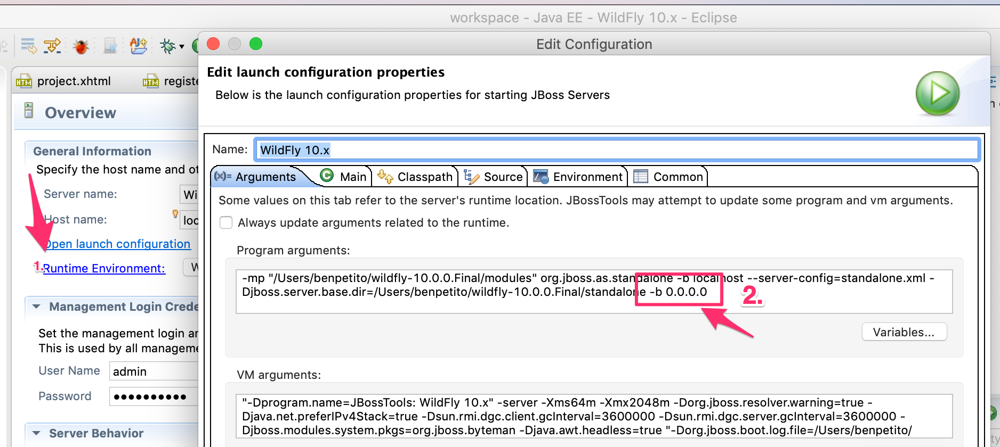

Restart Wildfly so the changes take effect.

You can then use the browser on your mobile device to connect to the local Skyve instance using the URL:

```
http://192.168.43.182:8080/myapp
```

**[⬆ back to top](#installing-and-configuring-a-skyve-development-environment)**

---
**Next [Setting up a Skyve instance](./../_pages/appendix-setting-up-a-skyve-instance.md)**<br>
**Previous [Deploying a Skyve application](./../_pages/appendix-deploying-a-skyve-application.md)**
