These instructions describe the process required to install and configure the 
development environment for Skyve. These instructions assume that you are 
using Windows and SQL Server. Some changes will need to be made if using a 
different operating system or database.

## Prerequisites and Overview

Before starting, you'll need to install several components:

- **Eclipse IDE**: A development environment for writing and managing code
- **Java Development Kit (JDK)**: Required to run Java applications
- **Wildfly Application Server**: A server that runs your Skyve application
- **Database**: SQL Server (or another supported database) to store your application data
- **Git**: Version control system to download the Skyve project

This guide will walk you through installing each component step by step.

## Download and Install Eclipse and JDK

### Download and Install Eclipse

For this section, we have chosen to show how to use Eclipse as the development environment, however, if you prefer, you can use other development environment tools such as IntelliJ, NetBeans, Visual Studio Code, etc. However, if you're not completely familiar with these, use Eclipse so that you can follow the steps below.

**Important Note**: Do not use the Eclipse EE9 preview. You will need the Jakarta EE Full & Web Distribution.

1. Go to the [Eclipse Downloads page](https://www.eclipse.org/downloads/packages/)
2. Click on **Eclipse IDE for Enterprise Java Developers** (this includes all the tools needed for Java web development)

   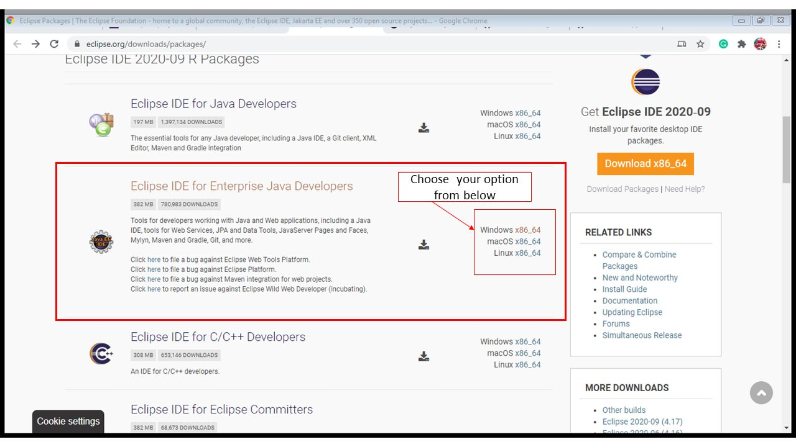

3. Click the **Download** button
4. Run the downloaded installer and follow the installation wizard
5. When prompted, choose a directory to install Eclipse (e.g., `C:\Program Files\Eclipse`)
6. Complete the installation and create a desktop shortcut if offered

### Download and Install JDK

The Java Development Kit (JDK) is required to compile and run Java applications. Skyve requires JDK 17 or 21.

1. Go to [AdoptOpenJDK](https://adoptium.net/temurin/releases/?package=jdk&version=17)
2. Download **OpenJDK 17** (or JDK 21 if you prefer)
3. Run the installer and follow the installation wizard
4. **Important**: Note the installation path (usually `C:\Program Files\Eclipse Adoptium\jdk-17.x.x.x-hotspot\`)
5. After installation, verify it works by opening a command prompt and typing:
   ```
   java -version
   ```
   You should see version information displayed.

## Install and Configure Wildfly Server

Wildfly is an application server that runs your Skyve application and makes it accessible through a web browser. Think of it as the "engine" that powers your web application. Skyve apps can be deployed on recent versions of Wildfly (27+).

### What is Wildfly?
Wildfly is a Java application server that:
- Runs your Skyve application
- Handles web requests from browsers
- Manages database connections
- Provides security and other enterprise features

### Install Wildfly Server

You can skip this step if WildFly Server is already installed on your system.

Now we'll create a WildFly server instance in Eclipse:

1. In Eclipse, right-click in the **Project Explorer** panel (the left sidebar) and select **New** → **Other**

   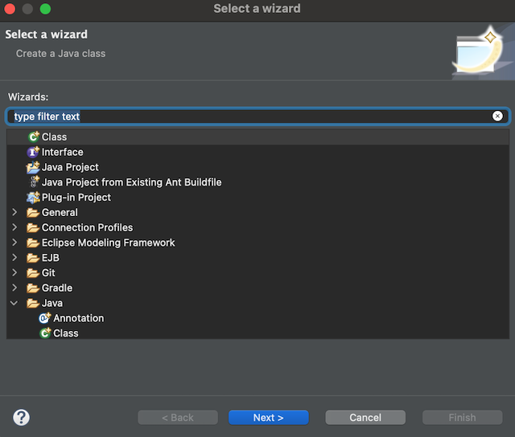
   
2. In the "Select a wizard" dialog, type `server` in the search box, select **Server**, and click **Next**

   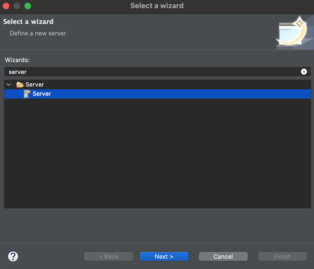

3. Select **WildFly** from the list (choose version 27 or later) and click **Next**

   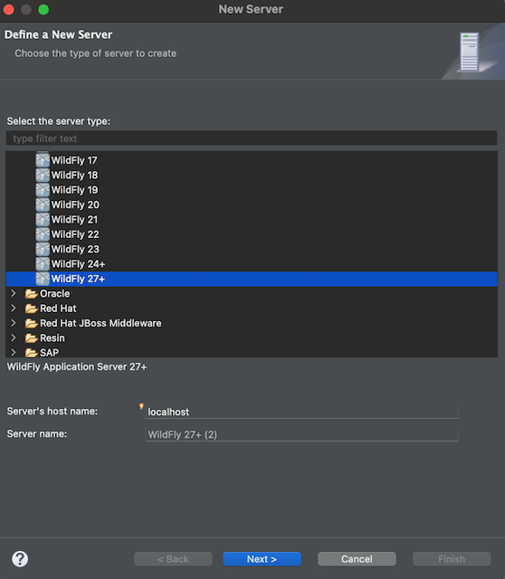

4. Click **Next** again

   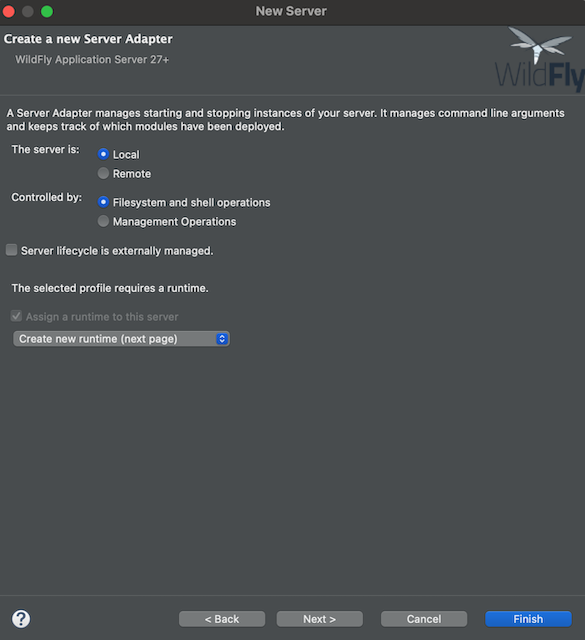

5. Click **Download and install runtime** to download WildFly

   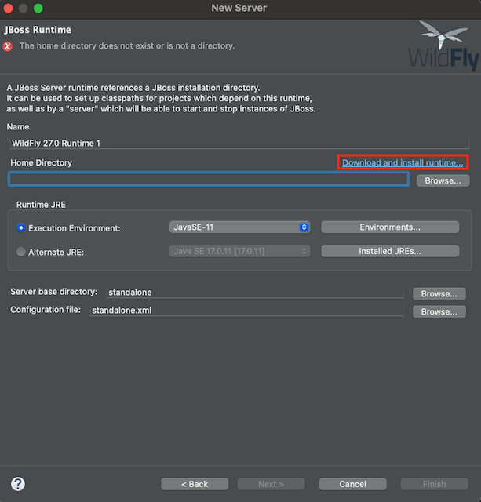

6. Select the latest version of WildFly and click **Next**

   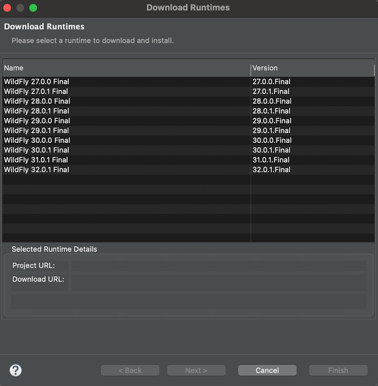

7. Read and accept the license agreement by checking the box, then click **Next**

   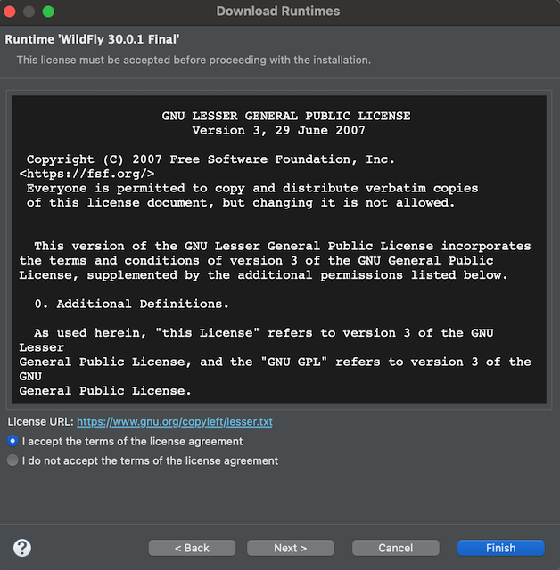

8. Choose where to install WildFly (e.g., `C:\wildfly`) and select your JDK installation, then click **Finish**

   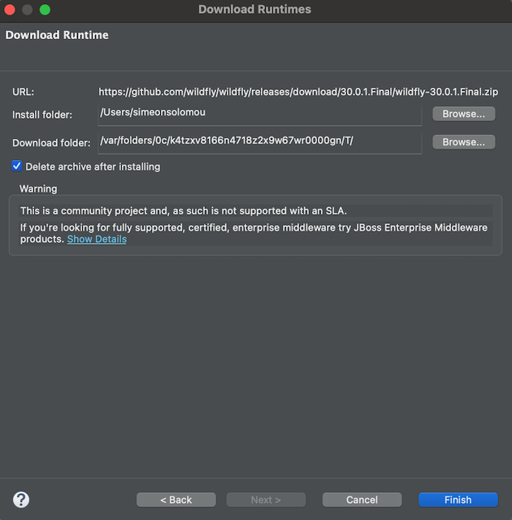
   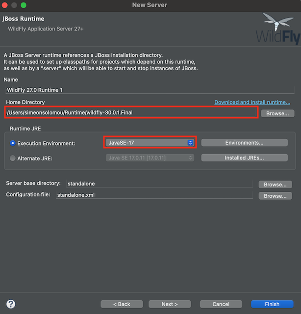

9. Wait for Eclipse to download and install WildFly (this may take several minutes)

**Note**: You should now see a WildFly server listed in the **Servers** tab at the bottom of Eclipse.

## Configure Eclipse IDE

### Set Up Eclipse Workspace

A workspace is a folder where Eclipse stores all your projects and settings.

1. Create a workspace folder:
   - Navigate to `C:\` in Windows Explorer
   - Right-click and select **New Folder**
   - Name it `workspace`
   - **Important**: Avoid spaces in folder names to prevent Java path issues

2. Start Eclipse and set up the workspace:
   - Launch Eclipse
   - When prompted for workspace location, browse to `C:\workspace\`
   - Check **Use this as the default and do not ask again**
   - Click **Launch**
   - Close the welcome screen if it appears

### Configure Java Compiler

Set Eclipse to use Java 17 (required for Skyve):

1. Go to **Window** → **Preferences**
2. Navigate to **Java** → **Compiler**
3. Set **Compiler compliance level** to **17**
4. Click **Apply and Close**
5. When prompted to rebuild, click **Yes**
  
See additional details in [Setting up a Skyve instance](./../_pages/appendix-setting-up-a-skyve-instance.md)

### Additional Recommended Setup

For a complete development environment, we also recommend:

- **Database**: Install a database like MySQL, PostgreSQL, or SQL Server (see database setup below)
- **Version Control**: Register for GitHub, GitLab, or BitBucket for code management
- **Skyve Community**: Join [Skyve Foundry](https://foundry.skyve.org/foundry) for resources
- **Support**: Join our [public Slack](https://join.slack.com/t/skyveframework/shared_invite/enQtNDMwNTcyNzE0NzI2LTRkMWUxZDBlZmFlMmJkMjQzYWMzYWQxMmQzYWQ1ZTdlODNkNjRlYzVhYjFmMmQ4NTlhYWY4MjNhMGVkZGNlMjY) for help

## Set Up Database (SQL Server Example)

Skyve needs a database to store your application data. This example uses Microsoft SQL Server.

### Install SQL Server

1. Download SQL Server:
   - Go to the [Microsoft SQL Server downloads page](https://www.microsoft.com/en-au/sql-server/sql-server-downloads)
   - Download the **Developer** or **Express** edition (both are free for development use)
   - Run the installer and follow the setup wizard

2. Install SQL Server Management Studio (SSMS):
   - Download from [Microsoft's SSMS page](https://docs.microsoft.com/en-us/sql/ssms/download-sql-server-management-studio-ssms)
   - This tool lets you manage your database

### Create Database and User

1. **Connect to SQL Server**:
   - Open SQL Server Management Studio
   - Choose **Windows Authentication** and click **Connect**

2. **Create the database**:
   - Right-click **Databases** in the left panel
   - Select **New Database...**
   - Name it `skyve` and click **OK**

3. **Create a database user**:
   - Right-click **Security** → **Logins** → **New Login...**
   - Enter a login name (e.g., `skyve_user`)
   - Choose **SQL Server authentication**
   - Enter a strong password (write it down!)
   - Uncheck **Enforce password expiration**
   - Uncheck **User must change password at next login**
   - Set **Default database** to `skyve`
   - In **Server Roles**, check **sysadmin**
   - In **User Mapping**, check the `skyve` database
   - Click **OK**

4. **Note the port number**:
   - If you just installed SQL Server, you may need to configure the port
   - See [these instructions](https://community.spiceworks.com/how_to/124598-find-the-port-sql-server-is-using-and-change-a-dynamic-port-to-static) for port configuration
   - Write down the port number (usually 1433)

## Import the Skyve Project

Now we'll download and import the Skyve project into Eclipse.

*Note: These instructions are for Eclipse. If using another IDE, you'll need to find similar import instructions.*

### Step 1: Download the Skyve Project

1. Open a command prompt or terminal
2. Navigate to your workspace directory:
   ```
   cd C:\workspace
   ```
3. Clone the Skyve repository:
   ```
   git clone https://github.com/skyvers/skyve.git
   ```
   If you are following a tutorial or setting up an existing application (for example from [Skyve Foundry](https://foundry.skyve.org/foundry) or the [Aged Care tutorial](https://skyvers.github.io/Aged-care/chapter3/)), clone that application's repository instead of (or in addition to) the main Skyve repository. Then use that project for the Maven install and content/addins steps below.
4. Wait for the download to complete

### Step 2: Import into Eclipse

1. In Eclipse, go to **File** → **Import...**
2. Expand **Maven** and select **Existing Maven Projects**
3. Click **Next**
4. Click **Browse...** and navigate to the `skyve` folder you just downloaded
5. Select the `skyve` folder and click **Select Folder**
6. Eclipse should automatically detect multiple Maven projects (you'll see them listed with checkboxes)
7. Ensure all projects are checked and click **Finish**
8. Wait for Eclipse to import and build all projects (this may take several minutes)

### Step 3: Verify Import

- You should see multiple projects in the Project Explorer (left panel)
- Wait for the progress indicator in the bottom-right corner to finish
- If you see any errors, try **Project** → **Clean** → **Clean all projects** → **OK**

## Create content and addins directories

Skyve uses a **content directory** for file uploads, images, backups, and caches, and an **addins directory** for addins such as the Skyve content management addin. The application will not start correctly unless these paths exist and are specified in your application's `.json` settings file. The steps below use `C:\workspace\` to match the workspace location used earlier in this guide.

1. **Create the content directory**
   - In Windows Explorer, navigate to your workspace (e.g. `C:\workspace`).
   - Create a new folder named `content` (e.g. `C:\workspace\content\`).
   - Optionally create a subfolder per application (e.g. `C:\workspace\content\myApp\`). The user or process running WildFly must have read and write access to this folder. Keeping the content folder outside your project folder avoids IDE scanning issues.

2. **Create the addins directory**
   - Inside the content folder you created, create a new folder named `addins` (e.g. `C:\workspace\content\addins\`). If you do not set `addins.directory` in your `.json` file, Skyve defaults to `<content.directory>/addins/`.

3. **Produce the content addin zip**
   - In Eclipse, right-click your project in Project Explorer and select **Run As** → **Maven install**.
   - When the build completes, a versioned zip file appears in your project's **target** folder (e.g. `skyve-content-9.4.0.zip`). The exact filename matches your Skyve version.

4. **Place the addin**
   - Copy that single zip file (e.g. `skyve-content-9.4.0.zip`) from the project's `target` folder to the addins directory (e.g. `C:\workspace\content\addins\`). Keep only one copy of the content addin zip in the addins directory. Do not unzip it—Skyve will detect it on startup and unzip/install it in the correct location.

5. **Configure the application JSON**
   - Ensure your application's `.json` settings file has:
     - **content.directory** set to your content path. The value must end with a slash and use forward slashes even on Windows (e.g. `"C:/workspace/content/myApp/"`).
     - **addins.directory** set to your addins path (e.g. `"C:/workspace/content/addins/"`).

The same layout is used in the [Aged Care tutorial (chapter 3)](https://skyvers.github.io/Aged-care/chapter3/). For more detail on the `.json` format, see [Working with content](./working-with-content) and [Setting up a Skyve instance](./appendix-setting-up-a-skyve-instance).

## Configure your application in WildFly deployments (manual deployment)

During development there are two common ways to deploy your Skyve application:

- From Eclipse, using **Run on Server**, which manages deployment for you (see [Start Your Skyve Application](#start-your-skyve-application) below).
- By copying your application artefacts into WildFly’s `standalone/deployments/` folder, which is closer to how UAT and production environments are configured. This is the approach shown in step 3.7 of the [Aged Care tutorial](https://skyvers.github.io/Aged-care/chapter3/).

Each Skyve application has:

- An instance-specific JSON settings file (for example `myApp.json`).
- For databases other than H2, a datasource file (for example `myApp-ds.xml`).

To configure your application in WildFly using the manual deployment style:

1. **Locate your settings files**
   - In most Skyve projects, the application `.json` and `-ds.xml` files are included with the exported project or generated assembly (for example in the project). The file names will match your application name, such as `myApp.json` and `myApp-ds.xml`.

2. **Copy settings into WildFly deployments**
   - Copy your application JSON file (for example `myApp.json`) into the WildFly deployments folder, for example:
     - `C:\wildfly-<version>\standalone\deployments\`
   - If you are using a database other than H2, also copy your datasource file (for example `myApp-ds.xml`) into the same `deployments` folder.

3. **Keep the JSON configuration consistent**
   - The `.json` you copy into `standalone\deployments\` must include the `content.directory`, `addins.directory` and datastore configuration you set earlier in this guide. When you change these settings, make sure you update the copy of the JSON file in `deployments\` as well.

4. **H2 exception**
   - When you are using H2 as your database, the entire datastore definition (connection and dialect) is specified in the application JSON and **no `-ds.xml` file is required or should be created**. For details and an example H2 configuration, see [Changing database dialect](./appendix-changing-database-dialect).

For a complete description of deploying your application `.war` alongside these settings files, see [Deploying a Skyve application](./appendix-deploying-a-skyve-application).

## Start Your Skyve Application

### Development Environment

You can either deploy your application directly from Eclipse using **Run on Server** (convenient for local development), or via the WildFly `standalone\deployments\` folder as described in [Configure your application in WildFly deployments (manual deployment)](#configure-your-application-in-wildfly-deployments-manual-deployment), which is closer to how staging and production environments are typically configured.

1. **Build the project and content addin (if not already done)**:
   - Right-click your project in Project Explorer and select **Run As** → **Maven install**. This builds the project and produces the content addin zip (e.g. `skyve-content-9.4.0.zip`) in the `target` folder. Complete the [Create content and addins directories](#create-content-and-addins-directories) steps first and ensure the `.json` content and addins paths point to the folders you created.

2. **Copy the application settings into WildFly deployments (once, before the first deploy)**:
   - Copy your application's `.json` file (e.g. `myApp.json`) into WildFly's deployments folder (e.g. `C:\wildfly-<version>\standalone\deployments\`). This is required for every deployment.
   - If you are using a database other than H2, also copy your application's datasource file (e.g. `myApp-ds.xml`) into the same `deployments` folder. When using H2, no `-ds.xml` file is needed (the datastore is defined in the JSON). See [Configure your application in WildFly deployments (manual deployment)](#configure-your-application-in-wildfly-deployments-manual-deployment) for details.

3. **Add the project to the server (if needed)**:
   - In the **Servers** tab (bottom panel), right-click your WildFly server and select **Add and Remove...**. Add your project to the server, then click **Finish**.

4. **Start WildFly Server**:
   - In Eclipse, go to the **Servers** tab (bottom panel)
   - Right-click your WildFly server and select **Start**
   - Wait for the server to start (watch the Console tab for messages)

5. **Deploy Your Application**:
   - Right-click your Skyve project in Project Explorer
   - Select **Run As** → **Run on Server**
   - Choose your WildFly server and click **Finish**

6. **Access Your Application**:
   - Open a web browser
   - Go to `http://localhost:8080/your-app-name`
   - You should see the Skyve application login page

**Note**: Skyve creates a default admin user for development. Check your project's configuration files for the default login credentials.

### Production Environments

For UAT and production environments, WildFly should be configured as a Windows service. See the WildFly documentation for detailed instructions.

### Test from Mobile Device (Optional)

You can test your Skyve application from mobile devices on the same network.

#### Step 1: Find Your Computer's IP Address

1. Open Command Prompt (press Windows + R, type `cmd`, press Enter)
2. Type `ipconfig` and press Enter
3. Look for your network adapter's IPv4 address (e.g., 192.168.1.100)

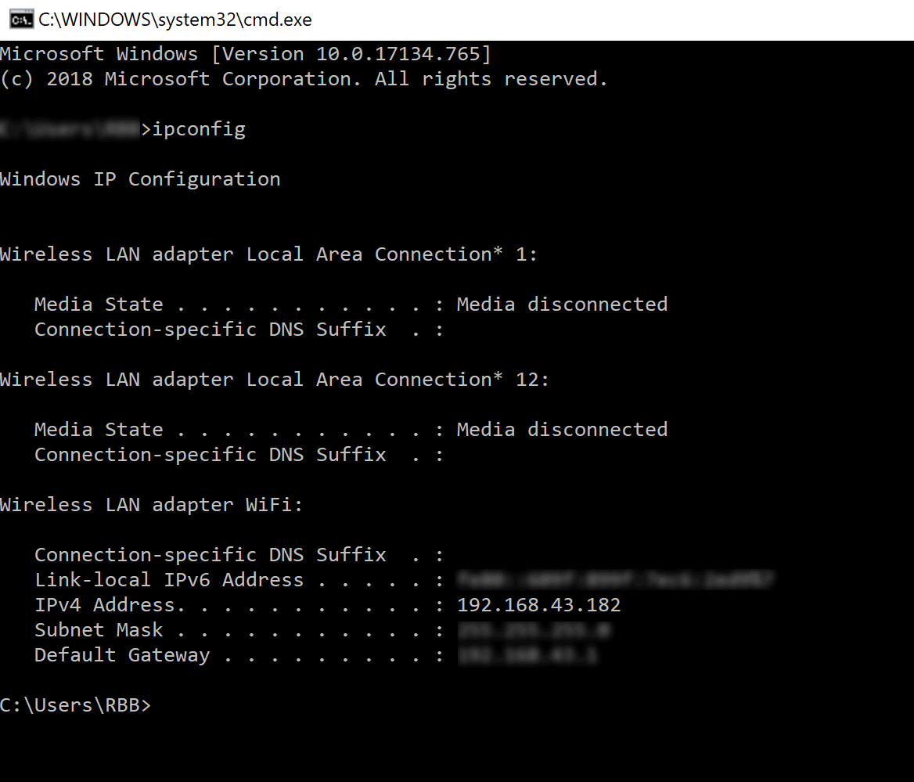

#### Step 2: Configure WildFly for External Access

1. In Eclipse, double-click your WildFly server in the **Servers** tab
2. In the **Server Locations** section, select **Use custom location**
3. In the **Open launch configuration** link, add `-b 0.0.0.0` to the **Program arguments**
4. Save and restart WildFly

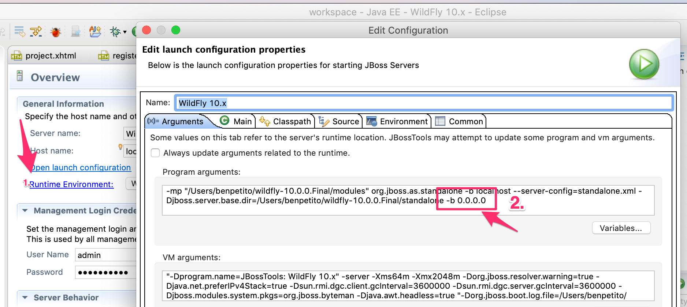

#### Step 3: Update Application Configuration

1. Find your project's configuration file (usually a `.json` file)
2. Update the `server url` setting to use your IP address:
   ```
   http://192.168.1.100:8080/
   ```
3. Keep your existing context path (e.g., `/myapp`)

#### Step 4: Test from Mobile

1. Connect your mobile device to the same network as your computer
2. Open a browser on your mobile device
3. Navigate to: `http://YOUR_IP_ADDRESS:8080/your-app-name`
4. You should see your Skyve application

**[⬆ back to top](#installing-and-configuring-a-skyve-development-environment)**

---
**Next [Setting up a Skyve instance](./../_pages/appendix-setting-up-a-skyve-instance.md)**<br>
**Previous [Deploying a Skyve application](./../_pages/appendix-deploying-a-skyve-application.md)**
