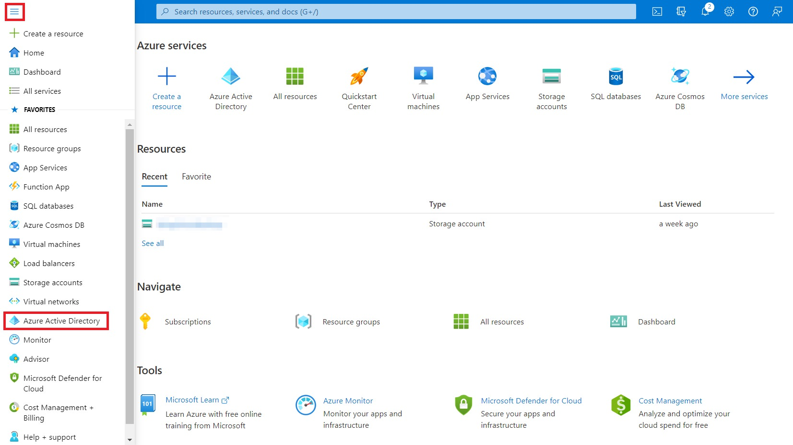
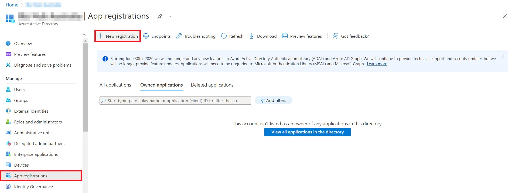
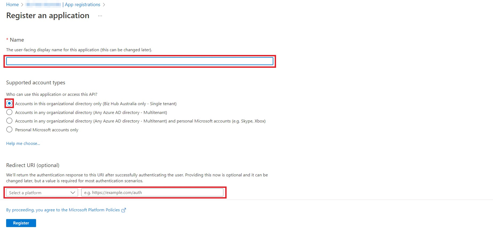
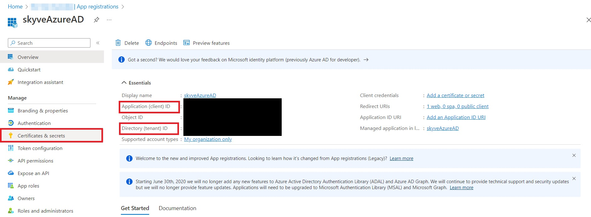
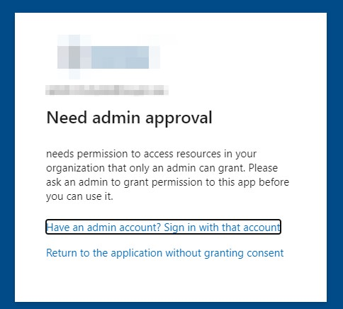

In addition to local authentication, Skyve supports authentication using OAuth2 with Google, Facebook, GitHub and Office 365. 

Enabling OAuth2 authentication only allows a user to authenticate with Skyve, it does not define which roles/groups the user is _authorized_ for within the application. This is still maintained by Skyve.

Once enabled, the login screen will update and provide a new button for users to login with. Services can be enabled by turning on the specific properties in the `account` section of the application's json configuration file.

## Azure AD integration

If you are using Microsoft 365, it is possible to integrate your Skyve application with Active Directory. This provides users the ability to login using their existing business email and password (and 2-factor authentication if enabled) to login, instead of having Skyve manage the credentials.

_Prerequisites:_

1. You have an active Microsoft 365 subscription
1. Usernames in your Skyve application must match the email address in your active directory
1. Your Skyve application is at least version 8.2.2

### Configuration

#### Microsoft Azure Portal

1. Login to portal.azure.com
1. Click the hamburger menu in the top left hand corner, then select Azure Active Directory



1. Select `App registrations`
1. Click `New registration`



1. Enter the name of the application
1. Keep Single Tenant selected for supported account types
1. Select Web and enter the url, the url should be the context path to the application and end with `/oauth2/code`, be sure to EXCLUDE the trailing slash
	1. The Redirect URL should be the following with the application URL: `<protocol>://<domain>:<port>/<applicationName>/login/oauth2/code`
  1. Ensure you have the correct `protocol` (http/http), `domain name`, optional `port` and `application name`
  1. E.g. `http://localhost:8080/mySkyveApp/login/oauth2/code`
1. Click `Register`



1. Add the following properties from the app registration you entered in the Azure portal to your application's json configuration:

```json
"account": {
  "azureAdAuthTenantId": "<your-tenant-ID>",
  "azureAdAuthClientId": "<your-client-ID",
  "azureAdAuthSecret": "<your-client-secret>"
}
```

To generate a client secret if you do not have one, from the Overview -> Client credentials, click the link, or select Certificates & secrets from the left-hand menu. Follow the prompts to create a new client secret and copy the `value` once generated. (NOTE: Be sure to copy the value at this point in time as it will not be available later and a new Secret will need to be generated.)

The clientID and tenantID can be taken from the App Registrations also, as shown.



#### Skyve Customisations

In order for the JSESSIONID to not be lost when redirecting through the Microsoft authorisation flow, the cookie settings need to be customised for the application when enabling Azure AD in Skyve.

This requires a file to be created in your project:

1. Create file `undertow-handlers.conf` at `src/main/java/webapp/WEB-INF/undertow-handlers.conf` with the following values:

```
path-prefix('/')->samesite-cookie(mode=Lax, cookie-pattern=customer)
path-prefix('/')->samesite-cookie(mode=Lax, cookie-pattern=JSESSIONID)
path-prefix('/')->samesite-cookie('Strict')

```

##### Application JSON Changes

In order for Skyve to enable the Azure AD login option, 3 properties need to be set in the account section of the project JSON file. Update these now if they were not entered previously.

```json
"account": {
  "azureAdAuthTenantId": "<your-tenant-ID>",
  "azureAdAuthClientId": "<your-client-ID",
  "azureAdAuthSecret": "<your-client-secret>"
}
```

### Testing

Once the changes have been applied to the Azure portal and your Skyve application, deploy the changes to confirm they are working.

You will need a user in your Skyve application with a _username_ that matches the _email address_ of an administrator in your active directory that can approve access for your portal app registration.

#### Approve Access

Once you login to your deployed Skyve application for the first time, the login screen should now show an Azure AD sign in option below the username / password input fields. Clicking this will attempt login using Azure AD, and after authenticating with AD, you will be prompted for approval. If you attempt to sign in with an account that does not have the correct permissions, you will be shown a message similar to below:



Once approval has been granted, you should be signed in.

**[⬆ back to top](#azure-ad-integration)**