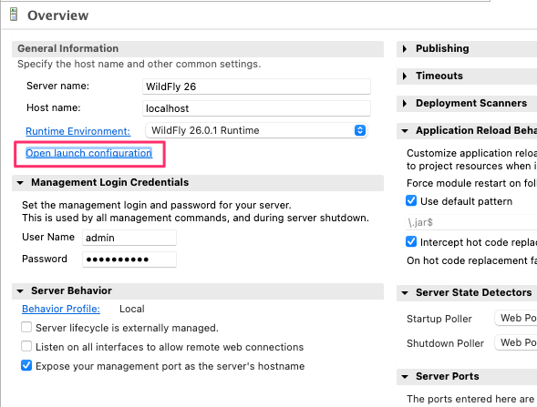
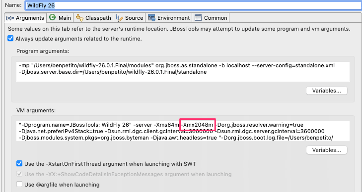

The following are some common problems and solutions when working with Skyve applications.

## Frequently Asked Questions

**Question**

I am having issues with a new project not showing my added modules.  My menu entries don't show up, the modules aren't listed in the data maintenance section, and defined roles don't appear when editing a user.  The modules are in the WAR archive.  I can see from the Wildfly log that the modules are being parsed, and related tables are created in the database.

**Answer**

If your application runs locally and you already have a bootstrap user to sign in with, check if your bootstrap user has permission to the other modules.

When Skyve first starts up and creates the bootstrap user, it will grant that user all module roles. 

If you add a module *after* this user is created, you must manually assign the new roles.
Check out the user guide for steps to [add a role or group to an existing user](https://skyvers.github.io/skyve-user-guide/users/#adding-a-group-or-role-to-a-user).

**Question**

I receive an error during deployment of an application to MySQL:

```bash
12:39:58,788 ERROR [[org.jboss.as](http://org.jboss.as/).controller.management-operation] (Controller Boot Thread) WFLYCTL0013: Operation ("deploy") failed - address: ([("deployment" => "iqms.war")]) - failure description: {"WFLYCTL0080: Failed services" => {"jboss.deployment.unit.\"iqms.war\".undertow-deployment" => "java.lang.RuntimeException: java.lang.IllegalStateException: Cannot initialise either the data schema or the bootstrap user.
    Caused by: java.lang.RuntimeException: java.lang.IllegalStateException: Cannot initialise either the data schema or the bootstrap user.
```

**Answer**

Check your database to see what tables have been created. If they have not been created for all modules, you may need to update your hibernate settings in your application json config file to specify the `catalog`. 

See the [Changing database dialect](https://skyvers.github.io/skyve-dev-guide/appendix-changing-database-dialect/#updating-the-json-file-for-mysql) section of the developer guide for more details.

**Question**
I am getting an out of memory error at startup when deploying my application:
```
09:42:27,901 ERROR [org.jboss.msc.service.fail] (ServerService Thread Pool -- 98) MSC000001: Failed to start service jboss.deployment.unit."appName.war".undertow-deployment: org.jboss.msc.service.StartException in service jboss.deployment.unit."appName.war".undertow-deployment: java.lang.OutOfMemoryError: Java heap space
```

**Answer**
If this happens during redeploys of the application, it may be that Wildfly does not have enough memory available to it. If running from within the Eclipse plugin, this can be increased by:

* double-clicking on your Wildfly server in the `Servers` panel
* click Open launch configuration url in the Overview
* increase the `-Xmx` memory to something larger, e.g. `-Xmx2048m`




If the error still occurs, it is most likely caused by an error in your project JSON configuration file, usually when something is not terminated correctly, e.g. an open `{` without a matching `}`, or a new stanza `{ … }` without a comma after the previous one.

Try reverting your JSON to the default or an earlier version to restore a working configuration, or see [Missing comma or badly formed json file](#missing-comma-or-badly-formed-json-file) for more details.

## Example building problems

### Problems building your app

* Check that you have Java 11+ (jdk11) available in your IDE.

For example, in Eclipse, right-click your project and choose _Properties_->_Java Build Path_
Change to the _Libraries_ tab, select the JRE Library and click _Edit_
Click _Installed JREs_
Add or select Java 11 (jdk11)


* Check that you have Java 11 (jdk11) selected for compiler compliance in your IDE.

For example, in Eclipse, right-click your project and choose _Properties_->_Java Compiler_->_Configure Workspace Settings_


Alternatively, select _Enable project specific settings_ and set the project compliance level.

* Check that you have the Java 11 (jdk11) selected for the Runtime JRE.

For example, in Eclipse, right-click your project and choose _Run As_->_Run Configurations..._


* Check that you have successfully built your project using the Generate Domain task.

In your project _config_ folder, right-click the _MyAppName - Generate Domain.launch_ task and choose 
_Run As_->_MyAppName - Generate Domain_

### Incorrect hibernate dialect

* If you have overlooked setting the correct dialect in your `.json` file, the application may not be able to deploy because the automatic database table creation feature may not be able to create the tables required for your application.

For example, if you created your application using the `h2` dialect and are attempting to connect to a `MS SQL` database, you have the correct connection string in the `ds.xml` file but have not set the correct dialect in the `.json` file, you will receive an exception like this:

```
07:59:23,042 ERROR [org.hibernate.engine.jdbc.env.internal.JdbcEnvironmentImpl] (ServerService Thread Pool -- 130) Could not fetch the SequenceInformation from the database: com.microsoft.sqlserver.jdbc.SQLServerException: The "variant" data type is not supported.
```

In this case, check that:
* the dialect in the `pom.xml` matches your target database and then `Generate Domain` to rebuild you project for that dialect (e.g. `<dialect>MSSQL_2016</dialect>`)
* the dialect in the `.json` file also matches (e.g. `"dialect": "org.skyve.impl.persistence.hibernate.dialect.SQLServer2012SpatialDialect",`)

See more at [Changing the database dialect](./../_pages/appendix-changing-database-dialect/)

### Problems finding your app

If you are having trouble loading your Skyve application in your browser after it has been successfully deployed:

* Check the URL settings in the project `.json` file for the URL and context. 

For example, if you project has the following:

```json
	// URL settings - various SKYVE URL/URI fragments - useful for linking and mailing
	"url": {
		// server URL
		"server": "${SKYVE_URL:http://localhost:8080}",
		// web context path
		"context": "${SKYVE_CONTEXT:/helloWorld}",
		// home path
		"home": "/"
	},
```

Then you can access your app at:

[http://localhost:8080/helloWorld](http://localhost:8080/helloWorld)

If this still does not work, check the value of the `context-root` element in `src/main/webapp/WEB-INF/jboss-web.xml`. This should match the `context` setting in the project `.json` file.

```xml
	<context-root>${env.SKYVE_WEB_CONTEXT:/helloWorld}</context-root>
```

See more at [Changing the project URL](./../_pages/appendix_skyve_application_configuration/#changing-the-project-url)

### Problems signing in for the first time

As a way to get started with a new environment, Skyve provides a bootstrap capability that inserts a user credential into your database for your first sign in (normally into an empty database). 

If the bootstrap option is used, the user record will be inserted into your database so that you can sign in, however this will only occur if the username does NOT already exist, and if the environment identifier indicates that the environment is NOT a _Production_ environment.

You can change the bootstrap settings in the project `.json` file, however, once the username exists in the database, changing the bootstrap user or password will have no effect unless a different username is used or the user record is removed.

To ensure the bootstrap user is inserted for your first sign in:

* Check the _environment identifier_ setting in the project `.json` file, and check that it is not `null` (i.e. this is not _Production_ environment).

For example, if you have the following:

```json
	// Environment settings
	"environment": {
		// test, sit, uat, dev etc: null = prod
		"identifier": null,
	}
```

Change this to a specific environment setting such as :

```json
	// Environment settings
	"environment": {
		// test, sit, uat, dev etc: null = prod
		"identifier": "dev",
	}
```

Then restart your app server (e.g. Wildfly).

When you are ready to go live into Production, change the identifier value back to `null` and restart Wildfly.

* Check that you are using the bootstrap credentials as set in the project `.json` properties file.

For example, if you have the following:

```json
	// bootstrap user settings - creates a user with all customer roles assigned, if the user does not already exist
	"bootstrap": {
        "customer": "skyve",
        "user": "${BOOTSTRAP_USERNAME:setup}",
        "email": "test@test.com",
        "password": "${BOOTSTRAP_PASSWORD:setup}"
    }
```

Then your bootstrap credentials will be:

* user: `setup`
* password: `setup`

If you still have problems, ensure that the bootstrap `customer` setting matches the environment default `customer` setting and that the environment identifier is not `null` (for example, you may switch the identifier to `config` to indicate the system is being configured, or `dev` for developer mode etc.)

For example, if you have the following:

```json
	// Environment settings
	"environment": {
		// test, sit, uat, dev etc: null = prod
		"identifier": "dev",
		// Dev Mode will drop cached metadata allowing the effects of any changes to be observed without redeploying
		"devMode": true,
		// Customer Default
		"customer": "skyve",
	},
	// bootstrap user settings - creates a user with all customer roles assigned, if the user does not already exist
	"bootstrap": {
		"customer": "skve",
		"user": "setup",
		"email": "test@test.com",
		"password": "setup"
	}
```

If you set the `environment.customer` to null, the Skyve sign in page will require you to specify the _customer_ as well as the _username_ and _password_.

If you specify an `environment.customer`, make sure it matches the `bootstrap.customer` or your initial sign in will fail.

## Example deployment problems

Key problems in the `myApplication.json` configuration file block can your project from deploying successfully and sometimes yield non-obvious errors or stack output. The following provides three common examples.

### Example output for incorrect content or addins folder
Incorrect content folder - the folder doesn't exist:

```json
	// Content settings
	"content": {
		// directory path
		"directory": "C:/skyve/content/", 
		// CRON Expression for CMS Garbage Collection job - run at 7 past the hour every hour
		"gcCron": "0 7 0/1 1/1 * ? *", 
		// Attachments stored on file system or inline
		"fileStorage": true
	},
  // Add-ins settings
	"addins": {
		// Where to look for add-ins - defaults to <content.directory>/addins/
		"directory": null
	},
```

In this case, the folder `C:/skyve/content/` doesn't exist or the name is incorrect.

Attempting to deploy in this case yields results such as the following:

```
15:51:09,837 ERROR [org.jboss.msc.service.fail] (ServerService Thread Pool -- 61) MSC000001: Failed to start service jboss.undertow.deployment.default-server.default-host./phweb: org.jboss.msc.service.StartException in service jboss.undertow.deployment.default-server.default-host./phweb: java.lang.RuntimeException: java.lang.IllegalStateException: content.directory C:/skyve/content/ does not exist.
	at org.wildfly.extension.undertow.deployment.UndertowDeploymentService$1.run(UndertowDeploymentService.java:85)
	at java.util.concurrent.Executors$RunnableAdapter.call(Executors.java:511)
	at java.util.concurrent.FutureTask.run(FutureTask.java:266)
	at java.util.concurrent.ThreadPoolExecutor.runWorker(ThreadPoolExecutor.java:1149)
	at java.util.concurrent.ThreadPoolExecutor$Worker.run(ThreadPoolExecutor.java:624)
	at java.lang.Thread.run(Thread.java:748)
	at org.jboss.threads.JBossThread.run(JBossThread.java:320)
Caused by: java.lang.RuntimeException: java.lang.IllegalStateException: *content.directory C:/skyve/content/ does not exist.*
	at io.undertow.servlet.core.DeploymentManagerImpl.deploy(DeploymentManagerImpl.java:236)
	at org.wildfly.extension.undertow.deployment.UndertowDeploymentService.startContext(UndertowDeploymentService.java:100)
	at org.wildfly.extension.undertow.deployment.UndertowDeploymentService$1.run(UndertowDeploymentService.java:82)
	... 6 more
Caused by: java.lang.IllegalStateException: content.directory C:/skyve/content/ does not exist.
	at org.skyve.impl.web.SkyveContextListener.contextInitialized(SkyveContextListener.java:102)
	at io.undertow.servlet.core.ApplicationListeners.contextInitialized(ApplicationListeners.java:187)
	at io.undertow.servlet.core.DeploymentManagerImpl$1.call(DeploymentManagerImpl.java:200)
	at io.undertow.servlet.core.DeploymentManagerImpl$1.call(DeploymentManagerImpl.java:171)
	at io.undertow.servlet.core.ServletRequestContextThreadSetupAction$1.call(ServletRequestContextThreadSetupAction.java:42)
	at io.undertow.servlet.core.ContextClassLoaderSetupAction$1.call(ContextClassLoaderSetupAction.java:43)
	at io.undertow.servlet.api.LegacyThreadSetupActionWrapper$1.call(LegacyThreadSetupActionWrapper.java:44)
	at io.undertow.servlet.api.LegacyThreadSetupActionWrapper$1.call(LegacyThreadSetupActionWrapper.java:44)
	at io.undertow.servlet.api.LegacyThreadSetupActionWrapper$1.call(LegacyThreadSetupActionWrapper.java:44)
	at io.undertow.servlet.api.LegacyThreadSetupActionWrapper$1.call(LegacyThreadSetupActionWrapper.java:44)
	at io.undertow.servlet.api.LegacyThreadSetupActionWrapper$1.call(LegacyThreadSetupActionWrapper.java:44)
	at io.undertow.servlet.core.DeploymentManagerImpl.deploy(DeploymentManagerImpl.java:234)
	... 8 more
```

A similar error occurs if the `addins` directory is not found:

```
org.jboss.msc.service.StartException in service jboss.deployment.unit."jobManager.war".undertow-deployment: java.lang.RuntimeException: java.lang.IllegalStateException: addins.directory C:/skyve/content/addins/ does not exist.
```

Manually create an `addins` directory inside the content directory specified for your project. This is where Skyve will look for the addins directory by default if no path is specified in the json.

### Example incorrect/invalid customer in bootstrap stanza

Incorrect customer in the bootstrap- there is no such customer defined:

```json
// bootstrap user settings - creates a user with all customer roles assigned, if the user does not already exist
"bootstrap": {
	"customer": "skyve",
	"user": "admin",
	"email": "test@test.com",
	"password": "admin"
}
```

In this case, there is no _skyve_ customer declaration file within the _customer_ folder.

Attempting to deploy in this case yields results such as the following:

```
15:48:03,814 ERROR [stderr] (ServerService Thread Pool -- 68) org.skyve.metadata.MetaDataException: A problem was encountered.
15:48:03,814 ERROR [stderr] (ServerService Thread Pool -- 68) 	at org.skyve.impl.metadata.repository.LocalDesignRepository.getCustomer(LocalDesignRepository.java:174)
15:48:03,814 ERROR [stderr] (ServerService Thread Pool -- 68) 	at org.skyve.impl.metadata.user.UserImpl.getCustomer(UserImpl.java:198)
15:48:03,814 ERROR [stderr] (ServerService Thread Pool -- 68) 	at org.skyve.impl.metadata.user.SuperUser.getAccessibleModuleNames(SuperUser.java:85)
15:48:03,814 ERROR [stderr] (ServerService Thread Pool -- 68) 	at org.skyve.impl.persistence.hibernate.AbstractHibernatePersistence.resetDocumentPermissionScopes(AbstractHibernatePersistence.java:528)
15:48:03,814 ERROR [stderr] (ServerService Thread Pool -- 68) 	at org.skyve.impl.persistence.hibernate.AbstractHibernatePersistence.setUser(AbstractHibernatePersistence.java:500)
15:48:03,814 ERROR [stderr] (ServerService Thread Pool -- 68) 	at org.skyve.impl.web.SkyveContextListener.contextInitialized(SkyveContextListener.java:276)
15:48:03,814 ERROR [stderr] (ServerService Thread Pool -- 68) 	at io.undertow.servlet.core.ApplicationListeners.contextInitialized(ApplicationListeners.java:187)
15:48:03,814 ERROR [stderr] (ServerService Thread Pool -- 68) 	at io.undertow.servlet.core.DeploymentManagerImpl$1.call(DeploymentManagerImpl.java:200)
15:48:03,815 ERROR [stderr] (ServerService Thread Pool -- 68) 	at io.undertow.servlet.core.DeploymentManagerImpl$1.call(DeploymentManagerImpl.java:171)
15:48:03,815 ERROR [stderr] (ServerService Thread Pool -- 68) 	at io.undertow.servlet.core.ServletRequestContextThreadSetupAction$1.call(ServletRequestContextThreadSetupAction.java:42)
15:48:03,815 ERROR [stderr] (ServerService Thread Pool -- 68) 	at io.undertow.servlet.core.ContextClassLoaderSetupAction$1.call(ContextClassLoaderSetupAction.java:43)
15:48:03,815 ERROR [stderr] (ServerService Thread Pool -- 68) 	at io.undertow.servlet.api.LegacyThreadSetupActionWrapper$1.call(LegacyThreadSetupActionWrapper.java:44)
15:48:03,815 ERROR [stderr] (ServerService Thread Pool -- 68) 	at io.undertow.servlet.api.LegacyThreadSetupActionWrapper$1.call(LegacyThreadSetupActionWrapper.java:44)
15:48:03,815 ERROR [stderr] (ServerService Thread Pool -- 68) 	at io.undertow.servlet.api.LegacyThreadSetupActionWrapper$1.call(LegacyThreadSetupActionWrapper.java:44)
15:48:03,815 ERROR [stderr] (ServerService Thread Pool -- 68) 	at io.undertow.servlet.api.LegacyThreadSetupActionWrapper$1.call(LegacyThreadSetupActionWrapper.java:44)
15:48:03,815 ERROR [stderr] (ServerService Thread Pool -- 68) 	at io.undertow.servlet.api.LegacyThreadSetupActionWrapper$1.call(LegacyThreadSetupActionWrapper.java:44)
15:48:03,815 ERROR [stderr] (ServerService Thread Pool -- 68) 	at io.undertow.servlet.core.DeploymentManagerImpl.deploy(DeploymentManagerImpl.java:234)
15:48:03,815 ERROR [stderr] (ServerService Thread Pool -- 68) 	at org.wildfly.extension.undertow.deployment.UndertowDeploymentService.startContext(UndertowDeploymentService.java:100)
15:48:03,816 ERROR [stderr] (ServerService Thread Pool -- 68) 	at org.wildfly.extension.undertow.deployment.UndertowDeploymentService$1.run(UndertowDeploymentService.java:82)
15:48:03,816 ERROR [stderr] (ServerService Thread Pool -- 68) 	at java.util.concurrent.Executors$RunnableAdapter.call(Executors.java:511)
15:48:03,816 ERROR [stderr] (ServerService Thread Pool -- 68) 	at java.util.concurrent.FutureTask.run(FutureTask.java:266)
15:48:03,816 ERROR [stderr] (ServerService Thread Pool -- 68) 	at java.util.concurrent.ThreadPoolExecutor.runWorker(ThreadPoolExecutor.java:1149)
15:48:03,816 ERROR [stderr] (ServerService Thread Pool -- 68) 	at java.util.concurrent.ThreadPoolExecutor$Worker.run(ThreadPoolExecutor.java:624)
15:48:03,816 ERROR [stderr] (ServerService Thread Pool -- 68) 	at java.lang.Thread.run(Thread.java:748)
15:48:03,816 ERROR [stderr] (ServerService Thread Pool -- 68) 	at org.jboss.threads.JBossThread.run(JBossThread.java:320)
15:48:03,816 ERROR [stderr] (ServerService Thread Pool -- 68) Caused by: org.skyve.metadata.MetaDataException: Could not unmarshal customer at /C:/_/pgibsa/Phylloxera/javaee/pgibsa.ear/apps.jar/customers/skyve/skyve.xml
15:48:03,816 ERROR [stderr] (ServerService Thread Pool -- 68) 	at org.skyve.impl.util.XMLMetaData.unmarshalCustomer(XMLMetaData.java:185)
15:48:03,816 ERROR [stderr] (ServerService Thread Pool -- 68) 	at org.skyve.impl.metadata.repository.LocalDesignRepository.getCustomer(LocalDesignRepository.java:164)
15:48:03,817 ERROR [stderr] (ServerService Thread Pool -- 68) 	... 24 more
15:48:03,817 ERROR [stderr] (ServerService Thread Pool -- 68) Caused by: java.io.FileNotFoundException: C:\_\pgibsa\Phylloxera\javaee\pgibsa.ear\apps.jar\customers\skyve\skyve.xml (The system cannot find the path specified)
15:48:03,817 ERROR [stderr] (ServerService Thread Pool -- 68) 	at java.io.FileInputStream.open0(Native Method)
15:48:03,817 ERROR [stderr] (ServerService Thread Pool -- 68) 	at java.io.FileInputStream.open(FileInputStream.java:195)
15:48:03,817 ERROR [stderr] (ServerService Thread Pool -- 68) 	at java.io.FileInputStream.<init>(FileInputStream.java:138)
15:48:03,817 ERROR [stderr] (ServerService Thread Pool -- 68) 	at java.io.FileInputStream.<init>(FileInputStream.java:93)
15:48:03,817 ERROR [stderr] (ServerService Thread Pool -- 68) 	at org.skyve.impl.util.XMLMetaData.unmarshalCustomer(XMLMetaData.java:173)
15:48:03,817 ERROR [stderr] (ServerService Thread Pool -- 68) 	... 25 more
```

### Missing comma or badly formed json file

Missing comma or badly formed json file:

```json
	// bootstrap user settings - creates a user with all customer roles assigned, if the user does not already exist
	"bootstrap": {
		"customer": "skyve",
		"user": "admin",
		"email": "test@test.com",
		"password": "admin"
	} 
	// When taking photos or uploading images they will be compressed to within the size below (if possible)
	maxUploadedFileSizeInBytes: 1000000 // 10 MB
}
```

For example, there should have been a comma _after_ the bootstrap stanza.

Attempting to deploy in this case yields results such as the following:

```
15:40:16,947 ERROR [org.jboss.msc.service.fail] (ServerService Thread Pool -- 69) MSC000001: Failed to start service jboss.undertow.deployment.default-server.default-host./phweb: org.jboss.msc.service.StartException in service jboss.undertow.deployment.default-server.default-host./phweb: java.lang.RuntimeException: java.lang.ClassCastException: java.lang.Long cannot be cast to java.util.Map
	at org.wildfly.extension.undertow.deployment.UndertowDeploymentService$1.run(UndertowDeploymentService.java:85)
	at java.util.concurrent.Executors$RunnableAdapter.call(Executors.java:511)
	at java.util.concurrent.FutureTask.run(FutureTask.java:266)
	at java.util.concurrent.ThreadPoolExecutor.runWorker(ThreadPoolExecutor.java:1149)
	at java.util.concurrent.ThreadPoolExecutor$Worker.run(ThreadPoolExecutor.java:624)
	at java.lang.Thread.run(Thread.java:748)
	at org.jboss.threads.JBossThread.run(JBossThread.java:320)
Caused by: java.lang.RuntimeException: java.lang.ClassCastException: java.lang.Long cannot be cast to java.util.Map
	at io.undertow.servlet.core.DeploymentManagerImpl.deploy(DeploymentManagerImpl.java:236)
	at org.wildfly.extension.undertow.deployment.UndertowDeploymentService.startContext(UndertowDeploymentService.java:100)
	at org.wildfly.extension.undertow.deployment.UndertowDeploymentService$1.run(UndertowDeploymentService.java:82)
	... 6 more
Caused by: java.lang.ClassCastException: java.lang.Long cannot be cast to java.util.Map
	at org.skyve.impl.web.SkyveContextListener.getObject(SkyveContextListener.java:378)
	at org.skyve.impl.web.SkyveContextListener.contextInitialized(SkyveContextListener.java:253)
	at io.undertow.servlet.core.ApplicationListeners.contextInitialized(ApplicationListeners.java:187)
	at io.undertow.servlet.core.DeploymentManagerImpl$1.call(DeploymentManagerImpl.java:200)
	at io.undertow.servlet.core.DeploymentManagerImpl$1.call(DeploymentManagerImpl.java:171)
	at io.undertow.servlet.core.ServletRequestContextThreadSetupAction$1.call(ServletRequestContextThreadSetupAction.java:42)
	at io.undertow.servlet.core.ContextClassLoaderSetupAction$1.call(ContextClassLoaderSetupAction.java:43)
	at io.undertow.servlet.api.LegacyThreadSetupActionWrapper$1.call(LegacyThreadSetupActionWrapper.java:44)
	at io.undertow.servlet.api.LegacyThreadSetupActionWrapper$1.call(LegacyThreadSetupActionWrapper.java:44)
	at io.undertow.servlet.api.LegacyThreadSetupActionWrapper$1.call(LegacyThreadSetupActionWrapper.java:44)
	at io.undertow.servlet.api.LegacyThreadSetupActionWrapper$1.call(LegacyThreadSetupActionWrapper.java:44)
	at io.undertow.servlet.api.LegacyThreadSetupActionWrapper$1.call(LegacyThreadSetupActionWrapper.java:44)
	at io.undertow.servlet.core.DeploymentManagerImpl.deploy(DeploymentManagerImpl.java:234)
	... 8 more
```

## Still having problems?

If you are still having problems with your Skyve application, please join us on [Slack](https://join.slack.com/t/skyveframework/shared_invite/enQtNDMwNTcyNzE0NzI2LWNjMTBlMTMzNTA4YzBlMzFhYzE0ZmRhOWIzMWViODY4ZTE1N2QzYWM1MTdlMTliNDIyYTBkOWZhZDAxOGQyYjQ) and ask our friendly team.

**[⬆ back to top](#example-building-problems)**

<div style="padding-bottom: 100px"></div>