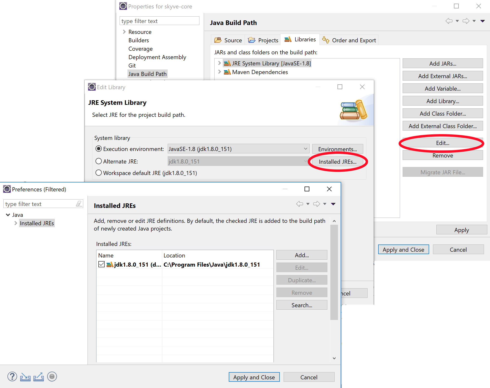
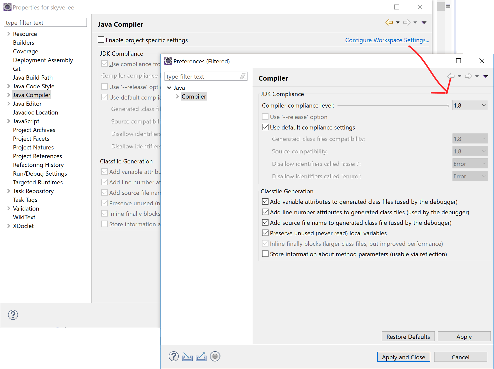
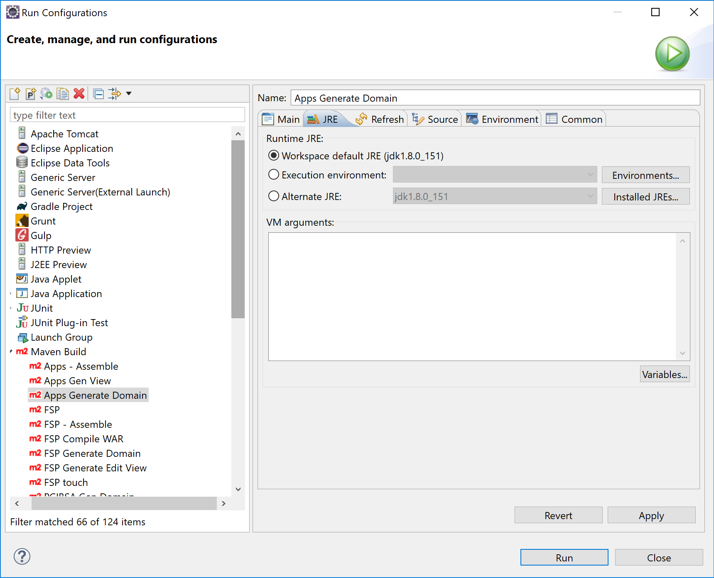
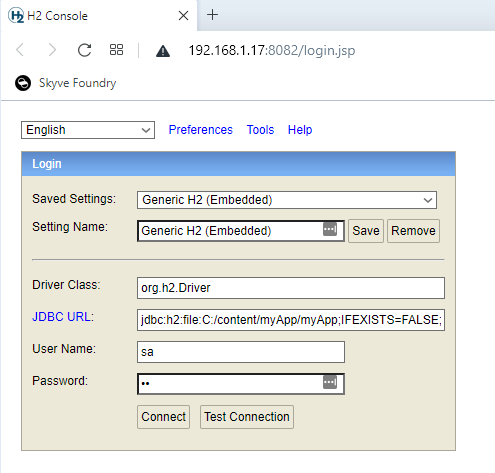
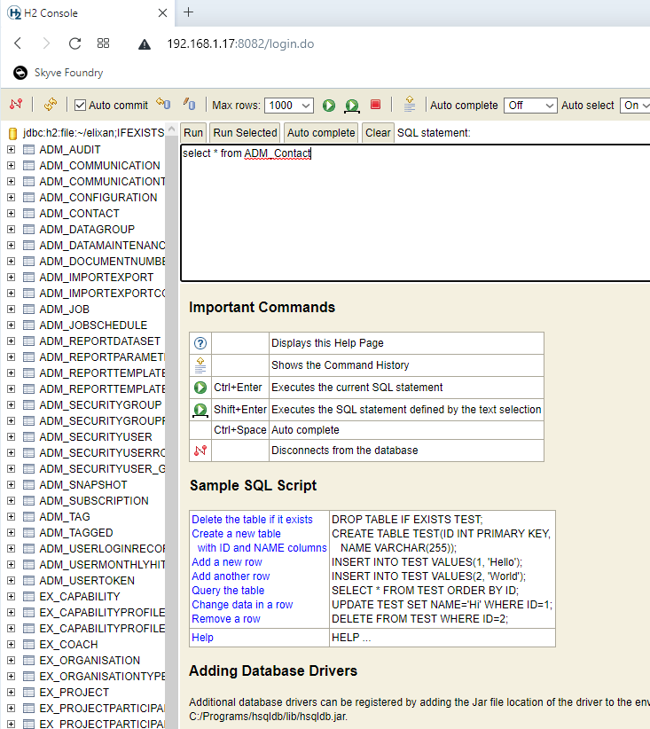
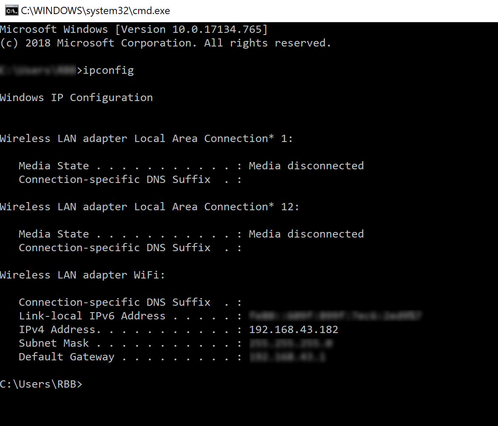

## Problem solver

### Problems building your app

* Check that you have Java 11+ (jdk11) available in your IDE.

For example, in Eclipse, right-click your project and choose _Properties_->_Java Build Path_
Change to the _Libraries_ tab, select the JRE Library and click _Edit_
Click _Installed JREs_
Add or select Java 11 (jdk11)



* Check that you have Java 11 (jdk11) selected for compiler compliance in your IDE.

For example, in Eclipse, right-click your project and choose _Properties_->_Java Compiler_->_Configure Workspace Settings_



Alternatively, select _Enable project specific settings_ and set the project compliance level.

* Check that you have the Java 11 (jdk11) selected for the Runtime JRE.

For example, in Eclipse, right-click your project and choose _Run As_->_Run Configurations..._



* Check that you have successfully built your project using the Generate Domain task.

In your project _config_ folder, right-click the _MyAppName - Generate Domain.launch_ task and choose 
_Run As_->_MyAppName - Generate Domain_

### Problems deploying your app

* If you're using the collaboration option in [Skyve Foundry](https://foundry.skyve.org/foundry), or have exported your project, check that you selected the `Default` theme first. 

If your project has a _paid theme_ selected we can't provide the theme files for your other environments.

You should change your theme to the free `Default` theme on the <em>Customise</em> tab in [Skyve Foundry](https://foundry.skyve.org/foundry) before you start collaboration (or export), OR you can proceed and collaborate (or export) with this theme selected, but we can't include the theme files in your code repository (or download). You will need to purchase your own licence to use the paid theme for local development.

### Problems finding your app

* Check the URL settings in the project `.json` file for the URL and context. 

For example, if you project has the following:

```json
	// URL settings - various SKYVE URL/URI fragments - useful for linking and mailing
url: {
        // server URL
        server: "${SKYVE_URL:http://localhost:8080}",
        // web context path
        context: "${SKYVE_CONTEXT:/helloWorld}",
        // home path
        home: "/"
    },
```

Then you can access your app at

[http://localhost:8080/helloWorld](http://localhost:8080/helloWorld)

See more at [Changing the project URL context](#changing-the-project-url-context)

### Problems signing in for the first time

As a way to get started with a new environment, Skyve provides a bootstrap capability that inserts a user credential into your database for your first sign in (normally into an empty database). 

If the bootstrap option is used, the user record will be inserted into your database so that you can sign in, however this will only occur if the username does NOT already exist, and if the environment identifier indicates that the environment is NOT a _Production_ environment.

You can change the bootstrap settings in the project `.json` file, however, once the username exists in the database, changing the bootstrap user or password will have no effect unless a different username is used or the user record is removed.

To ensure the bootstrap user is inserted for your first sign in:

* Check the _environment identifier_ setting in the project `.json` file, and check that it is not `null` (i.e. this is not _Production_ environment).

For example, if you have the following:

```json
	// Environment settings
	environment: {
		// test, sit, uat, dev etc: null = prod
		identifier: null,
	...
```

Change this to a specific environment setting such as 

```json
	// Environment settings
	environment: {
		// test, sit, uat, dev etc: null = prod
		identifier: "dev",
	...
```

Then restart your app server (e.g. Wildfly).

When you are ready to go live into Production, change the identifier value back to `null` and restart Wildfly.

* Check that you are using the bootstrap credentials as set in the project `.json` properties file.

For example, if you have the following:

```json
	// bootstrap user settings - creates a user with all customer roles assigned, if the user does not already exist
	bootstrap: {
        customer: "skyve",
        user: "${BOOTSTRAP_USERNAME:setup}",
        email: "info@skyve.org",
        password: "${BOOTSTRAP_PASSWORD:setup}"
    }
```

Then your bootstrap credentials will be:

user: `setup`

password: `setup`


* If you still have problems, ensure that the bootstrap `customer` setting matches the environment default `customer` setting and that the environment identifier is not `null` (for example, you may switch the identifier to `config` to indicate the system is being configured, or `dev` for developer mode etc.)

For example, if you have the following:

```json
	// Environment settings
	environment: {
		// test, sit, uat, dev etc: null = prod
		identifier: "dev",
		// Dev Mode does not cache the view metadata allowing the effects of view changes to be observed without redeploying
		devMode: true,
		// Customer Default
		customer: "skyve",
		// Run the jobs scheduled in the data store or not - set false for slave skyve instances
		jobScheduler: true,
		// Password hashing algorithm - usually MD5 (obsolete) or SHA1 etc
		passwordHashingAlgorithm: "MD5"
	},
	// bootstrap user settings - creates a user with all customer roles assigned, if the user does not already exist
	bootstrap: {
		customer: "skve",
		user: "setup",
		email: "info@skyve.org",
		password: "setup"
	}
```

If you set the `environment.customer` to null, the Skyve sign in page will require you to specify the _customer_ as well as the _username_ and _password_.

If you specify an `environment.customer`, make sure it matches the `bootstrap.customer` or your sign in will fail.

### Example deployment problems
Key problems in the `myApplication.json` configuration file block your project from deploying successfully and sometime yield non-obvious errors or stack output. The following provides three common examples.

### Example output for incorrect content or addins folder
Incorrect content folder - the folder doesn't exist:

```json
	// Content settings
	"content": {
		// directory path
		"directory": "C:/skyve/content/", 
		// CRON Expression for CMS Garbage Collection job - run at 7 past the hour every hour
		"gcCron": "0 7 0/1 1/1 * ? *", 
		// Attachments stored on file system or inline
		"fileStorage": true
	},
  // Add-ins settings
	"addins": {
		// Where to look for add-ins - defaults to <content.directory>/addins/
		"directory": null
	},
```

In this case, the folder `C:/skyve/content/` doesn't exist or the name is incorrect.

Attempting to deploy in this case yields results such as the following:
```
15:51:09,837 ERROR [org.jboss.msc.service.fail] (ServerService Thread Pool -- 61) MSC000001: Failed to start service jboss.undertow.deployment.default-server.default-host./phweb: org.jboss.msc.service.StartException in service jboss.undertow.deployment.default-server.default-host./phweb: java.lang.RuntimeException: java.lang.IllegalStateException: content.directory C:/skyve/content/ does not exist.
	at org.wildfly.extension.undertow.deployment.UndertowDeploymentService$1.run(UndertowDeploymentService.java:85)
	at java.util.concurrent.Executors$RunnableAdapter.call(Executors.java:511)
	at java.util.concurrent.FutureTask.run(FutureTask.java:266)
	at java.util.concurrent.ThreadPoolExecutor.runWorker(ThreadPoolExecutor.java:1149)
	at java.util.concurrent.ThreadPoolExecutor$Worker.run(ThreadPoolExecutor.java:624)
	at java.lang.Thread.run(Thread.java:748)
	at org.jboss.threads.JBossThread.run(JBossThread.java:320)
Caused by: java.lang.RuntimeException: java.lang.IllegalStateException: *content.directory C:/skyve/content/ does not exist.*
	at io.undertow.servlet.core.DeploymentManagerImpl.deploy(DeploymentManagerImpl.java:236)
	at org.wildfly.extension.undertow.deployment.UndertowDeploymentService.startContext(UndertowDeploymentService.java:100)
	at org.wildfly.extension.undertow.deployment.UndertowDeploymentService$1.run(UndertowDeploymentService.java:82)
	... 6 more
Caused by: java.lang.IllegalStateException: content.directory C:/skyve/content/ does not exist.
	at org.skyve.impl.web.SkyveContextListener.contextInitialized(SkyveContextListener.java:102)
	at io.undertow.servlet.core.ApplicationListeners.contextInitialized(ApplicationListeners.java:187)
	at io.undertow.servlet.core.DeploymentManagerImpl$1.call(DeploymentManagerImpl.java:200)
	at io.undertow.servlet.core.DeploymentManagerImpl$1.call(DeploymentManagerImpl.java:171)
	at io.undertow.servlet.core.ServletRequestContextThreadSetupAction$1.call(ServletRequestContextThreadSetupAction.java:42)
	at io.undertow.servlet.core.ContextClassLoaderSetupAction$1.call(ContextClassLoaderSetupAction.java:43)
	at io.undertow.servlet.api.LegacyThreadSetupActionWrapper$1.call(LegacyThreadSetupActionWrapper.java:44)
	at io.undertow.servlet.api.LegacyThreadSetupActionWrapper$1.call(LegacyThreadSetupActionWrapper.java:44)
	at io.undertow.servlet.api.LegacyThreadSetupActionWrapper$1.call(LegacyThreadSetupActionWrapper.java:44)
	at io.undertow.servlet.api.LegacyThreadSetupActionWrapper$1.call(LegacyThreadSetupActionWrapper.java:44)
	at io.undertow.servlet.api.LegacyThreadSetupActionWrapper$1.call(LegacyThreadSetupActionWrapper.java:44)
	at io.undertow.servlet.core.DeploymentManagerImpl.deploy(DeploymentManagerImpl.java:234)
	... 8 more
```

A similar error occurs if the `addins` directory is not found:

```
org.jboss.msc.service.StartException in service jboss.deployment.unit."jobManager.war".undertow-deployment: java.lang.RuntimeException: java.lang.IllegalStateException: addins.directory C:/skyve/content/addins/ does not exist.
```

Manually create an `addins` directory inside the content directory specified for your project. This is where Skyve will look for the addins directory by default if no path is specified in the json.

### Example incorrect/invalid customer in bootstrap stanza
Incorrect customer in the bootstrap- there is no such customer defined:

```json
// bootstrap user settings - creates a user with all customer roles assigned, if the user does not already exist
bootstrap: {
	customer: "skyve",
	user: "admin",
	password: "admin"
}
```

In this case, there is no _skyve_ customer declaration file within the _customer_ folder.

Attempting to deploy in this case yields results such as the following:

```
15:48:03,814 ERROR [stderr] (ServerService Thread Pool -- 68) org.skyve.metadata.MetaDataException: A problem was encountered.
15:48:03,814 ERROR [stderr] (ServerService Thread Pool -- 68) 	at org.skyve.impl.metadata.repository.LocalDesignRepository.getCustomer(LocalDesignRepository.java:174)
15:48:03,814 ERROR [stderr] (ServerService Thread Pool -- 68) 	at org.skyve.impl.metadata.user.UserImpl.getCustomer(UserImpl.java:198)
15:48:03,814 ERROR [stderr] (ServerService Thread Pool -- 68) 	at org.skyve.impl.metadata.user.SuperUser.getAccessibleModuleNames(SuperUser.java:85)
15:48:03,814 ERROR [stderr] (ServerService Thread Pool -- 68) 	at org.skyve.impl.persistence.hibernate.AbstractHibernatePersistence.resetDocumentPermissionScopes(AbstractHibernatePersistence.java:528)
15:48:03,814 ERROR [stderr] (ServerService Thread Pool -- 68) 	at org.skyve.impl.persistence.hibernate.AbstractHibernatePersistence.setUser(AbstractHibernatePersistence.java:500)
15:48:03,814 ERROR [stderr] (ServerService Thread Pool -- 68) 	at org.skyve.impl.web.SkyveContextListener.contextInitialized(SkyveContextListener.java:276)
15:48:03,814 ERROR [stderr] (ServerService Thread Pool -- 68) 	at io.undertow.servlet.core.ApplicationListeners.contextInitialized(ApplicationListeners.java:187)
15:48:03,814 ERROR [stderr] (ServerService Thread Pool -- 68) 	at io.undertow.servlet.core.DeploymentManagerImpl$1.call(DeploymentManagerImpl.java:200)
15:48:03,815 ERROR [stderr] (ServerService Thread Pool -- 68) 	at io.undertow.servlet.core.DeploymentManagerImpl$1.call(DeploymentManagerImpl.java:171)
15:48:03,815 ERROR [stderr] (ServerService Thread Pool -- 68) 	at io.undertow.servlet.core.ServletRequestContextThreadSetupAction$1.call(ServletRequestContextThreadSetupAction.java:42)
15:48:03,815 ERROR [stderr] (ServerService Thread Pool -- 68) 	at io.undertow.servlet.core.ContextClassLoaderSetupAction$1.call(ContextClassLoaderSetupAction.java:43)
15:48:03,815 ERROR [stderr] (ServerService Thread Pool -- 68) 	at io.undertow.servlet.api.LegacyThreadSetupActionWrapper$1.call(LegacyThreadSetupActionWrapper.java:44)
15:48:03,815 ERROR [stderr] (ServerService Thread Pool -- 68) 	at io.undertow.servlet.api.LegacyThreadSetupActionWrapper$1.call(LegacyThreadSetupActionWrapper.java:44)
15:48:03,815 ERROR [stderr] (ServerService Thread Pool -- 68) 	at io.undertow.servlet.api.LegacyThreadSetupActionWrapper$1.call(LegacyThreadSetupActionWrapper.java:44)
15:48:03,815 ERROR [stderr] (ServerService Thread Pool -- 68) 	at io.undertow.servlet.api.LegacyThreadSetupActionWrapper$1.call(LegacyThreadSetupActionWrapper.java:44)
15:48:03,815 ERROR [stderr] (ServerService Thread Pool -- 68) 	at io.undertow.servlet.api.LegacyThreadSetupActionWrapper$1.call(LegacyThreadSetupActionWrapper.java:44)
15:48:03,815 ERROR [stderr] (ServerService Thread Pool -- 68) 	at io.undertow.servlet.core.DeploymentManagerImpl.deploy(DeploymentManagerImpl.java:234)
15:48:03,815 ERROR [stderr] (ServerService Thread Pool -- 68) 	at org.wildfly.extension.undertow.deployment.UndertowDeploymentService.startContext(UndertowDeploymentService.java:100)
15:48:03,816 ERROR [stderr] (ServerService Thread Pool -- 68) 	at org.wildfly.extension.undertow.deployment.UndertowDeploymentService$1.run(UndertowDeploymentService.java:82)
15:48:03,816 ERROR [stderr] (ServerService Thread Pool -- 68) 	at java.util.concurrent.Executors$RunnableAdapter.call(Executors.java:511)
15:48:03,816 ERROR [stderr] (ServerService Thread Pool -- 68) 	at java.util.concurrent.FutureTask.run(FutureTask.java:266)
15:48:03,816 ERROR [stderr] (ServerService Thread Pool -- 68) 	at java.util.concurrent.ThreadPoolExecutor.runWorker(ThreadPoolExecutor.java:1149)
15:48:03,816 ERROR [stderr] (ServerService Thread Pool -- 68) 	at java.util.concurrent.ThreadPoolExecutor$Worker.run(ThreadPoolExecutor.java:624)
15:48:03,816 ERROR [stderr] (ServerService Thread Pool -- 68) 	at java.lang.Thread.run(Thread.java:748)
15:48:03,816 ERROR [stderr] (ServerService Thread Pool -- 68) 	at org.jboss.threads.JBossThread.run(JBossThread.java:320)
15:48:03,816 ERROR [stderr] (ServerService Thread Pool -- 68) Caused by: org.skyve.metadata.MetaDataException: Could not unmarshal customer at /C:/_/pgibsa/Phylloxera/javaee/pgibsa.ear/apps.jar/customers/skyve/skyve.xml
15:48:03,816 ERROR [stderr] (ServerService Thread Pool -- 68) 	at org.skyve.impl.util.XMLMetaData.unmarshalCustomer(XMLMetaData.java:185)
15:48:03,816 ERROR [stderr] (ServerService Thread Pool -- 68) 	at org.skyve.impl.metadata.repository.LocalDesignRepository.getCustomer(LocalDesignRepository.java:164)
15:48:03,817 ERROR [stderr] (ServerService Thread Pool -- 68) 	... 24 more
15:48:03,817 ERROR [stderr] (ServerService Thread Pool -- 68) Caused by: java.io.FileNotFoundException: C:\_\pgibsa\Phylloxera\javaee\pgibsa.ear\apps.jar\customers\skyve\skyve.xml (The system cannot find the path specified)
15:48:03,817 ERROR [stderr] (ServerService Thread Pool -- 68) 	at java.io.FileInputStream.open0(Native Method)
15:48:03,817 ERROR [stderr] (ServerService Thread Pool -- 68) 	at java.io.FileInputStream.open(FileInputStream.java:195)
15:48:03,817 ERROR [stderr] (ServerService Thread Pool -- 68) 	at java.io.FileInputStream.<init>(FileInputStream.java:138)
15:48:03,817 ERROR [stderr] (ServerService Thread Pool -- 68) 	at java.io.FileInputStream.<init>(FileInputStream.java:93)
15:48:03,817 ERROR [stderr] (ServerService Thread Pool -- 68) 	at org.skyve.impl.util.XMLMetaData.unmarshalCustomer(XMLMetaData.java:173)
15:48:03,817 ERROR [stderr] (ServerService Thread Pool -- 68) 	... 25 more
```

### Missing comma or badly formed json file

Missing comma or badly formed json file:

```json
	// bootstrap user settings - creates a user with all customer roles assigned, if the user does not already exist
	bootstrap: {
		customer: "skyve",
		user: "admin",
		password: "admin"
	} 
	// When taking photos or uploading images they will be compressed to within the size below (if possible)
	maxUploadedFileSizeInBytes: 1000000 // 10 MB
}
```

For example, should have been a comma after the bootstrap stanza.

Attempting to deploy in this case yields results such as the following:

```
15:40:16,947 ERROR [org.jboss.msc.service.fail] (ServerService Thread Pool -- 69) MSC000001: Failed to start service jboss.undertow.deployment.default-server.default-host./phweb: org.jboss.msc.service.StartException in service jboss.undertow.deployment.default-server.default-host./phweb: java.lang.RuntimeException: java.lang.ClassCastException: java.lang.Long cannot be cast to java.util.Map
	at org.wildfly.extension.undertow.deployment.UndertowDeploymentService$1.run(UndertowDeploymentService.java:85)
	at java.util.concurrent.Executors$RunnableAdapter.call(Executors.java:511)
	at java.util.concurrent.FutureTask.run(FutureTask.java:266)
	at java.util.concurrent.ThreadPoolExecutor.runWorker(ThreadPoolExecutor.java:1149)
	at java.util.concurrent.ThreadPoolExecutor$Worker.run(ThreadPoolExecutor.java:624)
	at java.lang.Thread.run(Thread.java:748)
	at org.jboss.threads.JBossThread.run(JBossThread.java:320)
Caused by: java.lang.RuntimeException: java.lang.ClassCastException: java.lang.Long cannot be cast to java.util.Map
	at io.undertow.servlet.core.DeploymentManagerImpl.deploy(DeploymentManagerImpl.java:236)
	at org.wildfly.extension.undertow.deployment.UndertowDeploymentService.startContext(UndertowDeploymentService.java:100)
	at org.wildfly.extension.undertow.deployment.UndertowDeploymentService$1.run(UndertowDeploymentService.java:82)
	... 6 more
Caused by: java.lang.ClassCastException: java.lang.Long cannot be cast to java.util.Map
	at org.skyve.impl.web.SkyveContextListener.getObject(SkyveContextListener.java:378)
	at org.skyve.impl.web.SkyveContextListener.contextInitialized(SkyveContextListener.java:253)
	at io.undertow.servlet.core.ApplicationListeners.contextInitialized(ApplicationListeners.java:187)
	at io.undertow.servlet.core.DeploymentManagerImpl$1.call(DeploymentManagerImpl.java:200)
	at io.undertow.servlet.core.DeploymentManagerImpl$1.call(DeploymentManagerImpl.java:171)
	at io.undertow.servlet.core.ServletRequestContextThreadSetupAction$1.call(ServletRequestContextThreadSetupAction.java:42)
	at io.undertow.servlet.core.ContextClassLoaderSetupAction$1.call(ContextClassLoaderSetupAction.java:43)
	at io.undertow.servlet.api.LegacyThreadSetupActionWrapper$1.call(LegacyThreadSetupActionWrapper.java:44)
	at io.undertow.servlet.api.LegacyThreadSetupActionWrapper$1.call(LegacyThreadSetupActionWrapper.java:44)
	at io.undertow.servlet.api.LegacyThreadSetupActionWrapper$1.call(LegacyThreadSetupActionWrapper.java:44)
	at io.undertow.servlet.api.LegacyThreadSetupActionWrapper$1.call(LegacyThreadSetupActionWrapper.java:44)
	at io.undertow.servlet.api.LegacyThreadSetupActionWrapper$1.call(LegacyThreadSetupActionWrapper.java:44)
	at io.undertow.servlet.core.DeploymentManagerImpl.deploy(DeploymentManagerImpl.java:234)
	... 8 more
```


### Still having problems?

Join us on [Slack](https://join.slack.com/t/skyveframework/shared_invite/enQtNDMwNTcyNzE0NzI2LWNjMTBlMTMzNTA4YzBlMzFhYzE0ZmRhOWIzMWViODY4ZTE1N2QzYWM1MTdlMTliNDIyYTBkOWZhZDAxOGQyYjQ) and ask our friendly team. 

## Changing database dialect

One of the great things about Skyve is how easy it is to change between different database providers AND KEEP YOUR DATA. Skyve provides a platform-independent Backup format that can be restored to a different database technology without issue.

_NOTE: Before you begin - backup your data (using the Skyve backup feature in the admin module->Dev Ops->Data Maintenance)_

The steps to change database are:
1. If you are changing to MySQL, MSSQL, POSTGRES you will need to create a new empty database schema for your project
2. Update the datasource connection in the `-ds.xml` file (in ../wildfly/standalone/deployments/)
3. Ensure you have loaded and configured Wildfly for the new database dialect (detailed instructions are below)
4. Update the dialect in the `json` settings file for the new dialect (in ../wildfly/standalone/deployments/)
5. Update the dialect setting in the pom.xml, and use the `generate domain` target to update your project for the new dialect

Then, to restore your data to the new environment:
* Set the environment identifier to a non-null value (e.g. "dev"), deploy and log in with the bootstrap user
* Restore your backup - from the admin module->Dev Ops->Data Maintenance. (Select the backup zip, and choose the appropriate pre-process setup - usually "Delete existing table data using metadata").
* Once the restore is complete, change the instance identifier in the `json` settings file back to the previous value and redeploy your application.	

More information on backup and restore are available at the [User Guide](https://skyvers.github.io/skyve-user-guide/backup-restore/)

### Available dialects

The currently supported dialects are:
* H2
* MySQL
* MSSQL
* POSTGRES

The Oracle dialect is not currently available as part of the open-source platform. Please contact us if you require Oracle support.

For project generation (i.e. the setting in the `pom.xml`), there are some additional options:

Dialect Option | Description | dataStoreIndexForeignKeys (boolean) | dataStoreIndexNamesInGlobalNamespace (boolean) | dataStoreIdentifierCharacterLimit (int) | dataStoreBizKeyLength (int)
-------|--------|-------------|------------|-----------------|----------------------------------
H2 | H2 | true | false | 0 | 1024  
H2_NO_INDEXES | H2 without indexes | false | false | 0 | 1024 //Indexes in H2 generate warnings, this option gives you a cleaner log but no indexes
MYSQL_5 | MySQL 5 | true | false | 64 | 1024
MYSQL_5_4_BYTE_CHARSET | MySQL 5 | true | false | 64 | 768
MYSQL_8 | MySQL 8 | true | false | 64 | 1024
MYSQL_8_4_BYTE_CHARSET | MySQL 8 | true | false | 64 | 768
MSSQL_2014 | SQL Server up to 2014 | true | true | 0 | 900 // SQL Server 2014 and below limits indexes to 900
MSSQL_2016 | SQL Server 2016+ | true | true | 0 | 1024
POSTGRESQL | PostgreSQL | true | true | 63 | 1024

For the `json` file `dialect` setting, choose the appropriate dialect class:
 
`org.skyve.impl.persistence.hibernate.dialect.H2SpatialDialect`
`org.skyve.impl.persistence.hibernate.dialect.MySQL5InnoDBSpatialDialect`
`org.skyve.impl.persistence.hibernate.dialect.MySQL56InnoDBSpatialDialect`
`org.skyve.impl.persistence.hibernate.dialect.MySQL8InnoDBSpatialDialect`
`org.skyve.impl.persistence.hibernate.dialect.PostgreSQL9SpatialDialect`
`org.skyve.impl.persistence.hibernate.dialect.PostgreSQL91SpatialDialect`
`org.skyve.impl.persistence.hibernate.dialect.PostgreSQL92SpatialDialect`
`org.skyve.impl.persistence.hibernate.dialect.PostgreSQL93SpatialDialect`
`org.skyve.impl.persistence.hibernate.dialect.PostgreSQL94SpatialDialect`
`org.skyve.impl.persistence.hibernate.dialect.PostgreSQL95SpatialDialect`
`org.skyve.impl.persistence.hibernate.dialect.SQLServer2008SpatialDialect`
`org.skyve.impl.persistence.hibernate.dialect.SQLServer2012SpatialDialect`

_Note: as mentioned above, if you require support for Oracle or other dialects, please contact us._

### Accessing the H2 database console

Using the H2 database console directly can be useful for debugging. 

Before attempting to connect with the console, ensure you have allowed for multiple connections by setting `AUTO_SERVER=TRUE` both when starting the server (ds.xml) and when attempting to connect, e.g.

```xml
<?xml version="1.0" encoding="UTF-8"?>
<datasources>
	<datasource jndi-name="java:/myAppDB" pool-name="myApp" enabled="true" jta="true" use-ccm="false">
		<connection-url>jdbc:h2:file:C:/content/myApp/myApp;IFEXISTS=FALSE;IGNORECASE=TRUE;AUTO_SERVER=TRUE</connection-url>
		<driver>h2</driver>
		<pool>
			<min-pool-size>5</min-pool-size>
			<max-pool-size>10</max-pool-size>
		</pool>
		<security>
			<user-name>sa</user-name>
			<password>sa</password>
		</security>
	</datasource>
</datasources>
```

Note that we recommend, for consistency, locating the H2 database file within the application content folder (in the above example the H2 database file `C:/content/myApp/myApp.mv.db` will be created automatically when first deployed if it does not exist.

To access the console, download and run the installer from <a href="http://www.h2database.com/html/download.html">http://www.h2database.com/html/download.html</a> (this has been tested with "Version 1.4.199 (2019-03-13), Last Stable")

Once installed run 'H2 Console' from the start menu; the H2 console should open in your browser.

When prompted use the same connection-url and credentials as the deployed project `-ds.xml` file.



You can then access the H2 database directly with SQL.



### Configuring Wildfly for different dialects

Refer to other Wildfly documentation for detailed information, but the basic steps are as follows.

1. Place the appropriate jdbc driver into your `\wildfly-x\modules\system\layers\base\` folder.
2. Add the driver to the `drivers` stanza in the wildfly configuration in `\wildfly-x\standalone\configuration/standalone.xml`


#### Wildfly driver configuration for MSSQL

Place the appropriate jdbc driver into your `\wildfly-x\modules\system\layers\base\` folder.

For MSSQL you should have the following files in `\wildfly-x\modules\system\layers\base\com\microsoft\sqlserver\main\`:

* module.xml
* sqljdbc_auth.dll (if you use windows authentication)
* sqljdbc{version}.jar

An example module.xml file is:

```xml
<?xml version="1.0" encoding="utf-8"?> 
<module xmlns="urn:jboss:module:1.3" name="com.microsoft.sqlserver"> 
  <resources> 
    <resource-root path="sqljdbc42.jar"/> 
  </resources> 
  <dependencies> 
    <module name="javax.api"/> 
    <module name="javax.transaction.api"/>
	<module name="javax.xml.bind.api"/>
  </dependencies> 
</module>
```

Ensure that the driver matches the version of your jar 

```xml    
<resource-root path="sqljdbc{version}.jar"/>
``` 

Add the driver to the `drivers` stanza in the wildfly configuration, for example in `\wildfly-x\standalone\configuration/standalone.xml`

```xml
<drivers>
    <driver name="sqlserver" module="com.microsoft.sqlserver">
        <xa-datasource-class>com.microsoft.sqlserver.jdbc.SQLServerXADataSource</xa-datasource-class>
    </driver>      
...
```

*NOTE: Also ensure that you have the following settings on your MSSQL database rather than the defaults.*

```sql
ALTER DATABASE ${projectName} SET ALLOW_SNAPSHOT_ISOLATION ON
GO
ALTER DATABASE ${projectName} SET READ_COMMITTED_SNAPSHOT ON
GO
ALTER DATABASE ${projectName} SET AUTO_CLOSE OFF WITH NO_WAIT
GO
ALTER DATABASE ${projectName} SET RECOVERY SIMPLE WITH NO_WAIT
GO
```

#### Wildfly driver configuration for MySQL

Place the appropriate jdbc driver into your `/wildfly-x/modules/system/layers/base/` folder.

For MySQL you should have the following files in `/wildfly-x/modules/system/layers/base/com/mysql/main/`:

* module.xml
* mysql-connector-java-5.{version}.jar

An example module.xml file is:

```xml
<?xml version="1.0" encoding="utf-8"?> 
<module xmlns="urn:jboss:module:1.3" name="com.mysql">
    <resources>
        <resource-root path="mysql-connector-java-5.1.33.jar" />
    </resources>
    <dependencies>
        <module name="javax.api"/>
        <module name="javax.transaction.api"/>
    </dependencies>
</module>
```

Ensure that the driver matches the version of your jar 

```xml    
<resource-root path="mysql-connector-java-{version}.jar"/>
``` 

Add the driver to the `drivers` stanza in the wildfly configuration, for example in `/wildfly-x/standalone/configuration/standalone.xml`

```xml
<drivers>
	<driver name="mysql" module="com.mysql">
	    <driver-class>com.mysql.jdbc.Driver</driver-class>
	</driver>
...
```

#### Problems with utf8 - character sets for other languages - MySQL
If your Skyve application is not storing utf8 chars correctly, and you're using MySQL, check that MySQL is configured for utf8. Check the charset of the DB and tables, e.g. the default  is 'latin1'.

In the my.cnf file (for MySQL), check that you have the following:
```
[client]
default-character-set=utf8

[mysql]
default-character-set=utf8

[mysqld]
collation-server = utf8_unicode_ci
init-connect='SET NAMES utf8'
character-set-server = utf8
```

To keep an existing database once this change has been made, export the schema from MySQL workbench, use text edit change latin1 to utf8, then drop your schema and import the edited one.

If you don't need to keep existing data, then after the my.cnf changes above, drop your schema, create a new one, then use Skyve bootstrap (in the json settings file) to sign in and let Skyve create the new schema for you.

#### Wildfly driver configuration for PostgreSQL 

Place the appropriate jdbc driver into your `/wildfly-x/modules/system/layers/base/` folder.

For Postgres, you should have the following files in `/wildfly-x/modules/system/layers/base/org/postgresql/main/`:

* postgresql-{version}.jar
* module.xml

An example module.xml file is:

```xml
<?xml version="1.0" encoding="utf-8"?> 
<module xmlns="urn:jboss:module:1.1" name="org.postgresql">

    <resources>
    	<!--the name of your driver -->
        <resource-root path="postgresql-42.2.6.jar"/>
    </resources>

    <dependencies>
        <module name="javax.api"/>
        <module name="javax.transaction.api"/>
    </dependencies>
</module>
```

Ensure that the driver matches the version of your jar 

```xml    
<resource-root path="postgresql-{version}.jar"/>
```

Add the driver to the `drivers` stanza in the wildfly configuration, for example in `/wildfly-x/standalone/configuration/standalone.xml`

```xml
<drivers>
    <driver name="postgresql" module="org.postgresql">
        <driver-class>org.postgresql.Driver</driver-class>
    </driver>              
...
```

## Deploying a Skyve application

Skyve builds applications as a single web archive (`.war`) folder, containing the application metadata and Skyve platform components. By default, Skyve `.war` folders are deployed 'exploded' or 'unzipped'.

The `.war` folder is deployed with a `.json` settings file and a `-ds.xml` datasource file. 

For example, to deploy a Skyve application called `myApplication` using a Wildfly application server, you will need to place the following into the Wildfly `deployment/` area:

```
myApplication.war
myApplication-ds.xml
myApplication.json
```

where 
* `myApplication.war` is the self-contained web archive containing application metadata and Skyve platform libraries
* `myApplication-ds.xml` is the datasource file containing the jdbc connection string and credentials
* `myApplication.json` is the instance-specific settings file, containing all of the settings specific to the particular instance.

You can manually signal Wildfly to deploy the datasource and application by creating files named with `.dodeploy` - i.e.:
`myApplication-ds.xml.dodeploy` and `myApplication.war.dodeploy` (the contents of the files is irrelevant - creating empty files with the correct names is sufficient). If Wildfly is running, it will detect the presence of these files and attempt to deploy them, resulting in the creation of either a `.deployed` or a `.failed` signal file.

When moving an application from DEV->TEST->PROD, the settings files on each instance remain in place unchanged - only the application web archive is updated.

This approach is part of the Skyve risk reduction strategy, to minimise the risk of problems when updating new versions of your application. Once each instance is configured, moving from DEV -> TEST -> PROD becomes a low-risk trivial activity, requiring no reconfiguration (unless the different instance have significantly different set ups).

## Deploying a new application version
Where an instance has already been configured, to deploy a new application version on each instance:
- undeploy the project (or stop Wildfly)
- remove the existing `.war` from the deployment area
- place the new `.war` folder into the deployment area
- redeploy the project (or restart Wildfly)

If the server has multiple Skyve application deployments, you can replace one of these without impacting on other deployments by signalling an undeployment and deployment as follows:

To undeploy, create an `myApplication.war.undeploy` file in the `wildfly/standalone/deployment/` folder corresponding to the name of your application (an empty text file with that name is all that is required). After about a minute, Wildlfly will replace this file with a file named `myApplication.war.undeployed`. 

To redeploy, create a `myApplication.war.dodeploy` file in the `wildfly/standalone/deployment/` folder corresponding to the name of your application (again - an empty text file with that name is all that is required). Wildfly will replace this file with `myApplication.war.isdeploying` and once deployment is successful, Wildfly will replace this with either `myApplication.war.deployed` (if successful) or `myApplication.war.failed` (if unsuccesful).

Additional steps are required for Single Sign-On configuration, 
the creation of service user accounts, SPNs and port configuration.

## Installing and configuring the Skyve development environment

These instructions describe the process required to install and configure the 
development environment for Skyve. These instructions assume that you are 
using Windows and SQL Server. Some changes will need to be made if using a 
different operating system or database.

### Prerequisites checklist

Before you begin, ensure you have the following:

* Java ([www.oracle.com](http://www.oracle.com/technetwork/java/javase/downloads/)), JDK 11
* Eclipse IDE for Java EE developers ([www.eclipse.org](https://www.eclipse.org/downloads/)), so that the installation
is in `C:\eclipse\`
* NOTE - When downloading Eclipse, ensure you have selected Eclipse for Java EE (Enterprise Edition) Developers as the non-Enterprise Edition is missing libraries that Skyve utilises, as well as plugins that are used for local deployment. 
* Wildfly 20+ (select the last final version available) ([http://wildfly.org](http://wildfly.org/downloads/))
* A RDBMS which is supported by Hibernate ([www.hibernate.org](http://www.hibernate.org)) - ensure you record the
  administrator username and password. 

For this example, to use MS SQL Server as the database for the Skyve project:
* If you do not already have SQL Server installed:
  * download and install the latest version of the developer or express edition for your platform from the [Microsoft website](https://www.microsoft.com/en-au/sql-server/sql-server-downloads)
  * you will also need to download and install a copy of [SQL Server Management Studio](https://docs.microsoft.com/en-us/sql/ssms/download-sql-server-management-studio-ssms) to connect you your database and execute scripts
* Open SQL Server Management Studio, choose Authentication as Windows Authentication and click the 'Connect' button.
* Create a db named 'skyve', right click Databases->New Databases... and leave everything as is and click the _OK_ button.
* Create a user for skyve db in SQL Server Management Studio, right click Security->New->Login...
* Create a Login name (remember this login name as you will need it later), choose 
  SQL Server authentication and enter your password. Remember that SQL Server policy 
  requires a 'strong' password (remember this password as you will need it later), 
  untick the 'Enforce password expiration' and the 'User must change password at 
  next login'
* On the same dialog box, choose Default database as 'skyve', now go to Server Roles 
  on left hand pane and tick 'sysadmin', then go to User Mapping and tick 'skyve' 
  and finally, click the _OK_ button down the bottom right.
* If you've just installed SQL server, you will need to specify the port for this 
  database, see instructions [here](https://community.spiceworks.com/how_to/124598-find-the-port-sql-server-is-using-and-change-a-dynamic-port-to-static), 
  again, remember the port number you've entered.

### Configuring Java
* Download jdk11 (if you haven't already) 
  (http://www.oracle.com/technetwork/java/javase/downloads/) 
  and install it to your machine.
* Go your Control Panel->System and Security->System (for Windows). Now select 
  'Advanced system settings' and click the "Environment Variables..." button.
* Locate 'Path' under System variables double click it, click the _New_ button and 
  enter this (with the semicolon) `;<jdk11 installation folder>\bin\` and 
  click the _OK_ button and _OK_, again _OK_ to close the System Properties 
  dialog box.

### Configuring the IDE (Windows example)

* Create `C:\\_\` (go to C:\->right click->New->Folder then type "_" as the 
folder name). You may use any folder for you workspace in Eclipse, just make sure you remember 
the folder you've chosen and try to ensure that the folder name has no spaces to avoid 
any issues with Java paths and spaces.
* Start Eclipse using Eclipse.exe and select `C:\\_\` as workspace, tick 'Use as 
default option - do not ask again', Cancel the welcome wizard and Close the welcome 
tab in the editor frame.
* Change compiler compliance level to 11 (Window -> Preferences -> Java -> Compiler) 
press 'Apply' - press Yes for full build, and then press OK.
* To manage the Wildfly application server from Eclipse:
  * Open the server explorer window if it is not already in your workspace (Window -> Show View -> Servers)
  * Right click inside the server explorer and select New
  * Expand JBoss Community
  * If WildFly 20+ is not in the list of adapters, you will need to download them:
    * Choose JBoss, WildFly & EAP Server Tools and click Next
    * Accept the licence terms and click Finish
    * Restart Eclipse when prompted
  * Select WildFly 20+ and click _Next_
  * Accept the defaults and click _Next_
  * Click _Finish_
  
See additional details in [Setting up a Skyve instance](#setting-up-a-skyve-instance)(below)

### Importing an existing Skyve project from Git

*Note: These instructions are for the Eclipse IDE, you will need to locate instructions for your IDE if not using Eclipse.*

In Eclipse, 

* choose File->Import...>Git->Projects from Git->Next->Clone URI and set the URI (for example type in https://github.com/skyvers/skyve.git as URI),
* then click the _Next_ button, 
* choose the master and click the _Next_ button. 
* Choose your destination directory, in this example, we have chosen `C:\\_\ directory`.
* Then click the _Next_ button. 
* The import wizard should be displayed and cloning the Skyve project.

After cloning the master, go to Project -> Clean - Select clean all projects and press OK - wait for activity to cease in bottom right corner of the Eclipse window.

### Starting the server

#### Development environment
Skyve provides a bootstrap user configuration (specified in the `.json` file) - this will insert a user with all module roles as a way to get started. The bootstrap configuration is disabled if the instance is a production instance.

#### Other environments
In UAT and PROD environments, Wildfly should be configured as a service. Refer to Wildfly documentation for detailed instructions.

#### Connecting to your local instance from a mobile device

It is useful to be able to test your Skyve application from your own mobile devices as you develop locally. For example, if you connect your developer PC and mobile device to the same network (for example, your phone's hotspot) use IP address assigned to your PC for the URL in your `.json` settings file - then connect from your phone to your developer PC.

To find the IP address assigned to your dveloper PC in Windows, in a `cmd` window, run:

```
ipconfig
```



Then set the `server url` setting in the `.json` properties file to match the assigned address, for example `http://192.168.43.182:8080/` (matching your port settings etc) and keep your existing context setting, e.g. `/myapp`.

You will also need to set Wildfly to be able to serve clients other than localhost. To do this double click on your Wildfly server from eclipse to open the configuration and change the standalone arguments to include `-b 0.0.0.0` (note this can also be done directly in the `standalone.xml` file).


Restart Wildfly so the changes take effect.

You can then use the browser on your mobile device to connect to the local Skyve instance using the ural:

```
http://192.168.43.182:8080/myapp
```

## Setting up a Skyve instance

### Recommended requirements 
We recommend the following:
- 4GB RAM for Linux and 8GB RAM for Windows
- Java JDK 11 (this is the JDK for Java 11)
- Wildfly 20+
- Disk space requirements depend on the nature of the application especially if the database and content repository are located on the same drive, however, for most common applications, 50GB drive space will probably be sufficient.

### Installation of prerequisites
To run a Skyve application, the server requires:

Java 11 - while the JRE is sufficient, the JDK is recommended.
 - Download the Java JDK 11 from https://www.oracle.com/technetwork/java/javase/downloads 

Wildfly 20+
 - Download from http://wildfly.org/downloads/   
 - This link may assist (even though it is for an older version of Wildfly)- https://linuxtechlab.com/wildfly-10-10-1-0-installation/ 

### Installing database driver
For database access, load the appropriate driver and declare this driver in the Wildfly standalone.xml configuration file.

For example, for SQL Server:
- load the sqljdbc42.jar into wildfy.../modules/system/layers/base/com/microsoft/sqlserver/main/
- copy the following definition into a new file  wildfy.../modules/system/layers/base/com/microsoft/sqlserver/main/module.xml

```xml
    <?xml version="1.0" encoding="utf-8"?> 
        <module xmlns="urn:jboss:module:1.3" name="com.microsoft.sqlserver"> 
        <resources> 
                <resource-root path="sqljdbc42.jar"/> 
        </resources> 
        <dependencies> 
                <module name="javax.api"/> 
                <module name="javax.transaction.api"/>
            <module name="javax.xml.bind.api"/>
        </dependencies> 
    </module>
```

- declare the driver in the wildfly configuration file wildfly/standalone/configuration/standalone.xml `<drivers>` stanza as follows:

```xml
    <driver name="sqlserver" module="com.microsoft.sqlserver">
        <xa-datasource-class>com.microsoft.sqlserver.jdbc.SQLServerXADataSource</xa-datasource-class>
    </driver>
```

### Other datasource options

There are a number of optional settings for the application data source file `myApplication-ds.xml`. The file provided from the Skyve project creator is usually satisfactory, however the following describes other options which you may need to consider.

Option | Values | Description
-------|--------|----------
*jta* | *true*/*false* | this should be *false* for Skyve applications unless you are using ccm (see below) - refer to http://www.mastertheboss.com/jboss-server/jboss-datasource/demystifying-datasource-jta-and-xa-settings-on-jboss-wildfly 
*use-ccm* |  *true*/*false* | Essentially this will log leaked connections - "The Cached Connection Manager is used for debugging data source connections and supporting lazy enlistment of a data source connection in a transaction, tracking whether they are used and released properly by the application. At the cost of some overhead, it can provide tracing of the usage, and make sure that connections from a data source are not leaked by your application. Although that seems like an advantage, in some instances it's considered an anti-pattern and so to be avoided." (from <a href="https://access.redhat.com/documentation/en-us/jboss_enterprise_application_platform/5/html/performance_tuning_guide/chap-performance_tuning_guide-servlet_container#sect-Performance_Tuning_Guide-Servlet_Container-Cached_Connection_Manager">JBoss AS 5 Administration Guide</a>).

Additional information is available from a number of sources, for example <a href="https://developer.jboss.org/wiki/ConfigDataSources">for example</a>.

### Additional configuration

The validation stanza provides Wildfly with the required configuration to create new connections as needed.

From <a href="https://stackoverflow.com/questions/128527/is-there-any-way-to-have-the-jboss-connection-pool-reconnect-to-oracle-when-conn">this page</a>  *"If the validation query executes successfully, the pool will return that connection. If the query does not execute successfully, the pool will create a new connection"*.
A typical validation stanza is as follows:

```xml                
<validation>
  <check-valid-connection-sql>select 1</check-valid-connection-sql>
  <validate-on-match>true</validate-on-match>
  <background-validation>false</background-validation>
  <background-validation-millis>0</background-validation-millis>
</validation>
<statement>        
  <prepared-statement-cache-size>0</prepared-statement-cache-size>
  <share-prepared-statements>false</share-prepared-statements>
</statement>
```

Note that the sql statement for `<check-valid-connection-sql>` is dialect specific - so consider your specific configuration carefully.

From the <a href="https://docs.jboss.org/jbossas/docs/Server_Configuration_Guide/beta500/html/ch13s13.html">documentation</a>:
- `<prepared-statement-cache-size>` - the number of prepared statements per connection to be kept open and reused in subsequent requests. They are stored in a LRU cache. The default is 0 (zero), meaning no cache.
-  `<share-prepared-statements>` - with prepared statement cache enabled whether two requests in the same transaction should return the same statement

### Configuring ports
To configure which ports will be used for accessing the application, modify the <socket-binding-group> section in the wildfly configuration file wildfly/standalone/configuration/standalone.xml for http and https:

```xml
    <socket-binding name="http" port="${jboss.http.port:8080}"/>
    <socket-binding name="https" port="${jboss.https.port:8443}"/>
```

For example, for external access, typically you would assign as follows:

```xml
    <socket-binding name="http" port="${jboss.http.port:80}"/>
    <socket-binding name="https" port="${jboss.https.port:443}"/>
```

### Create a folder for content
Skyve includes content management - for file uploads and images - the repository requires a dedicated folder to persist files. The user credential running wildfly (for example) will need read-write permissions to this folder.

### Create a folder for addins
Typically, it's easiest to add one add-ins subfolder for all your projects, and refer to it directly in all project JSON settings files:

```json
	// Add-ins settings
	addins: {
		// Where to look for add-ins - defaults to <content.directory>/addins/
		directory: "C:/_/content/addins/"
	},	
```
(Note the trailing slash.)

Load the skyve-content.zip (this manages content locally) into the addins by:
* right-click your project and Run As -> Maven install
* the skyve-content.zip will be downloaded to your target folder - the results of the maven install will include this location, usually <project>\target\

```
[INFO] --- maven-dependency-plugin:2.8:copy (copy-content-addin-dependency) @ elixan ---
[INFO] Configured Artifact: org.skyve:skyve-content:7.0.2:zip
[INFO] Copying skyve-content-7.0.2.zip to C:\_\j11\elixan\target\skyve-content.zip
```

* copy the skyve-content.zip to the directory specified in the JSON settings file above.

### Install Wildfly as a Service

So that the Skyve application will be always available, install the wildfly service, ensuring that the service will have read/write access to the content folder.

The following may be useful for linux installations - https://community.i2b2.org/wiki/display/getstarted/2.4.2.3+Run+Wildfly+as+a+Linux+Service

## Skyve application configuration
To deploy a Skyve application, there are typically three artefacts:
- the application '.war' folder
- the datasource 'ds.xml' file
- the properties '.json' file

For example, if your Skyve application is called 'myApplication', these will be:
- 'myApplication.war'
- 'myApplication-ds.xml'
- 'myApplication.json'

The 'ds.xml' and '.json' remain on the server you are deploying to, and are customised for that specific instance, so that when you are  deploying a new version of your Skyve application, the instance settings do not need to be adjusted.

When deploying the Skyve application web archive 'war', ensure that matching configuration settings are updated in the associated 'ds.xml' and '.json' configuration files. 

Ensure the 'ds.xml' file uses a connection string and credentials corresponding to the setting for the database driver above

Ensure the '.json' properties file has been updated for the specific instance including:
- content directory
- context url
- database dialect
- smtp settings
- maps and other api keys
- environment identifier

Finally, ensure that the user credential that will run the wildfly service has read/write permissions to the wildfly folder and the content folder created above.

### Configuring Recaptcha for the sign in page 

First, sign up for a Google Recaptcha key as follows:
1. Visit [Google Recaptcha](https://www.google.com/recaptcha/intro/v3.html) console and sign in
2. Click Admin console in the top right corner
3. Click the + button in the toolbar to create a new site
4. Enter a label to identify what this key will be for (the name of your Application)
5. Select reCAPTCHA v2 and select the type of challenge (the default is fine)
6. Enter the URL of your Skyve application
7. Read and accept the terms of use
8. Click Submit

Once you have received your *site* key, copy your key into the Startup Configuration section of the Admin menu of your Skyve application:
1. From the Admin menu, open Configuration
2. Change tabs to the Startup Configuration tab
3. Scroll down to the Security Settings section, enter the Key and then press Save at the top of the form.

Alternatively, you can place the API key in the project JSON file under `api` -> `googleRecaptchaSiteKey:` 

```
	// API Settings
	api: {
		googleRecaptchaSiteKey: "xxxxxxxxxxx",
```

### Changing the project URL context

Normally, the project name will be the name of the `.war` - which will be the context on the URL for example `https://skyve.org/myApplication` where `myApplication` is also the name of the project.

If you only need to change the base URL (for example, from `https://skyve.org/` to `https://myDomain.com/`), you can do this by specifiying the URL in the `myApplication.json` settings file. Similarly, if your application will operate from the base URL then make the change to the URL in the `myApplication.json` file and set the context setting to `/` for example:

```json
	// URL settings - various SKYVE URL/URI fragments - useful for linking and mailing
	url: {
		// server URL
		server: "https://myDomain.com",
		// web context path
		context: "/",
		// home path
		home: "/"
	},
```

Note that URLs without a specified port will require you to change the Wildlfy port settings suitably, for example:

```xml
        <socket-binding name="http" port="${jboss.http.port:80}"/>
        <socket-binding name="https" port="${jboss.https.port:443}"/>
```

However if you need to change the project for a different URL context, like `https://skyve.org/tax_management`, then there's a few simple steps you need to take to make that work.

1. Remove the project from your wildfly server (and ensure the `myApplication.war` is removed from the deployments area). 
2. Edit the project `pom.xml` file to change the name of the `.war` to be built:

change

```xml
	<groupId>myApplication</groupId>
	<artifactId>myApplication</artifactId>
	<version>1.0</version>

	<packaging>war</packaging>
	<name>myApplication</name>
```

to

```xml
	<groupId>myApplication</groupId>
	<artifactId>tax_management</artifactId>
	<version>1.0</version>

	<packaging>war</packaging>
	<name>tax_management</name>
```

3. Rename the `.json` settings file from `myApplication.json` to `tax_management.json`
4. Update the project `.json` file for the new context
from

```json
	// URL settings - various SKYVE URL/URI fragments - useful for linking and mailing
	url: {
		// server URL
		server: "https://skyve.org",
		// web context path
		context: "/myApplication",
		// home path
		home: "/"
	},
```

to

```json
        // URL settings - various SKYVE URL/URI fragments - useful for linking and mailing
	url: {
		// server URL
		server: "https://skyve.org",
		// web context path
		context: "/tax_management",
		// home path
		home: "/"
	},
```

5. Rename the `myApplication-ds.xml` to `tax_management-ds.xml`
6. Maven update the project (for example, in eclipse, right-click the project, choose Maven and update Project)
7. Add the project to your wildfly server

Note that 
* when deploying, you may need to manually create the `tax_management-ds.xml.dodeploy` and `tax_management.war.dodeploy` signal files. 
* You need to manually remove the previous `myApplication.war` if you didn't in the preparation stage. 
* If you didn't rename the previous `myApplication.json` and `myApplication-ds.xml`, you should these files to avoid confusion (for example if the datasource name is the same for both the old `myApplication-ds.xml` and `tax_management-ds.xml`).

### Protecting the ds.xml credentials

The ds.xml password is clear text. While it is possible to use an encrypted password for the datasource connection, this is of limited use.

Instructions are available if this is required, for example [Encrypt password for Wildfly](https://stackoverflow.com/questions/33538117/wildfly-encrypt-password-and-username-for-database).

This approach has limited use as it is really just a level of indirection. The credentials need to be decrypted and so a key needs to be stored. This means the file containing the key then needs to be protected on the file system - and if this is possible, it would seem reasonable to simply apply that level of protection to the ds.xml file (and other config) directly.

### Configuring Wildfly for virtual hosts

It is possible to configure several applications to use the base context of different URLs on the same machine, by configuring virtual hosts.

Instructions are available, for example [Virtual hosts](http://www.mastertheboss.com/jboss-web/jbosswebserver/jboss-as-virtual-host-configuration).

For example, if you have 3 applications hosted on the same server, but you want to access them via different urls (rather than different contexts on the same url):

Declare the hosts in the standalone configuration.xml file as follows:

```xml
<host name="project1" alias="project1.skyve.org" default-web-module="project1.war" >
    <access-log prefix="project1"/>
</host>
<host name="project2" alias="project2.skyve.org" default-web-module="project2.war" >
    <access-log prefix="project2"/>
</host>
<host name="project3" alias="project3.skyve.org" default-web-module="project3.war" >
    <access-log prefix="project3"/>
</host>
```

To access your projects from the root context of the above URLs, specify the root context for each project in 

`.../WEB-INF/jboss-web.xml`

as follows:

```xml
<?xml version="1.0" encoding="UTF-8"?>
<jboss-web xmlns="http://www.jboss.com/xml/ns/javaee"
		   xmlns:xsi="http://www.w3.org/2001/XMLSchema-instance"
		   xsi:schemaLocation="http://www.jboss.com/xml/ns/javaee http://www.jboss.org/j2ee/schema/jboss-web_5_1.xsd">
	<context-root>/</context-root>
</jboss-web>
```

### Example deployment instructions for Single Sign-on

The following steps are to install an instance of XXX onto a vanilla
Windows 10.

--JAVA

Install Java JDK

Set `JAVA\_HOME` to location of the Java root directory - e.g.
`C:\Java\jdk11...`

Set `PATH` to include `Java\bin` - e.g. `C:\Java\jdk11...\bin`

copy `sqljdbc4.jar` and `sqljdbc\_auth.dll` to `java\jdk\jre\lib\ext`

--JBOSS

Install Wildfly (unzip and copy to `c:\`) 

check/update `wildfly\bin\run.conf` settings for memory -
`JAVA\_OPTS="-Xms1024m -Xmx1024m -XX:MaxPermSize=512m` (1 occurence)

check/update `wildfly\bin\service.bat` settings for calls to `run.bat` to
include the options `-c default -b 0.0.0.0` (2 occurrences)

e.g. call `run.bat -c default -b 0.0.0.0 &lt; .r.lock &gt;&gt; run.log
2&gt;&1`

as administrator, install service (from command prompt, in `wildfly\bin\` issue `service install`

set service to run as `XXX\svc.wildfly user` (from service msc, change user
and startup type - don't check name as it will try to resolve as
svc.wildfly@NET.XXX)

--KERBEROS

copy krb5.conf to `wildfly\bin`

copy spnego-r7.jar to `wildfly\server\default\lib\`

add clauses from `web.xml\_amendment.txt`
(`wildfly\..deploy\jbossweb.sar\web.xml` or
`wildfly\..\deploy\jbossweb-tomcat55.sar\conf\web.xml`)

add clauses from `login-config.xml\_amendment.txt`
(`wildfly\..\default\conf\login-config.xml`)

copy `hello\_spnego.jsp wildfly\..\root.war`

check HTTP SPNs added to both svc.wildfly user and machine

--DEPLOYMENT

Stop Wildfly service

Copy `\\dev\C\$\\_\Example` to `C:\\_\Example`

check `C:\\_\Example\javaee\arc\_ds.xml` connection string

check `C:\\_\Example\content\repository.xml` connection strings (x2)

check `C:\\_\Example\content\workspaces\arc\workspace.xml`
connection string

check `C:\\_\Example\content\workspaces\default\workspace.xml`
connection string

check `C:\\_\Example\apps\repository\customers\arc\arc.xml` icon

Copy `C:\\_\Example\javaee\arc.ear & arc\_ds.xml` to
`C:\wildfly\server\default\deploy\`

Start JBoss service

--CHECKS

check `http://&lt;server&gt;.net.arc:8080/hello\_spnego.jsp`

if "Failure unspecified at GSS-API level (Mechanism level: Checksum
failed)- check SPNs

check `http://&lt;server&gt;.net.arc:8080/arc/init.biz`

if error - check that you have an account in XXX, check
`C:\wildfly\standalone\log\server.log` to see your user
principal is being recognised


### Installing Skyve in Production

The following are our personal instructions for deploying a Skyve application in a production environment. You may need to tweak these to suit your personal situation, and feel free to submit a pull request to update these instructions if you find something better or they become out of date.

### Wildfly standalone production install (Windows)

These instructions apply to a standalone server installation of Wildfly 20+ on Windows server connecting to Microsoft SQL Server.

- [download](http://www.oracle.com/technetwork/java/javase/downloads/) and install the JDK 11+
- create a SYSTEM "JAVA_HOME" system environment variable and set it to where you installed the JDK to (`C:\Program Files\Java\jdk11` by default, substitute with correct Java version path)
- [download](http://wildfly.org/downloads/) Wildfly 20+ 
  - extract to C:\wildfly
- [download](https://docs.microsoft.com/en-us/sql/connect/jdbc/microsoft-jdbc-driver-for-sql-server?view=sql-server-2017) and copy the sql server driver jar and module.xml (below) to `C:\wildfly\modules\system\layers\base\com\microsoft\sqlserver\main`

`module.xml` (modify the `resource-root` path to match your sql server jdbc jar name)

```xml
<?xml version="1.0" encoding="utf-8"?> 
<module xmlns="urn:jboss:module:1.3" name="com.microsoft.sqlserver"> 
  <resources> 
    <resource-root path="sqljdbc41.jar"/> 
  </resources> 
  <dependencies> 
    <module name="javax.api"/> 
    <module name="javax.transaction.api"/> 
  </dependencies> 
</module>
```

- edit `standalone.xml`
- if using integrated security to connect to the database:
  - install the sqljdbc_auth.dll driver into `C:\windows\system32`
  - Note: If you don't have permissions for the system32 directory, you may instead create a directory anywhere (e.g. `D:\java\libs`) and add it to the System Path. This can be done by Advanced System Settings → Environment Variables → System Variables)
- add the sql server driver

```xml
<driver name="sqlserver" module="com.microsoft.sqlserver">
    <xa-datasource-class>com.microsoft.sqlserver.jdbc.SQLServerDriver</xa-datasource-class>
</driver>
```

- add the security-domain (replace {projectNameDB} with your project name, e.g. exampleDB)

```xml
<security-domain name="skyve" cache-type="default">
    <authentication>
        <login-module code="Database" flag="required">
            <module-option name="dsJndiName" value="java:/{projectNameDB}"/>
            <module-option name="principalsQuery" value="select password from ADM_SecurityUser where bizCustomer + '/' + userName = ?;"/>
            <module-option name="rolesQuery" value="select 'Nobody', 'Roles' from ADM_SecurityUser where bizCustomer + '/' + userName = ?"/>
            <module-option name="hashAlgorithm" value="SHA1"/>
            <module-option name="hashEncoding" value="base64"/>
        </login-module>
    </authentication>
</security-domain>
```

or, if using Active Directory authentication:

```xml
<security-domain name="skyve" cache-type="default">
    <authentication>
        <login-module code="org.jboss.security.auth.spi.LdapLoginModule" flag="requisite">
            <module-option name="java.naming.factory.initial" value="com.sun.jndi.ldap.LdapCtxFactory"/>
            <module-option name="java.naming.provider.url" value="ldaps://{adServerName}:636/"/>
            <module-option name="java.naming.security.authentication" value="simple"/>
            <module-option name="throwValidateError" value="true"/>
            <module-option name="principalDNPrefix" value=""/>
            <module-option name="principalDNSuffix" value="@{adsuffix}"/>
            <module-option name="rolesCtxDN" value="cn={cn},dc={dc}"/>
            <module-option name="uidAttributeID" value="sAMAccountName"/>
            <module-option name="matchOnUserDN" value="false"/>
            <module-option name="roleAttributeID" value="memberOf"/>
            <module-option name="roleAttributeIsDN" value="true"/>
            <module-option name="roleNameAttributeID" value="name"/>
            <module-option name="password-stacking" value="useFirstPass"/>
        </login-module>
        <login-module code="Database" flag="optional">
            <module-option name="dsJndiName" value="java:/{projectNameDB}"/>
            <module-option name="principalsQuery" value="select password from ADM_SecurityUser where bizCustomer + '/' + userName = ?;"/>
            <module-option name="rolesQuery" value="select 'Nobody', 'Roles' from ADM_SecurityUser where userName =  ?"/>
            <module-option name="hashAlgorithm" value="SHA1"/>
            <module-option name="hashEncoding" value="base64"/>
            <module-option name="password-stacking" value="useFirstPass"/>
        </login-module>
    </authentication>
</security-domain>
```
- replace instances of `{adServerName}`, `{adsuffix}`, `{cn}`, `{dc}` and `{projectNameDB}` from the above

- remove the following filter-refs from the default-server definition in the undertow stanza

  ```xml
  <filter-ref name="server-header"/>
  <filter-ref name="x-powered-by-header"/>
  ```
  
- comment out the welcome content `<location name="/" handler="welcome-content"/>`
- replace <jsp-config/> in the default servlet-container config with

  ```xml
  <jsp-config x-powered-by="false"/>
  ```
  
- add Wildfly as a windows service
  - go to the directory `C:\wildfly\docs\contrib\scripts`
  - copy the folder "service"
  - go to the directory `C:\wildfly\bin`
  - paste the service folder there
  - edit `C:\wildfly\bin\service\service.bat`
  - search for: "set DESCRIPTION="
  - remove the double quotes, save and exit
  - open a new command prompt to `C:\wildfly\bin\service\`
  - from a command prompt, run: `service.bat install`
  - verify that the service has been installed, change the startup type to _Automatic (Delayed Start)_
  - set the system account that should be running the wildfly service

 - make Wildfly accessible outside of localhost
   - edit `standalone.xml`
   - find `<interface name="public">` and change to the following
  ```xml
  <interface name="public">
  <inet-address value="${jboss.bind.address:0.0.0.0}"/>
  </interface>
  ```
- to run on port 80 instead of 8080, search for `<socket-binding name="http" port="${jboss.http.port:8080}"/>` and replace with `<socket-binding name="http" port="${jboss.http.port:80}"/>`

- copy the datasource.xml file into wildfly\standalone\deployments
  - configure the connection url, JNDI name, and authentication
- copy the projectName.json into wildfly\standalone\deployments
  - configure the _server name_, _content path_ and _catalog_
  - check if the bootstrap user is required
- create the content directory if it does not exist
- start the wildfly service and make sure the datasources deploy successfully
- deploy projectName.war

### Troubleshooting
If you receive an error like:

```
Caused by: org.hibernate.engine.jndi.JndiException: Unable to lookup JNDI name [java:jboss/datasources/{projectNameDB}]
    Caused by: javax.naming.NameNotFoundException: datasources/{projectNameDB} -- service jboss.naming.context.java.jboss.datasources.{projectNameDB}\"},
```

then check that your JNDI name in the standalone.xml (`<module-option name="dsJndiName" value="java:/{projectNameDB}"/>`) matches _exactly_ (case sensitive):
- the JNDI name in the JSON
  ```json
  "skyve": {
      // JNDI name
      jndi: "java:/{projectNameDB}",
  ```
- and the JNDI name in the ds.xml
  ```xml
  <datasource jndi-name="java:/{projectNameDB}" pool-name="skyve" enabled="true" jta="true" use-ccm="false">
  ```

### Managing Wildfly Server log file size

To manage/(limit) the fize size for logging, modify the `standalone.xml` file as follows:

```xml
<periodic-size-rotating-file-handler name="FILESIZE" autoflush="true" rotate-on-boot="true">
               <formatter>
                   <named-formatter name="PATTERN"/>
               </formatter>
               <file relative-to="jboss.server.log.dir" path="server.log"/>
               <rotate-size value="400m"/>
               <max-backup-index value="20"/>
            <suffix value=".yyyy-MM-dd"/>
               <append value="true"/>
</periodic-size-rotating-file-handler>
```

In root logger 
```xml
<root-logger>
               <level name="INFO"/>
               <handlers>
                   <handler name="CONSOLE"/>
                   <handler name="FILE"/>
                <handler name="FILESIZE"/>
               </handlers>
           </root-logger>
```

### Wildfly Bitnami production install (Windows)

These instructions apply to Bitnami Wildfly 10 stack installation on Windows server modified to connect to Microsoft SQL Server.
	
* Download the latest Bitnami Wildfly Windows image (https://bitnami.com/stack/wildfly)
* Ideally install Bitnami to a location on a non-OS partition
* Rename serviceinstall.bat to _DO_NOT_RUN_serviceinstall.bat (rename this back if you are going to uninstall Bitnami)
* If not using MySQL, go to services, disable the MySql service (named `wildflyMySQL`)
* Install the SqlServer module into Wildfly:
  * Edit `standalone.xml` in Bitnami\wildfly-10.1.0-1\wildfly\standalone\configuration
  * Find the Drivers section in the document and add the following:
  
  ```xml
  <driver name="sqlserver" module="com.microsoft.sqlserver">
      <xa-datasource-class>com.microsoft.sqlserver.jdbc.SQLServerDriver</xa-datasource-class>
  </driver>
  ```
  
* Copy the files into Bitnami\wildfly-10.1.0-1\wildfly\modules\system\layers\base\com\microsoft\sqlserver\main
  * `module.xml` (below)
  * [download](https://docs.microsoft.com/en-us/sql/connect/jdbc/microsoft-jdbc-driver-for-sql-server?view=sql-server-2017) the latest SQL Server JDBC driver and copy the jbbc jar

`module.xml` (modify the `resource-root` path to match your sql server jdbc jar name)

```xml
<?xml version="1.0" encoding="utf-8"?> 
<module xmlns="urn:jboss:module:1.3" name="com.microsoft.sqlserver"> 
  <resources> 
    <resource-root path="sqljdbc41.jar"/> 
  </resources> 
  <dependencies> 
    <module name="javax.api"/> 
    <module name="javax.transaction.api"/> 
  </dependencies> 
</module>
```

* If using Integrated Security to authenticate with the database:
  * Install the `sqljdbc_auth.dll` driver into C:\windows\system32
  * Note: If you don't have permissions for the system32 directory, you may instead create a directory anywhere (e.g. D:\java\libs) and add it to the System Path. This can be done by Advanced System Settings → Environment Variables → System Variables)
* Stop the Wildfly service if it is running
* Add driver config to standalone.xml
* Add security domain to standalone.xml

```xml
<security-domain name="skyve" cache-type="default">
    <authentication>
        <login-module code="Database" flag="required">
            <module-option name="dsJndiName" value="java:/{projectNameDB}"/>
            <module-option name="principalsQuery" value="select password from ADM_SecurityUser where bizCustomer + '/' + userName = ?;"/>
            <module-option name="rolesQuery" value="select 'Nobody', 'Roles' from ADM_SecurityUser where bizCustomer + '/' + userName = ?"/>
            <module-option name="hashAlgorithm" value="MD5"/>
            <module-option name="hashEncoding" value="base64"/>
        </login-module>
    </authentication>
</security-domain>
```

* rename folder `Bitnami\wildfly-20.x\java` to `Bitnami\wildfly-20.x\javaold`
* Download latest Java 11 64 runtime but select to change destination folder during install to `Bitnami\wildfly-20.x\java`
* Add java_home env variable and append `%JAVA_HOME%\bin` to path env variable eg `JAVA_HOME=D:\Bitnami\wildfly-20.x\java`, `Path=%JAVA_HOME%\bin`
* Add env variable:
  * name: `JAVA_OPTS`
  * value: `-Xms4G -Xmx4G -XX:MetaspaceSize=96M -XX:MaxMetaspaceSize=2G`
* Ensure the following...
  * `ErrorDocument 503 /static/index.html` is in Bitnami\wildfly-10.1.0-1\apache2\conf\bitnami\bitnami.conf
* Copy static.zip to `Bitnami\wildfly-20.x\apache2\htdocs\`
* Copy static.zip to `Bitnami\wildfly-20.x\wildfly\welcome-content\`
* Change Bitnami\wildfly-20.x\wildfly\conf\wildfly.conf that contains
  ```xml
  <Location />
  ProxyPass http://localhost:8080/
  ProxyPassReverse http://localhost:8080/
  </Location>
  ```

to contain the following

```
ProxyPass /static !
ProxyPass / http://localhost:8080/ timeout=600 Keepalive=On
ProxyPassReverse / http://localhost:8080/
```
(literally replace the whole lot exactly as shown - so that there are no <Location/> tags)

* Change the path of the `welcome-content` path attribute in the file handler to point to `welcome-content\static\` in `Bitnami\wildfly-20.x\wildfly\standalone\configuration\standalone.xml` like so
  ```xml
  <file name="welcome-content" path="${jboss.home.dir}/welcome-content/static/"/>
  ```
* Change `standalone.xml`
  * Remove the following filter-refs from the default-server definition in the undertow stanza

    ```xml
    <filter-ref name="server-header"/>
    <filter-ref name="x-powered-by-header"/>
    ```
  * Replace ```<jsp-config/>``` in the default servlet container config with 
    ```xml
    <jsp-config x-powered-by="false"/>
    ```
* Copy the datasource xml files into wildfly\standalone\deployments
* Copy the `{projectName}.json` into wildfly\standalone\deployments and configure the server name and the content path
* Set the system account that should be running the wildfly service
* Start the wildfly service and make sure the datasources deploy successfully
* Deploy `{projectName}.war`

## Common Wildfly settings

## Managing Wildfly server logs

You can either use the periodic rotating file handler:

```xml
<periodic-rotating-file-handler name="FILE" autoflush="true">
    <formatter>
        <named-formatter name="PATTERN"/>
    </formatter>
    <file relative-to="jboss.server.log.dir" path="server.log"/>
    <suffix value=".yyyy-MM-dd"/>
    <append value="true"/>
</periodic-rotating-file-handler>
```

or the size rotating file handler:

```xml
<size-rotating-file-handler name="FILE" autoflush="true" rotate-on-boot="true">
   <formatter>
       <named-formatter name="PATTERN"/>
   </formatter>
   <file relative-to="jboss.server.log.dir" path="server.log"/>
   <rotate-size value="40m"/>
   <max-backup-index value="5"/>
   <append value="true"/>
</size-rotating-file-handler>
```

## Managing Post Size (large file upload)

Add the `max-post-size` setting to the http-listener as follows:

```xml
<subsystem xmlns="urn:jboss:domain:undertow:3.1">
    <buffer-cache name="default"/>
    <server name="default-server">
        <http-listener name="default" socket-binding="http" max-post-size="4294967296" redirect-socket="https" enable-http2="true"/>
        <https-listener name="https" socket-binding="https" security-realm="ApplicationRealm" enable-http2="true"/>
        <host name="default-host" alias="localhost">
            <location name="/" handler="welcome-content"/>
            <filter-ref name="server-header"/>
            <filter-ref name="x-powered-by-header"/>
        </host>
	</server>
```

Specifying a `max-post-size` of `0` will disable the upload limit entirely.

**[⬆ back to top](#problem-solver)**

---
**Previous [Backup and restore](./../_pages/backup-restore.md)**
