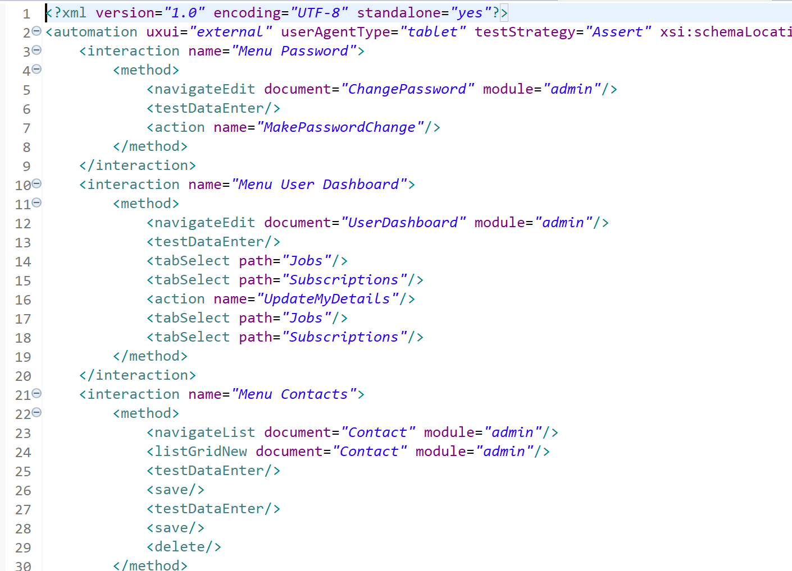
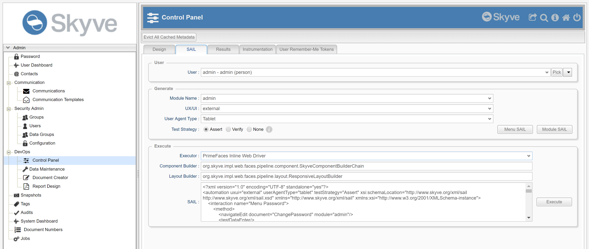
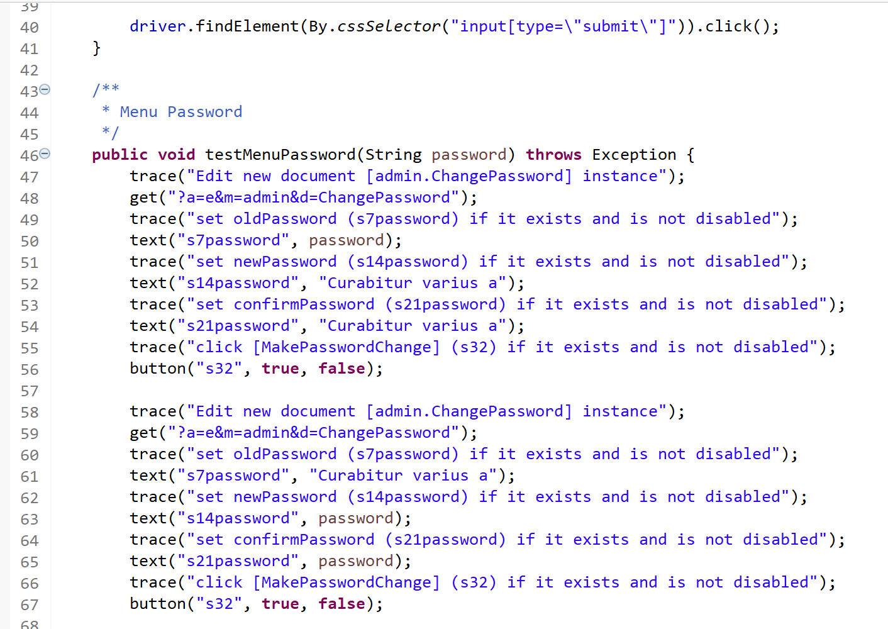

The Skyve platform provides the ability to generate a suite of automated User Interface tests via the _Skyve Abstract Interaction Language_ (SAIL).

_SAIL_ is a high level language for describing interactions with applications, specified in a format which can be used to generate _Selenese_ or _Web Driver_ interactions. 

_SAIL_ is abstract in the sense that test cases are specified in terms of general user focused interactions like _save_ or _delete_, rather than in terms which relate specifically to a particular renderer or user agent/device. This ensures that tests can be expressed in terms of the capability of the application, even where the specifics of how the UI is laid out or the specific UI mechanisms may be subject to change. Our intention is that the _SAIL_ test case specification for an application can remain (as far as possible) independent of the particular rendering technology in use.

Because Skyve metadata is self-describing, and because Skyve user interfaces are consistent and predictable, Skyve can generate _SAIL_ tests for many aspects of your application. The _SAIL_ test cases can then be expanded, modified and combined to increase test coverage or to include highly specific test cases.

Once your _SAIL_ test cases are specified, Skyve can then generate _Selenese_ or _Web Driver_ interactions.

The basic steps to generate automated UI tests are:
1. Use the Skyve _Control Panel_ (DevOps menu in Admin module) to generate SAIL (generated to the _Results_ tab) 
2. Copy the generated _SAIL_ from the _Results_ tab, then review, modify and organise the _SAIL_ test case descriptions 
3. Paste the resulting _SAIL_ into the _SAIL_ text area on the _Control Panel_ _SAIL_ tab then press _Execute_ to generate _Selenese_ or _Web Driver_ test methods (generated to the _Results_ tab) 
4. Copy the generated methods from the _Results_ tab into your test classes as appropriate 

_SAIL_ test generation builds on Skyve's automated unit testing infrastructure, to be able to generate valid data for inputs according to the domain declaration.

NOTE Automated User Interface testing impacts the persisted data and content of your application, and does not use an in-memory database (like automated unit testing). 

## Generating SAIL

To access the _DevOps_ menu in your Skyve application, ensure that your user has the DevOps role granted to them. 

Steps to generate the _SAIL_ test cases:
- Click the _Control Panel_ menu item and switch to the SAIL tab.
- Specify the user credential which exemplifies the user profile for the suite of tests to be generated. (To generate _SAIL_ appropriately, the generator needs to know which menu items and actions will be accessible during the test, and this is determined by the user profile.), e.g. _myUser_
- Select the module to test, e.g. _myModule_
- Select the UX/UI to test, e.g. _external_
- Select the User Agent Type, e.g. _Tablet_
- Select the Test Strategy, e.g. _Verify_
- Select the Generation option, e.g. _Menu SAIL_


Note that while the UX/UI and User Agent Type are specified, this is only so that the _SAIL_ generation will include only menu items and actions which would be available to that combination - _SAIL_ itself is independent of these.

### Test strategies

Strategy | Description | Usage
---------|-------------|------
_Assert_ | the test will be abandoned as soon as a test case fails | used as the basis of go/no go decisions about whether the application is ready to progress (e.g. from Test to Production)
_Verify_ | the test will continue if a test case fails | used by developers to analyse what further development/remediation activity is required
_None_ | not testing | used for automated interactions which are not tests

### Generation options

The _Menu SAIL_ generation option will generate _SAIL_ test cases for every menu option available to the specified user/UX/UI combination.

_Module SAIL_ generation option will generate _SAIL_ test cases for every document accessible by the user/UX/UI combination which could possibly be accessed, irrespective of the menu items declared in the module. This option may be useful where the system uses other menuing mechanisms not declared in the usual way.

## Understanding SAIL

```xml
<?xml version="1.0" encoding="UTF-8" standalone="yes"?>
<automation uxui="external" userAgentType="tablet" testStrategy="Assert" 
	xsi:schemaLocation="http://www.skyve.org/xml/sail ../../../skyve/schemas/sail.xsd" 
	xmlns="http://www.skyve.org/xml/sail" 
	xmlns:xsi="http://www.w3.org/2001/XMLSchema-instance">
	
    <interaction name="Menu Document Numbers">
        <method>
            <navigateList document="DocumentNumber" module="admin"/>
            <listGridNew document="DocumentNumber" module="admin"/>
            <testDataEnter/>
            <save/>
            <testDataEnter/>
            <save/>
            <delete/>
        </method>
    </interaction>
```    

The above example shows a typical _SAIL_ interaction for testing _Create-Read-Update-Delete_ capabilities, as follows:
- navigate to the list for the _DocumentNumber_ document in the _admin_ module
- select _New_ from the list to create a new _DocumentNumber_
- enter randomly generated (but valid) input data across all data entry widgets
- save the _DocumentNumber_ record
- enter randomly generated (but valid) input data across all data entry widgets
- save the _DocumentNumber_ record
- delete the _DocumentNumber_ record

By starting with `<listGridNew>` and ending with `<delete>`, the interaction leaves the data store in the same state it was in prior to the test (provided the test completes successfully). This is not required for _SAIL_ tests, but developers need to consider the impact of the tests they generate/construct and whether additional interactions may be required for _setup_ and _teardown_.    

The _SAIL_ schema (`sail.xsd`) is included in the standard Skyve project distribution in the schemas folder.

Each _SAIL_ `interaction` must be named and contain one or more `method` items.

Available `method` items include:

Item | Description | Example(s)
-----|-------------|---------
`action` | perform a declared `action` | `<action name="MakePasswordChange"/>`
`cancel` | press the default _cancel_ action button | `<cancel>`
`dataEnter` | enter data into a widget | `<dataEnter binding="url" value="skyve.org"/>`
`dataGridEdit` | enter a bound column for inline editing in a dataGrid (press the _Edit_ button or right-click to _Edit_) for the collectin binding | `<dataGridEdit row="0" binding="websites" />`
`dataGridNew` | create a new element in the dataGrid collection binding (press the _New_ button) | `<dataGridNew binding="websites"/>`
`dataGridRemove` | remove the element at row X from the dataGrid collection binding (press the _Remove_ button) | `<dataGridRemove row="0" binding="websites"/>`
`dataGridSelect` | select the row X from the dataGrid collection binding | `<dataGridSelect row="0" binding="websites"/>`
`dataGridZoom` | zoom into row X from the dataGrid collection binding | `<dataGridSelect row="0" binding="websites"/>`
`delete` | delete the current record (implicit _delete_ action) | `<delete/>`
`execute` | not yet implemented | 
`listGridNew` | create a new element from the listGrid (press the _New_ button) | `<listGridNew module="admin" document="DocumentNumber" />` `<listGridNew query="qDocumentNumber"/>` `<listGridNew model="myModel"/>` `<listGridNew module="admin" document="User" createView="true"/>`
`listGridSelect` | select row X from the listGrid | `<listGridSelect module="admin" document="User" row="0"/>`
`listGridZoom` | zoom into row X from the listGrid | `<listGridZoom module="admin" document="User" row="0"/>`
`lookupDescriptionAutoComplete` | autocomplete in the lookupDescription widget for binding using the search value | `<lookupDescriptionAutoComplete search="Elon Mu" binding="contact"/>`
`lookupDescriptionEdit` | edit the related record which is currently selected in the lookupDescription widget for the binding | `<lookupDescriptionEdit binding="contact"/>`
`lookupDescriptionNew` | create a new related record for the lookupDescription widget for the binding | `<lookupDescriptionNew binding="contact"/>`
`lookupDescriptionPick` | pick an item from the pick list of the lookupDescription widget for the binding | `<lookupDescriptionPick row="0" binding="contact"/>`
`navigateCalendar` | not yet implemented
`navigateEdit` | navigate to an Edit view for the specified module document | `<navigateEdit document="ChangePassword" module="admin"/>`
`navigateLink` | navigate to the link | `<navigateLink href="https://www.skyve.org"/>`
`navigateList` | navigate to the List view for the specified module document | `<navigateList document="Contact" module="admin"/>`
`navigateMap` | not yet implemented
`navigateTree` | navigate to the element in the tree view for the module document with the start and end | `<navigateTree module="staffManagement" document="OrganisationalStructure" startBinding="currentStaff" endBinding="currentStaffReport"/>`
`ok` | press the _ok_ implicit action button | `<ok/>`
`remove` | press the _remove_ implicit action button | `<remove/>`
`save` | press the _save_ implicit action button | `<save/>`
`tabSelect` | select the specified tab from the _tabPane_ | `<tabSelect path="Jobs"/>`
`testDataEnter` | select each data entry widget and enter valid random data (according to the attribute declaration of type, format and validator) | `<testDataEnter/>`
`testFailure` | signal the test has failed with message | `<testFailure message="The contact could not be added" />`
`testSuccess` | signal the test was successful | `<testSuccess/>`
`testValue` | test that the widget with binding has the specified value | `<testValue value="123.5" binding="total"/>`
`zoomOut` | press the _zoomOut_ implicit action button | `<zoomOut/>`

### Using `<testDataEnter/>` for _Happy_ paths

The `<testDataEnter/>` step is a high-level step which sets focus into each available data entry widget (in tab order) and enters randomly generated character sequences which are valid according to the attribute declaration of type, converter, format and validator.

This means that `<testDataEnter/>` effectively follows a `Happy` test path. For other paths, developers need to specify each data entry value using the `<dataEnter/>` step.

For example, if a view has 4 attributes - text, dateOnly, decimal2 and boolean - using `<testDataEnter/>` will exercise all four attributes in the order they appear in the view, and enter appropriate data for each, specifically:
- text according to the specified attribute length and validator
- dateOnly according to the declared converter (or default customer date converter if the attribute does not declare the converter)
- decimal2 according to the declared converter (if one is declared)
- boolean as true, false or null (if the attribute is not required)

(This list is not exhaustive - refer to the `DataBuilder()` description in [Automated Unit Testing](./../_pages/automated-unit-testing.md) 

## Generating _Selenese_ or _Web Driver_ methods

Steps to generate methods:
- With the settings as specified above for generating SAIL, paste the contents of your _SAIL_ xml file into the _SAIL_ text area on the _Control Panel_ 
- Specify the desired _executor_ (either _PrimeFaces Inline Selenese_ or _PrimeFaces Inline Web Driver_)
- Press _Execute_ - the methods will be generated to the _Results_ tab.

Create a new class which extends PrimeFacesTest as per the following (for example `TestAdminMenuExternalTabletAsAdmininstrator.java`):

```java
package sail.admin;

import org.junit.After;
import org.junit.Before;
import org.openqa.selenium.By;

import util.sail.BrowserConfiguration;
import util.sail.Devices;
import util.sail.PrimeFacesTest;

public class TestAdminMenuExternalTabletAsAdmininstrator extends PrimeFacesTest {

	private String pathToChromeDriver = "/Users/myUser/chromedriver.exe";
	
	@Before
	public void setup() throws Exception {
		setupChrome(new BrowserConfiguration().baseUrl("http://localhost:8080/myApplication/").pathToDriver(pathToChromeDriver).userAgentString(Devices.ipad.userAgentString));
	}
	
	@After
	public void teardown() {
		tearDownBrowser();
	}

	protected void login(String customer, String username, String password) throws Exception {

		driver.get(baseUrl);

		driver.findElement(By.name("customer")).clear();
		driver.findElement(By.name("customer")).sendKeys(customer);

		driver.findElement(By.name("user")).clear();
		driver.findElement(By.name("user")).sendKeys(username);

		driver.findElement(By.name("password")).clear();
		driver.findElement(By.name("password")).sendKeys(password);

		driver.findElement(By.cssSelector("input[type=\"submit\"]")).click();
	}
	
}
```

Note that because the login page is not generated by Skyve, it is not included in the _SAIL_ generated methods. 

Add your generated methods to this class, changing `private` methods to `protected`.

Create a new Test class which extends your class above (in this example `TestAdminMenuExternalTabletAsAdmininstrator.java`) and calls the desired methods, as per the following example:

```java
package sail.admin;

import org.junit.Test;

public class TestAdminModule extends TestAdminMenuExternalTabletAsAdmininstrator {

	@Test
	public void test() throws Exception {
		
		String clearTextPassword = "Password01";
		
		login("demo", "admin", clearTextPassword);
		
		testMenuPassword();
		
	}
}
```

When running the test, use a `JUnit` run configuration, ensuring that the `test\modules\test` and `lib` jars are on the classpath.

### Note on testing the _admin_ module

A number of features in the _admin_ module can have major effects on your data store and so testing the _admin_ module should be performed with care. For example, the _admin_ module gives a suitably credentialled user the ability to backup, restore, or truncate all database data, change passwords, delete users etc.

Automated User Interface testing impacts the persisted data and content of your application, and does not use an in-memory database (like automated unit testing). 

The _admin_ module distributed as part of the Skyve framework is tested as part of the Skyve release process, however, as developers can customise this module, they may need to test it, and Developers must consider carefully the implications of the UI tests they create.

**[⬆ back to top](#automated-ui-testing-and-sail)**

---
**Next [Backup and restore](./../_pages/backup-restore.md)**<br>
**Previous [Automated Unit Testing](./../_pages/automated-unit-testing.md)**
