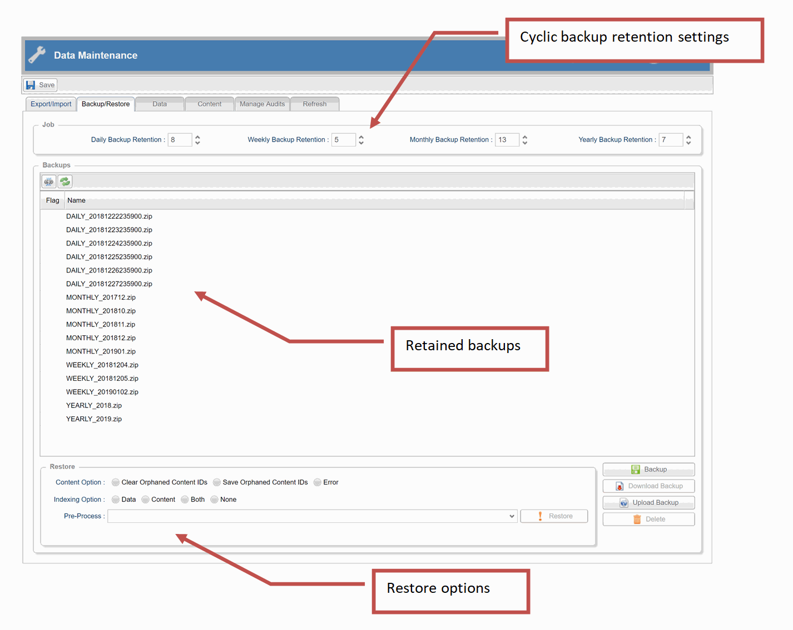

## Backup and restore

Skyve provides a powerful backup and restore facility that offers a unique range of features.



Feature | Description
--------|------------
*platform independent* | e.g. backups taken on Windows systems can be restored to Linux systems and vice versa  
*database independent* | e.g. backups taken from a system using one database provider (e.g. MS SQL Server) can be restored to systems using another provider (e.g. Oracle, H2 or MySQL) and vice versa
*includes structured and non-structured data* | backups include both SQL/relational/structured database data as well as non-structured/non-sql content items (note that structured and non-structured data are not necessarily guaranteed to be synchronised)
*handles schema 'drift'* | Skyve offers a range of restore *Pre-Process* options to handle cases where a backup was taken from an application with *version x* domain model or schema and is restored to an application running *version y* and vice versa

A detailed set of steps and explanations is included in the <a href="https://skyvers.github.io/skyve-user-guide/backup-restore/">Skyve User Guide</a> including for:
* Backup
* Scheduling backups
* Cyclic retention
* Restore
* Recovery options

We strongly recommend developers take the time to read and understand this feature.

*NOTE* that Skyve backup and restore is an application wide function - across all customer data segments. If your application is a multi-tenant SaaS application, you should consider carefully both backup and restore options.

### Customising Skyve backup and restore

The code for Skyve backup and restore is located in the admin module to enable developers to customise where required.

Without going into details, some customisation options to consider are:
* automatically obfuscating data from Production systems (i.e. where the `environment` setting in the `.json` application settings file is `null`) as part of the backup process
* blocking/disabling downloading backups from a Production system (for example, by setting the `visible` condition on the *Download Backup* button to `"false"`
* limiting restore options to those that are appropriate for your method of working

### Handling agile development and schema 'drift'

The Skyve backup and restore capability has been developed with agile development in mind, and restore options provide ways to handle differences between the current schema of the application and the backup being restored.

For an explanation of these options, refer to the <a href="https://skyvers.github.io/skyve-user-guide/backup-restore/">Skyve User Guide</a>.

#### Uploading large backups

Wildfly controls the size limits on file uploads (for example to upload large backup zip files).

To control this you can add  `max-post-size="4294967296"`  to the wildfly default http-listener

For example: 

        ```<subsystem xmlns="urn:jboss:domain:undertow:8.0" default-server="default-server" default-virtual-host="default-host" default-servlet-container="default" default-security-domain="other" statistics-enabled="${wildfly.undertow.statistics-enabled:${wildfly.statistics-enabled:false}}">
            <buffer-cache name="default"/>
            <server name="default-server">
                <http-listener name="default" socket-binding="http" max-post-size="4294967296" redirect-socket="https" enable-http2="true"/>
                <https-listener name="https" socket-binding="https" security-realm="ApplicationRealm" enable-http2="true"/>
                <host name="default-host" alias="localhost">
                    <location name="/" handler="welcome-content"/>
                    <http-invoker security-realm="ApplicationRealm"/>
                </host>
            </server>
            <servlet-container name="default">
                <jsp-config/>
                <websockets/>
            </servlet-container>
            <handlers>
                <file name="welcome-content" path="${jboss.home.dir}/welcome-content"/>
            </handlers>
        </subsystem>```


**[⬆ back to top](#backup-and-restore)**

---
**Next [Appendix](./../_pages/appendix_deployment_problem_solver.md)**<br>
**Previous [Automated UI testing](./../_pages/automated-ui-testing.md)**
