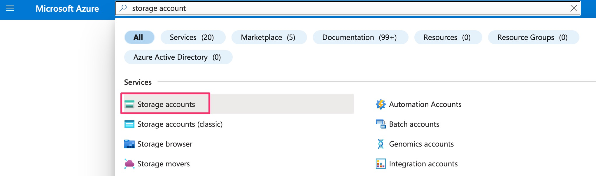
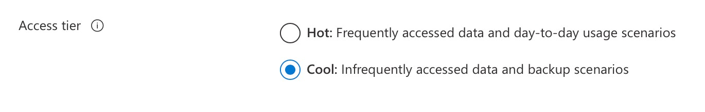
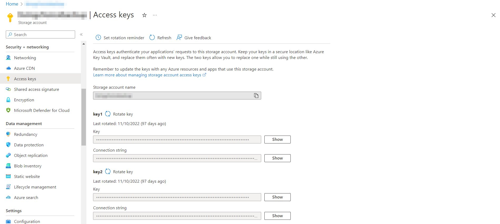

Skyve provides a powerful backup and restore facility that offers a unique range of features.


Feature | Description
--------|------------
*platform independent* | e.g. backups taken on Windows systems can be restored to Linux systems and vice versa  
*database independent* | e.g. backups taken from a system using one database provider (e.g. MS SQL Server) can be restored to systems using another provider (e.g. Oracle, H2 or MySQL) and vice versa
*includes structured and non-structured data* | backups include both SQL/relational/structured database data as well as non-structured/non-sql content items (note that structured and non-structured data are not necessarily guaranteed to be synchronised)
*handles schema 'drift'* | Skyve offers a range of restore *Pre-Process* options to handle cases where a backup was taken from an application with *version x* domain model or schema and is restored to an application running *version y* and vice versa

A detailed set of steps and explanations is included in the <a href="https://skyvers.github.io/skyve-user-guide/backup-restore/">Skyve User Guide</a> including for:
* Backup
* Scheduling backups
* Cyclic retention
* Restore
* Recovery options

We strongly recommend developers take the time to read and understand this feature.

*NOTE* that Skyve backup and restore is an application wide function - across all customer data segments. If your application is a multi-tenant SaaS application, you should consider carefully both backup and restore options.

## Customising Skyve backup and restore

The code for Skyve backup and restore is located in the admin module to enable developers to customise where required.

Without going into details, some customisation options to consider are:
* automatically obfuscating data from Production systems (i.e. where the `environment` setting in the `.json` application settings file is `null`) as part of the backup process
* blocking/disabling downloading backups from a Production system (for example, by setting the `visible` condition on the *Download Backup* button to `"false"`
* limiting restore options to those that are appropriate for your method of working

## Handling agile development and schema 'drift'

The Skyve backup and restore capability has been developed with agile development in mind, and restore options provide ways to handle differences between the current schema of the application and the backup being restored.

For an explanation of these options, refer to the <a href="https://skyvers.github.io/skyve-user-guide/backup-restore/">Skyve User Guide</a>.

## Uploading large backups

Wildfly controls the size limits on file uploads (for example to upload large backup zip files).

To control this you can add  `max-post-size="4294967296"`  to the wildfly default http-listener

For example: 

```xml
<subsystem xmlns="urn:jboss:domain:undertow:8.0" default-server="default-server" default-virtual-host="default-host" default-servlet-container="default" default-security-domain="other" statistics-enabled="${wildfly.undertow.statistics-enabled:${wildfly.statistics-enabled:false}}">
    <buffer-cache name="default"/>
    <server name="default-server">
        <http-listener name="default" socket-binding="http" max-post-size="4294967296" redirect-socket="https" enable-http2="true"/>
        <https-listener name="https" socket-binding="https" security-realm="ApplicationRealm" enable-http2="true"/>
        <host name="default-host" alias="localhost">
            <location name="/" handler="welcome-content"/>
            <http-invoker security-realm="ApplicationRealm"/>
        </host>
    </server>
    <servlet-container name="default">
        <jsp-config/>
        <websockets/>
    </servlet-container>
    <handlers>
        <file name="welcome-content" path="${jboss.home.dir}/welcome-content"/>
    </handlers>
</subsystem>
```

## Configurating the Backup Location

By default, Skyve backups are stored in the content folder in the location specified in the application's json property file. These are stored in a `<customerName>_backup` within the content folder, so that each customer has a separate backup with data they have access to.

### Cloud Backups

From version 6.0 (8.2.3 for multi-tenant applications), Skyve also supports cloud/offsite backups via Microsoft Azure blob storage. Enabling this requires signing up for a paid Microsoft Azure subscription, and making some minor changes to your application configuration.

*Note: these instructions are current as at February 2023 and the steps and/or screenshots may no longer reflect the Azure portal.*

**Create an Azure storage account**

* visit [portal.azure.com](https://portal.azure.com/) and sign in or create an account
* if you do not already have an active billing subscription
    * start with free trial if you do not already have a subscription
    * follow the steps to verify your identity and enter payment details to create a billing account
    * once complete, click `Home`
* click `Storage Accounts` under `Azure Services`, or if not listed there, search for it, then select it



* click `Create`
* select your `Subscription` for billing
* select a Resource group for the backups, or click `Create new` if you do not have one
    * enter a name, e.g. `SkyveAppBackups`, then click `OK`
* Enter a `Storage account name`, e.g. `<appname>backup`
* Select the `Region` for your backup
* Keep performance and redundancy defaults
* click `Next`
* scroll to the bottom of the `Advanced` screen
    * under Access tier, change from Hot to `Cool`
    * click `Next`



* keep defaults on the `Networking` screen and click `Next` (we will change these later)
* keep defaults on the `Data protection` screen and click `Next`
* keep defaults on the `Encryption` screen and click `Next`
* leave tags blank unless you have any you would like to add (used for billing), then click `Review`
* review all the settings, scroll all the way down, wait for final validation and click `Create`
* when deployment is complete (this takes a couple of minutes), click `Go to resource`
* in the menu on the left, scroll to Security + network, then select `Networking`
	* change *Public network access* to `Enabled from selected virtual networks and IP addresses`
	* Under *Firewall*, add the IP address of the server(s), e.g. UAT, Prod
	* Click `Save`
	* For further info securing the storage account, see the Azure [docs](https://learn.microsoft.com/en-us/azure/storage/common/storage-network-security?tabs=azure-portal)
* in the menu on the left, scroll to Security + networking, then select `Access keys`
	* under `key1`, click the `Show` button next to `Connection string`
	* click the `Copy to clipboard` icon at the end of the connection string, we will paste this into our Skyve application in a little bit



**Update your Skyve application**

* update the appropriate server or docker `.json` files within your project where:
    * `ACCOUNT_NAME` is the AccountName in the Storage account name from the Access Keys page
    * `ACCOUNT_KEY` is a Key from the Access Keys page 

```json
"backup": {
    "externalBackupClass": "org.skyve.impl.backup.AzureBlobStorageBackup",
    "connectionString": "DefaultEndpointsProtocol=https;AccountName=ACCOUNT_NAME;AccountKey=ACCOUNT_KEY;EndpointSuffix=core.windows.net",
    // name of the top-level backup directory in Azure, e.g. <applicationName>, this will be created if it does not exist
    "containerName": "<backup directory name>"
},
```

* add the following dependency to your application's `pom.xml`:

```xml
<dependency>
    <groupId>com.azure</groupId>
    <artifactId>azure-storage-blob</artifactId>
    <version>12.25.2</version>
</dependency>
```

A single storage account may be used for multiple Skyve applications. By specifying a different `containerName` in the application's `.json`, Skyve backup store the backups in a different directory for each application.

Once this is configured and up and running successfully, you should be able to see backups in your storage account via the Microsoft Azure `Storage browser` to confirm backups are working. When using an external backup class, Skyve will first perform the backup locally then upload it to Microsoft Azure, so sufficient disk space needs to be available to create an entire backup. When performing a restore, the backup is downloaded from Microsoft Azure, then restored locally.

**[⬆ back to top](#backup-and-restore)**