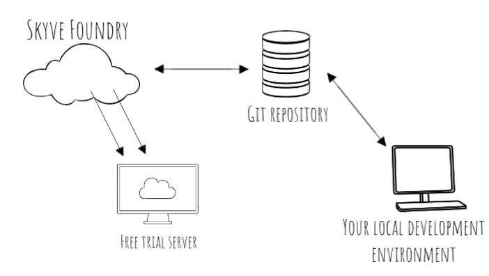
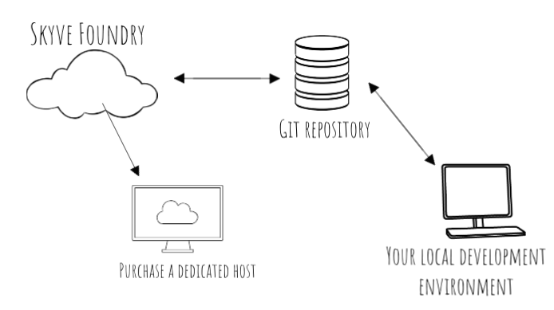
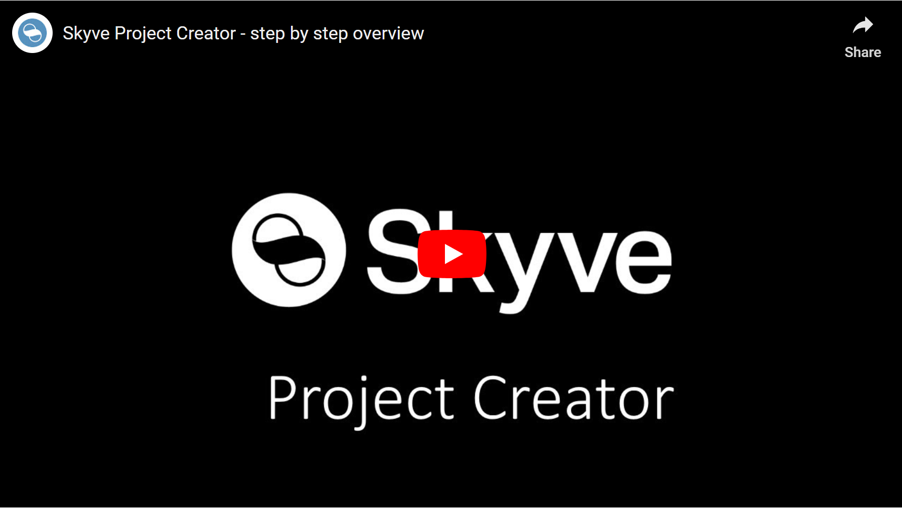
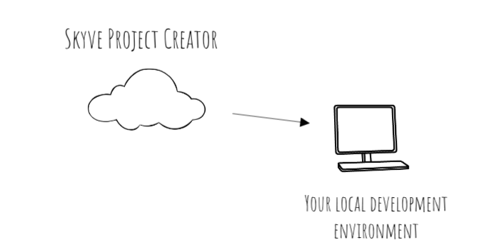
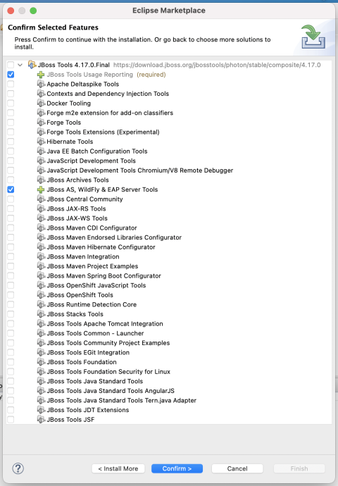

## Creating a new Skyve project

There are two ways to create a Skyve project - either:
- use Skyve Foundry - a free point and click designer, deployment and collaboration workspace, OR
- use Skyve project creator

### Tutorial

If you're new to Skyve, check out our detailed [getting started tutorial](https://skyvers.github.io/Aged-care/)

### Skyve Readme

The skyve project contains a Readme at [github.com/skyvers/skyve](https://github.com/skyvers/skyve) with useful information for getting started, configuring Spring security and other steps to get you started.

### Creating a project

We recommend starting your Skyve experience with Skyve Foundry - https://foundry.skyve.org/foundry.

Skyve Foundry provides a point and click project creator: you can quickly declare the data model for your project, deploy and test your project using Skyve Foundry's Free Trial server.

Once your foundry project is created, you can use the collaboration feature to connect Skyve Foundry to a secure git code repository, then continue making changes using both Skyve Foundry, or in your own preferred Integrated Development Environment (IDE) (Eclipse, IntelliJ etc) on your local development infrastructure.

Using Skyve Foundry to create your project will not prevent you deploying the application you create to your own infrastructure if preferred, but it will enable you to quicky deploy and test your application. 

You can also export your project at any time, or purchase a dedicated host, using your own domain name, to run your applications 24/7.

### Creating a project with Skyve Foundry

This video shows you how:

	

### Creating a project with Skyve project creator

Use the Project Creator [https://foundry.skyve.org/foundry/project.xhtml](https://foundry.skyve.org/foundry/project.xhtml) to create a Skyve project download and receive the link to the file via email.

* Enter your email address (so you can be notified when the project is created and ready to download) and give your  project a name.
* Skyve supports multi-tennanted applications - so all data is secured against a customer or client name. Just enter your organisation name.
* Next choose the type of database you want for structured data - if you're not sure, the H2 file-based option is an easy way to get started -  and you can change to something else later.
* Finally, if you've got a Skyve Script you can add it here. If you don't, just leave this blank.
* Create your project, and in about 1 minute, you'll receive an email with a download link.
* Once you receive the email, use the link to download your project, and unzip it to your Java workspace. 

This video shows you how:

	

## Configuring your local development environment

Whichever way you created your project, if you want to extend your application with Java you'll need to configure a local Java development environment.

Once you've done this, if you started with Skyve Foundry you can continue using Foundry's free trial server for testing your application, or purchase a dedicated production instance to run your application 24/7. Remember that at any time, you can export your project from Foundry to deploy to your own infrastructure if preferred.

If you started with the Skyve project creator, we're assuming you understand how to configure and deploy a production instance yourself, however [you can find detailed steps in the dev guide](../appendix/#installing-and-configuring-the-skyve-development-environment).

### Before you start

Before you begin, you need to have the following software installed:
* Java JDK 11+
* Eclipse or an alternative Java based Integrated Development Environment (do not use the EE9 preview - choose the Jakarta EE Full & Web Distribution)
* Wildfly 20+

In Eclipse we also recommend you install the following from the Eclipse Marketplace:
* JBoss tools (you only need to select the `JBoss AS, Wildfly & EAP Server Tools` option)
* Runner

 

### Quick overview

The basic steps to configure your environment are:
1. Pull the project from your repository, (or export the project from Skyve Foundry, 
2. Import the project as a maven project.
3. Run maven install, locate the skyve-content addin and configure your application instance via the `.json` properties file, ensure you identify a file location for _content_, nominate an environment identifier (e.g. "dev")
4. Configure the application `-ds.xml` file for connection properties to your preferred database.
5. Log into your application at `localhost:8080/<projectName>` with your bootstrap credentials and begin using your application.

### Detailed steps

1. Clone the project git repository into your local workspace (in Eclipse you can do this from the Git Repositories window) - or use the download link in the email from the Skyve project creator
2. In eclipse, File->Import and import the project
3. Right-click your project->Run As->Maven install to resolve and download dependencies, build and download addins.
4. In your local file system, create a folder for content (uploads, backups, caches) and a folder for Skyve addins (e.g. for Windows machines, create `C:\Workspace\content\<projectName>\` and `C:\Workspace\content\addins\`)
5. Expand the target folder in your project and copy the `skyve-content.zip` file - then copy this to the `addins` folder you created above - you do not need to unzip this addin
6. Copy the project `<projectName>.json` properties file and the project `<projectName>-ds.xml` datasource file to the Wildfly `/standalone/deployments/` folder.
7. Update the `<projectName>.json` properties file you have just copied (in the `/standalone/deployments/` folder) with:
    * the path of your `content` folder
    * the path of your `addins` folder
    * provide a name for your instance in the `Environment Identifier` (e.g. "dev" or "local")
    * update the bootstrap username and password values so you can sign in for the first time. 
8. Update the `<projectName>-ds.xml` datasource file you have just copied (in the `/standalone/deployments/` folder) with:
    * the jdbc connection string to your database (if you're using H2, provide a name for a new H2 database file)
    * the username and password that will allow Skyve to perform CRUD actions in your database 

Note: You do NOT need to create any tables, Skyve will do that for your when you first deploy.

(If you're using SQL Server, you'll need to configure Wildfly by placing the jdbc jar and windows authentication dll in place and declare the driver. And if you've chosen to use MySQL or SQL Server, you'll also need to go and create an empty database - but if you're using H2, you can skip this step. See more details on [changing database dialect](https://skyvers.github.io/skyve-dev-guide/appendix/#changing-database-dialect).

### Deploying your new project and logging in

On the Servers window in Eclipse, right-click the server and Add your project.

Start your wildfly server.

Once your project is running, go to your local context and sign in with the bootstrap credentials you set above.

## Security groups

### Background

A group is a combination of module-specific roles typically combined to represent a user access profile related to a business access profile.

Typically (not always) users will require a combination of roles to be able to access Skyve applications, for example, a back-end (staff) user may require:
- basic user privileges to the admin module to be able to manage their own user account, change password and contact details and view contact details of other back end users
- a role declared in the module(s) for your custom application.

The <a href="https://skyvers.github.io/skyve-user-guide/users/#security-groups">Skyve User Guide</a> provides detailed steps for creating groups and users.

The roles configured by default for the Skyve admin module are as follows:

Role | Explanation | Description
---|---|---
*Anonymous* |  | Access anonymous (not logged in) public features
*AppUser* | The App User role is intended for retail and public users interacting through the "front office". These users are assumed to operate within their own scope and have only visibility to their own data. App Users can create their own contacts, and change their own passwords. | Manage own contact details and password
*AuditManager* |  | Manage the activity audit log
*BasicUser* | The intention of Basic User role is to provide basic capability to back-office users. The role is for a typical office situation where users collaborate within the "Customer" scope on key application areas. For example, shared contact management, common document number serials and the ability to use Skyve's basic personal efficiency and automation capabilities, Tags, Snapshots, Communication and view dashboards. | General access to the administration module
*ContactManager* | Allows atomic control over management of, and interaction with, contacts. | Manage contact details and interactions
*ContactViewer* | Allows atomic control over visibility of contacts. | View-only access to contact details
*DevOps* | | Generate Skyve designs and metadata and administer technical aspects of the Skyve runtime
*JobMaintainer* | Allows atomic control over the ability to schedule jobs and review job progress. | Maintain Jobs
*SecurityAdministrator* | Administration of users and permissions. | Allows administration of Users and Groups
*ViewUser* | The view user is intended as a read-only office user, with visibility as per Basic User role. | View-only access to the administration module

Groups can be further combined on a per user basis and user creation provides for selection of groups.

Roles can also be combined for customer-specific combinations, however these combinations are set at design-time by the developer. For more information see the <a href="https://skyvers.github.io/skyve-dev-guide/customers/#customer-roles">developer guide</a>. 

**[⬆ back to top](#skyve-readme)**

---
**Next [Customers](./../_pages/customers.md)**  
**Previous [Exception Handling](./../_pages/exception-handling.md)**
