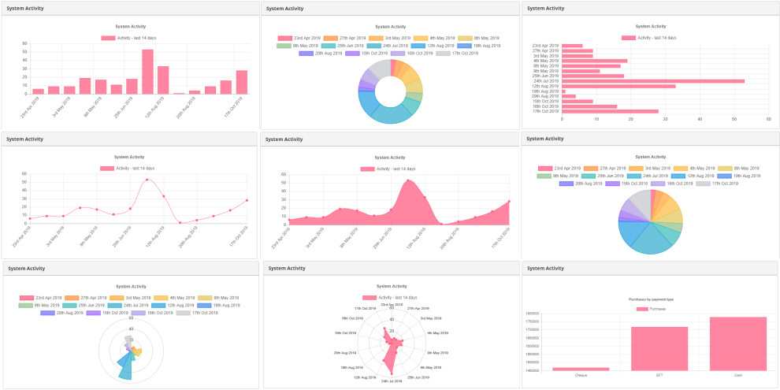
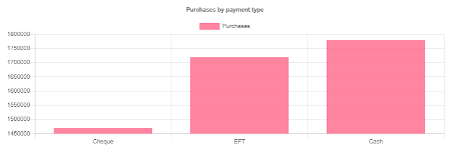
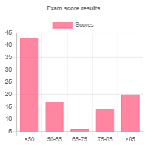
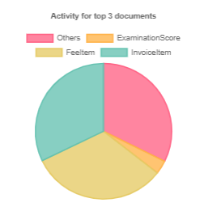

Skyve provides a no-code and low-code charting capability, integrating both client-side charts via [chart.js](https://www.chartjs.org) and server-side charts are possible via [JFreeChart](https://www.jfree.org/jfreechart/).

For most applications, we recommend the Chart.js chart options, as the Skyve implementation is significantly simpler and can be created without programming code. However, JFreeChart is a useful option, especially where server-side generation or more customisation is required (for example, inclusion in a PDF report).

For more control, developers can create a java class that extends `ChartModel` and refer to this model within the chart widget declaration. Skyve intends to also provide an option to generate an image using JFreeChart and the simplified ChartModel concept (in progress).

## Chart concepts



Chart widgets can be declared in a view markup as follows:

```xml
<chart type="bar">
	<model title="Purchases by payment type" 
		moduleName="devGuideExamples" documentName="Purchase"
		label="Purchases" valueBinding="amountExcludingTax" valueFunction="Sum" 
		categoryBinding="paymentType" >
		<noBucket/>
	</model>
</chart>
```

where:
* `type="bar"` specifies the type of chart and `model` specifies the data model for the chart.

The `model` may be declared within the view xml, or reference a class extending `ChartModel`. The model may also nominate a module `query` (perhaps to include filtering) as the basis of the data for the chart.

```xml
<chart type="line" modelName="UserActivityModel"/>
```

Within the model stanza:
* `moduleName="devGuideExamples" documentName="Purchase"` specifies the document data on which the chart is based
* `label="Purchases" valueBinding="amountExcludingTax" valueFunction="Sum"` specifies the values being charted, how the values are summarised and the label for the value
* `categoryBinding="paymentType"` defines the breakdown category



The chart `type` is independent of the `model`, allowing the designer to try different chart types to see which best visualises the model data (i.e. the available charts are all category based chart types).

The model stanza has a number of options to control the chart data:
* value functions
* bucketing (or `bins`)
* order

### Value functions

Available value functions match the `AggregateFunction` concept used elsewhere in Skyve (including for the Summary options in Skyve lists):
* Avg - Average
* Count - Count
* Max - Maximum
* Min - Minimum
* Sum - Sum or total

Developers may use other value functions extending a `ChartModel`, and by preparing data for the model.

### Bucketing (bins)

Bucketing is a way to bucket or group the chart data.

For example, if charting user activity based on records of timestamped user activity from the Skyve `Audit` document, visualising the data would benefit from bucketing (grouping) the data by day/month/year rather than charting each millisecond.

Bucket | Description | Example use case
---|---|---
NumericMultipleBucket | bucket data by numeric multiple value | chart population data into multiples of 10 year age groups, 10, 20, 30 etc
NumericRangeBucket | bucket data by arbitrary ranges - specify each range as an inclusive upper bound | chart student examination scores into grades (pass, credit)
TextStartsWithBucket | bucket data based on the first n letters of the valueBinding field | chart the frequency of names by first letter
TextLengthBucket | bucket data based on the length of text in the valueBinding field  | chart a histogram of phone number lengths
TemporalBucket.DAY_MONTH_YEAR | bucket temporal data by day, month and year | chart user activity by date
TemporalBucket.DAY | bucket temporal data by day (day number, not weekday name) | chart sales data by day for this month
TemporalBucket.MONTH | bucket temporal data by month  | chart rainfall by month
TemporalBucket.YEAR | bucket temporal data by year | chart year of birth of customers
TemporalBucket.MONTH_YEAR | bucket temporal data by month and year | chart sales results by month spanning more than 1 year bound
TemporalBucket.HOUR | bucket temporal data by hour | chart entries to the building for each hour of the day
TemporalBucket.HOUR_DAY | bucket temporal data by hour and day | chart client purchases per each hour during a multi-day sale period
TemporalBucket.HOUR_DAY_MONTH | bucket temporal data by hour, day and month | chart client purchases per each hour during an extended sale period
TemporalBucket.MINUTE_HOUR | bucket temporal data by minute and hour | chart city traffic congestion peak hour periods
TemporalBucket.SECOND_MINUTE_HOUR | bucket temporal data by second, minute and hour | chart the occurrence of signal bursts in nearest second buckets

Skyve will automatically generate a chart label based on the selected bucket.

#### Numeric range bucket example

```xml
<chart type="bar">
	<model title="Exam score results" 
		moduleName="devGuideExamples" documentName="ExaminationScore"
		label="Score" valueBinding="studentName" valueFunction="Count"  
		categoryBinding="score">
 		<numericRangeBucket>
			<range>50</range>
			<range>65</range>
			<range>75</range>			
			<range>85</range>			
		</numericRangeBucket>
		<order sort="ascending" by="category"/>
	</model>
</chart>	
```



### Top

The `top` option specifies how many series will be shown in the chart, based on what ordering, and whether an `others` series will be included.

This example demonstrates how to chart the top 3 documents being most utilised in your Skyve application:

```xml
<chart type="pie">
	<model title="Activity for top 3 documents"
		moduleName="admin" documentName="Audit"
		label="Count of activity" valueBinding="bizId" valueFunction="Count"
		categoryBinding="auditDocumentName">
		<noBucket/>
		<top includeOthers="true" sort="ascending" top="3" by="category"/>
	</model>
</chart>
```



Note that this chart requires your user has privileges to at least read Audit records.

## Extending ChartModel

`ChartModel` yields a `ChartData` and mirrors the metadata declaration for a chart widget. 

`ChartData` is an encapsulation of the categories, the values and the colours to use. Skyve provides a `ChartBuilder` class that can quickly implement the `ChartModel.getChartData()` method. A category can have a bucket and a value has an `AggregateFunction`, where `AggregateFunction` is the same used in `DocumentQuery` and exposed in the `ListGrid` summary row (Count, Sum, Avg, Min, Max).

In this example, the `ChartModel` is extended so that user privileges can be temporarily elevated, so that the chart can be visible for users who do not ordinarily have access to the application Audit records. `ChartBuilder` is used to specify the bucketing, top and order of data for the chart.

The `with` method specifies the source of the data for the `ChartModel`, and options include:
* ChartBuilder.with(moduleName, documentName)
* ChartBuilder.with(MetaDataQuery)
* ChartBuilder.with(DocumentQuery)
* ChartBuilder.with(bizQL)
* ChartBuilder.with(SQL)
* ChartBuilder.with(ListModel)

```java
public class ActivityModel extends ChartModel<SystemDashboard> {

	private static final long serialVersionUID = -4775794889575080733L;

	@Override
	public ChartData getChartData() {
		
		Persistence pers= CORE.getPersistence();
		
		// temporarily elevate user to be able to see Audit records in case they don't usually have access
		pers.setDocumentPermissionScopes(DocumentPermissionScope.global);
		
		DocumentQuery q = pers.newDocumentQuery(Audit.MODULE_NAME, Audit.DOCUMENT_NAME);
		q.getFilter().addGreaterThan(Audit.millisPropertyName, UserDashboardExtension.TWO_WEEKS_AGO);

		ChartBuilder cb = new ChartBuilder();
		cb.with(q);
		cb.category(Audit.timestampPropertyName, new TemporalBucket(TemporalBucketType.dayMonthYear));
		cb.value(Audit.userNamePropertyName, AggregateFunction.Count);
		cb.top(14, OrderBy.category, SortDirection.descending, false);
		cb.orderBy(OrderBy.category, SortDirection.ascending);
		
		ChartData chartData = cb.build("System activity - last 14 days","Activity");

		pers.resetDocumentPermissionScopes();
		
		return chartData;
	}
}
```

The `ChartBuilder` can also take a `ColourSeries` implementation for generating colours for the categories.

Examples of `ChartBuilders`:

```java
	return new ChartBuilder().with(Contact.MODULE_NAME, Contact.DOCUMENT_NAME)
							.category(Contact.contactTypePropertyName)
							.value(Bean.DOCUMENT_ID, AggregateFunction.Count)
							.build("Contacts By Type");
```

```java
	return new ChartBuilder().with(Audit.MODULE_NAME, Audit.DOCUMENT_NAME)
							.category(Audit.operationPropertyName, new NumericMultipleBucket(100))
							.value(Bean.DOCUMENT_ID, AggregateFunction.Count)
							.topCategories(2, SortDirection.ascending)
							.build("Audits By Operation");
```

```java
	return new ChartBuilder().with(DocumentNumber.MODULE_NAME, DocumentNumber.DOCUMENT_NAME)
							.category(DocumentNumber.documentNumberPropertyName, new NumericMultipleBucket(100))
							.value(Bean.DOCUMENT_ID, AggregateFunction.Count)
							.build("Document Numbers By Multiples");
```

```java
	return new ChartBuilder().with(DocumentNumber.MODULE_NAME, DocumentNumber.DOCUMENT_NAME)
							.category(DocumentNumber.documentNumberPropertyName, new NumericRangeBucket(0, 100, 150, 200))
							.value(Bean.DOCUMENT_ID, AggregateFunction.Count)
							.build("Document Numbers By Range");
```

```java
	return new ChartBuilder().with(Audit.MODULE_NAME, Audit.DOCUMENT_NAME)
							.category(Audit.auditBizKeyPropertyName, new StringStartsWithBucket(1, true))
							.value(Bean.DOCUMENT_ID, AggregateFunction.Count)
							.build("Audit BizKey");
```

```java
	return new ChartBuilder().with(User.MODULE_NAME, User.DOCUMENT_NAME)
							.category(Binder.createCompoundBinding(User.contactPropertyName, Contact.email1PropertyName), new StringLengthBucket())
							.value(Bean.DOCUMENT_ID, AggregateFunction.Count)
							.topValues(20, SortDirection.descending)
							.orderByValue(SortDirection.descending)
							.build("Top 20 User email lengths");
```

```java
	return new ChartBuilder().with(User.MODULE_NAME, User.DOCUMENT_NAME)
							.category(Binder.createCompoundBinding(User.contactPropertyName, Contact.contactTypePropertyName))
							.value(Bean.DOCUMENT_ID, AggregateFunction.Count)
							.topValues(20, SortDirection.descending)
							.orderByValue(SortDirection.descending)
							.build("User Contact Types");
```

## Server side charts (JFreeChart)

To generate and show charts using JFreeChart, create a class that implements `DynamicImage` and place this into the `images` package within the document package, for example:

```java
public class SpiderChart implements DynamicImage<SurveyExtension> {

	private static final long serialVersionUID = -7167907371272427864L;
	private static final String EMPTY_STRING = "";
	
	@Override
	public BufferedImage getImage(SurveyExtension bean, int width, int height, User user) throws Exception {
		// load the montserrat font for the chart out of the classpath (src/main/resources)
		ClassLoader classLoader = getClass().getClassLoader();
		String fontName = "montserrat-v12-latin-ext_latin-regular.ttf";
		Font FONT = Font.createFont(Font.TRUETYPE_FONT, classLoader.getResourceAsStream("fonts/" + fontName));
		// update font size, defaults to size 1
		FONT = FONT.deriveFont(24.0f);
		
		// Create dataset
		CategoryDataset dataset = createDataset(bean);

		// build plot
		SpiderWebPlotPatch patch = new SpiderWebPlotPatch();
		int numberOfCapabilities = bean.getParticipant().getCapabilityProfile().getCapabilities().size();
		SpiderWebPlot plot = patch.getPlot(dataset, numberOfCapabilities);
		
		// set plot style
		plot.setLabelFont(FONT);
		plot.setStartAngle(54D);
		plot.setInteriorGap(0.25000000000000002D);
		plot.setMaxValue(5.0);
		plot.setWebFilled(false);
		plot.setAxisLinePaint(new Color(255, 255, 255, 0));
		plot.setSeriesOutlineStroke(new BasicStroke(2));
		plot.setSeriesPaint(0, new ChartColor(228, 27, 67));
		plot.setSeriesPaint(1, new ChartColor(153, 186, 87));
		plot.setLabelPaint(Color.GRAY);
		
		JFreeChart chart = new JFreeChart(EMPTY_STRING, FONT, plot, false);
		
		// set legend
		LegendTitle legendtitle = new LegendTitle(plot);
		legendtitle.setPosition(RectangleEdge.TOP);
		legendtitle.setItemFont(FONT);
		chart.addLegend(legendtitle);

		// set empty background
		chart.setBackgroundImageAlpha(0.0f);
		chart.getPlot().setBackgroundAlpha(0.0f);
		chart.setBackgroundPaint(null);
		chart.getPlot().setBackgroundPaint(new Color(255, 255, 255, 0));	
		chart.getPlot().setOutlinePaint(null);

		return chart.createBufferedImage(2*width, 2*height);
	}

	private CategoryDataset createDataset(SurveyExtension bean) {
		DefaultCategoryDataset dataset = new DefaultCategoryDataset();
		ProjectParticipantExtension participant = bean.getParticipant();
		Map<String, Map<Capability, Decimal2>> scores = participant.getSummaryScores();
		for(String r : scores.keySet()) {
			Map<Capability, Decimal2> map = scores.get(r);
			List<Capability> sorted = new ArrayList<Capability>(map.keySet());
			sorted.sort((c1, c2) -> c1.getFocus().compareTo(c2.getFocus()));
			for (Capability capability : sorted) {
				dataset.addValue(map.get(capability), r, capability.getName() + " (" + capability.getFocus() + ")");
			}
		}
		return dataset;
	}

	@Override
	public ImageFormat getFormat() {
		return null;
	}

	@Override
	public Float getCompressionQuality() {
		return null;
	}
}
```

Then, use the `dynamicImage` widget in the view to show the chart, for example:

```xml
	<vbox border="true" borderTitle="Survey summary scores">
		<dynamicImage name="SpiderChart" />
	</vbox>
```

### ThemeCharter

Skyve provides a `ThemeCharter` class with the admin module to simplify the use of JFreeChart for common chart types. `ThemeCharter` can be extended as required, but also provides worked examples of common JFree Charts, including:
* Area
* Bar
* Line
* Pie
* Fabulator

`ThemeCharter` also provides `SectionColouriser` to generate sequence colour gradients for charts to enable a themed colourisation of chart series.

```java
public class InvoiceSummary implements DynamicImage<BusinessDashboardExtension> {
	
	private static final long serialVersionUID = 920018115413956116L;

	@Override
	public BufferedImage getImage(BusinessDashboardExtension bean, int width, int height, User user) throws Exception {
		ThemeCharter charter = new ThemeCharter();
		charter.setSql(bean.getInvoiceHistorySQL(null, user));
		return charter.getAreaChartImage("", "Invoice", null, PlotOrientation.VERTICAL, width, height, false);
	}

	@Override
	public ImageFormat getFormat() {
		return null;
	}

	@Override
	public Float getCompressionQuality() {
		return null;
	}
}
```

**[⬆ back to top](#charts)**

**Next [Working with content](./../_pages/working-with-content.md)**  
**Previous [Push and asynchronous methods](./../_pages/push-and-asynchronous-methods.md)**  
