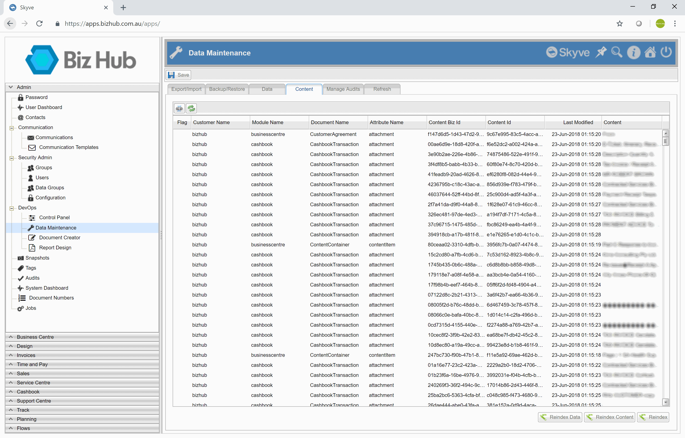

Skyve provides developer tools for the review and maintenance of content items within the repository. 
These can be accessed via the Data Maintenance menu option (provided the user has the role "DevOps" within the "admin" module). 

## Reindex data

The Reindex Data action will commence a reindexing of all data items in the repository.

## Reindex content

The Reindex action will commence a reindexing of all content items in the repository.

## Reindex 

The Reindex action will commence a reindexing of all data _AND_ content items in the repository.

**[⬆ back to top](#content-repository-tools)**

---
**Next [Bizport](./../_pages/bizport.md)**  
**Previous [Maven Targets](./../_pages/maven-targets.md)**
