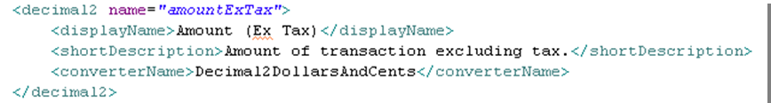
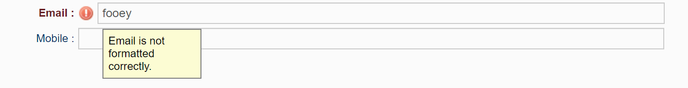

## Converter, validator and format
In certain circumstances, data of the same type may need to be
represented in differing ways.

For example, 2-digit decimal numbers may need to be represented as
currency, percentages, time or as latitude-longitude.

A traditional approach might use a basic type and then specify a
particular format-specific widget or format converter in a view, or even
format the value to a String in code. 

The Skyve approach is to declare
that an attribute uses a converter - allowing Skyve to enforce the format
conversion automatically and pervasively throughout the application.

### Defined Converters

Skyve provides a number of generic type converters.


Converters can be declared as default for a customer (within the
`customer.xml`), or for an attribute (within the `document.xml`).


Converters declared as the default converter on a document attribute
will ensure that the value of the attribute is always represented
consistently throughout the application.



Converters should also be used within developer code to ensure a
consistent representation throughout the application.


The converter will provide format hints to the user when fields are
empty.


### Worked Example

#### Requirement

An application must display research classifications by code, with each
code attributed a percentage. The percentage must always be a whole
number with the % sign included.

#### Implementation

To achieve this, an integer attribute *classPercentage* is declared as
follows:


The attribute *SimplePercentage* converter applies to
the integer value of the *classPercentage* attribute. *SimplePercentage*
includes a % sign when the value is displayed, but ignores the % sign if
entered by the user.

The attribute *description* is added to provide expansive context
help.

The developer regenerates the domain (using the ant task) and redeploys
the application to the application server.

#### Results

Skyve guarantees that the attribute will always have the conversion
applied.

In the edit view, the percentage value is displayed with the % sign. The
value stored is an integer whether the user enters the % sign or not.


If the user enters the value without a % sign, the displayed value will
be updated to include the % sign when the widget loses focus.

The *classPercentage* attribute will be shown with the % sign in all
contexts (including in grids).


### Format mask

Skyve provides a format mask capability for key-listener input control.

Format masking enforces specified input, rather than reflecting back to the user if their entered data is invalid.

```xml
<text name="accreditationNo" required="true">
	<displayName>Accreditation No</displayName>
	<length>20</length>
	<format mask="##/####" />
</text>
```

### Validator

Skyve provides validators to perform automated validation on user data entry.
Note that within the SmartClient renderer, validators will take effect in the client, 
while for the PrimeFaces renderer, validation occurs only at the server.

Skyve provides the following predefined validators:
- creditCard
- internetDomain
- ean13CheckDigit
- email
- ibanCheckDigit
- ipAddress
- ipv4Address
- isbnCheckDigit
- isinCheckDigit
- luhnCheckDigit
- url
- verhoeffCheckDigit

For example, to ensure that only valid email addresses are recorded for the `{email1}` attribute, 
you can declare the validator of that type, as follows:

```xml
<text name="email1" >
	<displayName>Email</displayName>
	<length>500</length>
	<validator type="email" />
</text>
```

In the above example, if the user enters an invalid email address, the validator will advise the user
(in this case using a default message).



However, supports the use of regular expressions for validation and custom messages, for example:

```xml
<text name="addressMainState">
	<displayName>Main State</displayName>
	<description>State of the Operator's physical address</description>
	<defaultValue>SA</defaultValue>
	<length>3</length>
	<validator 
		regularExpression="^(ACT|NSW|NT|QLD|SA|TAS|VIC|WA)$"
		validationMessage="Please enter a valid Australian state" />
</text>
```

**[⬆ back to top](#contents)**

---
**Next [Bizlets](./../_pages/bizlets.md)**  
**Previous [Documents](./../_pages/documents.md)**
