Skyve uses the term document to indicate the business-focused nature of
application objects.

In an office environment, users interact with paper or electronic
documents and are familiar with a documents being self-contained
artefacts with different types of content, often created using a
template.

Skyve documents are the core components of Skyve applications. All user
application data is contained within documents.


Within the application file structure, each document is assigned a
package.

The document package includes declarations of actions, reports, views
and the associated *Bizlet* file. The *Bizlet* file contains
document-specific behaviours including overrides of default action
behaviours and document bean lifecycle events (e.g. *newInstance*,
*preSave, etc.*).

Other java class files can be located within the document package if
required.

## Document.xml

Inside the document package, the *document.xml* file defines aspects of
a document, including:

-   document metadata (name, description, aliases),
-   *bizKey* (business key),
-   attributes (fields & references),
-   conditions,
-   constraints, and
-   documentation (doc).

Documents may be persistent (persisted in a database) or transient
(memory only).

If a document exists as a child of another document and should not be
orphaned, the *document.xml* will nominate the parent document.


## Document.xml sections

### Metadata

Each document.xml includes the following metadata:

  Metadata         | Description
  ---------------- | ------------
  name             | The unique name of the document within the module context.<br>This name defines the Java class name and how the document is referred to within developer code, e.g. 'Contact'.<br>Because documents are implemented as Java interface classes, document names are Titlecase.
  persistentName   | The name of the database table in which instances of the document will be persisted as tuples.<br>By convention, persistentNames are prefixed for each module, e.g. 'ADM\_Contact'.
  singularAlias    | The name of a document instance as used by users of the application, e.g. 'Weekly Timesheet'.
  pluralAlias      | The plural form of the singularAlias, so that a collection of document instances can be referred to in a grammatically correct way, e.g. 'Timesheets'.
  parentDocument   | The name of the document which is the parent of this document (if applicable), e.g. if the document is TimesheetLine, the value of parentDocument would be Timesheet.

_Document.xml sections_

### bizKey
To enable the application to display references simply, each document
must define a business key (*bizKey*) definition (similar to a Java
`toString()` method for the document). The *bizKey* is the default
representation of the entire document instance.

For example, a contact might have a *bizKey* of `{name}` whereas a
timesheet might have a *bizKey* composed of `{user}` and `{weekending date}`.

By mandating that every document has a *bizKey* there is always a
default representation available to the Skyve platform.

The *bizKey* declaration can contain a binding expression, or developer code (e.g. a call to a method in a *Bizlet*
class).

An example *bizKey* expression for a person Contact document might be:

```xml
<bizKey expression="{name} ({mobile})"/>
```

An example *bizKey* referencing a coded method might be:

```xml
<bizKey>
	<![CDATA[
		  	return modules.admin.Contact.ContactBizlet.myBizKey(this);
		]]>	
</bizKey>
```

In this example, method `myBizKey()` is a method created by the developer in the ContactBizlet class. 

When the class is generated, the code included in the *bizKey* section
is placed verbatim in the generated implementation (*Impl*) class in the
`myBizKey()` method. This means that the bizKey code must be compilable
within the context of that class.

If the *bizKey* section contains invalid or uncompilable code, the
domain *Impl* class will not compile.

### Attributes

Documents may have any number of attributes which can be scalar (simple
value) or complex (references to other documents etc).

The order in which attributes are defined in the *document.xml* implies
a default ordering for lists and views.

By default, all attributes are persisted and not required, unless
otherwise declared by the developer.

Attributes must have, as minimum, a name (the logical name as used by
the developer) and *displayName* (the business name as used by
application users - this will usually be the label of the input widget in a view).

Attribute declarations may include a *defaultWidget* declaration which
provides the platform with default representation information. If no
*defaultWidget* is supplied, Skyve will infer a widget from the
attribute's type. The developer can also override a *defaultWidget* by
specifying a widget in a view definition.

If an attribute includes a *description*, this will be rendered as
tool-tip help button in the detail view. The *description* can
contain simple markup as it will be rendered as HTML.

### Attribute types

Developers should note that database specific implementations of each
type are defined by *Hibernate* mapping settings and not by the Skyve
specification.

The following attribute types are available:

  Attribute type | Description | Default widget | Example
  -------------- | ----------- | -------------- | -------
  association    | A reference to another document.<br>Associations may be either an aggregation or composition and must include the name of the document which is the subject of the association.<br>Associations may optionally include queryName - the name of a metadata query defined in the *module.xml* which provides eligible document instances.<br>Associations of type composition will cascade delete. | lookup | 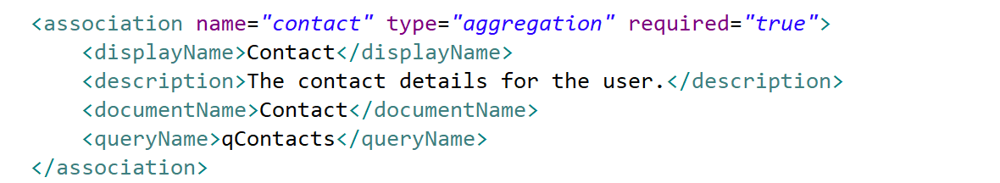<br>In this example, the document has a reference to the Contact document called Contact.<br>If the association above was type composition (rather than aggregation), deletion of the document would cascade and delete referenced Contacts.<br>Note that specifying a *queryName* is optional. If no *queryName* is specified, Skyve will supply the default or generic inferred query for the associated document.
  boolean         | True or False<br>If a boolean attribute is not marked as required, the value may also be null. | checkBox | 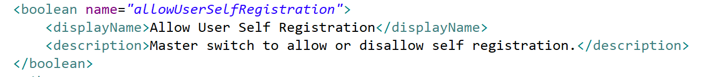<br>In this example, the attribute is not required. Non-requiredness means that null is a valid value for the attribute.
  collection      | An orderable collection of references to another document.<br>Collections must specify the *documentName* - the name of the document which is the subject of the collection.<br>Collections may be either *child*, *aggregation* or *composition* type.<br>*Child* collections belong to the document and cascade deletion will occur. Members of *child* collections have a *parent* reference automatically created and assigned. By default, interactions with *child* members will occur in modal windows and within the same transaction as interactions with the *parent*.<br>Optionally, collections may declare their `usage` ("domain", "view" or "both") - this is a hint to developers about how the collection is used and for example can be used by developers to control whether collections are filled by Factory classes or in other generic code. <br>Collections must have a *minCardinality* (which can be 0) and may optionally have a *maxCardinality*.<br>Collections may be ordered, either implicitly by the user (drag and drop within a grid) or specifically by the developer (using the order by clause).<br>Collections may specify a uniqueness constraint within the context of the *parent*'s collection (rather than within the customer's scope).<br>Aggregation and composition collections may specify a *queryName* unless the document's default query is to be used to define eligible document instances. | dataGrid (child, composition)<br>OR<br>dataGrid with a row containing a lookup (aggregation) | <br>In this example, the document has a collection of children called *Interactions*. Since minCardinality is 0, the document will be valid even if no children exist. The collection will be automatically reordered as defined by the ordering clause (*interactionDate*, then *interactionTime*, then *interactionType*) whenever the bean is saved.<br>All interactions will have a reference to the document called *parent*.<br>If the document is deleted, all children will also be deleted.<br>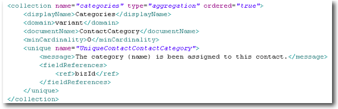<br>In this example, the collection is ordered, meaning that the user can re-order the collection by drag-drop in the view. The ordering performed by the user will be preserved when the bean is saved.<br>This example includes a uniqueness constraint applied within the context of the collection to prevent the same ContactCategory being added twice to the same collection.<br>Because the collection is of type *aggregation* (rather than *composition*) deleting the document will not cause cascade delete of the ContactCategory members of the collection.
  colour         | A colour. | colourPicker | 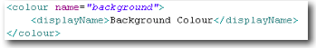<br>In this example no *shortDescripiton* is declared and as such no tool-tip help icon will be displayed next to widgets bound to this attribute.
  content        | Complex objects like movies, sound, word processing documents, spreadsheets, etc.<br>Content objects are automatically indexed by the textual indexer. | contentLink | 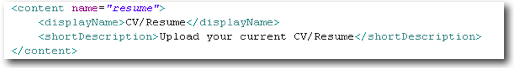
  date           | A calendar date (year, month, day).<br>By default, Skyve will provide a calendar widget for selection, but the date can be modified as text.<br>Note that if a converter has been declared, the representation within the *textField* component will reflect that conversion. | textField | 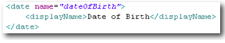
  dateTime       | Date with time (hours, minutes).<br>By default, Skyve will provide a calendar with time widget for selection, but the date and time can be modified as text.<br>Note that if a converter has been declared, the representation within the *textField* component will reflect that conversion. | textField | 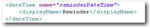
  decimal2       | Decimal number rounded to 2 decimal places, commonly used for currency and percentages.<br>Note that if a converter has been declared, the representation within the *textField* component will reflect that conversion. | textField | <br>In this example, the converter DollarsAndCents is automatically applied wherever this attribute is displayed.
  decimal5       | Decimal number rounded to 5 decimal places.<br>Note that if a converter has been declared, the representation within the *textField* component will reflect that conversion. | textField | 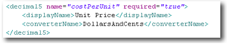
  decimal10      | Decimal number rounded to 10 decimal places.<br>Note that if a converter has been declared, the representation within the *textField* component will reflect that conversion. | textField | 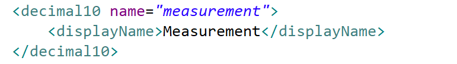
  enum           | A declared value set of static values for user selection (see full description below) | combo | 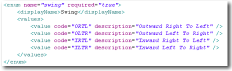<br>In this example, an enumeration will, by default, be represented as a simple combo box, with the four nominated descriptions in the combo list.<br>Because descriptions have been supplied, the codes will never be seen by the user, but will be persisted in the database.<br>Because name attributes have not been supplied for the values, the domain class for the document will include a Java enumeration with elements named as valid Java identifiers based on the description values, as shown:<br>
  geometry       | Used for storing location and geographical features in the Skyve platform (using a "flat-earth" cartesian approach - i.e. a non-geodetic feature on a 2-dimensional plane). | geometry |  
  integer        | An integer between the values of 2\^31-1 and -2\^31-1.<br>Note that if a converter has been declared, the representation within the *textField* component will reflect that conversion. | textField | 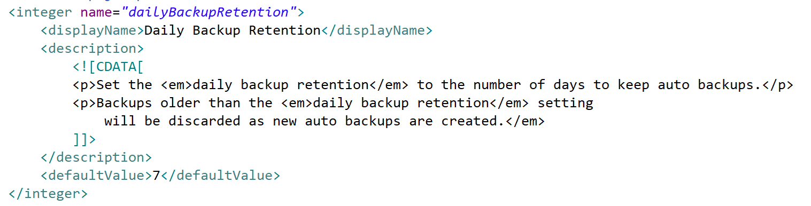<br>In this example the attribute has a *description* containing markup to provide expansive formatted tool-tip help.<br>The defaultValue setting in this case will yield a default value in the generated domain class as follows:<br>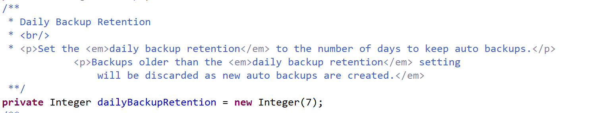
  longInteger    | A large integer.<br>Note that if a converter has been declared, the representation within the *textField* component will reflect that conversion. <br/> In this example, the attribute declares that a database index is to be maintained. | textField | 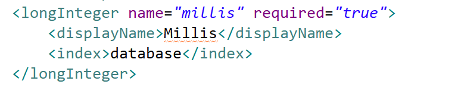
  markup         | Text with embedded markup tags.<br>Markup is the same as a *memo* where the textual indexer knows it will be HTML and will ignore HTML tags. | richText | 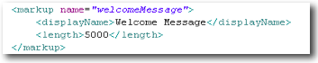<br>In this example the length will be applied and the user will be prevented from entering more than 5000 characters in the client (on keyPress event).<br>If the developer makes an error in code and attempts to set a longer value, an exception will be thrown when the code attempts to persist the bean.<br>The markup tags are included in the character count (but won't be indexed).
  memo           | Generic text values which are intended for large or formatted text values.<br>Memo attributes are automatically indexed for textual searching. <br/> As indexes are created by default by Skyve for `memo` attributes, in this example, the attribute declares that no index is created. | textArea | 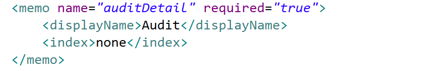
  text           | Generic text values.<br>Text attributes can be marked as indexed either for textual searching, or as a database index.<br>Text attributes may specify a value domain either constant, variant or dynamic - loosely typed value lists generated by methods in the document *Bizlet*. | textField<br>OR<br>combo if a domain is specified | 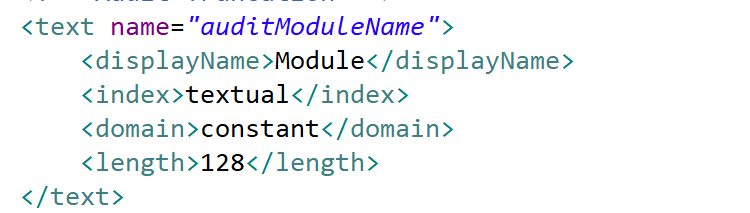<br>In this example the method attribute is textually indexed.<br>Normally constant domains are implemented as enum type attributes, but in this case, the developer will be responsible for generating the domain value set (by overriding the `getConstantDomainValues()` in the *Bizlet*. By default the attribute will be displayed as a simple combo with the generated value set included in the combo list to constrain users to that value set.<br>If the developer sets a value which is not returned by the `getConstantDomainValues()` method (i.e. not in the domain value set), the bean validation will throw an exception to prevent the value from being persisted.
  time           | Time (hours, minutes, seconds).<br>Note that if a converter has been declared, the representation within the *textField* component will reflect that conversion. | textField | 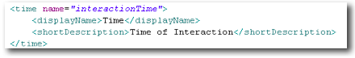
  timestamp      | Date with time (hours, minutes, seconds).<br>Note that if a converter has been declared, the representation within the *textField* component will reflect that conversion. | textField | 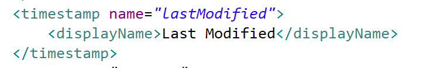

_Document attribute types_

### Declaring `enum`

An enumeration is a text field which is constrained to be one of a set of values, and can either declare values or refer to another attribute value set.

If enumerations are not marked required, they may be set to null.

Value attribute | Description | Required
----------------|-------------|----------
`code` | the value stored when this value is selected & the value stored in the persistence mechanism | *required*
`description` | how the value is displayed to the user - if the `description` is not explicitly declared it will be inferred from the `code` | *optional*
`name` | how the value is referred to in developer code and metadata - if the `name` is not explicitly declared it will be inferred from `description` | *optional*

`name` must be compilable as a Java identifier. 

Skyve will infer the `name` if it is not explicitly declared and if inference from the `code` or `description` does not lead to a satisfactory Java identifier, compile errors may result from the domain generation. In this case, declare a preferred `name` explicitly. 

When declaring an enumeration note that the `defaultValue` must correspond to the `name` of the value.

```xml
<enum name="loadAction">
	<displayName>Action</displayName>
	<defaultValue>lookupLike</defaultValue>
	<values>
		<value code="set" name="setValue" description="Always set this value"/>
		<value code="equals" name="lookupEquals" description="Look for exact match"/>
		<value code="like" name="lookupLike" description="Look for like match"/>
		<value code="contains" name="lookupContains" description="Look for matches containing this value"/>
		<value code="confirm" name="confirmValue" description="Fail if this value doesn't match"/>
	</values>
</enum>
```

In the above example, when the first value is selected from by the user, the code `set` will be stored (in the persistence mechanism), while the `description` *Always set this value* will be presented to the user.

To determine which value has been set can take advantage of the `switch` operator using the attribute `getter` as follows:

```java
switch(getLoadAction()) {
case confirmValue:
	//user code
	break;
case lookupContains:
	//user code
	break;
case lookupEquals:
	//user code
	break;
case lookupLike:
	//user code
	break;
case setValue:
	//user code
	break;
default:
	break;
}
```

To declare additional attributes using the same value set, use the `attributeRef` option in the `enum` declaration. If the value set is declared on an attribute in a different `document`, use the `attributeRef` *and* `documentRef` to specify the source. If the source is in a different `module`, use the `attributeRef` *and* `moduleRef` *and* `documentRef`.  

```xml
<enum name="otherAction" attributeRef="loadAction">
	<displayName>Action</displayName>
</enum>
```

When the domain is generated, the enum will result as follows:

```java
/**
 * Action
 **/
@XmlEnum
public static enum LoadAction implements Enumeration {
	setValue("set", "Always set this value"),
	lookupEquals("equals", "Look for exact match"),
	lookupLike("like", "Look for like match"),
	lookupContains("contains", "Look for matches containing this value"),
	confirmValue("confirm", "Fail if this value doesn't match");

	private String code;
	private String description;

	/** @hidden */
	private DomainValue domainValue;

	/** @hidden */
	private static List<DomainValue> domainValues;

	private LoadAction(String code, String description) {
		this.code = code;
		this.description = description;
		this.domainValue = new DomainValue(code, description);
	}

	@Override
	public String toCode() {
		return code;
	}

	@Override
	public String toDescription() {
		return description;
	}

	@Override
	public DomainValue toDomainValue() {
		return domainValue;
	}

	public static LoadAction fromCode(String code) {
		LoadAction result = null;

		for (LoadAction value : values()) {
			if (value.code.equals(code)) {
				result = value;
				break;
			}
		}

		return result;
	}

	public static LoadAction fromDescription(String description) {
		LoadAction result = null;

		for (LoadAction value : values()) {
			if (value.description.equals(description)) {
				result = value;
				break;
			}
		}

		return result;
	}

	public static List<DomainValue> toDomainValues() {
		if (domainValues == null) {
			LoadAction[] values = values();
			domainValues = new ArrayList<>(values.length);
			for (LoadAction value : values) {
				domainValues.add(value.domainValue);
			}
		}

		return domainValues;
	}
}
```
Note that to set the value of the `enum` attribute from a String, use the `fromCode` or `fromDescription` as is appropriate.

The `Binder.formatMessage()` method will return the declared (or inferred) `description`, as follows (using the example attribute declaration above):

```java
String output = Binder.formatMessage(CORE.getCustomer(), "You have selected the action `{loadAction}`.", bean);
```

### Enum with domain

You can conditionally restrict the list of enum values available to the user by declaring an enum attribute with a domain. This means that from the full list of values declared within the document (being generated into a proper Java enum for compile time checks), you can restrict the values available to the user at run time to those that are relevant. 

By declaring a domain, the values available to the user will be constrained to those resulting from the Bizlet domain method.

For example, the admin Data Maintenance function provides a number of restore types to handle restoring a database from a previous or later version of the same application:

```java
<!-- Restore parameters -->
<enum name="restorePreProcess">
	<displayName>Pre-Process</displayName>
	<domain>constant</domain>
	<values>
		<value code="noProcessing" description="No Processing" />
		<value code="dropUsingMetadataAndCreateUsingBackup" description="Drop tables using metadata &amp; recreate tables from backup create.sql" />
		<value code="dropUsingBackupAndCreateUsingBackup" description="Drop tables using backup drop.sql &amp; recreate tables from backup create.sql" />
		<value code="dropUsingMetadataAndCreateUsingMetadata" description="Drop tables using metadata &amp; recreate tables from metadata" />
		<value code="dropUsingBackupAndCreateUsingMetadata" description="Drop tables using backup drop.sql &amp; recreate tables from metadata" />
		<value code="createUsingBackup" description="Create tables from backup" />
		<value code="createUsingMetadata" description="Create tables from metadata" />
		<value code="deleteData" description="Delete existing table data using metadata" />
	</values>
</enum>
```

In this case, the document declares all valid enum values, but also declares a constant domain. In this case, the values available to the user will be limited by the `getConstantDomainValues()` Bizlet method as follows:

```java
@Override
public List<DomainValue> getConstantDomainValues(String attributeName) throws Exception {
	List<DomainValue> result = null;
	

	...
	else if(DataMaintenance.restorePreProcessPropertyName.equals(attributeName)){
		result = new ArrayList<>();
		result.add(RestorePreProcess.noProcessing.toDomainValue());
		if(UtilImpl.CUSTOMER!=null){
			result.add(RestorePreProcess.dropTablesUsingMetadataRecreateTablesFromBackupCreatesql.toDomainValue());
			result.add(RestorePreProcess.dropTablesUsingBackupDropsqlRecreateTablesFromBackupCreatesql.toDomainValue());
			result.add(RestorePreProcess.dropTablesUsingMetadataRecreateTablesFromMetadata.toDomainValue());
			result.add(RestorePreProcess.dropTablesUsingBackupDropsqlRecreateTablesFromMetadata.toDomainValue());
			result.add(RestorePreProcess.createTablesFromBackup.toDomainValue());
			result.add(RestorePreProcess.createTablesFromMetadata.toDomainValue());
		}
		result.add(RestorePreProcess.deleteExistingTableDataUsingMetadata.toDomainValue());
	}
}
``` 

  

### Conditions
Document conditions are code snippets which return a Java `boolean` value,
and which can be used by view declarations.

By restricting client-side view conditions to server-side compiled code
rather than client-side Javascript (or other client script), the risks
of developer bugs is significantly reduced. Only the result of the
condition is passed to the client, so the chance of an invalid or
unintended result is minimised. This also means that client interactions
can have access to the results of the full breadth of the server-side
code base, utilities and libraries, while all code is maintained in one
central location. The additional benefit is that all application code is
in one language.

```xml
<condition name="personType">
	<expression>
  		<![CDATA[ContactType.person.equals(getContactType())]]>
  	</expression>
</condition>
```
_Although available to client-side views, conditions can take advantage of strongly typed compiled code._

_Condition declaration_

Conditions become methods of the generated document *Impl* classes.
The code within the condition declaration is placed verbatim in the
method allowing condition methods to be used in developer server-side
code (including *Bizlet* code).

For each condition declaration Skyve generates pairs of condition
methods (both positive and negative methods are generated).

```java
@Override
public boolean isPersonType() {
  return (ContactType.person.equals(getContactType()));
}

@Override
public boolean isNotPersonType() {
  return (ContactType.person.equals(getContactType()));
}
```
_Generated condition method pairs._

### Constraints
Uniqueness constraints can be defined within the *document.xml*.

Constraints are checked using row locking (where available, e.g. using
the *select for update* syntax or the update hint in MS SQL Server).

Constraints can combine any number of attribute references (refs) and are declared against
a scope (either user, datagroup, customer or global).

```xml
	<uniqueConstraints>
		<constraint scope="customer" name="UniqueSystemCommunication"
		description="Ensure no duplication of communication templates">
			<message>A communication for {description} already exists.</message>
			<fieldReferences>
				<ref>description</ref>
			</fieldReferences>
		</constraint>
	</uniqueConstraints>
```
_The message is displayed to the user when the constraint is violated, and may contain bindings._

In the above example, the constraint will ensure uniqueness of the system communications per customer.

### Documentation

The *document.xml* includes a `<documentation>` tag to allow document
specific documentation to be included with the document definition.

```xml
<?xml version="1.0" encoding="UTF-8" standalone="yes"?>
<document name="Subscription" xmlns="http://www.skyve.org/xml/document" xsi:schemaLocation="http://www.skyve.org/xml/document ../../../schemas/document.xsd"
	xmlns:xsi="http://www.w3.org/2001/XMLSchema-instance">
	<documentation>
		<![CDATA[
		A Subscription models the receiver's preference about how 
		they wish to receive the communication type (or not).

		If the subscription is declined, the format type is not required. 
		If the format type is supplied, then the communication
		is only declined for that format.
		
		If the subscription is not declined, the format type is required, 
		as this specifies the format preference for the communication.		
		
		If the subscription is not declined and has no formatType, 
		the subscription can be deleted as it holds no value.
		
		Subscriptions are user-scoped - The assumption is that it is up to 
		the user whether they wish to accept or decline receiving 
		communications and in what manner they are delivered.
		]]>
	</documentation>
	<persistent name="ADM_Subscription" />
```

_documentation tag for a document_

## Overriding documents
Documents may be overridden for customers, to allow customised variants
of the document definition including:

-   attribute names and descriptions,
-   attribute types and sizes,
-   attribute converters,
-   default widgets,
-   conditional logic,
-   relationships and constraint particulars, and
-   views, actions, reports and *Bizlet* methods.

To override a document, view, action, report or *Bizlet* method, place
the overriding artefact into the customer package, mirroring the folder
structure of the originating artefact.

When overriding *Bizlet* methods, only the methods being overridden
should occur in the overriding *Bizlet* class (placed in the customer
package).

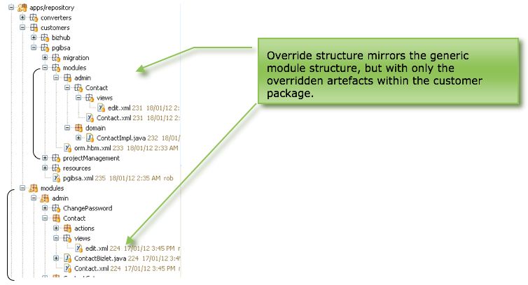

The example shown in demonstrates how a customer override is
achieved.

In this example the customer *pgibsa* has the Contact *document.xml* and
edit view overridden within the *admin* module. Note that only the
overridden artefacts are included in the override. All other aspects of
the module will respect the generic functionality declared in the module
package (rather than the customer package).

Note also that the implementation (*Impl*) class for Contact is also
overridden however this override is generated automatically by Skyve
using the *generateDomain* ant task.

## Database persistence of relationships and key constraints

To ensure referential integrity, Skyve (via Hibernate™) persists foreign
key constraints in the data tier, as follows:

  Relationship           | Description | Logical types
  ---------------------- | ----------- | -------------
  aggregation association | When an aggregated association is declared from A to B, the database table for document A will have a UUID field created named according to the name declared on the association in document A, suffixed \_id.<br>For example, if Invoice has an aggregated association to Employee, typically the name of the association might also be employee (camelCase). If the persistent name of the Invoice document (i.e. the name of the database table) is `INV_Invoice`, then this table will have a field called employee\_id which holds the UUID key for the Employee record.<br>In this example, Invoice.employee would be a reference to Employee.bizId and would be stored in the database as Invoice.employee\_id.<br>Hibernate will ensure that a Foreign Key constraint is created on `INV_Invoice` table to ensure referential integrity and the Employee record will not be able to be deleted until the relationship is nulled or changed or the corresponding Invoice record is deleted. | Many-to-one
  composition association | As for aggregation association except with cascade delete.<br>For example, if an Employee is a Contact, then Employee will have a composition association to Contact. If the Employee is deleted, the referred Contact will be deleted automatically (i.e. cascade). | Many-to-one
  aggregation collection  | When an aggregation collection of document B is declared on document A, a directional joining table is created to express the relationship.<br>The joining table will have two fields: `owner_id` and `element_id` with foreign key constraints such that `owner_id` references document A and `element_id` references document B (i.e. where Bs are elements of A's collection).<br>The joining table is named according to the direction of the relationship using the persistent names of both documents.<br>For example, a Depot may have a collection of Taxi. If the persistent names of the documents are TRAN\_Depot and TRAN\_Taxi, the joining table will be named TRAN\_Depot\_Taxi and the owner\_id will reference TRAN\_Depot and the element\_id will reference TRAN\_Taxi.<br>The joining table is directional because if another relationship is declared from document B to document A (i.e. the other way around) another joining table is created such that the owner is document B and elements are document A.<br>When an element of the collection is deleted or removed, the tuple in the joining table is deleted automatically by Skyve.<br>When the owner of the relationship is deleted, the tuple in the joining table is also deleted automatically. | Many-to-many
  composition collection  | As for aggregation collection except with cascade delete.<br>For example, if Depot has a collection of Taxi which is of type composition, then deletion of the Depot will result in cascade deletion of the associated Taxis and therefore also the tuples in the joining table will be deleted. | Many-to-many
  parent-child collection | When a parent child relationship is declared from A to B, document B will have a parent property (with corresponding .getParent() and .setParent() methods) and the table for document B will have a `parent_id` field created.<br>For example, if the Invoice document is declared as parent to InvoiceLine and the persistent name of the InvoiceLine document is `INV_Invoice`Line then this table will have a column `parent_id` which holds the UUID key of the parent Invoice. | One-to-many

### Database indexes

Hibernate ensures that all primary keys are indexed unique and that all
tables have a primary key defined.

Skyve platform columns *bizCustomer* (the customer context in which the
data was created), *bizKey* (the Java String representation of the bean)
and *bizUserId* (the user who created the data) are also indexed.

In addition, developers can declare a database index on document attributes, 
or turn off the default indexing behaviour where it is not required, as follows:
```xml
		<longInteger name="millis" required="true">
			<displayName>Millis</displayName>
			<index>database</index>
		</longInteger>
		<memo name="auditDetail" required="true">
			<displayName>Audit</displayName>
			<index>none</index>
		</memo>
```

## Java classes

Skyve provides a *generateDomain* ant task which generates java classes
as required for each document. These classes are located in the module
*domain* folder.

For each document a generic document interface class is generated as
well as an implementation class (*Impl*). *Bizlet* code uses these
interfaces so compile errors are generated if developer code is
inconsistent with the application specification metadata.

An *Impl* class is also generated for each customer-override of the
document (located in the customer's *module.document* override package).

## Bean

Each document class extends the *Bean* interface.

Beans include a number of attributes to support Skyve interactions,
specifically:

  Attribute      | Description                                                                             | logical type
  -------------- | --------------------------------------------------------------------------------------- | ------------------------------------
  bizId          | A guaranteed unique primary identifier for the instance of the bean                     | UUID (universally unique identifier)
  bizKey         | A simple scalar representation of the bean.                                             | String
  bizCustomer    | The name of the customer/tenant the instance belongs to.                                | String
  bizDataGroupId | The id of the datagroup context which the bean instance belongs to.                     | UUID
  bizUserId      | The id of the user who created the bean.                                                | UUID
  bizModule      | The name of the Skyve module in which the instance exists.                              | String
  bizDocument    | The name of the Skyve document which this bean is an instance of.                       | String
  bizOrdinal     | The ordinal position of the bean if it exists as a member of a collection.              | Integer
  persisted      | Whether the bean has been persisted. For transient beans this will always return false. | Boolean
  created        | Whether the bean has been validly created.                                              | Boolean

_Bean attributes_

Each generated document interface class implements either
*PersistentBean* or *TransientBean* and represents the intersection of
all customer-overrides.

## PersistentBean

In addition to the basic attributes required for beans,
*PersistentBeans* contain attributes required for persistence (including
attributes to allow record locking and contention management) so that
any persistent document created within Skyve has all aspects required
for secure multi-user interactions.

  Attribute      | Description | Logical Type
  -------------- | ----------- | ------------
  bizLock        | Platform and database independent optimistic locking information consisting of a timestamp and username.<br>Comparing lock values allows the platform not only to determine *IF* the bean has been altered by another conversation since it was loaded into the current conversation, but also by *WHOM* and *WHEN*. | OptimisticLock
  bizVersion     | An incrementing integer that is used to detect if changes have been made by another conversation. | Integer
  bizFlagComment | Users can add to comments the document instance as part of generic list functionality called Flags. | String
  bizTagged      | Indicates whether a bean is a part of the currently selected tag within the context of the conversation. While relevant for persistent beans, the value of *bizTagged* is not itself persisted. | Boolean

_PersistentBean attributes_

## Persistence and locking

Persistent Skyve documents are persisted as tables in the data tier, and
document instances as data rows or tuples. Document attributes
containing content (i.e. file attachments) contain only a reference to
the actual content (which is managed within the file system).

Skyve tables always have columns for the *Bean* and *PersistentBean*
attributes defined above, in addition to those defined by the developer
in the *document.xml*. This guarantees that every table can
automatically be managed by Skyve in a secure, scalable and
transactional way.

While some DBMS implement their own proprietary contention and record
locking mechanisms, Skyve implements these in a platform and
database-independent way.

Pessimistic locking happens in the data tier (page, row, table DB locks) - these are for each database connection and handled by the DBMS.

Optimistic locking happens during user wait time (also called long
transactions) and relies on a piece of data which changes each time
someone changes a tuple. Optimistic locking is required because holding
database connections open while users interact with the system would
severely impact on performance and infrastructure requirements for
multi-user systems.

**[⬆ back to top](#documents)**

---
**Next [Converter, validator and format](./../_pages/converters.md)**  
**Previous [Modules](./../_pages/modules.md)**
