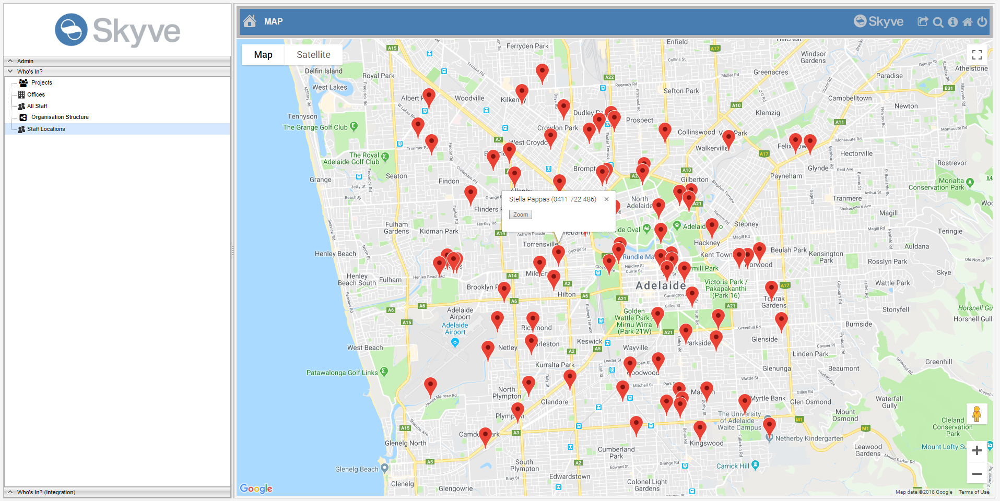
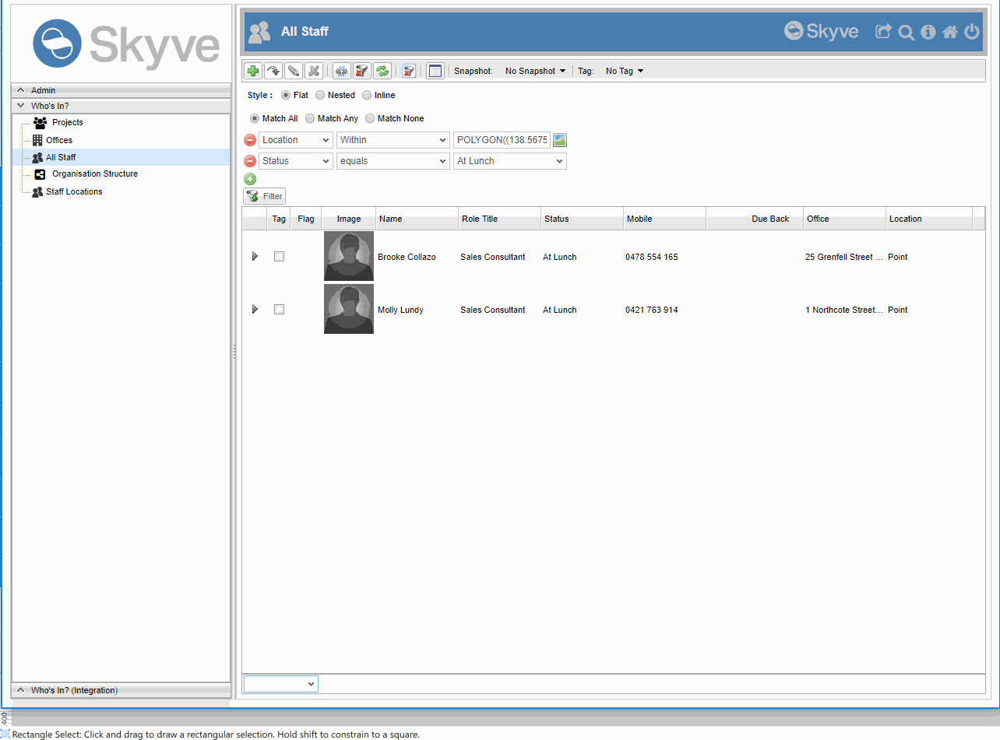
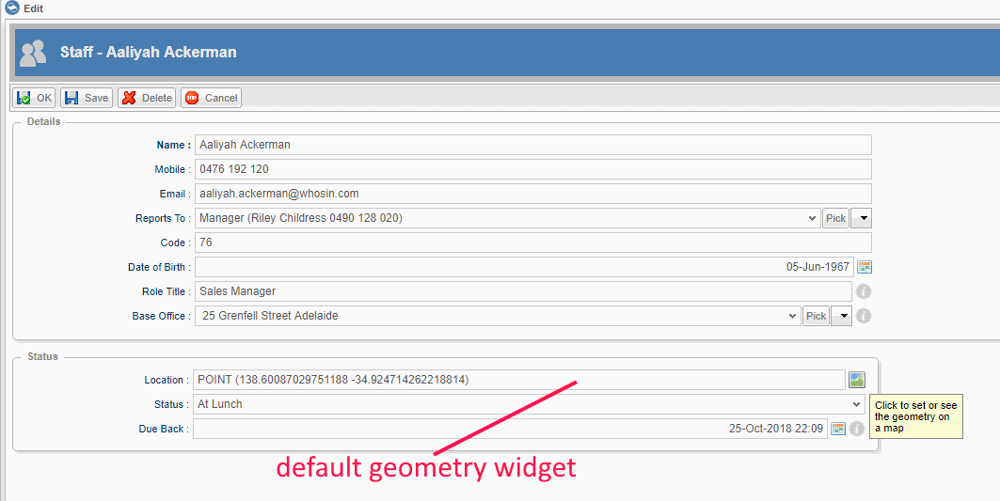
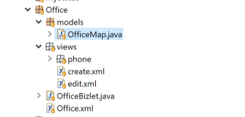
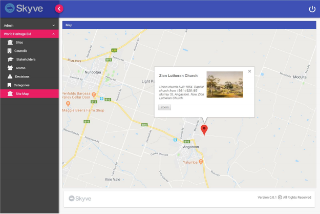

## Geometry and geospatial

### Before you begin - things to consider

#### The default Google maps API

Skyve provides a Google maps API by default, however it is your responsibility to consider usage, licencing and billing implications when used in your application. Refer to [Google](https://cloud.google.com/maps-platform/terms/) terms. 

#### Alternative map APIs

Skyve applications can take advantage of other map APIs (for example [Leaflet](https://leafletjs.com/), [OpenStreetMap](https://www.openstreetmap.org/) etc) however these APIs are not included in the open-source Skyve distribution. For assistance, contact us at skyve.org to discuss detailed steps for other integration options.

#### Configuring Skyve for map-based interactions

To take advantage of Skyve's inbuilt map features with the default Google maps API, you must provide a valid [Google maps API key](https://developers.google.com/maps/documentation/javascript/get-api-key) in the Skyve application `.json` file.

```json
// API Settings
api: {
	googleMapsV3Key: "AIzaaaaaDDDDAAA-CMqvI0TIAPlye9g4Wr4Dg",
	googleRecaptchaSiteKey: null,
	ckEditorConfigFileUrl: null
},
```

### Geometry attribute type

Skyve provides a native `geometry` attribute type for geometrical and geospatial objects, shapes and locations and takes advantage of hibernate spatial dialects for storage and searching of spatial items.

Attributes storing geometric or geospatial points (locations) or shapes are declared in the `document.xml` as follows:

```xml
<geometry name="location">
	<displayName>Location</displayName>
</geometry>
```

### Map menu

The Map menu item provides map-based interactions to locate records spatially and then to navigate to those records via the info-window popup. 

To provide map-based navigation, declare a `map` menu item in your application `module.xml` file as follows:

```xml
<map name="Staff Locations" document="Staff" geometryBinding="location" >
	<uxui name="desktop" />
	<role name="Manager" />
	<role name="StaffMember" />
</map>
```

Because map-based interactions are currently only supported via the `desktop` rendering mode (i.e the SmartClient renderer), specifying the `desktop` `uxui` menu option means the map will not be available for other renders (as is appropriate).

The `geometryBinding` parameter specifies which document attribute is being displayed. In the above example, the map will display `geometry` data for the *location* attribute of the *Staff* document.



The info-window will display the record bizKey (by default) with a `Zoom` action - allowing the user to zoom into the corresponding record detail view.

The map menu item supports the following options:

 Option | Description
 ---------|---------
 document | all records will be displayed based on the user permissions, based on the specified `geometryBinding` attribute
 query | all records will be displayed based on the user permissions and query declaration included in the `module.xml`
 model | all records will be displayed based on the user permissions and model code
 refreshTimeInSeconds | not yet implemented - the time in seconds to automatically refresh the map
 showRefreshControls | not yet implemented - whether to include the refresh controls as provided by the map service

Note that to customise the map display options, including the info-window, requires a developer to create a map *model* (see below). 

### Spatial filters in the list menu item

Where `geometry` attributes are included in a list menu item, Skyve will provide suitable filters for that attribute (currently only supported in the `desktop` rendering mode). The simple filter line allows input of WKT strings as the filter criteria, however the advanced filter options provide map-based rubber-band selection tool. 



Note that Skyve's list control supports spatial filter criteria used as well as other criteria for combined effect.

### Geometry and geospatial widgets

The `geometry` values are displayed as <a href="https://en.wikipedia.org/wiki/Well-known_text">Well-known text</a> by the default `geometry` widget.



The `geometry` widget provides a map-based data entry tool option with basic drawing tools. The mapping interfaces are currently only supported in the `desktop` rendering mode and depends on a valid Google maps API key having been specified in the application `.json` settings file.

[Map-based data entry tool](./../assets/images/geospatial/geometry-map-based-data-entry-tool.png "Map-based data entry tool")

### Geolocator widget

The `geolocator` widget is a geocoding/reverse geocoding tool to set address related attributes, based on map-based interactions. 

Geolocator will render a Map button, when pressed, a Geolocation window will appear with a pointer to the address or position bound to the Geolocator widget. A new address or location can be selected within the Geolocator Map if the Geolocator is not disabled.

The Geolocator Widget has multiple bindings which interact with the map
* addressBinding
* cityBinding 
* stateBinding 
* postcodeBinding
* countryBinding
* latitudeBinding
* longitudeBinding

When the Map button is clicked, the geolocator (shown below) will be displayed in a modal window. 


When the map tools are used to specify a geometry location (or shape), the specified `addressBinding`, `cityBinding`, etc. will be set correspondingly. The widget supports the use of any or all binding options.

### Map widget

To take advantage of the `map` widget, you must declare the `map` widget in the view *and* create a map *model* for the map.

The map widget is declared as follows:
```xml
<map modelName="OfficeMap" percentageWidth="100" percentageHeight="100" />
```

The `modelName` specifies the model class which controls the display options for the map.

Note that the `map` widget is a first-level container and is not specified within a `form` container. However, it may be contained within `vbox`, `hbox` and `tab` layout containers in the view.

### Map model

A map model is a java class which extends `org.skyve.metadata.view.model.map.MapModel` and must implement a `getResult()` method returning a `org.skyve.metadata.view.model.map.MapResult`.

According to the convention, the `model` java class must be declared within the corresponding document package, and located in a `models` package as shown:



MapModel provides the `getBean()` which returns the context bean (the bean for the view in which the model will be displayed) - if a bean context has been set. If a MapModel is specified as the `model` for a map menu item, `getBean()` will return null.

```java
import java.util.ArrayList;
import java.util.List;

import modules.whosinIntegrate.domain.Office;
import modules.whosinIntegrate.domain.Staff;
import modules.whosinIntegrate.domain.Staff.Status;

import org.skyve.CORE;
import org.skyve.metadata.view.model.map.MapFeature;
import org.skyve.metadata.view.model.map.MapItem;
import org.skyve.metadata.view.model.map.MapModel;
import org.skyve.metadata.view.model.map.MapResult;
import org.skyve.persistence.DocumentQuery;
import org.skyve.persistence.Persistence;

import com.vividsolutions.jts.geom.Envelope;
import com.vividsolutions.jts.geom.Geometry;

public class OfficeMap extends MapModel<Office> {
	private static final long serialVersionUID = 7880044512360465355L;

	@Override
	public MapResult getResult(Envelope mapExtents) throws Exception {
		Office office = getBean();		
		
		List<MapItem> items = new ArrayList<>();

			// add the office feature
		Geometry boundary = office.getBoundary();
		if (boundary != null) {
			MapItem item = new MapItem();
			item.setBizId(office.getBizId());
			item.setModuleName(office.getBizModule());
			item.setDocumentName(office.getBizDocument());
			item.setInfoMarkup(office.getBizKey());
			
			MapFeature feature = new MapFeature();
			feature.setGeometry(office.getBoundary());
			feature.setFillColour("#009900");
			feature.setFillOpacity("0.6");
			feature.setStrokeColour("#00FF00");
			item.getFeatures().add(feature);
			items.add(item);
		}
		
		// add the staff features
		if (office.isPersisted()) {
			
			Persistence p = CORE.getPersistence();
			DocumentQuery q = p.newDocumentQuery(Staff.MODULE_NAME, Staff.DOCUMENT_NAME);
			q.getFilter().addEquals(Staff.baseOfficePropertyName, office);
			
			List<Staff> staff = q.beanResults();
			for (Staff member : staff) {
				MapItem item = new MapItem();
				item.setBizId(member.getBizId());
				item.setModuleName(member.getBizModule());
				item.setDocumentName(member.getBizDocument());
				
				Status memberStatus = member.getStatus();
				StringBuilder markup = new StringBuilder(64);
				markup.append(member.getContact().getName());
				if (memberStatus != null) {
					markup.append("<br/>").append(memberStatus.toDescription());
				}
				item.setInfoMarkup(markup.toString());
				
				MapFeature feature = new MapFeature();
				feature.setGeometry(member.getLocation());
				item.getFeatures().add(feature);
				
				items.add(item);
			}
		}
		
		return new MapResult(items, null);
	}
}
```

The above example constructs a `List` of `MapItem` based on the boundary of the Office bean and the staff associated with that office.

The `MapItem.infoMarkup` allows html markup for the map info-window popups such as the example shown below:



The example above takes advantage of the Skyve `content` servlet to include an image into the info-window display, similar to the following:

```java
StringBuilder markup = new StringBuilder();
markup.append("<table><tbody><tr><td>");
markup.append("<p><h2>").append(bean.getName()).append("</h2></p>");
markup.append("<p><i>").append(bean.getDescription()).append("</i></p>");
markup.append("</td><td>");
markup.append("");
markup.append("</td></tbody></table>");

item.setInfoMarkup(markup.toString());
```

For more information on the Skyve `content` servlet see [Content](./../_pages/working-with-content.md).

### Spatial queries

Provided a geospatial hibernate dialect is selected for the application, Skyve's document query supports combining spatial and other filter criteria for `Bizlet`, Extension class, `action` or other general application code.

```java
/**
 * 
 * Return a List of staff whose current location is within the office boundary
 * and whose status is `at lunch`
 * 
 * @param office
 * @return
 */
public static List<Staff> getStaffOnSite(Office office) {

	Persistence pers = CORE.getPersistence();
	DocumentQuery q = pers.newDocumentQuery(Staff.MODULE_NAME, Staff.DOCUMENT_NAME);
	q.getFilter().addWithin(Staff.locationPropertyName, office.getBoundary());
	q.getFilter().addEquals(Staff.statusPropertyName, Status.atLunch);
	
	List<Staff> results = q.beanResults();
	
	return results;
}
```

The document query filter object provides the following spatial criteria options:

Option | Description
-------|------------
addContains(binding, geometry), addNullOrContains(binding, geometry) | filter for beans where the attribute specified by the `binding` is completely enclosed within the specified `geometry`  
addCrosses(binding, geometry), addNullOrCrosses(binding, geometry) | filter for beans where the attribute specified by the `binding` is crosses the specified `geometry`
addDisjoint(binding, geometry), addNullOrDisjoint(binding, geometry) | filter for beans where the attribute specified by the `binding` is does not cross, intersect nor is contained by the specified `geometry`
addEquals(binding, geometry), addNullOrEquals(binding, geometry) | filter for beans where the attribute specified by the `binding` is concurrent or the same as the specified `geometry`
addIntersects(binding, geometry), addNullOrIntersects(binding, geometry) | filter for beans where the attribute specified by the `binding` intersects the specified `geometry`
addOverlaps(binding, geometry), addNullOrOverlaps(binding, geometry) | filter for beans where the attribute specified by the `binding` overlaps the specified `geometry`
addTouches(binding, geometry), addNullOrTouches(binding, geometry) | filter for beans where the attribute specified by the `binding` is touches some part of the specified `geometry`
addWithin(binding, geometry), addNullOrWithin(binding, geometry) | filter for beans where the attribute specified by the `binding` is contained within the specified `geometry`


**[⬆ back to top](#geometry-and-geospatial)**

---
**Next [Communication](./../_pages/communication.md)**  
**Previous [Hierarchies](./../_pages/hierarchies.md)**
