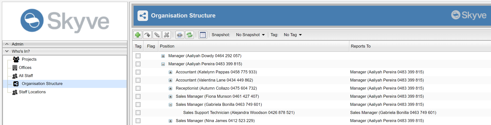
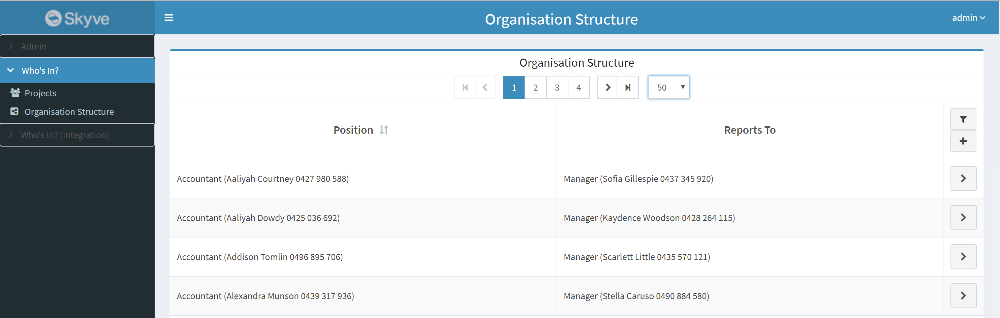
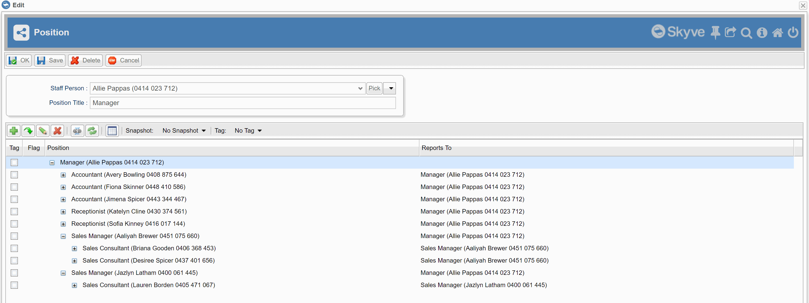
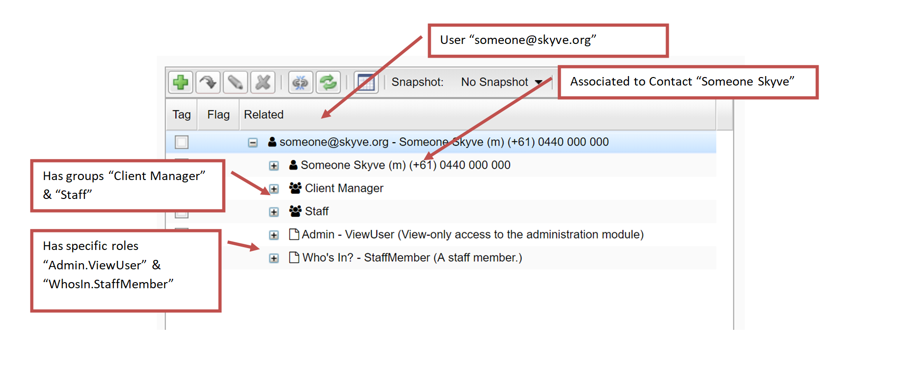

## Hierarchies

Skyve provides support for n-level hierarchy structures such as organisation structures, work break-down structures, inventory structures, bills of material and other tree structures.

The *desktop* mode renderer includes a lazy-load tree viewer that enables user exploration and navigation. As the user expands nodes, the child nodes are loaded, enabling support of large complex structures.

### Declaring hierarchic structures

To declare a document to support hierarchic structures, set the `parentDocument` attribute of the document to be itself, i.e. the same document, for example, review the declaration of the following _Position_ document to represent an organisation structure:
 
```xml
<document name="Position" xmlns="http://www.skyve.org/xml/document" xsi:schemaLocation="http://www.skyve.org/xml/document ../../../schemas/document.xsd"
	xmlns:xsi="http://www.w3.org/2001/XMLSchema-instance">
	<documentation>
		<![CDATA[
			The Position document holds the hierarchical relationship between staff at the organisation.
		]]>
	</documentation>
	<persistent name="WHO_Position" />
	<singularAlias>Position</singularAlias>
	<pluralAlias>Organisational Structure</pluralAlias>
	<iconStyleClass>fa fa-share-alt-square</iconStyleClass>
	<parentDocument>Position</parentDocument>
	<bizKey expression="{positionTitle} ({staff.contact.name} {staff.contact.mobile})"/>
	<attributes>
		<text name="positionTitle">
			<displayName>Position Title</displayName>
			<length>200</length>
		</text>
		<association type="aggregation" name="staff">
			<displayName>Staff Person</displayName>
			<documentName>Staff</documentName>
		</association>
	</attributes>
</document>		
```

In the above example, the "Position" document declares it's `parentDocument` as "Position". Each position node of the hierarchy has an association to a `Staff` document which has the specific employee details for each employee. 

To use the tree view widget in the *desktop* mode renderer, declare a `tree` menu item as follows: 

```xml
<tree name="Organisation Structure" document="Position" >
	<role name="MyRoleName" />
</tree>
```  

The above declarations will yield the following tree viewer in the *desktop* mode renderer.



By default, Skyve will use the declared `bizKey` as the display item for each node in the structure.

Note that currently, a lazy-load hierarchic view widget is not available for *responsive* mode renders, and these will degrade to a simple list view of top-level nodes, as follows:



Zooming in from the tree view will display the detail view of the node.

### Context specific hierarchic display

Skyve provides the `treeGrid` widget for showing hierarchic/tree structures within a specific context. The `treeGrid` provides the parameter attribute `rootIdBinding` which will locate the `treeGrid` at the node corresponding to the binding supplied.

To utilise the treeGrid, you must specify a suitable query in the `module.xml`, for example:

```xml
<query name="qPositions" documentName="Position">
	<description>Organisation Structure</description>
	<columns>
		<column binding="bizKey" sortOrder="ascending"/>
	</columns>
</query>
```		

In the above query, the only column declared shows the bizKey for each node.

Once the query is declared, the `treeGrid` widget can be declared in the document view as follows:

```xml
<?xml version="1.0" encoding="UTF-8" standalone="yes"?>
<view title="Position" name="edit" xmlns="http://www.skyve.org/xml/view"
	xsi:schemaLocation="http://www.skyve.org/xml/view ../../../../schemas/view.xsd"
	xmlns:xsi="http://www.w3.org/2001/XMLSchema-instance">
	<form border="true" percentageWidth="50">
		<column percentageWidth="20" />
		<column />
		<row>
			<item>
				<default binding="staff" />
			</item>
		</row>
		<row>
			<item>
				<default binding="positionTitle" />
			</item>
		</row>
	</form>	
	<treeGrid continueConversation="true" rootIdBinding="bizId" query="qPositions" />
	<actions>
		<defaults />
	</actions>
	<newParameters />	
</view>
```

In the above example, the rootIdBinding is set to be the `id` of the node which is being viewed. This means that the `treeGrid` will show the tree and allow exploration _from the current node down_ only, i.e. the subordinate tree.



Note that the `treeGrid` provides the `continueConversation` parameter attribute to allow the developer to decide the transactional demarcation of changes the user may make when zooming into subordinate tree nodes.

### Adding child nodes to the tree

To add child nodes to the tree, you need to set the new node bizParentId to the bizId of the parent node.

You can do this with an action in the Position as follows - firstly, add data-entry attributes to the Position document:

```xml
		<!-- For adding child nodes / reporting staff -->
		<!-- These attributes are transient as they are only required for the action of adding new staff reports -->
		<!-- The new nodes will be created as separate instances of the document -->
		<text name="newReportPositionTitle"  persistent="false" trackChanges="false" audited="false">
			<displayName>New Report Position Title</displayName>
			<length>200</length>
		</text>
		<association type="aggregation" name="newReportStaff"  persistent="false" trackChanges="false" audited="false">
			<displayName>New Report Staff Person</displayName>
			<documentName>Staff</documentName>
		</association>
```

(At this point, generate domain so that the new attributes can be referenced).

Add an action to create a new staff report, in the actions package within the Position document package.

```java
package modules.myModule.Position.actions;

import org.skyve.CORE;
import org.skyve.metadata.controller.ServerSideAction;
import org.skyve.metadata.controller.ServerSideActionResult;
import org.skyve.web.WebContext;

import modules.myModule.domain.Position;

public class AddNewReportStaff implements ServerSideAction<Position> {

	@Override
	public ServerSideActionResult<Position> execute(Position bean, WebContext webContext) throws Exception {

		if(bean.getPositionTitle()!=null ){
			Position p = Position.newInstance();
			p.setPositionTitle(bean.getNewReportPositionTitle()); // values for the new child node
			p.setStaff(bean.getNewReportStaff()); // values for the new child node
	
			p.setBizParentId(bean.getBizId()); // this will attach the new node as a child
			p = CORE.getPersistence().save(p);
			
			// and reset the data entry fields 
			bean.setNewReportPositionTitle(null);
			bean.setNewReportStaff(null);
		}
		
		return new ServerSideActionResult<Position>(bean);
	}

}
```

Ensure that you have declared the privilege to use the new `AddNewReportStaff` action in the module xml

```xml
		<document name="Position" permission="CRUDC" >
			<action name="AddNewReportStaff"/>
		</document>
```		

Update the Position view to include the new action and data entry fields

```xml
<?xml version="1.0" encoding="UTF-8" standalone="yes"?>
<view title="Position" name="edit" xmlns="http://www.skyve.org/xml/view"
	xsi:schemaLocation="http://www.skyve.org/xml/view ../../../../schemas/view.xsd"
	xmlns:xsi="http://www.w3.org/2001/XMLSchema-instance">
	<form border="true" percentageWidth="50">
		<column percentageWidth="20" />
		<column />
		<row>
			<item>
				<default binding="staff" />
			</item>
		</row>
		<row>
			<item>
				<default binding="positionTitle" />
			</item>
		</row>
	</form>	
	<form  percentageWidth="50" border="true" borderTitle="Add a new report">
		<column percentageWidth="20" />
		<column/>
		<row>
			<item>
				<default binding="newReportTitle"/>
			</item>
		</row>
		<row>
			<item>
				<default binding="newReportStaff"/>
			</item>
		</row>
		<row>
			<item>
				<spacer/>
			</item>
			<item>
				<button action="AddNewReportStaff"/>
			</item>
		</row>
	</form>
	<treeGrid continueConversation="true" rootIdBinding="bizId" query="qPositions" showAdd="false"/>
	<actions>
		<defaults />
		<action className="AddNewReportStaff" clientValidation="true" displayName="Add New Report Node" inActionPanel="false"></action>
	</actions>
	<newParameters />	
</view>
```

Since adding nodes is now handled by the action AddNewReportStaff, the inbuilt add feature on the tree grid should be disabled by setting `showAdd="false"`.

### Customising the way treeGrids work

Skyve's `treeGrid` implementation is a special case of the `listGrid` and the `treeGrid` can be customised using a `model`. For more information on this, refer to <a href="https://skyvers.github.io/skyve-dev-guide/lists/">Lists</a>.

#### RelationTreeModel

A RelationTreeModel is a tree displaying related entities and can be used as the basis for an exploration tree to show how an entity relates to its constituent parts.

A basic RelationTreeModel is implemented as follows:

```java
package modules.admin.User.models;

import org.skyve.metadata.view.model.list.RelationTreeModel;

import modules.admin.domain.GroupRole;
import modules.admin.domain.User;

public class RelationsModel extends RelationTreeModel<User> {
    private static final long serialVersionUID = 3035762173664181592L;

    public RelationsModel() throws Exception {
        super(GroupRole.DOCUMENT_NAME);
    }

    @Override
    public String getDescription() {
        return "References";
    }
}
```

In this case, the model will show all entities related to a `User` - stopping (i.e. going no deeper) than `GroupRole`.

The `RelationTreeModel` is heterogenous - that is, displays a tree of related entities of different types in a single structure.

The treeGrid is declared in the view, referring to the model as follows:

```xml
<treeGrid model="RelationsModel" continueConversation="true" />
```

Note the `continueConversation` is required to be declared but can be either `true` or `false` depending on the use-case.

The result is a `treeGrid` displaying all relations from the `User` instance:



**[⬆ back to top](#hierarchies)**

---
**Next [Images](./../_pages/images.md)**  
**Previous [Content](./../_pages/working-with-content.md)**
