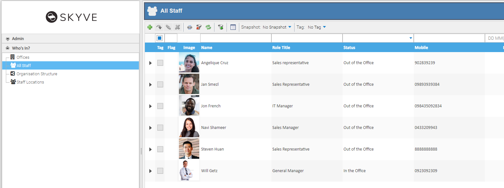

## Images

Working with images can introduce performance and memory issues - especially where applications use large numbers or high quality images and show these frequently and resizing these per on the fly. Whereas the browser will cache static images, for images which are part of your dynamic application data, resizing and serving these images can impact application performance and degrade the user experience.

To avoid these problems, Skyve provides automatic image caching and _thumbnail_ capabilities. Developers can configure how this feature works to fine-tune performance for their application. Cached files are stored within Skyve's content folder, in a folder called `SKYVE_THUMBNAILS`.

Skyve's automatic caching and management also works for files served through Skyve's resource mechanism.

### Thumbnail settings

The project `json` settings file contains a section to allow you to configure of how thumbnails are managed in your Skyve application.

```json
// Thumbnail settings
thumbnail: {
    // The number of threads that are allowed to serv thumbnails at once.
    // Too many threads can cause out of memory errors.
    // You can calculate this as concurrentThreads * memory usage determined by targetSize below
    // For the default of 10 concurrentThreads at 4MB the approx max memory usage is 40MB.
    concurrentThreads: 10,
    // The sub-sampling doesn't kick in until the image's largest dimension is at least double the target size
    // Then it sub-samples pixels by 2, 3 etc.
    // You can calculate the approximate max memory used per image with
    // targetSize * 2 (double width) * targetSize * 2 (double height) * 4 (ARGB bytes per pixel) / 1024 (KB) / 1024 (MB)
    // assuming the images are relatively square.
    // target of 256 = max 1MB; target of 512 = max 4MB, target of 1024 = max 16MB per image.
    subsamplingMinimumTargetSize: 512,
    // Thumbnails can be stored on the file system or generated on the fly each time
    fileStorage: true,
    // Where to put thumbnails if fileStorage is true - defaults to <content.directory>/SKYVE_THUMBNAILS/
    // Skyve will recreate this folder if it is deleted whilst running but if defined it must exist at startup.
    directory: null
},
```

The thumbnail JSON entry/stanza/object isn’t required though - so if this section is not included, your Skyve application will default to 40MB usage across 10 concurrent threads using `<content.directory>/SKYVE_THUMBNAILS/`. 

### Automatic caching and management

In Skyve, images are stored as content (see [Working with content](./../_pages/working-with-content.md). When content, images and resources are served to the user, images are resized for the specific layout context as required. 

Skyve's automatic subsampling occurs if the source image is too big. As images are resized, the resized version _thumbnail_ is automatically cached for re-use. By storing a _thumbnail_ of the right size (assuming the same size is requested again) then there's no resizing cost on memory for subsequent requests.

Consider, for example, if your application was to provide a list of _Staff_ records, each with an image of a user - where the module query for the list used the `content` column type:

```xml
<query name="qStaff" documentName="Staff">
	<description>All Staff</description>
	<columns>
		<content display="thumbnail" binding="contact.image" displayName="Image"
			 emptyThumbnailRelativeFile="shared/images/UnknownContact.jpg"/>
		<column binding="contact.name" sortOrder="ascending"/>
		<column binding="roleTitle" />
		<column binding="status" />
		<column binding="contact.mobile" />
		<column binding="dueBack" />
		<column binding="baseOffice.bizKey"/>
		<column binding="location" hidden="true"/>
	</columns>
</query>
``` 

The list of staff members would show as follows:


Skyve automatically pages list results with between 50-75 requests per page (unless its been visited before and then it'll be cached).

Assuming the settings above, initially 10 threads will be handled at a time (with the other 65 waiting and checking every 10 milliseconds if they are allowed to go or not). The first 10 threads write a thumbnail image (to the `SKYVE_THUMBNAIL` folder) and any subsequent requests will just serve the image. This means the processing is serialised 10 images at a time so that memory doesn't blow out - until the 75 requests are processed.

A thumbnail is requested with a width and height - if there is already a thumbnail image for that content or file with that width or height, then that thumbnail will be served. 

Files are keyed on the SHA-1 hash of their canonical path, content is keyed by its content ID using the same balanced folder structure as the SKYVE_STORE.

SVG file type icons are served when a file or content is not an image. If an image cannot be made (the content isn't an image - for example if the content field contains a PDF document) a marker file is placed on the FS so that next time it serves the file type SVG and the file type icon for that file type.


**[⬆ back to top](#images)**

---
**Next [Geometry and geospatial](./../_pages/geospatial.md)**  **Previous [Hierarchies](./../_pages/hierarchies.md)**
