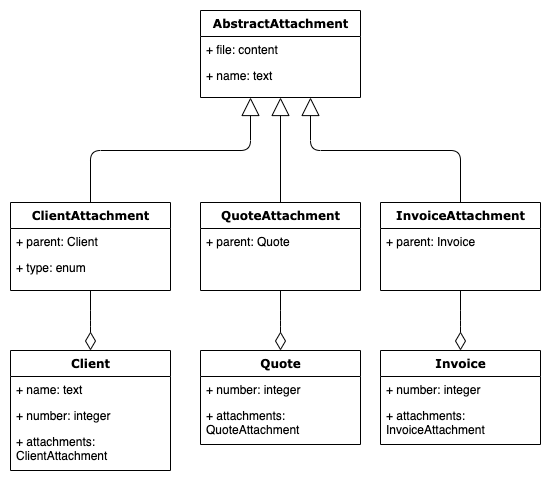

## Inheritance

Skyve supports inheritance between documents, to maximise re-use, and improve quality.

If you have a number of documents that have a subset of common attributes, you can declare an Abstract document with the common attributes, and then other documents that extend this.

The abstract document is declared with a persistence strategy - this defines the way in which the data will be persisted.

There are three persistence strategies available:
* _joined_ - all inherited attributes will be in one table - and subtype documents will join to this table (handled automatically by Skyve)
* _mapped_ - the document is a common superclass - all inherited attributes will be persisted as columns in tables for each subtype document, and there will be no table for the abstract document
* _single_ - data for all documents will be persisted in a single table with a `bizDiscriminator` column (handled automatically by Skyve)

### Example

Consider a situation where your project will handle a number of different finance items:
* invoice items
* fee items

with each that will require common attributes:
* description
* amount excluding tax
* amount of tax
* amount including tax
 
The abstract document may be declared as:

```xml
<document name="AbstractFinanceItem" ...
	<abstract>true</abstract>
	<persistent strategy="mapped" />
	...
	<attributes>
		<textField name="description">
			<displayName>Description</displayName>
			<length>100</length>
		</textField>
		<decimal2 name="amountExcludingTax">
		   <displayName>Ex Tax</displayName>
		   <converterName>Decimal2DollarsAndCents</converterName>
		</decimal2>
		<decimal2 name="amountOfTax">
		   <displayName>Tax</displayName>
		   <converterName>Decimal2DollarsAndCents</converterName>
		</decimal2>
		<decimal2 name="amountIncludingTax">
		   <displayName>Inc Tax</displayName>
		   <converterName>Decimal2DollarsAndCents</converterName>
		</decimal2>
	</attributes>
```

and the subtype (i.e. inheriting) documents are declared as extending that document:

For InvoiceItem

```xml
<document name="InvoiceItem" ...
	<extends document="AbstractFinanceItem"
	<persistent name="FIN_InvoiceItem" />
	...
	<attributes>
		<integer name="quantity">
			<displayName>Quantity</displayName>
		</integer>
	...
```

For FeeItem

```xml
<document name="FeeItem" ...
	<extends document="AbstractFinanceItem"
	<persistent name="FIN_FeeItem" />
	...
	<attributes>
		<enum name="feeType">
			<displayName>Fee Type</displayName>
			<values>
			...
	...
```

### Persistence

Using the mapped strategy, the database tables will have the following columns:

FIN_InvoiceItem | FIN_FeeItem
---|---
description | description
amountExcludingTax | amountExcludingTax
amountOfTax | amountOfTax
amountIncludingTax | amountIncludingTax
quantity | feeType

*Note - for clarity implicit columns are not shown here.

### Module permissions

Permissions for the abstract document are not required to be declared explicitly in the module.xml, unless the abstract document includes content attributes - in this case, you will need to declare permissions so that the content attribute can be managed.

### Bizlet and extension

You can create an extension class for an abstract document in the usual way, for example:

```java
public class AbstractFinanceItemExtension extends AbstractFinanceItem {

	private static final Decimal2 TAX_RATE = new Decimal2("0.1");

	public void calculate() {
		if (getAmountExcludingTax() == null) {
			if (getAmountExcludingTax() != null) {
				setAmountOfTax(getAmountExcludingTax().multiply(TAX_RATE));
				setAmountIncludingTax(getAmountExcludingTax().add(getAmountOfTax()));
			}
		} else if (getAmountIncludingTax() == null) {
			if (getAmountIncludingTax() != null) {
				setAmountOfTax(getAmountIncludingTax().divide(Decimal2.ONE.add(TAX_RATE)));
				setAmountExcludingTax(getAmountIncludingTax().subtract(getAmountOfTax()));
			}

		}
	}
}
```

Bizlets will not extend the abstract document bizlet by default, but you can define a Bizlet for the abstract document then extend that manually and the Bizlet for the abstract document can use methods from the extension class as follows.

In this example, the calculate method ensures tax calculations are done whenever the bean is saved.

```java
public abstract class AbstractFinanceItemBizlet<T extends AbstractFinanceItemExtension> extends Bizlet<T>{

	@Override
	public void preSave(T bean) throws Exception {	
		bean.calculate();
		super.preSave(bean);
	}
}
```

To inherit the same preSave behaviour in the subtype (inheriting) documents, create Bizlet classes which extend the abstract Bizlet. 

While the specific behaviour is defined in the abstract Bizlet class, the behaviour won't be inherited unless you create a Bizlet class that extends the abstract Bizlet (even if the subtype Bizlet class is empty) - so that Skyve can call the correct super class.

Note, at this point this is pure Java, Skyve only defines Bizlet as <T extends Bean> , so if one of the subclasses defines a Bizlet, there is no built in extension happening. But, by extending the abstract Bizlet, the behaviour is inherited.

For example, for FeeItem:

```java
public class FeeItemBizlet extends AbstractFinanceItemBizlet<AbstractFinanceItemExtension>{

}
```

And for InvoiceItem:

```java
public class InvoiceItemBizlet extends AbstractFinanceItemBizlet<AbstractFinanceItemExtension> {

}
```

Because AbstractFinanceItem does not define a class to satisfy the Bizlet <T extends Bean> and passes on T, we can use the generic type T in the Abstract Bizlet methods so when a FeeItem is preSaved by Skyve, FeeItem is the type that gets passed to its super Bizlet (AbstractFinanceItem) and satisifies the type <T extends AbstractFinanceItem> defined by AbstractFinanceItemBizlet.

However, because FeeItem extends AbstractFinanceItem, methods in AbstractFinanceItemExtension are automatically inherited by FeeItem whether or not a FeeItemExtension class is declared.

So for example, the calculate() method can be used for FeeItem as follows:

```java
	public static FeeItem createFee(Decimal2 exTaxAmount) {
		FeeItem f = FeeItem.newInstance();
		f.setAmountExcludingTax(exTaxAmount);
		f.calculate();
		return f;
	}
```

#### Explanation of extensions

Consider the following diagram:



For ClientAttachment as per the diagram which extends AbstractAttachment, the generated ClientAttachment.java actually extends AbstractAttachmentExtension, so it will inherit all the extension methods automatically. If we then went on to define a ClientAttachmentExtension which extends ClientAttachment, this would still inherit AbsractAttachmentExtension methods because ClientAttachment extends AbstractAttachmentExtension.

### View components

You can take advantage of inheritance by creating a reusable view component for the common attributes declared in the abstract class. Using a view component is useful for ensuring a consistent experience for users.

For example, AbstractFinanceItem has attributes description, amountExcludingTax, amountOfTax, amountIncludingTax.  

You can create a view component for AbstractFinanceItem as follows:

```xml
<?xml version="1.0" encoding="UTF-8"?>
<view xmlns="http://www.skyve.org/xml/view" xmlns:xsi="http://www.w3.org/2001/XMLSchema-instance" name="_financeItem" title="Abstract Finance Item"
	xsi:schemaLocation="http://www.skyve.org/xml/view ../../../../schemas/view.xsd">
	<form>
		<column percentageWidth="30" responsiveWidth="4" />
		<column />
		<row>
			<item>
				<default binding="description" />
			</item>
		</row>
		<row>
			<item>
				<default binding="amountExcludingTax" />
			</item>
		</row>
		<row>
			<item>
				<default binding="amountOfTax" />
			</item>
		</row>
		<row>
			<item>
				<default binding="amountIncludingTax" />
			</item>
		</row>
	</form>
</view>
```

The view component can then be used for FeeItem as follows:

```xml
<?xml version="1.0" encoding="UTF-8"?>
<view xmlns="http://www.skyve.org/xml/view" xmlns:xsi="http://www.w3.org/2001/XMLSchema-instance" name="edit" title="FeeItem" xsi:schemaLocation="http://www.skyve.org/xml/view ../../../../schemas/view.xsd">
	
	<component document="AbstractFinanceItem" name="_financeItem"/>
    <form >
        <column responsiveWidth="4"/>
        <column/>
        <row>
            <item>
                <default binding="feeType"/>
            </item>
        </row>
    </form>
    <actions>
        <defaults/>
    </actions>
    <newParameters/>
</view>
```


**[⬆ back to top](#views)**

---
**Next [Routing and rendering](./../_pages/routing.md)**  
**Previous [Views, widgets and layout](./../_pages/views.md)**