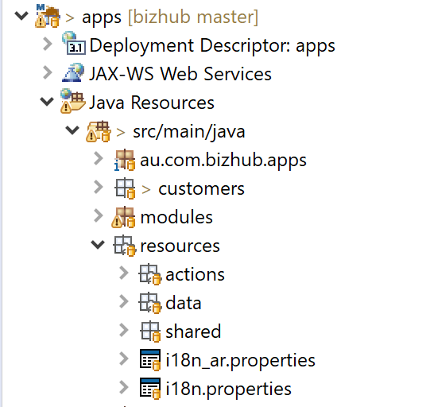
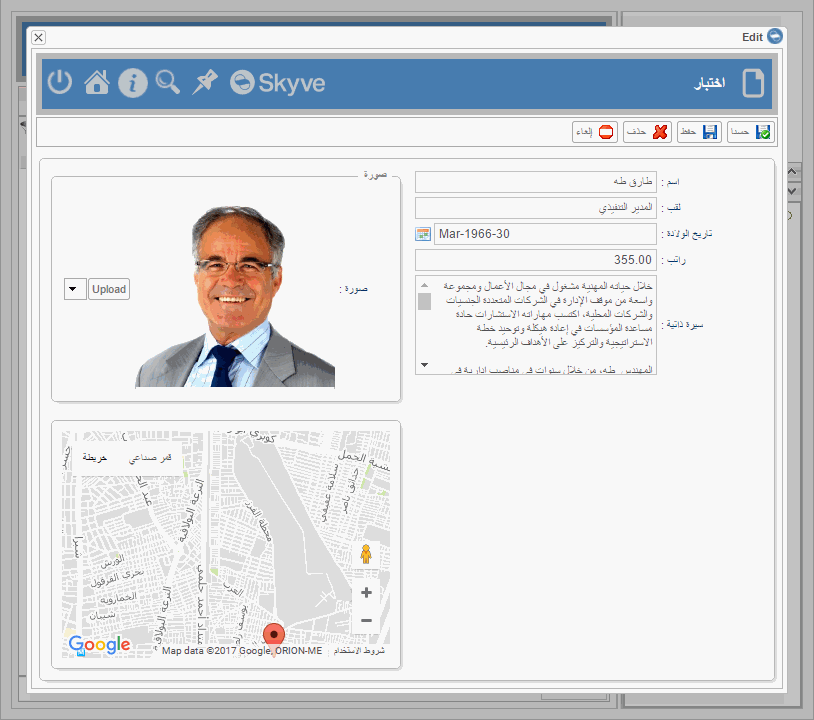
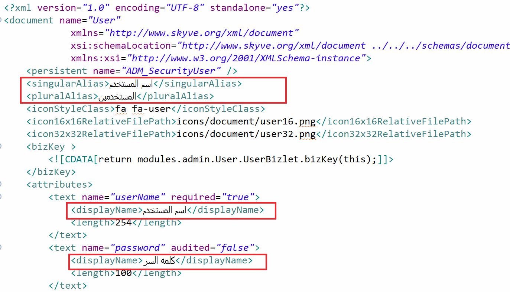
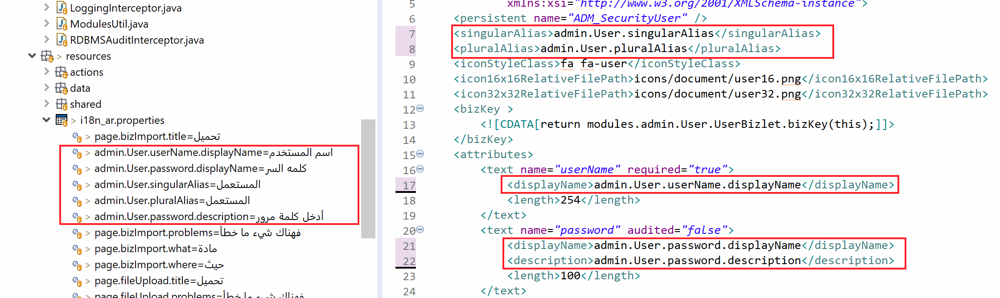

### Internationalisation and language support

Skyve supports building apps for local languages, including both left-to-right and right-to-left lanagues, as well as building applications for multiple languages (internationalisation)

Skyve metadata declarations can include UTF-8 characters and applications can store UTF-8 data (provided the database chosen by the developer is configured correctly).

Skyve provides a basic internationalisation resource file as a starting point for non-English usage. The file is named according to the ISO 639-1 two-letter language code in the `project/resources` folder.



The resource file contains key value pairs for the basic fixed Skyve messages, however you can expand these files for your own tokens (tokens you declare in your application metadata).

#### Setting a default language for a customer

Internationalisation and language support can also be specified when declaring the customer using the _language_ attribute
, .



To set the default language for a customer, include the language setting as follows (in this example, "ar"=Arabic).

```xml
<?xml version="1.0" encoding="UTF-8" standalone="yes"?>
<customer name="projecta"
            xmlns="http://www.skyve.org/xml/customer"
            xsi:schemaLocation="http://www.skyve.org/xml/customer ../../schemas/customer.xsd"
            xmlns:xsi="http://www.w3.org/2001/XMLSchema-instance"
            language="ar">
</customer>
```

If the language is not specified in the `customer.xml`, Skyve will detect the locale set in the browser, provided there is a matching internationalisation resource file provided.


#### UTF-8 Data

To ensure the database can store UTF-8 characters, ensure you have set the character set and collation.

For example, whereas H2 supports UTF-8 with default settings, for MySQL, ensure that the database is created with the correct character set and collation: 
```sql
CREATE DATABASE tpl CHARACTER SET utf8 COLLATE utf8_general_ci;
```

Additionally for MySQL, ensure your datasource connection string includes Unicode and UTF-8 encoding, for example:
``` 
jdbc:mysql://myServer:3306/myDatabase?useUnicode=true&amp;characterEncoding=UTF-8&amp;useCursorFetch=true&amp;defaultFetchSize=100
```

#### Local language support

You can use UTF-8 characters for display attributes in Skyve metadata



#### Building apps for multiple languages

To create an application which is available in more than one language, you can use the token-replacement feature to add tokens for the metadata declaration and matching key-value pairs in internationalisation resource files.

We suggest using the _module.document.attribute(.property)_ naming convention for your tokens, as shown.




**[⬆ back to top](#contents)**

---
**Next [Bizlets](./../_pages/bizlets.md)**  
**Previous [Converter, validator and format](./../_pages/converters.md)**