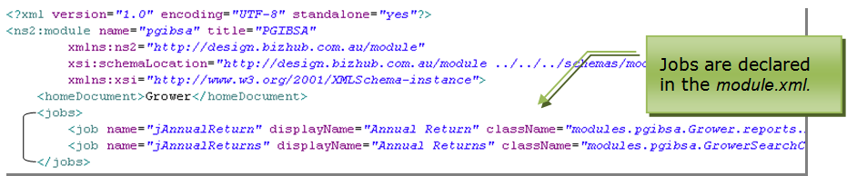

## Jobs

Skyve provides a mechanism for executing and scheduling offline Jobs
(i.e. Jobs processed irrespective of the state of the conversation or
session).

Jobs are declared in the *module.xml* file in the *jobs* section.



Job declaration includes logical name, *displayName* and *className.*

The *className* nominates the specific class file to be executed.

Once jobs have been declared, they are available to be scheduled at
run-time via the *admin* module job scheduler function.

The *admin* module provides comprehensive job scheduling functionality,
including assignment of the user under whose privileges the Job will be
executed.

Scheduling Jobs from the *admin* module requires the *JobMaintainer*
role.

### Job Classes

Job classes must extend the `org.skyve.job.Job` abstract class. Custom job code is located in the `execute()` method.

```
public class ProcessCommunicationForTagJob extends Job {
	private static final long serialVersionUID = 6282346785863992703L;

	@Override
	public String cancel() {
		return null;
	}

	@Override
	public void execute() throws Exception {

		List<String> log = getLog();

		Communication communication = (Communication) getBean();
```

The Skyve Job method getLog() retrieves the corresponding job log object, allowing the developer to log job activity (viewable for a suitably privileged user in the Job view in the admin module).

The Skyve Job method getBean() returns the corresponding bean instance where applicable (where a job has been instantiated 
within a bean context or action).

Jobs can be scheduled in action or *Bizlet* code using the
*JobScheduler* class.

```java
/**
 * Kick off the annual returns job
 */
@Override
public ServerSideActionResult<GrowerSearchCriteria> execute(GrowerSearchCriteria search, WebContext WebContext) throws Exception {
  User user = CORE.getPersistence().getUser();
  Customer customer = user.getCustomer();
  Module module = customer.getModule(Grower.MODULE_NAME);
  Job job = module.getJob("jAnnualReturns");

  EXT.runOneShotJob(job, search, user);

  search.setReturnResults("The generation job has commenced.");

  return new ServerSideActionResult<>(search);
}
```

_Example action class code to run a one-shot Job_

As Jobs are run within the context of a user so that Skyve's embedded
comprehensive security model can be enforced.

Developers must consider whether a user context will have sufficient
privileges for the Job to be executed.

**[⬆ back to top](#contents)**

---
**Next [Utility Classes](./../_pages/utility-classes.md)**  
**Previous [Reports](./../_pages/reports.md)**
