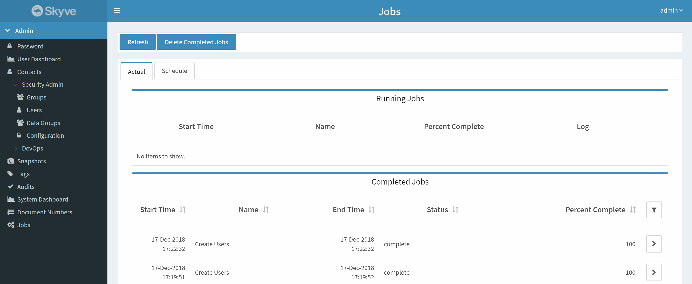
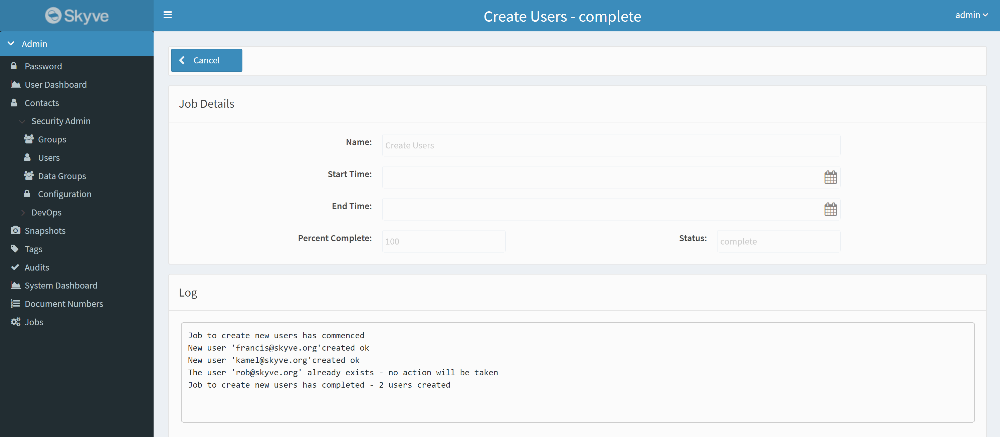

Skyve provides two different mechanisms for executing tasks in the background, jobs and background tasks. Jobs can be scheduled to 
run at a specific time or on a recurring schedule. Background tasks are used to run tasks in the background while the user continues 
to work in the application.

## Jobs

A Job represents an asynchronous process that can be scheduled or run ad-hoc. Jobs are registered against a module and available 
to be scheduled through the user interface. The are typically long-running tasks that can be scheduled to run at a specific time 
or on a recurring schedule. 

Jobs are declared in the `module.xml` file in the `<jobs>` section.


Job declaration includes logical name, *displayName* and *className.*

The *className* nominates the specific class file to be executed.

Once jobs have been declared, they are available to be scheduled at
run-time via the *admin* module job scheduler function.

The *admin* module provides comprehensive job scheduling functionality,
including assignment of the user under whose privileges the Job will be
executed.

Scheduling Jobs from the *admin* module requires the *JobMaintainer* role.

Although job logging can be turned off for a Job, each run is generally logged.

### Job Classes

Job classes must extend the `org.skyve.job.Job` abstract class. Custom job code is located in the `execute()` method.

```java
public class ProcessCommunicationForTagJob extends Job {
	private static final long serialVersionUID = 6282346785863992703L;

	@Override
	public String cancel() {
		return null;
	}

	@Override
	public void execute() throws Exception {

		List<String> log = getLog();

		Communication communication = (Communication) getBean();
```

The Skyve Job method `getLog()` retrieves the corresponding job log object, allowing the developer to log job activity (viewable for a suitably privileged user in the Job view in the admin module).

The Skyve Job method `getBean()` returns the corresponding bean instance where applicable (where a job has been instantiated 
within a bean context or action).

Jobs can be scheduled in action or *Bizlet* code using the
*JobScheduler* class.

```java
/**
 * Kick off the annual returns job
 */
@Override
public ServerSideActionResult<GrowerSearchCriteria> execute(GrowerSearchCriteria bean, WebContext WebContext) throws Exception {
  User user = CORE.getPersistence().getUser();
  Customer customer = user.getCustomer();
  Module module = customer.getModule(Grower.MODULE_NAME);
  JobMetaData job = module.getJob("jAnnualReturns");

  EXT.getJobScheduler().runOneShotJob(job, bean, user);

  webContext.growl(MessageSeverity.info, "The generation job has commenced.");

  return new ServerSideActionResult<>(bean);
}
```

_Example action class code to run a one-shot Job_

In the above example, the call `EXT.getJobScheduler().runOneShotJob` will schedule the job to run passing in the bean named _search_ under the permissions of the current _user_.

As Jobs are run within the context of a user so that Skyve's embedded
comprehensive security model can be enforced.

Developers must consider whether a user context will have sufficient
privileges for the Job to be executed.

### Other Job Subclasses

While most jobs can be defined by extending `org.skyve.job.Job`, there are two useful Job subclasses available which can be useful in certain scenarios:

#### CancellableJob

Extending `org.skyve.job.CancellableJob` provides the job with an `isCancelled()` method. This is useful for long running jobs which can be interrupted. This can be called in a `for` or `while` loop for example by checking during each iteration which allows the job to complete early:

```java
	if (isCancelled()) {
		getLog().add("Job cancelled...");
		return;
	}
```

#### IteratingJob

Extending `org.skyve.job.IteratingJob` is useful when the job is primarily responsible for processing a collection of the same type records. This defines two abstact methods which much be extended to tell the job which elements to iterate over (`getElements()`) and what operation to perform on each element (`operation()`). When the job executes, it will keep track of updating the progress percentage of the job and logging how many successful and unsucsessful records were processed.

An example of using this job is shown below:

```java
import org.skyve.job.IteratingJob;

public class ExpirePasswordJob extends IteratingJob<UserExtension> {

	@Override
	protected Collection<UserExtension> getElements() {
		// select all users to update
		return CORE.getPersistence().newDocumentQuery(User.MODULE_NAME, User.DOCUMENT_NAME)
				.beanResults();
	}

	@Override
	protected void operation(UserExtension element) throws Exception {
		// perform an operation on each user
		element.setPasswordExpired(Boolean.TRUE);

		// save the changes
		CORE.getPersistence().save(element);
	}
}
```

### Job Transactions

Unless specified by the developer, a job will run in a single transaction and roll-back if an exception is thrown. This may be suitable especially for jobs dealing with small numbers of beans. 

However, for jobs interacting with a large (or potentially large) number of beans, it may be useful to commit after each interaction, and possibly evict the cached bean to free resources.

```java
public class DeleteTaggedRecordsJob extends Job {
	private static final long serialVersionUID = 6282346785863992703L;

	@Override
	public String cancel() {
		return null;
	}

	@Override
	public void execute() throws Exception {

		List<String> log = getLog();

		Tag tag = (Tag) getBean();
		log.add("Started Delete Tagged contacts at " + new Date());

		Persistence pers = CORE.getPersistence();
		List<Bean> beans = TagBizlet.getTaggedItemsForDocument(tag, Contact.MODULE_NAME, Contact.DOCUMENT_NAME);

		int size = beans.size();
		int processed = 0;

		Iterator<Bean> it = beans.iterator();
		while (it.hasNext()) {
			
			Contact c = (Contact) it.next(); //get the contact

			String bizKey = c.getBizKey(); // remember details for logging below

			EXT.untag(tag.getBizId(), c); // remove the contact from the Tag set
			
			pers.delete(c);				  // delete the contact
			pers.commit(false);			  // commit the transaction
			pers.evictCached(c);		  // remove the deleted contact from the cache to free up resources
			pers.begin();     			  // start a new transaction for the next iteration

			log.add("The contact " + bizKey + " was deleted."); //log the result
			
			processed++;				  // increment the counter 
			setPercentComplete((int) (((float) processed) / ((float) size) * 100F));
		}

		setPercentComplete(100);
				
		log.add("Finished Delete Tagged contacts at " + new Date() + ". " + processed + " contacts were deleted.");
	}
}
```

The above example shows a number of common patterns for Jobs. 
- Firstly, the job uses the Tag concept, allowing the user to select which data will be affected at runtime.
- The job uses the iterator to safeguard against concurrent modification problems with the `List<Bean>` collection.
- The job commits each change, evicts any cached bean and then starts (`begin()`) a new transaction to free resources as it goes.

With this approach, should the job fail, deletions up to the point of failure are committed and won't be rolled back.

Developers should consider carefully implications of jobs which may process large numbers of beans and decide on an approach which best suits their needs.

For further examples, review the following classes in the Skyve admin module:
* admin.Communication.ProcessCommunicationForTagJob
* admin.DataMaintenance.BackupJob
* admin.DataMaintenance.RefreshDocumentTuplesJob
* admin.DataMaintenance.TruncateAuditLogJob
* admin.Tag.PerformDocumentActionForTagJob 
* admin.UserList.BulkUserCreationJob

### Logging

The Job class provides the `List<String> log` for developer logging.

The log is viewable while the job is running or after the job has completed.

To view the log, go to the admin->Jobs menu item and view the list of jobs (either running or completed).



Then click to view the job details and log.



## Background Tasks

Background tasks allow the user to continue working in the application while a task is running in the background. This can be used for short-running tasks need to continue to run in the background, but do not need to be scheduled like a Job. Some examples of this are sending an email, or preparing a report.

A `ViewBackgroundTask` is a short-running asynchronous process that can be kicked off via WebContext (no percent complete or interrupt method). It is applicable to the UI it is initiated from, and has access to and the ability to control the conversation caching in its execution via `cacheConversation()`.

It continues to use the `Persistence` instance from the conversation with all the state as if it was another user gesture (same database cache, same local UI mutations).
It’s `execute()` method takes the current contextual bean and is never null - ie it always must have a UI context (the record that initiated the task).

The persistence is set as async for the thread so that aysnc timeouts are used during its execution similar to Jobs (configured in the application .json properties file).

### ViewBackgroundTask

Background tasks must extend the `org.skyve.job.ViewBackgroundTask` abstract class. The application logic to run in the background is placed in the `execute()` method.

```java
public class MonthlyReportTask extends ViewBackgroundTask<MonthlyReport> {

	@Override
	public void execute(MonthlyReport bean) throws Exception {
		// generate and email the report
		// ...
	}
}
```

There are a couple of different methods of running the background task. From an action or Bizlet method with a `webContext`, there is a convenience `background()` method to run the task:

```java
	@Override
	public ServerSideActionResult<MonthlyReport> execute(MonthlyReport bean, WebContext webContext) throws Exception {
		// initiate task
		webContext.growl(MessageSeverity.info, String
				.format("A report job has been initiated. You will receive an email once the report is successfully generated."));
		webContext.background(MonthlyReportTask.class);
		
		return new ServerSideActionResult<>(bean);
	}
```

Alternatively, if you have access to the `webId` of the conversation, a task can be started in a similar method to immediately executing a job:

```java
EXT.getJobScheduler().runBackgroundTask(MonthlyReportTask.class, CORE.getUser(), webContext.getWebId());
```


**[⬆ back to top](#jobs)**