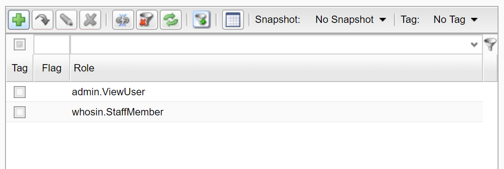
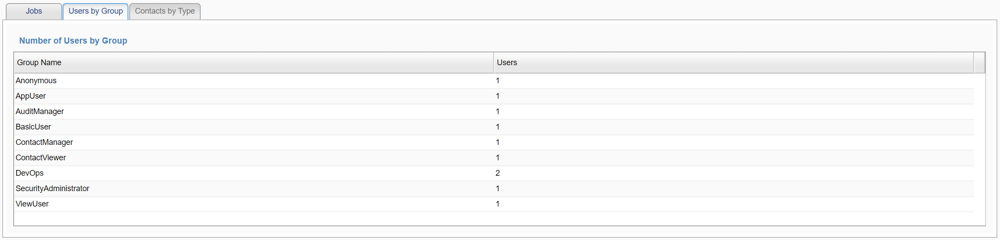

## Lists, Grids, queries and models

The Skyve list capability is core to most Skyve applications, and while much of the behaviour is usually implicit (just presenting a list of bean tuples from the database), Skyve allows overriding and customisation of the feature.

This is particularly useful where a developer needs to drive a list or tree from non-database data, or to customise the way filtering or summary features work.

Some situations where a developer may want to consider customising the feature:
* showing a list of files or folders from the file system
* listing content items from the content repository
* driving tree grids to use non-database driven hierarchies
* querying a web API
* using a non-SQL datasource
* showing an email list from the SMTP server
* changing the way the `<filterParameter>` works for a `listGrid`

The `treeGrid` feature (see <a href="https://skyvers.github.io/skyve-dev-guide/hierarchies/">Hierarchies</a>) is a special case of the list feature, where a filter is applied to return only nodes with a designated parent (representing that part of the tree), and therefore treeGrids can be customised in the same way as `listGrid`s.

### Difference between list grid and data grid

Skyve assumes a `dataGrid` control will be used to represent collections that are formally/explicitly modelled - where a document has a collection of another document, the Skyve default view will include a `dataGrid` control.

A `dataGrid`:
1. operates within the same conversation as the owning bean view 
2. is aware of collections
3. the data is not saved until the save or ok button on the outermost UI of the conversation is saved, same with remove
4. should only be for up to 100-200 records as the entire collection will be loaded in memory 

A `listGrid`:
1. is usually based on a metadata query declared in the `module.xml` file 
2. is a data island, refreshed (by default) on every response
3. is used to show data which may or may not be formally/explicitly related - can be filtered
4. can be driven by a model created by the developer in code (described further below)
5. includes all the export and filtering UI mechanisms available (in desktop mode)

#### List grid filtering

List grids offer additional no-code filtering options and the ability to pass in additional parameters.

```xml
<form>
	<column/>
	<column/>
	<row>
		<item>
			<checkBox binding="inactiveSelection">
				<onChangedHandler>
					<rerender clientValidation="false"/>
				</onChangedHandler>
			</checkBox>
		</item>
	</row>
</form>
<listGrid continueConversation="false" query="qUser">
	<filterParameter operator="equal" filterBinding="inactive" valueBinding="inactiveSelection"/>
</listGrid>
```

In the above example, the `filterParameter` is applied additionally to any filtering in the query `qUser` and additionally to any ad-hoc filtering set by the user at run time in the listGrid widget.

The `onChangedHandler` is used to trigger a rerender whenever the checkbox `inactiveSelection` is changed. The rerender triggers the listGrid to requery the data.

`filterBinding` is the binding in the query `qUser`.

`valueBinding` is the binding in the view.

The `filterParameter` above has the effect of adding to the `where` clause generated by the persistence pipeline, e.g. if the value of `valueBinding` (i.e. the attribute 'inactiveSelection') is 'true' then `and inactive = true` is applied as an additional filter to the query `qUser`.

#### List grid parameters

You can take advantage of passing parameters through the listGrid widget.

For example, if you have a module document query using a filter stanza as follows:

```xml
<query name="qTimesheets" documentName="WeeklyTimesheet">
	<description>Weekly timesheets for employees</description>
	<filter>
		<![CDATA[
			status = :selectedStatus
		]]>
	</filter>
	<columns>
		<column binding="weekEndingDate" sortOrder="descending" />
		<column binding="employee.employeeCode" />
		<column binding="totalHours" />
		<column binding="status"/>
</query
```

The listGrid widget can then pass in value parameters as follows:

```
<form>
	<column/>
	<column/>
	<row>
		<item>
			<checkBox binding="inactiveSelection">
				<onChangedHandler>
					<rerender clientValidation="false"/>
				</onChangedHandler>
			</checkBox>
		</item>
	</row>
</form>
<listGrid continueConversation="false" query="qUser">
	  <parameter name="selectedStatus" valueBinding="inactiveSelection" />
</listGrid>
```

### List models

Where developers require more control, Skyve provides a programmatic approach for driving lists, called list models. Developers can extend a list model, and manipulate the way data is provided to the list.

Skyve provides the following list model types:

Class | Description
------|------------
ListModel | The basic listModel that other types extend
`DocumentQueryListModel` | this approach takes advantage of the inbuilt handling of `DocumentQuery` and allows the developer to customise or construct the `DocumentQuery` and filters with minimal effort (rather than specifying the `DrivingDocument`, `Projections`, `Columns` and a `fetch()` method)
`InMemoryDocumentQueryListModel` |
`InMemoryListModel` | intended to provide a basis for complete implementation of all listGrid functions - advanced filtering, tags, flags, snapshot, summary etc.
`InMemorySQLListModel` | (not yet implemented)
`ReferenceListModel` | A class to extend to make a quick model based on a collection or an association within the edited bean. Used used to show references/collections from the bean as a list.
`RelationTreeModel` | A Tree Model that displays any document relations present in the edited document. That is, associations, collections, inverseOnes and inverseManys. The tree grid has one column, the document's bizKey. Used as the basis of exploratory tree showing all entities related to the bean.
`SQLDocumentQueryListModel` |
`SQLWithDrivingDocumentListModel` | (not yet implemented)
`SQLWithoutDrivingDocumentListModel2` | (not yet implemented)

### Declaring a list model

A list model is a Java class that extends `ListModel<>()` (or one of the subtypes) and is located in the models subpackage of the document package (as shown below):


Once the model is declared, it can be referenced using the `listGrid` widget in a view:

```xml
<listGrid model="BackupsModel" 
	selectedIdBinding="selectedBackupName" 
	continueConversation="false" 
	showAdd="false"
	showEdit="false" 
	showExport="false" 
	showFilter="false" 
	showRemove="false" 
	showSnap="false" 
	showSummary="false"
	showTag="false" 
	showZoom="false" 
	postRefresh="backupsRefreshRequired">
	<onSelectedHandlers>
		<server action="BackupSelected" />
	</onSelectedHandlers>
</listGrid>
```

In the above example, the `listGrid` uses the `BackupsModel` for basic display and selection of listed items (in this case, the backup files on the file system). 

`continueConversation` is set to false as `zoom` is not available. 

The `postRefresh` is controlled by the `backupsRefreshRequired` condition to avoid endless refreshing of the list as a result of the `onSelectedHandlers`. 

The `selectedIdBinding` is the binding name of the document attribute that will be updated when a row is selected - and used as the basis of code to handle the selected backup file.

#### Concepts

Skyve lists and models rely on a number of key concepts:

Concept | Description
--------|-----------
`Driving Document` | The primary document being listed - the document that will be navigated to if the user zooms into a row in the list
`Projection` | data fields returned or contained by the list concept, but not necessarily displayed as a column
`Column` | data fields which are shown to the user in the list
`Parameter` | a value and binding pair passed to the list - usually for the purposes of constructing a filter
`Filter` | a set of criteria limiting what data is returned by the list 
`Detail Query` | the way of retrieving the rows shown in the list
`Summary Query` | the way of retrieving the summary totals shown in the list summary
`Page` | a Class that represents a list of rows with a size and summary

#### Key methods

Method | Description
-------|------------
`fetch()` | returns a `Page` of results to be displayed in the `listGrid`
`iterate()` | enables export of a row using the export features of the `listGrid`

The general approach for creating a simple list model is:
* In the constructor, set the drivingDocument, projections and columns - this might be done for special cases of query-based models by specifying or establishing the query on which the list will be based
* Implement the `fetch()` method to return a `Page` of results for display.

#### Example DocumentQueryListModel

The following is an example of a class overriding DocumentQueryListModel to apply additional filtering (similar to the examples above). In this example, the listGrid is in the context of a document called SomeDocument that includes a filtering attribute called `inactiveSelection`.

```java
public class UserListModel extends DocumentQueryListModel<SomeDocument> {

	// override the constructor to decide which query to use as the basis of the list
	public UserListModel() {
		String queryName = "qUser";
		org.skyve.metadata.module.Module module = CORE.getCustomer().getModule(SomeDocument.MODULE_NAME);
		MetaDataQueryDefinition q = module.getMetaDataQuery(queryName);
		if (q == null) {
			q = module.getDocumentDefaultQuery(CORE.getCustomer(), queryName);
		}

		setQuery(q);
	}

	//override the establishQueries to manipulate the detail and summary queries 
	// with additional filtering
	@Override
	protected void establishQueries() {
		
		// ensure that the additional filters are added only the first time establishQueries is called
		if (getDetailQuery()==null) {
			
			super.establishQueries(); // do all the usual things Skyve does
			
			User bean = (User) getBean();
			if (bean != null) {
				DocumentQuery detail = getDetailQuery();
				detail.getFilter().addEquals(User.inactive, bean.getInactiveSelection());

				DocumentQuery summary = getSummaryQuery();
				summary.getFilter().addEquals(User.inactive, bean.getInactiveSelection());
			}
		}
	}
}
```

In the above example, note that the model manipulates both the `detailQuery` (the rows in the grid) and the `summaryQuery` (the summary line of the grid) the same way, so that the summary is based on the same filter as the rows in the grid.

#### Example ReferenceListModel

The Skyve admin module contains several use-cases of `ListModel` implementations which are useful for developers to review:

Model | Description
-------|---------
`DataMaintenance.BackupsModel` | lists items from the file system using the list feature 
`DataMaintenance.ContentModel` | lists items from the content repository using the list feature
`Communication.BatchesModel`  | *this is a basic variant of the DataMaintenance.BackupsModel*

The following example demonstrates using the ReferenceListModel to list references from a bean - in this case the `User` showing specific `Role`s assigned to them.

The model class is declared within the `models` subpackage in the document package.

```java
package modules.admin.User.models;

import java.util.Collections;
import java.util.List;

import org.skyve.impl.metadata.module.query.MetaDataQueryProjectedColumnImpl;
import org.skyve.metadata.module.query.MetaDataQueryColumn;
import org.skyve.metadata.view.model.list.ReferenceListModel;

import modules.admin.domain.User;
import modules.admin.domain.UserRole;

public class RolesModel extends ReferenceListModel<User> {
    private static final long serialVersionUID = 6762565294576709168L;

    private List<MetaDataQueryColumn> columns = null;
    
    public RolesModel() throws Exception {
        super(UserRole.MODULE_NAME, UserRole.DOCUMENT_NAME, User.rolesPropertyName);
    }
    
    @Override
    public String getDescription() {
        return "Roles";
    }

    @Override
    public List<MetaDataQueryColumn> getColumns() {
        if (columns == null) {
            MetaDataQueryProjectedColumnImpl column = new MetaDataQueryProjectedColumnImpl();
            column.setBinding(UserRole.roleNamePropertyName);
            column.setDisplayName("Role");
            columns = Collections.singletonList(column);
        }
        
        return columns;
    }
}
```

In this case, only one `Column` is displayed in the constructed list.

The listGrid is declared in the view as follows:

```xml
<listGrid model="RolesModel" continueConversation="false" />
```

Note that `continueConversation` is required but can be either "true" or "false" depending on the use-case.




### Calculated columns and aggregate queries

There are a number of approaches to included calculated column values in lists, and developers should consider which is most appropriate.

#### Aggregate queries

The assumed behaviour of lists is to represent document instances in their context, primarily for navigation to a detail view of a document bean instance.

However, in some circumstances it may be required to provide an interactive list of aggregated values for the purpose of display and supporting Skyve's built-in data export features.

Aggregate queries are metadata queries with `aggregate="true"`. This flag means that the list is not being used for navigation to a specific bean, and as such, the query does not need to include the Skyve attributes `bizId` etc. The aggregate query can therefore perform grouping so that each row can represent aggregate values rather than represent a single instance.

Aggregate queries take advantage of column expressions for aggregate functions.

The columns representing expression results are not able to be ordered, filtered or editable. If the `aggreate="true"` flag is set, Skyve will automatically disable list features appropriately.

Examples of aggregate functions are available for review as part of the Skyve admin module.

```xml
        <query name="qContactsByContactType" documentName="Contact" aggregate="true">
            <description>Number of Contacts by Contact Type</description>
            <from>
                <![CDATA[
                    {admin.Contact} as bean group by bean.contactType
                ]]>
            </from>
            <columns>
                <column binding="contactType" sortOrder="ascending" />
                <column displayName="Count">
                    <name>count</name>
                    <expression>
                        <![CDATA[
                            count(1)
                        ]]>
                    </expression>
                </column>
            </columns>
        </query>	
```

In the above example, the query counts the number of `Contacts` of each `ContactType`. The query takes advantage of the `<from>` clause specify that results be grouped by the `contactType` attribute. The expression for the column `Count` in this case counts 1 for each `Contact` instance, however this expression could instead use an aggregate function on some other attribute as required.

In this mode, editing the column would be meaningless, as would `Zoom` into a row. Similarly, Skyve's `Tag` and `Flag` features (referencing specific bean instances) are invalid, and Skyve hides features of lists that are not appropriate.



The following example shows a query to total an attribute, ordered by the resulting total.

```java
<query documentName="Account" name="qTotalFundsByAccount" aggregate="true">
	<description>Funds by Account</description>
	<from>
		<![CDATA[
			{myApp.Fund} as fund
			inner join fund.account as bean
			group by bean.description
		]]>
	</from>
	<columns>
		<column binding="description" />
		<column displayName="Total Balance" sortOrder="descending">
			<name>totalBalance</name>
			<expression>
				<![CDATA[
					sum(fund.curBal)
				]]>
			</expression>
		</column>
	</columns>        	
</query>
```

In the above example, the calculated column `sum(fund.curBal)` will be bound to a column `totalBalance` if it exists in the _driving document_ (in this example the _Account_ document). You don't need to declare an attribute called `totalBalance` for the list to work, however if you want the calculated column to display using a specific converter, declare a transient (i.e. `persistent="false"`) attribute called `totalBalance` in the driving document with the required converter. 


#### Other approaches to calculated columns

The `<from>` clause and column `<expression>` features can be used where `aggregate="false"` (the default setting for queries), however in the default mode each row needs to be resolvable to a single bean instance for navigation.

Alternatively, the developer can either utilise the `postLoad()` event to calculate _transient_ attribute result values for display in the list, or override an attribute `getter` method in an `Extension` class. In both of these cases, the column should be set as follows:

```xml
<column name="myTransientAttribute" sortable="false" editable="false" filterable="false"/>
```

Skyve lists are designed to support large numbers of rows for scalable applications, with paging and lazy loading controls to ensure prompt interactions. To deliver a paged result where filtering or sorting is applied in the client would not be practical (or at least scaleable) unless the value is persisted. (This is the same rationale for persisting the Skyve `bizKey` concept.)

If sorting, filtering and editing is required, then there are two further options. The simples is to declare the attribute as a _persistent_ attribute and calculate the value as part of `preSave()` or `preExecute()` methods to ensure the value is kept up to date. 

Finally, developers can avail themselves of the `listModel` approach for total control. In this case the developer can decide how paging, filtering and sorting can interact as they require.

**[⬆ back to top](#lists-grids-queries-and-models)**

**Next [Maven targets](./../_pages/maven-targets.md)**  
**Previous [Communication](./../_pages/communication.md)**  
