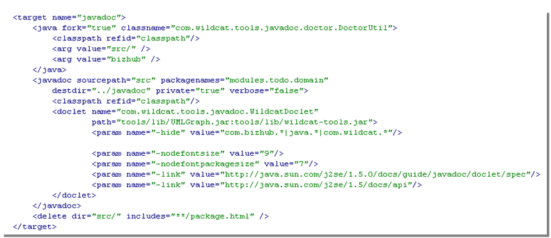

## Maven Targets

Specific to the Java implementation of Skyve, Skyve projects a number of Maven target utilities to assist
developers.

### Generate Domain

The *generateDomain* target will validate
the application model and generate domain classes. The *generateDomain*
target parameter is the path to the src folder being validated (normally
"src/").

### Generate a Default Edit View

To save time, it can be useful when creating a custom view to start with
the default view as Skyve would generate for a document on-the-fly.

The target will prompt for the customer, module and
document arguments.

When you run the target, a file generatedEdit.xml will be created within the _views_ package within the specified document package.
If no document is specified, the target will generate edit views for all documents within the module.

### Javadoc

Skyve provides a javadoc target which generates a documentation set
incorporating:

-   doc metadata attributes as specified in the Skyve metadata,
-   generic javadoc, and
-   logical model graph, generated using graphviz "dot" application.

To ensure that graphviz can generate model graphs, ensure that
..\\Graphviz\\bin is in your environment path.

Custom javadoc can also be created using the usual doclet interface.

The javadoc utility includes a combination of the application metadata
formatted and combined with the embedded documentation.

_Example of formatted application specification combining metadata and embedded documentation_

Skyve includes documentation attributes at every level of application
metadata.

Users can include basic html-style documentation within the metadata
"doc" attributes. The utility assembles this html and combines it with
self-describing metadata (like tool-tip definitions already embedded in
the metadata), according to the concepts inherent in the platform.

The utility creates a full documentation set including:

-   Titles,
-   Overviews,
-   Indexes and Table of Contents for each section,
-   Automatic numbered references for each section, table and figure,
-   Internal links, and
-   External links.

Because the utility generates documentation for every part of the
application specification, it encourages developers and technical
writers to be thorough and cover all aspects of the application they are
documenting.

_Customise the javadoc task to specify the package and destination directory_

**[⬆ back to top](#contents)**

---
**Next [Content Repository Tools](./../_pages/content-repository-tools.md)**  
**Previous [Skyve Perstistence Mechanisms](./../_pages/skyve-persistence-mechanisms.md)**
