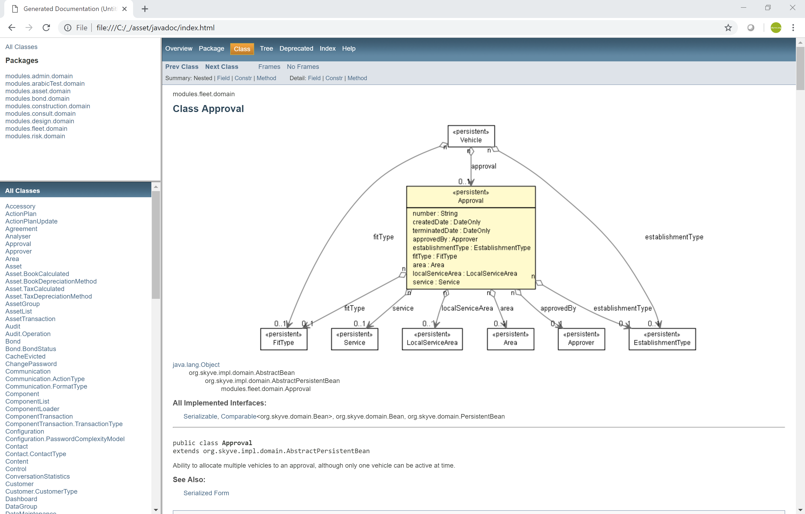
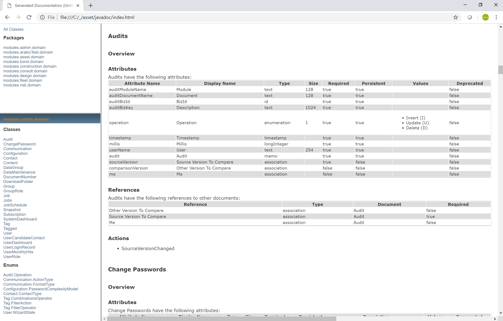

## Maven targets

Specific to the Java implementation of Skyve, Skyve projects a number of Maven target utilities to assist
developers. The Maven targets provided can be customised where required.

#### generateDomain
`mvn skyve:generateDomain`
Generate domain validates and compiles the metadata (XML files) in your project and checks that the application domain is in a valid state. Errors for the developer to fix are written to your console, and if generate is successful, the domain will be compiled to produce Java domain files and unit tests.

#### generateEditView
`mvn skyve:generateEditView`
Generate edit view requires to additional parameters, a `module` and `document` key value pair. If no edit.xml is specified for a document, Skyve will create a scaffolded view automatically using the attributes specified in the document. When customising a view, it is useful to start from that scaffolded view and extend it. This command will write a `generatedEdit.xml` file within the _views_ package of the module and document specified by the parameters.

The target will prompt for the customer, module and document parameters. If no document is specified, the target will generate edit views for all documents within the module.

#### generateDefaultQueries
`mvn skyve:generateDefaultQueries`
Similar to having a scaffolded edit view for new documents, when documents are shown in a list from a menu or in a lookupDescription, the /default query/ will be used which defines which columns are shown. This maven command can write out all the default queries to a file in the project root so any queries can be tweaked and included in your module.xml.

The target will prompt for customer and module.

#### Skyve Script
`mvn skyve:script`
This will look for a file called `skyve.md` inside a script directory in your project root. Any modules and documents found inside this file will be generated and added to your project. For more user feedback, this can also be performed via the UI from admin -> Document Creator.

#### Update resources
`mvn clean compile war:exploded`
Depending on how you configure your Wildfly, if you are not publishing changes during development into `wildfly/standalone/deployments`, you can use this maven command to update your local `/deployments/` directory with the compiled project. Your Wildfly deployment scanner can then be set to watch this location.

#### Local deploy
`man compile war:exploded skyve:touch`
This refreshes your projects `/deployments` directory and creates a `projectName.war.dodeploy` file telling Wildfly to restart the module. This is used when there are any Java or module changes which are cannot be hot-reloaded.

### Updating the Skyve version
To update your project with a specific Skyve version, you'll need to pull/check-out the Skyve project (from https://github.com/skyvers/skyve.git) prior to the following steps, ensuring you pull the specific Skyve version you're after. If in doubt, pull Skyve and check which version is retrieved. Releases are tagged, so it is typically safest to checkout the last tagged commit.

**Warning:** before continuing, make sure your project is under source control, and all files are committed locally. Upgrading a project can change lots of files, and will update your admin module and web resources. Any local changes you have made will be overwritten and need to be merged back in manually.

#### Configuring the assemble target
These instructions apply to projects created using the [Creating a new Skyve Project](#creating-a-new-skyve-project) process above. If you created your project manually, these steps may differ.

- If using Eclipse, create a new Run Configuration target, setting the base directory to your project's workspace, and setting the goal to `skyve:assemble`. Once setup in your pom this can also be run from the command line with `mvn skyve:assemble`.
- In your project's `pom.xml`, update the skyve.version property to match the version of Skyve you pulled/checked out
    - Find the Skyve plugin (search for artifactId `skyve-maven-plugin`) and configure the `<skyveDir></skyveDir>` setting with a relative or absolute path to the Skyve project local drive location (where you pulled to)
    - Set your `<customer></customer>` to match the customer in your project
    - Save your `pom.xml`
- Run the assemble target you have just created, resolving any reported issues
- When successful, run your project's generate domain target, resolving any reported issues
- When successful, run your project's unit tests, checking the upgrade did not interfere with any expected behaviour
- When successful, run your project's generated tests
- Deploy your project locally and sanity check everything still works correctly
- When satisified, commit the changes to your project

### Javadoc

Skyve provides a javadoc target which generates a documentation set
incorporating:

-   doc metadata attributes as specified in the Skyve metadata,
-   generic javadoc, and
-   logical model graph, generated using graphviz "dot" application.

To ensure that graphviz can generate model graphs, ensure that
..\\Graphviz\\bin is in your environment path.

Custom javadoc can also be created using the usual doclet interface.

The javadoc utility includes a combination of the application metadata
formatted and combined with the embedded documentation.

_Example of formatted application specification combining metadata and embedded documentation_

Skyve includes documentation attributes at every level of application
metadata.

Users can include basic html-style documentation within the metadata
"doc" attributes. The utility assembles this html and combines it with
self-describing metadata (like tool-tip definitions already embedded in
the metadata), according to the concepts inherent in the platform.

The utility creates a full documentation set including:

-   Titles,
-   Overviews,
-   Indexes and Table of Contents for each section,
-   Automatic numbered references for each section, table and figure,
-   Internal links, and
-   External links.

Because the utility generates documentation for every part of the
application specification, it encourages developers and technical
writers to be thorough and cover all aspects of the application they are
documenting.

**[⬆ back to top](#maven-targets)**

---
**Next [Content Repository Tools](./../_pages/content-repository-tools.md)**  
**Previous [Skyve Perstistence Mechanisms](./../_pages/hierarchies.md)**
