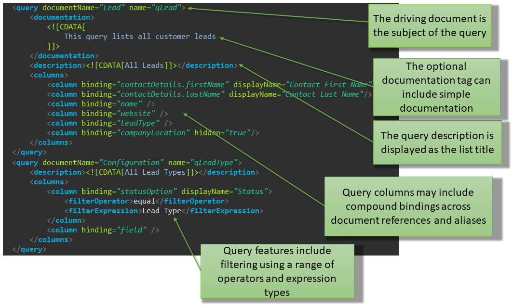

## Modules

Modules define self-contained application pieces and correspond to menus
within the system accordion menu pane. The repository/apps folder
contains all application metadata and code, organised as application
modules.

Each module folder contains a `module.xml` manifest file (declaring the
existence of the module components including jobs, documents, queries,
roles and menus) document packages (one package per document) and a
domain folder (which contains the generated domain classes).

Code in the domain folder is never manipulated by the developer
directly; all application changes are done via metadata and API-level
code.


The `module.xml` file is located in the top level directory of the
module and defines the following:

  Attribute/Section | Definition
  ----------------- | ----------
  name              | The name used by the developer to define and distinguish the module.
  title             | The title of the module as presented in the user interface.<br>The module title will be the label shown on the accordion pane containing the module menu.
  homeRef           | Whether the homeDocument (see below) will open in list or edit view.<br>This attribute is optional - if not included Skyve assumes a homeRef of *list* (i.e. a list view rather than a detail view).
  homeDocument      | The document which will open by default when the module is accessed by the user.
  documents         | The list of documents.<br>Documents may be persistent or transient. Each persistent document maps to a database table. (Transient documents exist only in memory.)
  queries           | The queries referenced within the application metadata.<br>Each list view is based on a metadata query specified in the `module.xml` and any queries referenced within document metadata (e.g. for collections or references) must be declared here. Skyve will generate default queries for each document unless a specific metadata query is declared.
  roles             | The user roles specified for the application.<br>Each role specifies permission levels for each document and actions which that role is permitted to execute.
  menu              | The menu specifies which menu items are applicable for each role specified in the roles section.

_Module.xml sections_

## Defining the `module.xml`

### Module header

An example module header is provided below. Note the key attributes of
*schemaLocation*, name, title *homeRef* and *homeDocument*.

```xml
<?xml version="1.0" encoding="UTF-8" standalone="yes"?>
<module name="admin" title="Admin" xmlns="http://www.skyve.org/xml/module" xsi:schemaLocation="http://www.skyve.org/xml/module ../../schemas/module.xsd"
	xmlns:xsi="http://www.w3.org/2001/XMLSchema-instance">
	<homeRef>edit</homeRef>
	<homeDocument>Welcome</homeDocument>
	<documents>
```
_Figure 18 - Module definition header_

_In this example, the home (or default) target for the module is the edit view of the Welcome document._

## Documents

The `module.xml` includes declarations for each document.

If documents from another module are referenced, the source module must
be nominated as *moduleRef*. Document privileges and scoping is always
only defined in the home module, to avoid the potential of conflicting
scoping or permissions.

```xml
<?xml version="1.0" encoding="UTF-8" standalone="yes"?>
<module name="todo" title="ToDo" xmlns="http://www.skyve.org/xml/module" xsi:schemaLocation="http://www.skyve.org/xml/module ../../schemas/module.xsd"
	xmlns:xsi="http://www.w3.org/2001/XMLSchema-instance">
	<homeDocument>ToDo</homeDocument>
	<documents>
    <document ref="Project" />
    <document ref="ToDo" />
    <document ref="Version" />
    <document ref="Contact" moduleRef="admin" />
    <document ref="User" moduleRef="admin" />
  </documents>
  <queries>
```

_`moduleRef` indicates the documents are originally declared in another module._

Documents listed in the `module.xml` may reference documents from other
modules (*moduleRef*) or are matched with document packages within the
module folder.


## Queries

The `module.xml` file can include definitions of queries used in the
application. Queries declared in the `module.xml` are called *metadata
queries* to distinguish them from other queries which may exist as views
on the database server or as unsecured SQL strings within developer code.

Each document can specify a *defaultQueryName* - which is the name of
the metadata query to use by default wherever lists of document
instances may be required (e.g. lists and lookups for document
references).

If a query name is not supplied Skyve will generate a *default* query which 
will include all columns for all document attributes.

Queries defined in the `module.xml` are also available to developers in
*Bizlet* code. Queries can also be declared as the source for document
attribute associations and collections. When used in this way, the query
determines eligible references for membership in the association or
collection.


## Default Queries

When Skyve generates a query (in the situation where a query is required
but none has been specified), this *default* query will contain all
document attributes for the *driving document* and the *bizKey* value
for all references. Columns will be in the order of document attributes
(as specified in the *document.xml*) with ascending ordering applied to
the first column. All columns will be non-editable inline in the list.

The *default* query for a Document can be specified by setting the 
`defualtQueryName` when specifying documents for your module (the default query 
to use needs to be defined in the queries section for the module). For example:

```xml
<document ref="DocumentNumber" defaultQueryName="qDocumentNumbers"/>
```

## Declaring queries

Skyve metadata queries use object references, rather than SQL.

Metadata queries must specify the *documentName*; the name of the
document which is the subject of the query.

If the query is the basis of a *listGrid*, then double-clicking in the
listGrid will zoom to the *driving document*.




More details are provided in [Queries](./../pages/queries.md)

### Queries for reference attributes

If a query is specified for an association attribute, Skyve will use
that query for association selections in the application user interface.
This can also be overridden by specifying a query in the view.

For an association, the query will be used for record selection in the
view.

For example, selecting a document association normally uses a
*lookupDescription* widget. The *lookupDescription* combo will display a
list of the *bizKeys* of the driving document instances in the same
order as the default query (or ordered by the first column if no query
is specified).


However, *lookupDescription* combos can display multiple columns (as
above) if a query is specified for the *lookupDescription* in the view.

## Roles

The `module.xml` declares roles for the module.

Each role specifies the privilege levels for documents the role will
access (and associated actions). The role name is the name displayed
when assigning roles to user security groups in the admin module.

Roles specified within the `module.xml` are available for selection within
the admin module at run-time.


For each document, the privilege level is specified in terms of C
(Create) R (Read) U (Update) D (Delete) and the
document scope access level, either G, C, D or U. The underscore
character (`_`) means no permission is granted.


For example, a document privilege of CRUDC means the role has access
to *Create*, *Read*, *Update*, *Delete* the document,
and that the document is scoped C (i.e. *Customer*) so for that role,
the document is available to all users within the customer context.

A document privilege of *\_R\_\_U* means that the role will only have
access to *Read* the document. In this case, the
document is scoped U (i.e. *User*), which means that for this role, each
document instance will only be accessible to the user who created it.

Role privileges are applied to all select statements generated
internally by Skyve. This means that privileges automatically apply to
developer code (except for unsecured SQL). The benefit of this is that
developer code does not have to handle security issues and therefore the
developer is not able to make inadvertent security holes.

### Document scope

While document privileges define what type of activities a role may
perform on a document, the document scope defines which document
instances are accessible to that role. As such, document scoping is a
method to provide pervasive row-level security, declaratively.

Document scope criteria are applied to all select statements generated
internally by Skyve. This means that document scoping applies
automatically to developer code (except for unsecured SQL).

Documents may be scoped *Global* (G), *Customer* (C), *DataGroup* (D) or
*User* (U).

*Customer* scope means all data created within the customer context is
accessible for that role.

A *Global* scope entitles the role to access data across all customers - 
this is useful for reference documents like Post Code lists which can be
shared across customers within the Skyve instance.

*DataGroup* scope means that the role only has access to data created
within the same *DataGroup* context as the user.

A *User* scope means that for that role, only data created within a
user's context can be viewed by that user.

## Worked Example

### Requirement

An application must allow each user to create and manage but not delete
their personal preferences securely, while allowing administrators to
maintain read, update and delete but not create preferences.

### Implementation

The `module.xml` declares two roles, User and Administrator:


The user is assigned privileges (CRU\_U) to create, read and update their own (i.e user-scoped) personal preference document.

The administrator role has privileges (\_RUDC) to documents within the customer scope.

### Results

Skyve will guarantee the no user activity or developer code can bypass
the declared permissions.

Users can only access document instances within their user scope, while
administrators have access to all personal preference document instances
within the customer context.

If a user is given both roles, the privileges are added and result in
(CRUDC) which equates to all privileges within the customer context.
Administrator users, if they also require personal preferences, are
assigned both roles.

## Role documentation

Role definition can include documentation within a &lt;doc&gt; tag which
is available to the application and to the documentation generation
module (Doctor).


## Menus

The application menu is declared in terms of groups and items. A menu
group is an expandable menu (submenu).


Roles included in the menu item stanza have access to that menu item. If
the menu item specifies a role, then users with that role will see the
menu item.

### Menu item types
Skyve supports a number of multiple-result menu items - _list_, _calendar_, _map_, _tree_.

These item types provide the user with the ability to understand their information within the context it exists. 
For example, a map item shows document instances _spatially_, a calendar shows them _temporally_. In both situations
the purpose of the menu item is to provide contextual and/or searching ability - so that the user is able to identify 
a specific instance and understand the context in which it exists.

For these multiple-result item types, Skyve supports three population approaches: _document_, _query_ and _model_.

The _document_ source type will populate results based on the document _defaultQuery_ (if one is declared). 

If no _defaultQuery_ is declared, Skyve will populate all document instance results the user is allowed to _Read_ 
(according to the document scope). For example, if the document privilege has been declared for the user role as 'CRUDC'
then Skyve will return all results for the customer.

By contrast, if the document privilege has been declared for the user role as 'CRUDU', the all results owned by the user
will be returned (normally the instances created by the user - where the bizUserId = the user Id)

The _query_ source type will populate results based on the specified module query.

The _model_ source type will populate results based on the specified model.   

#### calendar
Partially implemented.

Represents each result instance as a time-period bar within a calendar layout.

Properties:
* _document_ -  if populating instances for all 
* _model_ - if populating instances from a model, the name of the model
* _name_ - the display name of the menu item is it appears in the menu
* _query_ - a specific module query to use to populate results
* _startBinding_ - the date/dateTime attribute binding which represents the start of the time period to be displayed in the calendar for each result
* _endBinding_ - the date/dateTime attribute binding which represents the end of the time period to be displayed in the calendar for each result

#### edit
Navigates the user to a new instance of the specified document.

The Skyve _edit_ view allows a user to interact with a single bean instance and normally, a user will
navigate to the _edit_ view from a _list_ view which sets the context. When the `edit` view is provided as a menu item, the user has no way of setting the context, as they do not navigate to the view from a list, and so Skyve implicitly creates a new bean instance for the view.

Alternatively, if the document is transient and not persisted, then the developer can
rely on the implicit creation of a new bean, and override the _newInstance()_ to set bean default values.


Properties:
* _document_ -  if populating instances for all 
* _name_ - the display name of the menu item is it appears in the menu

#### group
A group is an expandable menu (submenu).


Properties:
* _name_ - the display name of the menu item is it appears in the menu

#### item
This is the abstract type for menu items - not applicable for declaration in the module declaration. 

#### link
Not yet implemented

#### list
Represents a list/grid of instances.

Properties:
* _document_ -  if populating instances for all 
* _model_ - if populating instances from a model, the name of the model
* _name_ - the display name of the menu item is it appears in the menu
* _query_ - a specific module query to use to populate results


#### map
Represents instances spatially on a map.

Properties:
* _document_ -  if populating instances for all
* _geometryBinding_ - the attribute geometry binding to use as the basis of locating pins on the map
* _model_ - if populating instances from a model, the name of the model
* _name_ - the display name of the menu item is it appears in the menu
* _query_ - a specific module query to use to populate results
* _refreshTimeInSeconds_ - the refresh rate of the map (not implemented)
* _showRefreshControls_ - whether to show or hide map refresh controls (not implemented)


#### tree
SmartClient render only.
Represents hierarchical information in a lazy-loaded tree structure.

Properties:
* _autoPopulate_ - whether to populate the tree or use a lazy-loading approach
* _document_ -  if populating instances for all 
* _model_ - if populating instances from a model, the name of the model
* _name_ - the display name of the menu item is it appears in the menu
* _query_ - a specific module query to use to populate results


### Other menu options
For the PrimeFaces render, you can take advantage of PrimeFaces options for menu arrangement within the _template.xhtml_ component.
For example, the default menu behaviour is declared as:
```<div class="#{leftMenu ? 'layout-wrapper layout-menu-static layout-menu-light' : 'layout-wrapper layout-menu-light'}">```


As opposed to the `static-menu`, the `layout-menu-overlay` menu option will leave the menu collapsed at the left until called upon.

While a horizontal behaviour is declared as follows:
```<div class="#{leftMenu ? 'layout-wrapper layout-menu-horizontal layout-menu-light' : 'layout-wrapper layout-menu-light'}">```


For more information and other options refer to the PrimeFaces documentation.

## Module documentation

Module definition can include detailed documentation about the module
within the *&lt;doc&gt;* tag. This documentation is used by the
documentation generation module (Doctor).


## Overriding modules

Module definitions can be overridden to provide a bespoke experience of
the application.

All aspects of the module can be overridden including:

-   inclusion or exclusion of documents,
-   jobs,
-   queries,
-   roles,
-   document scoping, and
-   menus (structure, names and targets).

To override a `module.xml`, place the overriding `module.xml` file into
the customer package.


As the `module.xml` file is a single artefact, it must contain all
elements of the module available for the bespoke experience and not
simply the components that differ. This is because the module override
can be subtractive, by not including elements contained within the
generic module.

## Java implementation

Java classes are contained within the domain folder situated within the
module package.


The domain folder includes a Hibernate object-relational mapping
definition file for the module, named *&lt;module&gt;\_orm.hbm.xml*, as
well as classes for all module documents.

Where the `module.xml` is overridden for a customer within a
multi-tenant paradigm, a mapping file will be generated into the
customer module override folder, within the customer package.

All domain classes are regenerated by the *generateDomain* ant task and
should not be modified in any way by developers. However, inspection of
the domain classes can be a useful process to analyse validation
problems within the module.

## The Skyve administration (admin) module

The Skyve admin (administration) module is a module provided as part of the Skyve platform, however
it is able to be customised if required according to the methods described above (as for any other 
Skyve module).

In particular the admin module provides basic roles for common user profiles who interact with admin
module features, such as managing contacts and users.

### Admin module roles

  Role | Description | Comments
  -----|-------------|-----------
  Anonymous | Anonymous (not logged in) access public features. | 
  AppUser | Manage own contact details and password. | The App User role is intended for retail and public users interacting through the "front office". These users are assumed to operate within their own scope and have only visibility to their own data. App Users can create their own contacts, and change their own passwords.			
  AuditManager | Manage the activity audit log. | 
  BasicUser | General access to the administration module. | The intention of Basic User role is to provide basic capability to back-office users. The role is for a typical office situation where users collaborate within the "Customer" scope on key application areas. For example, shared contact management, common document number serials and the ability to use Skyve's basic personal efficiency and automation capabilities, Tags, Snapshots, Communication and view dashboards.			
  ContactManager | Manage contact details and interactions. | Allows control over management of, and interaction with all contacts for the user's customer.
  ContactViewer | View-only access to contact details. | 
  DevOps | Generate Skyve designs and metadata and administer technical aspects of the Skyve runtime. | 
  JobMaintainer | Maintain Jobs. | Permission to schedule jobs and review job progress.
  SecurityAdministrator | Allows administration of Users and Groups. | This role has the ability to add new users, configure groups and modify existing users's permissions. All Skyve applications should have at least 1 user with this role.
  ViewUser | View-only access to the administration module.| The view user is intended as a read-only office user, with visibility as per Basic User role.

_admin module role definitions_

The following summaries provide a basic overview of the role combinations provided by the admin module
however for specific details of privileges, view the admin module xml declaration file directly.


### Prototype mode

To assist in rapid development and prototyping, Skyve provides a `prototype` option for modules which changes a number of default Skyve behaviours. Developers should note that the `prototype` option is designed to provide indicative results that may not necessarily provide optimal performance.

The two key differences `prototype` mode introduces are:
 - inclusion of association/reference columns in *default* queries (i.e. where no `defaultQueryName` is specified, Skyve will include columns for associations, displaying the bizKey value for the associated bean)
 - inclusion of content items in *default* queries as thumbnails

To declare `prototype` mode, add `prototype="true"` to the module declaration as follows:
```xml
<module name="admin" title="Admin" xmlns="http://www.skyve.org/xml/module" xsi:schemaLocation="http://www.skyve.org/xml/module ../../schemas/module.xsd"
	xmlns:xsi="http://www.w3.org/2001/XMLSchema-instance"
	prototype="true">
```

**[⬆ back to top](#modules)**

---
**Next [Documents](./../_pages/documents.md)**  
**Previous [Customers](./../_pages/customers.md)**
