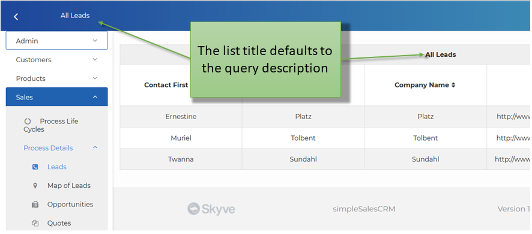
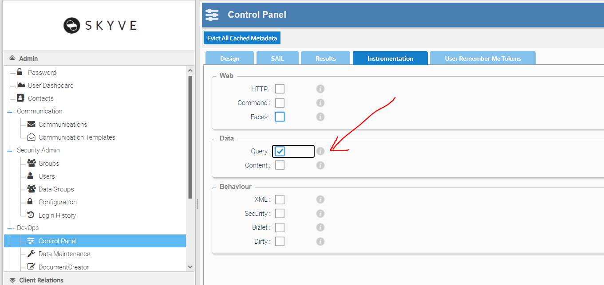

One of the great things about Skyve is that Skyve's Persistence automatically manages your SQL datastore and automatically issues SQL to retrieve data for basic Create, Read, Update and Delete operations, according to the privileges and scoping declared in your module.xml, even where you have declared complex relationships with references across several documents.

If a query name is not supplied, Skyve will generate a *default* query which will include all columns for all document attributes.

However, in some cases it is useful to declare the query in the module so that it can be more tightly customised or parameterised for your application.

Queries are declared in the module to maximise re-use throughout the application.

As described in [Modules](./../pages/modules.md), the `module.xml` file can include definitions of queries used in the application. Queries declared in the `module.xml` are called *metadata queries* to distinguish them from other queries which may exist as views on the database server or as unsecured SQL strings within developer code.

Each document can specify a *defaultQueryName* - which is the name of the metadata query to use by default wherever lists of document instances may be required (e.g. lists and lookups for document references).

## Declaring queries

Skyve metadata queries use object references, rather than SQL, and queries can include content columns (for images or attachments) as well as simple data values.

In Skyve, a query is a definition of a projected tabular set of results along with filter criteria - where the expressions are relative to a defined driving document. So Metadata queries must specify the *documentName*; the name of the _driving_ document.

If the query is the basis of a *listGrid*, then double-clicking in the listGrid will zoom to the *driving document*.




The evaluation engine knows when to inner and outer join based on the _requiredness_ as specified in the document metadata.

To improve performance, Skyve will defer instantiation of domain objects unless necessary - producing a list of mapped objects that implement the given domain interface. 

Non-persistent values can be projected (as well as persisted or database values) and the evaluation engine will load the domain objects behind the scenes only if necessary.

However you can also declare queries using bizQL (derived from [Hibernate Query Language](https://docs.jboss.org/hibernate/orm/3.3/reference/en/html/queryhql.html) and SQL.

### Query column definition

  Query column attributes | Description
  ----------------------- | -----------
  binding                 | The document value to be shown in the query column.<br>A compound binding can be used where the value to be shown is in a related document.
  displayName             | An alias for the query column.<br>If no displayName is specified in the query, the list column title will be the displayName specified for the document attribute.
  editable                | Whether the column is editable in the list view inline.<br>By default editable is set to true and must be set false if the column binding points to a non-persistent attribute.
  escape				  | Whether the value of the column (which might contain HTML, etc) should be escaped
  expression              | A valid HQL expression which defines the value to be shown in the list column.
  filterable              | Whether a filter can be applied to this column in the list view. This must be set false if the column binding points to a non-persistent attribute.
  filterExpression        | A literal value or one of a number of implicit parameter expressions (shown below).
  filterOperator          | The operation to use with the filterExpression (operators shown below).
  hidden                  | Whether the query column will be hidden by default in a list view.<br>Hidden columns are hidden by default, but can be un-hidden by the user unless the column has projected=false.
  name                    | You can include calculated or derived values in a query however you must create a non-persistent field in the driving document to hold the value. The *name* is the name of the non-persistent document field which holds the calculated value.<br>Note that the name must correspond to a transient (i.e. non persistent) field in the document which describes other aspects of the expression result (such as type, length, display format etc.).
  projected               | Whether the column will exist in the result set.<br>By default all query columns are projected unless this attribute is *false*.
  sanitise				  | Whether the value of the column (which might contain HTML, etc) should be sanitised.
  sortable                | Whether the query can be sorted by this column in the list view. This must be set false if the column binding points to a non-persistent attribute.
  sortOrder               | The sorting order (ascending or descending) to use by default when this query is displayed.<br>If the column is sortable, the user will be able to re-sort the list results.

_Implicit parameter expressions_

Skyve provides a number of implicit parameter expressions to be used for filtering:

* `{CONTACTID}` - the id of the contact who is the current user
* `{CUSTOMER}` - the name of the customer context in which the current user operates
* `{DATAGROUPID}` - the id of the data group of the current user<li>{DATE} - current date
* `{DATE}` - current date
* `{DATETIME}` - current date and time
* `{USERID}` - bizId of the current user
* `{USER}` - the userName of current user
* `{USERNAME}` -  the name of the current user contact

_Filter operators_

* `equal`
* `notEqual`
* `greater`
* `less`
* `greaterEqual`
* `lessEqual`
* `like`
* `notLike`
* `notNull`
* `isNull`
* `nullOrEqual`
* `nullOrNotEqual`
* `nullOrGreater`
* `nullOrLess`
* `nullOrGreaterEqual`
* `nullOrLessEqual`
* `nullOrLike`
* `nullOrNotLike`

Developers can of course use their own parameters and provide parameter values using the `DocumentQuery` interface.

_Query column definitions_

Driving documents can be the subject of many queries.

### Content query columns

Skyve also provides a `content` column type for content items (images and file attachments). The `content` column type has the following attributes:

 Content column attributes | Description
 --------------------------|-------------
 alignment                 | either left, right or centre
 display                   | either `thumbnail` or `link` - displays either a thumbnail of the image, or file type icon, or a download link for the content item
 displayName                | the column name for the column
 emptyThumbnailRelativeFile | the relative file to display if the content item produces an empty thumbnail
 hidden                     | whether the column is hidden by default
 pixelHeight                | the height of the thumbnail in pixels
 pixelWidth                 | the width of the thumbnail in pixels
 sortOrder                  | The sorting order (ascending or descending) to use by default when this query is displayed.


### Filter parameters

Remember that in many cases, you do not need to declare any query in the module and Skyve will automatically determine a "default" query for a document to drive lists, grids and `lookupDescription` selection.

You can also then apply `filterParameters` to `listGrid` and `lookupDescription` widgets in views without having to create specific queries for this purpose. 

```xml
<listGrid continueConversation="true" query="qCoach">
	<filterParameter operator="equal" filterBinding="team" valueBinding="selectedTeam"/>
</listGrid>
```

`filterBinding` is the binding expression relative to the driving document of `qCoach` and `valueBinding` is the binding expression relative to the bean on which the view is based.

Here, the `filterParameter` is applied _in addition_ to any filtering declared in the query (or to the default query inferred by Skyve where no query is explicitly declared).

Note that the `filterParameter` can refer to document attributes (or database columns) that are not included in the projected columns explicitly declared in the query. So, in the above example, the `filterBinding` _team_ can be used even if the _selectedTeam_ attribute is not one of the columns declared in the query. 

Note also that in the above example, _project_ may be an association type attribute.

To filter the `listGrid` in a view using the bean on which the view is based, use the `bizId` attribute as the `valueBinding`. Using the above example, if the listGrid appeared in a view based on a _Team_ document, to filter the list of _Coach_ for those related to the current Team would be as follows:

```xml
<listGrid continueConversation="true" query="qCoach">
	<filterParameter operator="equal" filterBinding="team" valueBinding="bizId"/>
</listGrid>
```

## Basic query example

The following query is used to retrieve details of _Users_. 

```xml
<query documentName="User" name="qUser">
	<description><![CDATA[Users]]></description>
	<columns>
		<content display="thumbnail" binding="contact.image" escape="false" />
		<column binding="username" />
		<column binding="contact.name" sortOrder="ascending" />
		<column binding="createdDateTime" hidden="true"/>
		<column binding="inactive" />
	</columns>
</query>
```

The above query is declared for the _User_ document - by convention we suggest naming the query beginning with `q` - `qUser` or `qUsers` etc.

If this query is used as the basis of a module menu item or a `listGrid`, the resulting list will enable navigation to _User_ records via the double-click/zoom gesture.

The `<content>` column will show a thumbnail of the user's contact image, from the thumbnail cache managed automatically by Skyve.

Because the query includes columns with bindings like `contact.name`, Skyve will generate SQL (via Hibernate) to `join` the _Contact_ database table.

The column for _createdDateTime_ is hidden, meaning that by default it will not appear in a list based on this query, but in desktop mode, users can opt to include this column at run-time if required.

### Basic metadata filtering

To filter the query to only include users that are not _inactive_, you can change the column declaration as follows:

```xml
<column binding="inactive">
	<filterOperator>nullOrEqual</filterOperator>
	<filterExpression>false</filterExpression>
	<projected>false</projected>
</column>
```

The `filterOperator` _nullOrEqual_ handles the case that the boolean value may not yet be set.

The `filterExpression` is the expression used by the `filterOperator` and in this case is the boolean value _false_

The `projected` element may be optionally included so that the column (which because of the filter will always be either null or false) is not included in the projected columns returned by the query - whereas the `hidden` attribute means that the column is not included in lists by default but can be selected for inclusion by the user at run-time. 

### Metadata declaration versus other methods

Using Skyve's metadata approach to declaring queries offers a number of advantages. 

* Metadata queries are non-dialect specific, and so applications can be ported across different SQL implementations.
* Metadata queries are subject to XML validation as well as Skyve's domain validation to prevent simple inadvertent transcription and syntax errors.

However, there are circumstances where more direct query methods are convenient to take advatage of more sophisticated filter expressions and even dialect-specific performance or capability advantages.

### Including a filter element

You can also include a filter element in the query definition and express your filter directly. 

Filtering expressions and bizQL are based on [Hibernate Query Language](https://docs.jboss.org/hibernate/orm/3.3/reference/en/html/queryhql.html).

Using the `filter` element can be useful for convenience and is added to the `where` clause as is, in addition to any implicit filtering performed automatically by Skyve or expressed using other filter operators.

The following queries are equivalent:

```xml
<query documentName="User" name="qActiveUser">
	<description><![CDATA[Users]]></description>
	<columns>
		<content display="thumbnail" binding="contact.image" escape="false" />
		<column binding="username" />
		<column binding="contact.name" sortOrder="ascending" />
		<column binding="createdDateTime" hidden="true"/>
		<column binding="inactive">
			<filterOperator>nullOrEqual</filterOperator>
			<filterExpression>false</filterExpression>
			<projected>false</projected>
		</column>
	</columns>
</query>
```

```xml
<query documentName="User" name="qActiveUser">
	<description><![CDATA[Users]]></description>
	<filter>
		<![CDATA[
			bean.inactive is null or bean.inactive = false
		]]>
	</filter>
	<columns>
		<content display="thumbnail" binding="contact.image" escape="false" />
		<column binding="username" />
		<column binding="contact.name" sortOrder="ascending" />
		<column binding="createdDateTime" hidden="true"/>
	</columns>
</query>
```

Here, the driving document is _aliased_ as `bean` by Skyve, and so filter expressions must include that alias (hence `bean.inactive`).

Note that the `filter` element can be used in combination with other filter operators, for example in combination with the column `filterOperator` and `filterExpression`.

For comparison, the following is an equivalent way of retrieving active users using the DocumentQuery interface.

```java
DocumentQuery qActiveUser = CORE.getPersistence().newDocumentQuery(User.MODULE_NAME, User.DOCUMENT_NAME);
qActiveUser.getFilter().addNullOrEquals(User.inactivePropertyName, Boolean.FALSE);

List<User> activeUsers = qActiveUser.beanResults();
```

However using the DocumentQuery method loads beans, not MapBeans.

### Including a from element

You can override the usual query behaviour to include other documents that may or not be directly related to the driving document by including a `from` element in the query declaration, and aliasing the documents. The documents must be declared using the `{module.Document}` naming convention.

Whereas the `filter` element will be _in addition_ to any implicit filtering by Skyve (i.e. added to the implied `where` clause), the `from` element replaces the implied `from` clause of the underlying query.

The following example returns the support tickets associated to the current user (using the `{USERID}` implicit parameter). The `from` clause is used to include the associated _CustomerAgreement_ document so that the `filter` element can check if the current user is a _member of_ the `supportUsers` collection under the agreement.

```xml
<query name="qClosedClientSupportTicket" documentName="SupportTicket">
	<description>Closed Support Tickets</description>
	<from>
		<![CDATA[
			{support.SupportTicket} as bean
			, {crm.CustomerAgreement} as ca
			, {admin.User} as u
		]]>
	</from>
	<filter>
		<![CDATA[
			bean.status in ('closed') 
			and bean.agreement.bizId = ca.bizId
			and u MEMBER OF ca.supportUsers
			and u.bizId = {USERID}
		]]>
	</filter>
	<columns>
		<column binding="ticketNumber" sortOrder="descending"/>
		<column binding="user.contact.email1" editable="false" />
		<column binding="priority" pixelWidth="200"/>
		<column binding="title" />
		<column binding="toDoStatus" editable="false" pixelWidth="150"/>
	</columns>
</query>
```

In the above example, _SupportTicket_ document in the _support_ module is the driving document and is aliased as `bean`.

### Using bizQL

In some cases, it may be convenient to specify the query using bizQL directly, rather than XML metadata.

In this example, the query retrieves _ContentAudit_ beans where a specified _instanceId_ is not one of the items in the _syncedInstances_ collection.

```xml
<bizQL name="bizqlGetNextUnsychronisedContentAudit">
	<description>Gets all unsynchronised content audits.</description>
	<query>
		<![CDATA[
			SELECT bean
			FROM {admin.ContentAudit} AS bean
			WHERE NOT EXISTS (
				SELECT li
				FROM {fsp.LocalInstance} AS li
				WHERE li IN ELEMENTS(bean.syncedInstances) 
					and li.idinstance = :instanceId
			)
			ORDER BY bean.millis
		]]>
	</query>
</bizQL>
```

The above query can then be referenced by developers as follows:

```java
BizQL bizQL = CORE.getPersistence().newNamedBizQL(ContentAudit.MODULE_NAME, "bizqlGetNextUnsychronisedContentAudit");
bizQL.putParameter("instanceId", instanceId);
bizQL.setMaxResults(1);
```

### Using SQL

If required, you can also declare queries using SQL (and a specific SQL dialect). In this case the SQL may be dialect-specific and your application may not function when used on other database types.

```xml
<sql name="qInspectionReportModel">
	<description>This query backs the FoodAct InspectionReportModel. If this query changes, the
		model class will need to also be updated.</description>
	<query>
		<![CDATA[
			SELECT 'Number of Businesses' as type
			    , sum(case when foodActPriority = 'P1' then 1 else 0 end) as P1 
			    , sum(case when foodActPriority = 'P2' then 1 else 0 end) as P2 
			    , sum(case when foodActPriority = 'P3' then 1 else 0 end) as P3 
			    , sum(case when foodActPriority = 'P4' then 1 else 0 end) as P4 
			    , sum(case when foodActPriority is not null then 1 else 0 end) as Total
				, 1 as ordinal
			FROM FSP_Audit a
			INNER JOIN FSP_AuditType t
			    ON a.auditType_id = t.bizId
			WHERE t.auditTypeName IN ('Vehicle', 'Surveillance', 'Unannounced', 'Initial')
				AND inspectionDate >= :inspectionDateFrom
				AND inspectionDate <= :inspectionDateTo
			
			UNION
			
			SELECT 'Inspections Conducted' as type
			    , sum(case when foodActPriority = 'P1' then 1 else 0 end) as P1 
			    , sum(case when foodActPriority = 'P2' then 1 else 0 end) as P2 
			    , sum(case when foodActPriority = 'P3' then 1 else 0 end) as P3 
			    , sum(case when foodActPriority = 'P4' then 1 else 0 end) as P4 
			    , sum(case when foodActPriority is not null then 1 else 0 end) as Total
				, 2 as ordinal
			FROM FSP_Audit a
			INNER JOIN FSP_AuditType t
			    ON a.auditType_id = t.bizId
			WHERE t.auditTypeName IN ('Vehicle', 'Surveillance', 'Unannounced', 'Initial')
				AND inspectionDate >= :inspectionDateFrom
				AND inspectionDate <= :inspectionDateTo
			
			ORDER BY ordinal
		]]>
	</query>
</sql>
```

In this example, the query depends on parameters `inspectionDateFrom` and `inspectionDateTo`, supplied when the query is used as follows:

```java
SQL sql = CORE.getPersistence().newNamedSQL(FoodAct.MODULE_NAME, SQL_QUERY_NAME);
sql.putParameter("inspectionDateFrom", dateFrom);
sql.putParameter("inspectionDateTo", dateTo);
```

### Using MEMBER OF

In this example, _Provider_ has a collection of _ServiceType_ called `servicesProvided`.

The query below filters _JobRequest_ items by _serviceType_, so that any of the service types that are in the Provider's collection are included, filtered for Providers where the _providerUser_ is the current user.

```xml
<query documentName="JobRequest" name="qAvailableJobRequests">
<description><![CDATA[Show only Job Requests that match the Services provider by this Provider.]]></description>
	<from>
        <![CDATA[
           {tradie.JobRequest} as bean, {tradie.Provider} as p 
        ]]>
     </from>
     <filter>
		<![CDATA[
			bean.serviceType MEMBER OF p.servicesProvided 
            and p.providerUser.bizId = {USERID}
		]]>
	</filter>
	<columns>
		<column binding="urgency" sortOrder="ascending" />
		<column binding="address" />
		<column binding="description" />
		<column binding="serviceType" />
	</columns>
</query>
```

The following example return users with the selfRegistrationGroup

```xml
<query documentName="User" name="qPendingApprovalUsers">
	<description>Users not yet approved</description>
	<from>
		<![CDATA[
			{admin.User} as bean, {admin.Group} as g, {admin.Configuration} as config
		]]>
	</from>
	<filter>
		<![CDATA[
			g MEMBER OF bean.groups
			and config.userSelfRegistrationGroup.bizId = g.bizId
		]]>
	</filter>
	<columns>
		<column binding="bizKey" />
		<column binding="createdDateTime" />
	</columns>
</query>		
```

### Other examples

This example filters the list of _People_ for those who do not have any _Schedule_ in the _currentTerm_, where _currentTerm_ belongs to the _General_ document.

```xml
<filter>
	<![CDATA[
	bean not in (select schedule.person 
					from {swimSchool.Schedule} as schedule
					, {swimSchool.SwimClass} as swimClass
					, {swimSchool.General} as general
					where swimClass = schedule.parent
					and swimClass.term = general.currentTerm 
					)
	]]>
</filter>
```

In this example, _Agreement_ has a `child` collection of _Task_. 

The `filter` element below filters for _Agreement_s that are current (_endDate_ is null or greater than or equal to the current date), and where there are active _Task_s (_inactive_ is null or equals false) that are members of the child collection (_parent_ = bean).

```xml
<filter>
	<![CDATA[
	(bean.endDate is null or bean.endDate >= {DATE})
	and exists (select bizId 
					from {business.Task} as task
					where (task.inactive is null or task.inactive=false)
					and task.parent = bean
					) 				
	]]>
</filter>	
```

_Users with a role_

This example shows how to retrieve all users with a specific role in the application.
(Users may have a Role assigned directly, or by being assigned a Group which has the Role.)

```xml
<query documentName="User" name="qUserWithRole">
	<description>Users with Basic User role</description>
	<from>
		<![CDATA[
			{admin.User} as bean
		]]>
	</from>
	 <filter>
    	<![CDATA[
    		bean.bizId in (select ur.parent.bizId 
    				from {admin.UserRole} as ur 
					where ur.roleName = 'admin.BasicUser')
			or bean.bizId in (select u.bizId
					from {admin.User} as u, {admin.Group} as g, {admin.GroupRole} as r
					where r.roleName = 'admin.BasicUser'
    				AND g MEMBER OF u.groups
					AND r.parent = g.bizId)
		]]>
	</filter>
	<columns>
		<column binding="bizKey" sortOrder="ascending" />
	</columns>
</query>         
```

## Debugging

Where direct expressions like bizQL or SQL are used for queries, Skyve offers trace options to assist developers debug their application queries.

The project `.json` file includes tracing options for `query` and `sql`.

```json
// Trace settings
"trace": {
	// XML metadata parsing
	"xml": false,
	// HTTP request attributes and parameters
	"http": false,
	// queries performed
	"query": true,
	// MVC command debug
	"command": false,
	// JSF inner workings
	"faces": false,
	// generated SQL statements
	"sql": true,
	// content manipulation
	"content": false,
	// application security denials
	"security": false,
	// bizlet callbacks
	"bizlet": false,
	// mutations in domain objects
	"dirty": false
},
```

`query` tracing will log the HQL generated by Skyve to the server log or developer console, for example:

```SQL
SELECT count(bean.bizId) as bizId, min(bean.bizFlagComment) as bizFlagComment FROM adminUser as bean 
```

`sql` tracing will log the SQL generated by Hibernate to the server log or developer console, for example:

```SQL
select count(adminuser0_.bizId) as col_0_0_, min(adminuser0_.bizFlagComment) as col_1_0_ from apps.ADM_SecurityUser adminuser0_
```

If `query` tracing was not specified at deploy-time, a user with `DevOps` role can turn it on at run-time via the deskop mode. This will turn on both `query` and `sql` tracing.



---
**Next [Inheritance](./../_pages/inheritance.md)**<br>
**Previous [Views](./../_pages/views.md)**