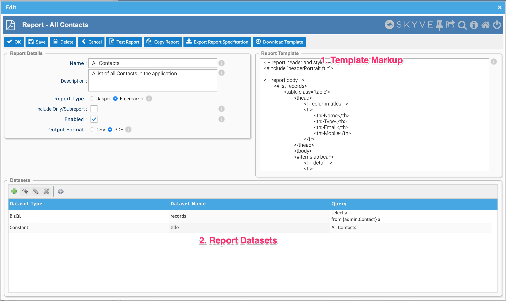
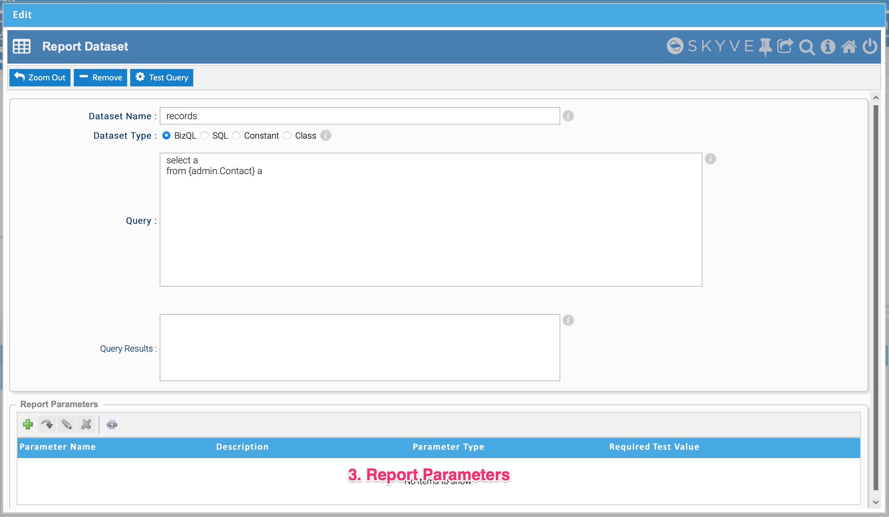
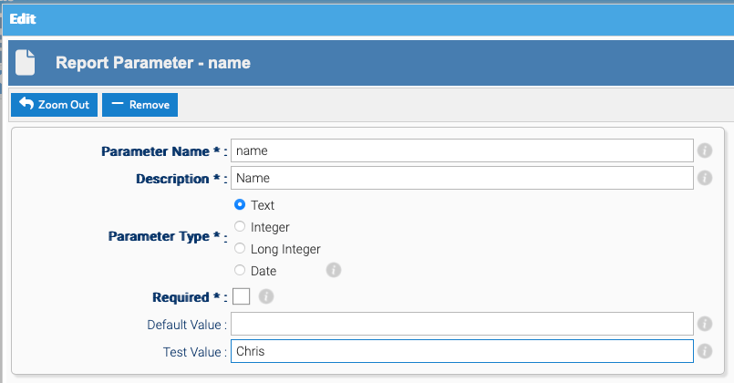

While using Desktop Mode, Skyve provides extensive ad-hoc reporting functions 
via the export capabilities available within every *listGrid* and list view. 
However, where highly formatted reports are required, Skyve provides two choices 
of built-in reporting technologies; Jasper Reports and Freemarker.

This chapter is not intended as a training course to make you a professional report 
template designer, but to provide some tips to get you started. 

## Custom reports

You can of course use any reporting solution to create reports against your application 
data store, however to integrate reporting into your Skyve application, by default Skyve 
supports the inclusion of Jasper or Freemarker reports.

### Jasper Reports

Jasper reports can be based on a number of data source types, though usually reports are based in SQL. However, Skyve offers a "bean" based data source for reporting, which provides a lot of advantages - particularly for ensuring value formats are consistent with your application.

By convention, Jasper report templates are located within the reports folder of the driving document.


#### The Report Action

Similar to declaring other [Actions](./../_pages/actions.md), Skyve Jasper reports can be 
included in views so they can be executed from a button or within the action bar. Report actions must be declared in a view for reports to be accessible to the user. 

The report action widget has the following parameters:

Report property | Description
 ----------------|------------
 documentName    | the document package where the report template is located
 moduleName      | the module package where the report template is located
 reportName      | the name of the report template
  confirm       | a confirmation message to be displayed requesting confirmation by the user<br><br>If no confirmation message is supplied, no confirmation is requested.
  disabled      | whether the button is shown in a disabled state
  displayName   | the text which will appear on the button
 enabled | whether the button is shown in a enabled state
  iconStyleClass | the icon class to use as the icon for the action using the fontawesom icon style classes - note that special action types (_ok_, _save_, _delete_, _cancel_, _zoomOut_, _remove_, _download_, _upload_, _import_, _export_) have predetermined icons - e.g. "fa fa-file-photo-o" will use the fontawesome ("fa") style class "fa-file-photo-o"
  inActionPanel | controls whether the action button is included in the Action Panel at the top of the view <br><br>If a button is not to be displayed in the *ActionPanel* a button widget will be required elsewhere within the view for the action to be accessible.
  invisible     | whether the action button is invisible
 listReport | whether the report is based on a list 
 modelName | the _model_ used to populate the report
  name          | where multiple actions may refer to the same action but with different options, the name property distinguishes which property set declaration to use (for example, to send different parameters to the same report)
 queryName | the _query_ used to populate the report
  relativeIconFileName | the filename of an icon which will be displayed together with the *displayName* on the button<br><br>        Filenames are usually relative allowing the Skyve overriding mechanism to locate the absolute path to the file based on the context of the user.
 reportFormat | the format in which to deliver the report result (avoids the need for a user to select a format)
  toolTip       | tooltip help to be displayed for the button
  visible       | whether the action button is visible 

And can be delcared in a view as per the following example:

```xml
  <report reportName="WeeklyTimeSheet" moduleName="time" documentName="WeeklyTimesheet"  
        displayName="Preview Timesheet" reportFormat="pdf" >
      <parameter name="ID" valueBinding="bizId" />
  </report>
```

Parameters can be passed to the report, based on local bindings (e.g. `bizId` in the above example)  

- you need to declare these parameters in your jasper report (with the same name -  e.g. "ID" as above)

In your report, you can refer to these parameters like any other value, for example, in an sql based report you can include a query string like this:

```sql
select * from TIME_WeeklyTimesheet where bizId = $P{ID}
```

If you don't have a view defined, then any reports in the "reports" folder will automatically be given a button in the auto-generated view, but obviously you'll need to declare a view (and the report action) if you want to specify parameter bindings.

Skyve provides the *generateEditView* run configuration to generate a default view definition. You can then add the required report actions to the action section or parameters as required.

By default, report actions are displayed with the printer icon.


To ensure all reports are valid and can be run, compile the reports using the Eclipse Jasper Report Designer plug-in.

When reports are requested by the user (using the report action button), Skyve will offer the user a choice of formats in which the report will be rendered.


It is the responsibility of the report designer to consider the implications of the user selecting a format which the designer has not catered for.

Alternatively, a report format can be specified in the report action declaration, avoiding the need for a user to select a format.

#### Automatic customer resource parameter

Skyve automatically passes a contextual parameter named *RESOURCE\_DIR*
containing the location of the customer resource folder to the reporting
engine, evaluated at run-time.

This parameter does not need to be declared within the report action
declaration, however Skyve cannot enforce that these parameters are
declared within the report template. If developers wish to make use of
these report parameters they must ensure they are declared within the
report template.

The parameter *RESOURCE\_DIR* is evaluated at the time the report is
requested by the user (i.e. at run-time).

As this parameter points to the central repository for customer
resources, it is useful for logo files and other images and objects
which might be part of highly formatted reports. By passing the specific
customer resource location (evaluated at run-time) references to these
types of items can be used generically for all customers.

#### Object "bean" data source

Skyve provides an object data source which can be used in place of SQL
as the driving query for the report. The object data source provides the
state of the beans in memory, whereas SQL queries will only return
persisted (i.e. saved) values.

If the bean passed to the report has collections, these can be used as
the basis for grouped detail rows, as with SQL data sources.


### Freemarker Reports

Skyve applications (from version 8.0.0 onwards) provide an alternative report engine based on the Freemarker tempalte language. While it does not provide the pixel-perfect precision of Jasper, reports can we written in HTML and have much less of a learning curve.

Freemarker reports also have the benefit of being able to be stored and executed in your application's database, so reports can be created or updated on the fly without needing to redeploy your application.

See the [Freemarker Quick Reference Guide](./../_pages/appendix-freemarker-quick-reference.md) for syntax specific help working with Freemarker report templates.

#### Executing a Report

Freemarker reports stored in the application database can be found within your application's admin module under `Reports -> Reports` when in Responsive Mode. Users require the _admin - BasicUser_ role to view and use this screen.

The list of all enabled reports will appear in this screen. Reports can be executed by zooming into a report and clicking **Download Report**. Users will be prompted for any required paramters here if the template contains any.

#### Scheduling a Report

When zoomed into report (see above), a report can be scheduled by naviating to the _Schedule Details_ tab. This has a similar configuration to scheduling a job, and will email a copy of the report to the specified recipient(s) according to the defined schedule.

### Report Designer

Skyve provides a report design tool as part of the admin module. This allows reports to be created and updated at runtime within the application database.

The Report Designer can be found within your application's admin module under `Reports -> Report Designer` when in Desktop Mode. Users require the _admin - DevOps_ role to view and use this screen.

#### Creating a New Report

From the Report Designer, click the `+` from the list to create a new Report Template. You will be prompted for a name and description for your new report.

If _Jasper_ is selected as the report type, an existing Jasper report definition within the `reports` folder of a module and document can be executed at runtime alongside other Freemarker reports.

If _Freemarker_ is selected, Skyve can _generate_ a new report template definition for you based on a provided module and document, or existing markup can be used.

#### Working with Report Templates

Report Templates are made up of 3 sections:





**1. Template Markup**

This section of the view is where the Freemarker markup is specified. Depending on the output format, this may be HTML markup for a PDF report, or plain text for a CSV report.

**2. Report Datasets**

This defines where your report will aquire its data from. This can be one of:

1. _BizQL_ - The Skyve query language, a starting query will be generated for you if the template was generated
1. _SQL_ - Can be used to write SQL queries against the database directly
1. _Constant_ - Can be used to specify a String constant to be merged into the report, for titles or footers for example within a common report template
1. _Class_ - The fully qualified name of a Java class within your application which supplies data for the report. Classes must implement `BeanReportDataset`

**3. Report Parameters**

If your report dataset is a BizQL, SQL or Class type, it can define parameters (required or optional) which can alter the output of the data being returned by the dataset.

For example, if we had a BizQL query to return all contacts like so:

```sql
select a
from {admin.Contact} a
```

This could take a named parameter to filter the output. We could update it to be:

```sql
select a
from {admin.Contact} a
where name like ':name%'
```

Skyve will detect the named parameter and create a new parameter for you and attempt to guess the data type. Users will be prompted for these parameters when they run it if they are marked as required.



When defining report parameters:

- **Name** - The name of the parameter, this will be used in the query and should be created by Skyve automatically if you include a named parameter in your query body
- **Description** - A description of the parameter, this will be displayed to the user when they run the report to assist them in understanding what the parameter is for
- **Parameter Type** - The data type of the parameter, this will be used to validate the input from the user
- **Required** - Whether the parameter is required to run the report
- **Default Value** - The default value of the parameter, this will be used if the user does not provide a value when running the report
- **Test Value** - A test value to use when testing the report, this will be used to validate the report is working correctly and will only be used in the Report Designer

### Report Manager

As Freemarker report definitions can be stored in an application database, the Report Manager screen allows reports to be exported and imported between environments. This allows reports to be designed and tested locally or in a test environment, then exported and imported into production.

Report definitions are stored as a `json` file, and can be checked into source control to allow the reports to be versioned.

The Report Manager can be found within your application's admin module under `Reports -> Report Manager` when in Desktop Mode. Users require the _admin - DevOps_ role to view and use this screen.

#### Exporting Report Definitions

To export reports, the report manager presents a list membership with a list of all reports in the application databaes on the left. Reports can be selected and moved to the right, then when **Export Report Specifications** is clicked reports will be downloaded.

If a single report is selected, that report's json specification will be downloaded. If multiple reports are selected, a zip containing the json of each report will be downloaded.

#### Importing Report Definitions

To import reports, click the **Import Report Specifications** button from the top section of the Report Manager.

This will prompt you to upload the reports. This can be either a single report `json`, or a zip of reports (as created by the Report Manager export function).

Before importing, there are two types of import to choose from:

1. _Validate only report configurations and templates_ will verify the report templates to be imported are valid, but will not modify the system
1. _Validate then import report configurations and templates_ will verify the report tempaltes are valid, and import the reports into the system

## Ad-hoc reports

Ad-hoc reports, created by the user from the *listGrid* *export table data* function tool, are created on-the-fly by Skyve.

The report title will be the query *displayName*. Ad-hoc report definitions are generated in code and passed directly to the reporting engine.

## Offline reporting jobs

Jobs can be declared to create reports offline, including bulk report generation. Jobs are described in the next section.

<!-- ### Skyve report designer

Skyve provides an automated report designer which generates a .jrxml template file. 

The report designer is available in the DevOps tools in the admin module->devOps->Report Design.


This will create a Jasper template based on an existing view, document or query. -->


**[⬆ back to top](#custom-reports)**

---
**Next [Jobs](./../_pages/jobs.md)**  
**Previous [Routing and rendering](./../_pages/routing.md)**
