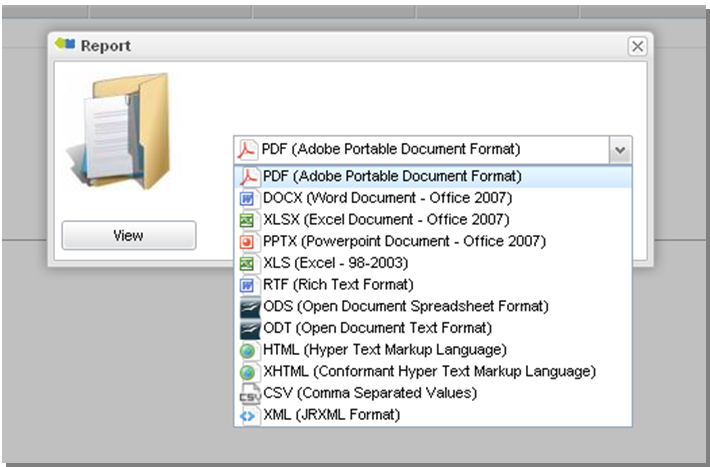
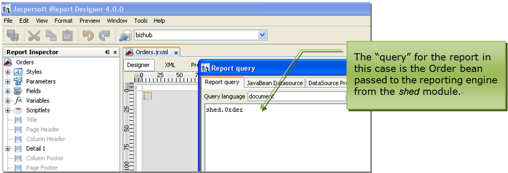

## Reports

Skyve provides extensive ad-hoc reporting functions via the export
capabilities available within every *listGrid* and list view, however,
where highly formatted reports are required, these are provided via
Jasper Reports.

This chapter is not intended as a training course to make you a professional report template designer, but to provide
some tips to get you started.

 Report property | Description
 ----------------|------------
 documentName | the document package where the report template is located
 moduleName | the module package where the report template is located
 reportName | the name of the report template
  confirm       | a confirmation message to be displayed requesting confirmation by the user<br><br>If no confirmation message is supplied, no confirmation is requested.
  disabled      | whether the button is shown in a disabled state
  displayName   | the text which will appear on the button
 enabled | whether the button is shown in a enabled state
  iconStyleClass | the icon class to use as the icon for the action using the fontawesom icon style classes - note that special action types (_ok_, _save_, _delete_, _cancel_, zoomOut_, remove_, _download_, _upload_, _import_, _export_) have predetermined icons - e.g. "fa fa-file-photo-o" will use the fontawesome ("fa") style class "fa-file-photo-o"
  inActionPanel | controls whether the action button is included in the Action Panel at the top of the view <br><br>If a button is not to be displayed in the *ActionPanel* a button widget will be required elsewhere within the view for the action to be accessible.
  invisible     | whether the action button is invisible
 listReport | whether the report is based on a list 
 modelName | the _model_ used to populate the report
  name          | where multiple actions may refer to the same action but with different options, the name property distinguishes which property set declaration to use (for example, to send different parameters to the same report)
 queryName | the _query_ used to populate the report
  relativeIconFileName | the filename of an icon which will be displayed together with the *displayName* on the button<br><br>        Filenames are usually relative allowing the Skyve overriding mechanism to locate the absolute path to the file based on the context of the user.
 reportFormat | the format in which to deliver the report result (avoids the need for a user to select a format)
  toolTip       | tooltip help to be displayed for the button
  visible       | whether the action button is visible 
 

### Custom reports

You can of course use any reporting solution to create reports on your SQL data base, however to integrate
reporting into your Skyve application, by default, Skyve allows inclusion of Jasper reports.

Jasper reports can be based on a number of data source types, though usually reports are based in SQL.
However, Skyve offers a "bean" based data source for reporting, which provides a lot of advantages - particularly for ensuring
value formats are consistent with your application.

By convention, Jasper report templates are located within the reports folder of the driving document.


Report actions must be declared in a view for reports to be accessible to the user. 
```xml
        <report reportName="WeeklyTimeSheet" moduleName="time" documentName="WeeklyTimesheet" displayName="Preview Timesheet"
            reportFormat="pdf" >
            <parameter name="ID" binding="bizId" />
        </report>
```

Parameters can be passed to the report, based on local bindings (e.g. "bizId" in the above example)  - you need to declare these parameters in your jasper report (with the same name -  e..g. "ID" as above) (edited)
In your report, you can refer to these parameters like any other value, for example, in an sql based report you can include a query string like this:
```sql
select * from TIME_WeeklyTimesheet where bizId = $P{ID}
```

If you don't have a view defined, then any reports in the "reports" folder will automatically be given a button in the auto-generated view, but obviously you'll need to declare a view (and the report action) if you want to specify parameter bindings.

Skyve provides the *generateEditView* run configuration to generate a default view definition. You can then add the required
report actions to the action section or parameters as required.

By default, report actions are displayed with the printer icon.


To ensure all reports are valid and can be run, compile the reports using the Eclipse Jasper Report Designer plug in.

When reports are requested by the user (using the report action button)
Skyve will offer the user a choice of formats in which the report will
be rendered.



It is the responsibility of the report designer to consider the
implications of the user selecting a format which the designer has not
catered for.

Alternatively, a report format can be specified in the report action declaration, avoiding the need for a user to select a format.

#### Automatic customer resource parameter

Skyve automatically passes a contextual parameter named *RESOURCE\_DIR*
containing the location of the customer resource folder to the reporting
engine, evaluated at run-time.

This parameter does not need to be declared within the report action
declaration however Skyve cannot enforce that these parameters are
declared within the report template. If developers wish to make use of
these report parameters they must ensure they are declared within the
report template.

The parameter *RESOURCE\_DIR* is evaluated at the time the report is
requested by the user (i.e. at run-time).

As this parameter points to the central repository for customer
resources, it is useful for logo files and other images and objects
which might be part of highly formatted reports. By passing the specific
customer resource location (evaluated at run-time) references to these
types of items can be used generically for all customers.

#### Object "bean" data source

Skyve provides an object data source which can be used in place of SQL
as the driving query for the report. The object data source provides the
state of the beans in memory, whereas SQL queries will only return
persisted (i.e. saved) values.

If the bean passed to the report has collections, these can be used as
the basis for grouped detail rows, as with SQL data sources.



### Ad-hoc reports

Ad-hoc reports, created by the user from the *listGrid* *export table
data* function tool, are created on-the-fly by Skyve.

The report title will be the query *displayName*. Ad-hoc report
definitions are generated in code and passed directly to the reporting
engine.

### Offline reporting jobs

Jobs can be declared to create reports offline, including bulk report
generation. Jobs are described in the next section.

#### Skyve report designer

Skyve provides an automated report designer which generates a .jrxml template file. 

The report designer is available in the DevOps tools in the admin module->devOps->Report Design.


This will create a Jasper template based on an existing view, document or query.


**[⬆ back to top](#reports)**

---
**Next [Jobs](./../_pages/jobs.md)**  
**Previous [Routing and rendering](./../_pages/routing.md)**
