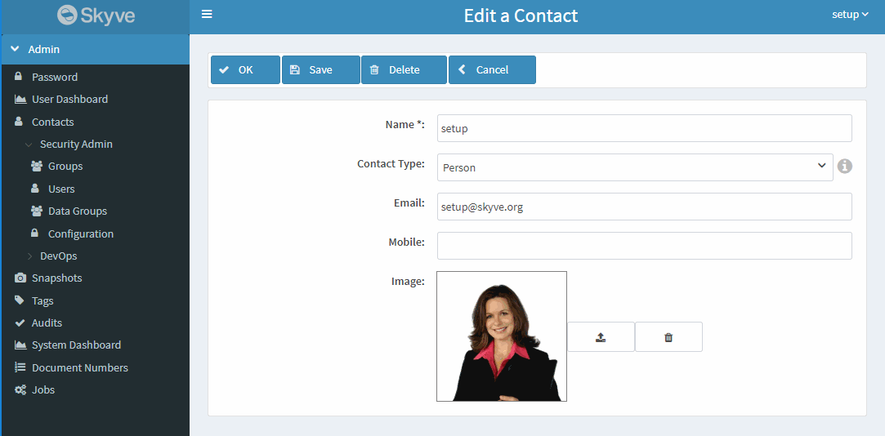
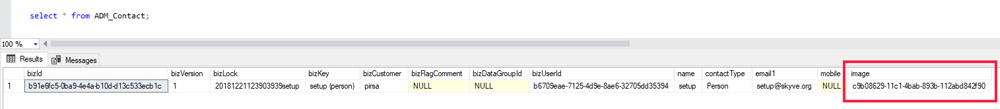
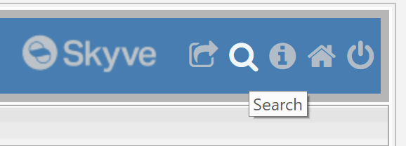
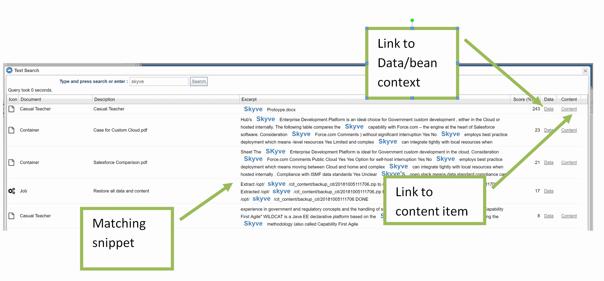
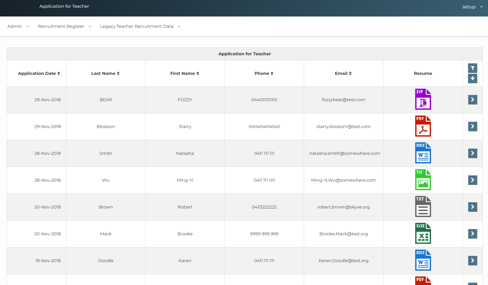

## Content attachments and images

Skyve includes both structured database persistence and a non-sql/content repository for the storage of file attachments, images and other non-structured data.

Skyve integrates the two persistence mechanisms transparently for developers and users for no-code and low-code applications. Additionally, Skyve provides a platform independent and consolidated backup and restore capability for both stores. However, developers can take advantage of understanding the distinction between the two types of persistence to produce sophisticated and rich solutions. 

Skyve incorporates automatic content management with non-sql storage. 

There are two options for content management:
* lucene based simple content manager addin (bundled with Skyve)
* use others (like Elastic) in the cloud or on another server if using on-premise

To use the free Skyve content management addin, retrieve the addin zip by performing a maven `install` or maven `compile` against your project and check the `target` folder in your project's workspace. Copy the downloaded `skyve-content.zip` to a file location, and specify that location for the `addins` section in the application `.json` settings file. 

The same content management addin can be referenced by multiple projects on the same instance, provided the version is compatible with the version of Skyve your project is using, you do not need to have a separate addin for each project.

e.g.

```json
// Add-ins settings
"addins": {
	// Where to look for add-ins - defaults to <content.directory>/addins/
	"directory": "C:/content/addins/"
},
```

The addin content manager requires access to the file system and a `content` folder must be specified in the application `.json` settings file `content` section for the Skyve platform to be able to start, with read and write permissions being assigned to the user credential under which Wildfly runs.

e.g.

```json
// Content settings
"content": {
	// Directory path to the location for storage of content, caching and working files
	// Note that if you are running on Windows do not use backslashes
	// The value must be terminated with a slash - e.g. "C:/Workspace/content/"
	"directory": "C:/content/myApplication/",
	// CRON Expression for CMS Garbage Collection job - run at 7 past the hour every hour
	"gcCron": "0 7 0/1 1/1 * ? *",
	// Attachments stored on file system or inline
	"fileStorage": true
},
```

Access to content items is controlled by the privilege declaration in the `module.xml` for the document that contains the content item attribute.

_For the developer environment, we recommend selecting a folder location for content which is outside of the project, to avoid problems with IDEs like Eclipse constantly scanning the folder for changes._

### Using content

Skyve manages content by linking the stored item with the bean context in which it exists - namely, in a `<content>` type document attribute.

For example, the document `Contact` may have the following attributes:

Attribute | Type | Description
----------|------| -----
name | text, 200 | the name of the person or organisation
contactType | enumeration | whether the contact is a person or an organisation
email1 | text, 500 | the email address for the contact
mobile | text, 20 | the mobile or cell number for the contact
image | content | the photo of the person or organisation logo

The content item is declared as follows:
```xml
<content name="image">
	<displayName>Image</displayName>
</content>
```

In the above case, the content item is _intended_ to store an image, however unless restricted by the developer, the content attribute can store any kind of digital content.

When a content item is uploaded (for example, from a content widget), the item is indexed automatically, unless the `index` tag declares otherwise. So for the above case, it would make sense to declare _none_ as the index type, as the attribute is intended for image type content.

```xml
<content name="image">
	<displayName>Image</displayName>
	<index>none</index>
</content>
```

Note that access to the content item is controlled by the privileges declared for the document (in this case Contact). If a user has _Read_ access to the Contact document, then they have the privelege to access the content item either from the view, or directly using the content servlet.    

In the view for a contact, Skyve will provide a content widget (with _upload_ and _clear_ buttons assuming the widget is not disabled), as shown: 



When the user uploads the image, the image item (in this case a `.png` file) will be stored in the content repository and an identifier (which links to the repository) will be stored in the database tuple for the content, as shown:



When Skyve retrieves or saves a bean (for example for display in the view), Skyve automatically maintains the content `id` value appropriately for the bean to ensure the integrity of the context. 

### Federated text search

Skyve provides a federated text search capability for indexed items - which includes text-based content items and other attributes declared with the _index_ tag (including `memo` and where `text` attributes have the _index_ tag declared).

_Note: `memo` attributes are indexed by default, unless this is switched off as in the content attribute example above._

To access the search, switch to desktop mode and use the _Search_ feature as shown.



Search results will include:
* the *Document* in which the content attribute exists
* the *Description* of the content attribute
* an *Excerpt* or snippet of the match 
* a *Score* which is a relative measure of the closeness of the match
* a link to the *Data* or bean context of the content item
* a link to the *Content* item itself

Note that access privileges (as declared for the document in the `module.xml`) limit the search results for the user.



### Retrieving content items in code

Using the `getter` in code for the `content` attribute will return only the `id` of the content as a `String`, and not the content item itself. To retrieve the content item, Skyve provides the `ContentManager` interface.

In the example of the Contact document above, the following code retrieves a byte array `byte[]` for the content item, and constructs a link to the item

```java
try (ContentManager cm = EXT.newContentManager()) {
      AttachmentContent ac = cm.get(bean.getImage());
      
	  if (ac != null) { 
		String link = String.format("<a href=\"%s/content?_n=%s&_doc=%s.%s&_b=%s" + 
						"\" target=\"_content\">%s (%s)</a>",
						Util.getSkyveContextUrl(),
						bean.getImage(),
						ac.getBizModule(),
						ac.getBizDocument(),
						ac.getAttributeName(),
						ac.getFileName(),
						ac.getMimeType());
	}      
}
```

### Searching content in code

Developers can take advantage of the text search capability in code, however developers need to consider that the indexed items include content and other indexed items.

```java
try (ContentManager cm = EXT.newContentManager()) {
	SearchResults matches = cm.google(bean.getFreeSearch(), 50);

	for (SearchResult match : matches.getResults()) {

		String bizId = match.getBizId();

		//if a bizId is returned, the match is with an indexed scalar attribute - not a content item 
		if (bizId == null) {
			AttachmentContent ac = cm.get(match.getContentId());
			int score = match.getScore();
			String snippet = match.getExcerpt();
		} 
	}
}
```			

In the above example, the `SearchResults` contains a list of results, but the `SearchResults` object also provides the following methods:
* `getSearchTimeInSecs()` - the search time in seconds
* `getSuggestion()` - returns the search value suggestion from the search value for auto-complete

Iterating through the `getResults()` collection, if the match has a non-null bizId, this means that the match was found in an indexed scalar attribute (for example, a _memo_ attribute).

### The content servlet

Skyve provides a content servlet for returning content from a link constructed along the lines of the example above.

The content servlet is accessible from the Skyve context url `/content` and will retrieve the content item specified by the given parameters.

If the content servlet request is provided with width (`w`) and height (`h`) parameter values, Skyve will return either an image of the specified size (if the content item is a recognised image type), or an icon representing the MimeType of the content item.

The content servlet allows the following parameters:

 Parameter | Description
 ----|----
 `_n` | the content id of the image (this is the string value stored in the document attribute which references the  content item stored in the content repository)
 `_doc` | the module.document of the bean containing the content
 `_b` | the binding of the content attribute relative to the module.document specified in `_doc`
 `_w` | width (optional, if supplied, the servlet will return an image for image mime-types or a mime-type icon for non-image types)
 `_h` | height (optional, if supplied, the servlet will return an image for image mime-types or a mime-type icon for non-image types)
  `_ctim` | time to live (optional, if supplied this informs the browser as to whether a cached version of the image may be used) 
 
For example, a `content` servlet request for the *image* attribute for the document *Staff* in the module *whosin* with content id = *ce49ba4b-89f3-476e-838b-7462d428ea6e* would resolve to a request similar to the following:

```
content?_n=ce49ba4b-89f3-476e-838b-7462d428ea6e&_doc=whosin.Staff&_b=contact.image&_w=180&_h=180&_ctim=1545998708029
```

Similarly, to include a content item image in a documentQuery column (for example in a list grid), construct a column similar to the following example:

```xml
<column displayName="Image" editable="false" filterable="false" sortable="false" alignment="centre" pixelWidth="70">
	<name>image</name>
	<expression>
		<![CDATA[
		 	concat(concat('')
		]]>
	</expression>
</column>
```

### Content column type for queries

Skyve provides a `content` column type with display options of `link` or `thumbnail` for exactly this purpose, for example:

```xml
<query name="qContact" documentName="Contact">
	<description>All Contact Details</description>
	<columns>
		<content display="thumbnail" binding="image"/>
		<column binding="name" sortOrder="ascending" />
		<column binding="contactType" sortOrder="ascending" />
		<column binding="email1" sortOrder="ascending" />
		<column binding="mobile" sortOrder="ascending" />
	</columns>
</query>
```

 
 
Using the `thumbnail` display option, where the content item is not an image, Skyve will return a thumbnail file type icon.



The `content` column type using display option `link` will provide a download link for the item.
 
### Content storage

_NOTE_ the following information is provided for information only - manipulating the content storage area directly may result in loss of data. 

The content folder (specified in the application `.json` settings file) will typically contain two folders for the storage and indexing of content items:

Folder | Description
----|-----
SKYVE_CONTENT | the indexing information for content items
SKYVE_STORE | the content items and associated metadata

When Skyve starts, the platform will create (if it doesn't already exist) a folder (within the specified `content` folder) called `SKYVE_CONTENT` - containing the index information for content items. 

As content items are saved in a Skyve application, these are saved to a folder (within the specified `content` folder) called `SKYVE_STORE`.

The `SKYVE_STORE` folder contains the content items (file attachments, images etc) in their original format and with associated metadata saved in a co-located file called `meta.json` as shown. 


The associated `meta.json` includes the identity of the bean context in which the content exists as well as the original file name, format and last modification datetime.

```json
{"attribute":"contentItem","bizCustomer":"cit","bizDataGroupId":null,"bizDocument":"ContentContainer","bizId":"97685d51-2746-426b-949c-0754509d7438","bizModule":"myModule","bizUserId":"6568db1f-be43-444b-a62a-b4468cabba0b","content_type":"application\/pdf","filename":"Skyve Developer Guide.pdf","last_modified":"2018-11-30T03:28:51.773+00:00"}
```

## Content tools

For details about Skyve platform content management tools, see [Content repository tools](./../_pages/content-repository-tools.md)

**[⬆ back to top](#content)**

---
**Next [Hierarchies](./../_pages/hierarchies.md)**  
**Previous [Charts](./../_pages/charts.md)**
