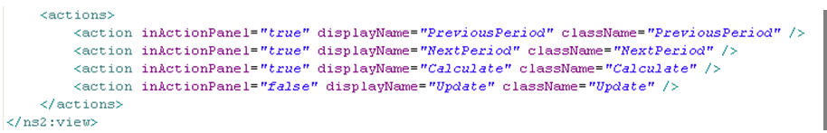
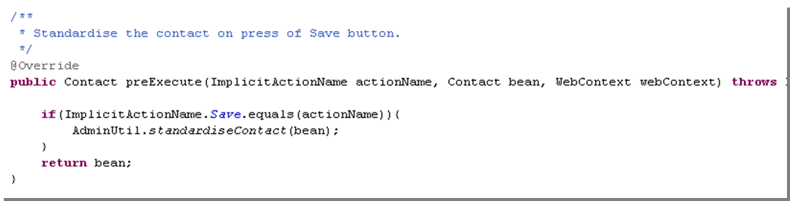

## Actions

### Contents

* **[Chapter 12: Actions](#actions)**
  * [OnChange Event Actions (Client-side Events)](#onchange-event-actions-client-side-events)

*Implicit Actions* are actions which are provided by Skyve by default based on the context of the current user gesture. By default, a Skyve view will contain a default collection of Implicit actions.

Skyve provides the following Implicit Actions:

  ImplicitActionName | Description
  ------------------ | -----------
  DEFAULTS           | A way to refer to the default set of *Implicit* actions for the view type and gesture context
  OK                 | *OK* button pressed by user while viewing the document edit view
  Save               | *Save* button pressed by user while viewing the document edit view
  Delete             | *Delete* button pressed by user while viewing the document edit view
  Add                | *Add* button pressed by user while viewing the child document edit view
  ZoomOut            | *Zoom Out* button pressed by user while viewing the child document edit view
  Cancel             | *Cancel* button pressed by user either at document or child-document edit view
  Remove             | *Remove* button pressed by user while viewing the document edit view
  New                | user adds a new item to the list view
  Edit               | user edits an item from the list view
  Report             | user presses a Report action button (useful for dialog and prompts before the report is opened)
  Navigate           | user navigates to a binding within a conversation
  BizImport          | user attempts to import data using the *Bizport* capability
  BizExport          | user attempts to export data using the *Bizport* capability

*Table 20 Implicit Actions*

In addition to implicit actions provided by Skyve, developers can create Custom actions, or override Implicit action behaviour in the document *Bizlet*.

To create a new action behaviour, developers create an action class and set permissions to execute the action within the role definitions section of the *module.xml* file.

When a user has access to execute an action (declared via role permissions) Skyve will generate a button by default in the detail view. When a view definition is supplied the view definition will control visibility and other properties of the action button.

The trivial *ServerSideAction* causes the view to be refreshed.

Action classes implement *ServerSideAction* and are located within the actions folder in a document package and correlate to action buttons in the user interface.

_Figure 64 - Example trivial action_

Note that actions can also be triggered by declaring onChangeHandlers for a specific widget in a view.

When a view declaration is supplied, the action must be declared in the
*actions* section of the *view.xml*.

{width="6.090972222222222in"
height="0.9243055555555556in"}

Figure 65 Example action section of a view definition

The action element of the view definition indicates the *className* of
the action as well as the *displayName* (button text). Action properties
are explained in full in Table 19.

Note that the action section of a view definition also includes implicit
actions.

_Figure 66 - Example customisation of the Save Implicit action_

In Figure 66 above, the *Implicit* action *Save* (i.e. when the user
presses the *Save* button) is customised to determine and set the state
of the *eligibility* attribute. This code will be executed prior to the
usual *Implicit Save* behaviour.

Note that the behaviour above is initiated by the use of the Save button
in the view, and this is a separate event to the bean’s preSave.

### OnChange Event Actions (Client-side Events)

Skyve provides a number of client-side events actions which can be
assigned to widgets. Details of *OnChange* event actions are provided in
Table 14 (above).

**[⬆ back to top](#contents)**

---
**Next [Chapter 13: Reports](./../chapters/reports.md)**  
**Previous [Chapter 11: Views](./../chapters/views.md)**
