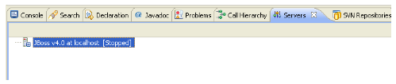
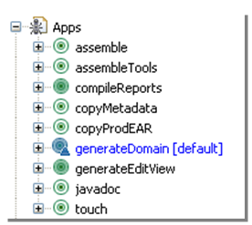

# Appendix

### Contents

  * [Chapter 1: Architectural Overview](../README.md)
  * [Chapter 2: Concepts](./../chapters/concepts.md)
  * [Chapter 3: Identifying the Skyve Version](./../chapters/concepts.md)
  * [Chapter 4: Security, Persistence and Access control](./../chapters/security-persistence-and-access-control.md)
  * [Chapter 5: Exception Handling](./../chapters/exception-handling.md)
  * [Chapter 6: Customers](./../chapters/customers.md)
  * [Chapter 7: Modules](./../chapters/modules.md)
  * [Chapter 8: Documents](./../chapters/documents.md)
  * [Chapter 9: Converters](./../chapters/converters.md)
  * [Chapter 10: Bizlets](./../chapters/bizlets.md)
  * [Chapter 11: Views](./../chapters/views.md)
  * [Chapter 12: Actions](./../chapters/actions.md)
  * [Chapter 13: Reports](./../chapters/reports.md)
  * [Chapter 14: Jobs](./../chapters/jobs.md)
  * [Chapter 15: Utility Classes](./../chapters/utility-classes.md)
  * [Chapter 16: Common Patterns](./../chapters/common-patterns.md)
  * [Chapter 17: Skyve Persistence Mechanisms](./../chapters/skyve-persistence-mechanisms.md)
  * [Chapter 18: Ant Utilities](./../chapters/ant-utilities.md)
  * [Chapter 19: Content Repository Tools](./../chapters/content-repository-tools.md)
  * [Chapter 20: Bizport](./../chapters/bizport.md)
  * [Chapter 21: WILDCAT Conversion Tool](./../chapters/wildcat-conversion-tool.md)
  * [Chapter 22: Automated Unit Testing](./../chapters/automated-unit-testing.md)
* **[Section 5: Appendix](#appendix)**
  * [Appendix 1: Deploying a Skyve Application](#deploying-a-skyve-application)
  * [Appendix 2: Installing and configuring the Skyve Development Environment](#installing-and-configuring-the-skyve-development-environment)
    * [Prerequisites checklist](#prerequisites-checklist)
    * [Configuring Java](#configuring-java)
    * [Configuring the IDE (Windows example)](#configuring-the-ide-windows-example)
      * [Configuring the workspace](#configuring-the-workspace)
      * [Importing Projects](#importing-projects)
      * [Creating the server](#creating-the-server)
      * [Configuring JBoss](#configuring-jboss)
      * [Starting the server](#starting-the-server)
      * [Deploying your solution](#deploying-your-solution)
  * [Appendix 3: Example Deployment Instructions with Single Sign-on](#example-deployment-instructions-with-single-sign-on)

## Deploying a Skyve Application

Skyve applications are deployed in two parts, the application metadata
and the Skyve enterprise archive.

Application metadata is deployed by copying the metadata Apps package to
the destination location. The Enterprise Archive is deployed by copying
the .ear package to the application server deployment area.

For example, to deploy a Skyve application to a Windows server:

-   Install JBoss 6.0 or later,

Copy the application metadata package to C:\\\_\\ ,

Copy the Skyve `.ear` package and the `*ds.xml` file to
&lt;jboss&gt;\\server\\default\\deploy\\ ,

Update the `*ds.xml` with a valid connection string,

Update the \\Apps\\content\\repository.xml,
\\Apps\\content\\workspaces\\&lt;workspace&gt;\\workspace.xml with a
valid JDBC connection string, (usually the same connection string in the
\*ds.xml file), and

Touch the server.

Additional steps may be required for single sign-on configuration, and
the creation of service user accounts, SPNs and port configuration as
required.

**[⬆ back to top](#contents)**

## Installing and configuring the Skyve Development Environment

These instructions describe the process required to install and
configure the development environment for Skyve.

### Prerequisites checklist

Before you begin, ensure you have the following:

* Java ([www.oracle.com](http://www.oracle.com)), at least JRE 1.6
* Eclipse ([www.eclipse.org](http://www.eclipse.org)) with Subclipse
(<http://subclipse.tigris.org/update_1.6.x>), so that the installation
is in C:\\eclipse\\
* JBoss 4.0.5.GA or greater ([www.redhat.com](http://www.redhat.com)) to
C:\\ so that the installation is in C:\\jboss-4.0.5.GA\\
* A RDBMS which is supported by Hibernate
([www.hibernate.org](http://www.hibernate.org)) – ensure you record the
administrator username and password

It is generally also a good idea to install Tortoise
(tortoisesvn.tigris.org) to resolve occasional problems with Subclipse.
You also need to have the username/password for the Skyve subversion
repository.

### Configuring Java

Copy jaxb-api.jar from bizhub/bizhub.ear/lib/ to
&lt;java-home&gt;/jre/lib/endorsed/ or to
&lt;jboss-home&gt;/lib/endorsed depending on java property
java.endorsed.dirs - which can be found in jboss boot.log

### Configuring the IDE (Windows example)

#### Configuring the workspace

Create C:\\\_\\

Start eclipse using C:\\eclipse\\eclipse.exe

Select C:\\\_\\ as the workspace location and check 'Use as default
option - do not ask again'

Cancel the welcome wizard

Close the welcome tab in the editor frame.

Change compiler compliance level to 6.0 (Window -&gt; Preferences -&gt;
Java -&gt; Compiler) press apply - press Yes for full build, and then
press OK.

#### Importing Projects

From eclipse, import the projects from the repository (in eclipse,
File-&gt;Import-&gt;SVN-&gt;Checkout Projects from SVN)

Follow the steps to connect to the repository and import the nominated
project.

Project -&gt; Clean - Select clean all projects and press OK - wait for
activity to cease in bottom right corner of the eclipse window.

#### Creating the server

Window -&gt; Show View -&gt; Other... -&gt; JBoss IDE -&gt; Server
Navigator - press OK.

Right click in Server Navigator View (docked at bottom of editor by
default) and select Configuration

Select JBoss 4.0.x and press \[New\]

Change name, select JBoss home directory as C:\\jboss-4.0.5.GA and
select default as the server configuration.

Go to Start tab and enter

-Djavax.management.builder.initial=org.jboss.system.server.jmx.MBeanServerBuilderImpl
-Djboss.platform.mbeanserver -Dcom.sun.management.jmxremote -Xms128m
-Xmx512m -XX:PermSize=128m

in the VM Arguments field

Press apply, then close.

Window -&gt; Preferences -&gt; JBoss IDE -&gt; deployer -&gt; Add -&gt;
Local JBoss Main Deployer \[Localhost:8080\] -&gt; OK and OK again

There should now be a JBoss server instance in the Server Navigator
view.

#### Configuring JBoss

Refer to JBoss documentation.

#### Starting the server

In Server Navigator, click the start widget or right-click on the server
and select start - look for errors in the log output.

Select bizhub project directory in the package explorer and select
Project -&gt; Clean - check Clean projects selected below and press OK

Select bizhub/bizhub.ear in package explorer and press
&lt;Ctrl&gt;-&lt;Shift&gt;-&lt;F3&gt; to deploy it to the JBoss server.

Select local JBoss main deployer as the target (NOT THE FILE DEPLOYER)

Open a browser and attempt to access
[http://localhost:8080/&lt;projectname&gt;/init.biz](http://localhost:8080/%3cprojectname%3e/init.biz)

Drag the following ant task files to the Ant view:

C:\\\_\\&lt;projectname&gt;\\build.xml

Other run configurations made need the jaxb libraries added to their
bootstrap classpath.

#### Deploying your solution

To deploy new application changes, choose *generateDomain* (from the
Apps ant task), select the Apps folder and press F5 (to refresh) and
then the touch target.

## Example Deployment Instructions with Single Sign-on

The following steps are to install an instance of XXX onto a vanilla
Windows 7.

--JAVA

Install Java - jdk-6u25-windows-i586

Set JAVA\_HOME to location of the Java root directory - e.g.
C:\\Java\\jdk1.6.0\_25

Set Path to include Java\\bin - e.g. C:\\Java\\jdk1.6.0\_25\\bin

copy sqljdbc4.jar and sqljdbc\_auth.dll to java\\jdk\\jre\\lib\\ext

--JBOSS

Install jboss (unzip and copy to c:\\)

either: jboss-4.0.5.GA.zip or jboss-as-distribution-6.0.0.Final.zip

check/update jboss\\bin\\run.conf settings for memory -
JAVA\_OPTS="-Xms1024m -Xmx1024m -XX:MaxPermSize=512m (1 occurence)

check/update jboss\\bin\\service.bat settings for calls to run.bat to
include the options -c default -b 0.0.0.0 (2 occurrences)

e.g. call run.bat -c default -b 0.0.0.0 &lt; .r.lock &gt;&gt; run.log
2&gt;&1

as administrator, install service (from command prompt, in jboss\\bin\\
"service install"

set service to run as XXX\\svc.jboss user (from service msc, change user
and startup type - don't check name as it will try to resolve as
svc.jboss@NET.XXX)

--KERBEROS

copy krb5.conf to jboss\\bin

copy spnego-r7.jar to jboss\\server\\default\\lib\\

add clauses from web.xml\_amendment.txt
(jboss\\..deploy\\jbossweb.sar\\web.xml or
jboss\\..\\deploy\\jbossweb-tomcat55.sar\\conf\\web.xml)

add clauses from login-config.xml\_amendment.txt
(jboss\\..\\default\\conf\\login-config.xml)

copy hello\_spnego.jsp jboss\\..\\root.war

check HTTP SPNs added to both svc.jboss user and machine

--DEPLOYMENT

Stop JBoss service

Copy \\\\dev\\C\$\\\_\\Example to C:\\\_\\Example

check C:\\\_\\Example\\javaee\\arc\_ds.xml connection string

check C:\\\_\\Example\\content\\repository.xml connection strings (x2)

check C:\\\_\\Example\\content\\workspaces\\arc\\workspace.xml
connection string

check C:\\\_\\Example\\content\\workspaces\\default\\workspace.xml
connection string

check C:\\\_\\Example\\apps\\repository\\customers\\arc\\arc.xml icon

Copy C:\\\_\\Example\\javaee\\arc.ear & arc\_ds.xml to
C:\\jbossxxx\\server\\default\\deploy\\

Start JBoss service

--CHECKS

check http://&lt;server&gt;.net.arc:8080/hello\_spnego.jsp

if "Failure unspecified at GSS-API level (Mechanism level: Checksum
failed)- check SPNs

check http://&lt;server&gt;.net.arc:8080/arc/init.biz

if error - check that you have an account in XXX, check
C:\\jbossxxx\\server\\default\\log\\server.log to see your user
principal is being recognised

**[⬆ back to top](#contents)**

## More information

For more information, email <a href="mailto:info@bizhub.com.au">**info@bizhub.com.au**</a> or call us on **+61 (0) 433 209 943**.

  Brought to you by Biz Hub Australia Pty Ltd.  
  1, Northcote St, Torrensville, SA, 5031, AUSTRALIA.  
  www.bizhub.com.au  
  

