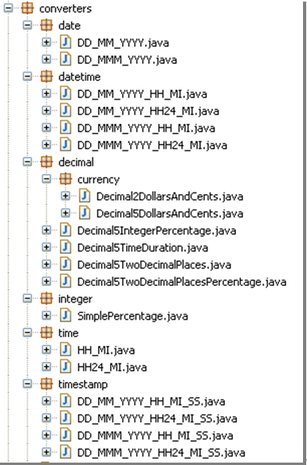
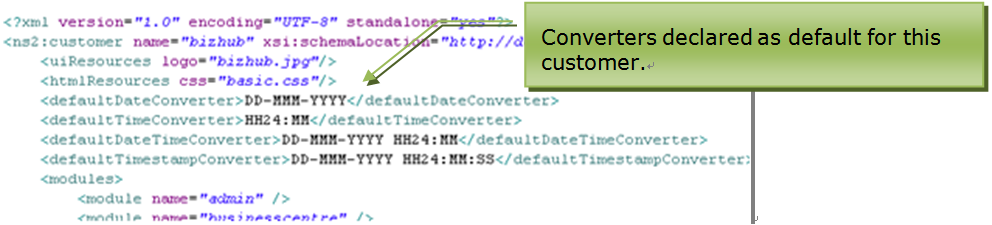
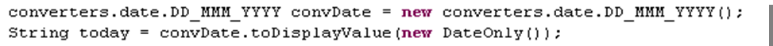
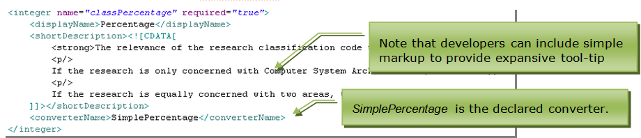
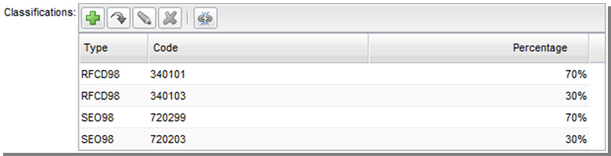

## Converters

### Contents

* [Chapter 1: Architectural Overview](../README.md)
* [Chapter 2: Concepts](./../chapters/concepts.md)
* [Chapter 3: Identifying the Skyve Version](./../chapters/concepts.md)
* [Chapter 4: Security, Persistence and Access control](./../chapters/security-persistence-and-access-control.md)
* [Chapter 5: Exception Handling](./../chapters/exception-handling.md)
* [Chapter 6: Customers](#customers)
* [Chapter 7: Modules](#modules)
* [Chapter 8: Documents](#documents)
* **[Chapter 9: Converters](#converters)**
  * [Defined Converters](#defined-converters)
  * [Worked Example](#worked-example)
    * [Requirement](#requirement)
    * [Implementation](#implementation)
    * [Results](#results)

In certain circumstances, data of the same type may need to be
represented in differing formats.

For example, 2-digit decimal numbers may need to be represented as
currency, percentages, time or as latitude-longitude.

A traditional approach might use a basic type and then specify a
particular format-specific widget or format converter in a view, or even
format the value to a String in code. The Skyve approach is to declare
that an attribute uses a converter so Skyve can enforce the format
conversion automatically and pervasively throughout the application.

### Defined Converters

Skyve provides a number of generic type converters.

_Figure 40 - Converters_

Converters can be declared as default for a customer (within the
`customer.xml`), or for an attribute (within the `document.xml`).

_Figure 41 - Converters can be declared as default for a specific type, for a customer_

Converters declared as the default converter on a document attribute
will ensure that the value of the attribute is always represented
consistently throughout the application.

_Figure 42 - Document attribute may declare a converter_

Converters should also be used within developer code to ensure a
consistent representation throughout the application.

_Figure 43 - Example use of converter within Bizlet code_

The converter will provide format hints to the user when fields are
empty.

_Figure 44 - Format hints for data entry_

### Worked Example

#### Requirement

An application must display research classifications by code, with each
code attributed a percentage. The percentage must always be a whole
number with the % sign included.

#### Implementation

To achieve this, an integer attribute *classPercentage* is declared as
follows:

_Figure 45 - Worked converters example: attribute declaration_

The attribute declares that the *SimplePercentage* converter applies to
the integer value of the *classPercentage* attribute. *SimplePercentage*
includes a % sign when the value is displayed, but ignores the % sign if
entered by the user.

The attribute *shortDescription* is added to provide expansive context
help.

The developer regenerates the domain (using the ant task) and redeploys
the application to the application server.

#### Results

Skyve guarantees that the attribute will always have the conversion
applied.

In the edit view, the percentage value is displayed with the % sign. The
value stored is an integer whether the user enters the % sign or not.

_Figure 46 - Worked converters example: converted value as displayed in the edit view, with tool-tip help_

If the user enters the value without a % sign, the displayed value will
be updated to include the % sign when the widget loses focus.

The *classPercentage* attribute will be shown with the % sign in all
contexts (including in grids).

_Figure 47 - Worked converters example: converted value as displayed in a grid_

**Next [Chapter 10: Bizlets](./../chapters/bizlets.md)**  
**Previous [Chapter 8: Documents](./../chapters/documents.md)** 
