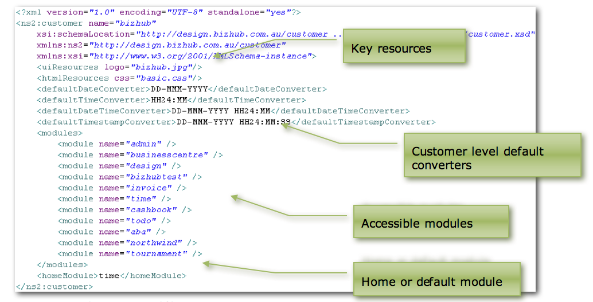
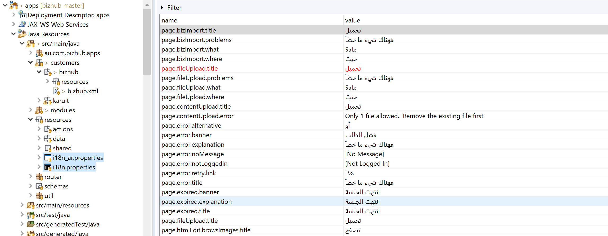

# Building Applications

## Customers

### Contents

* [Chapter 1: Architectural Overview](../README.md)
* [Chapter 2: Concepts](./../chapters/concepts.md)
* [Chapter 3: Identifying the Skyve Version](./../chapters/concepts.md)
* [Chapter 4: Security, Persistence and Access control](./../chapters/security-persistence-and-access-control.md)
* [Chapter 5: Exception Handling](./../chapters/exception-handling.md)
* **[Chapter 6: Customers](#customers)**
  * [Resources](#resources)
  * [Modules](#modules)

Skyve supports multi-tenant Software-As-A-Service (SAAS) applications
with extensive ability to customise the application for each
tenant/customer.

Each customer’s experience of the application is declared within the
customer package. The customer package includes a `customer.xml`
manifest file and a resources folder.

By convention, developers are encouraged to locate all
application-specific artefacts (such as project management and reference
materials) within the customer package.


_Figure 15 - Example customer package_

The `customer.xml` file declares which modules the customer has access
to, which default converters to use, the location of key resources, and
the default (or home) module.


_Figure 16 - Example customer.xml file_

The `customer.xml` file must declare the customer name. The customer
name is used to differentiate ownership of data rows within the database
(and therefore also users at the default login page).

Internationalisation and language support can also be specified when declaring the customer using the _language_ attribute.

```xml
<?xml version="1.0" encoding="UTF-8" standalone="yes"?>
<customer name="projecta"
            xmlns="http://www.skyve.org/xml/customer"
            xsi:schemaLocation="http://www.skyve.org/xml/customer ../../schemas/customer.xsd"
            xmlns:xsi="http://www.w3.org/2001/XMLSchema-instance"
            language="ar">
</customer>
```

If the language is not specified in the `customer.xml`, Skyve will detect the language set in the browser, provided there is an internationalisation file provided.



_Figure 16.1 - Language resource files_

The `customer.xml` file also declares the location of the customer logo
file (displayed in the top left hand corner of the UI above the
accordion pane), and assumes the file is located within the customer’s
resources folder.

### Resources

Skyve provides a resource hierarchy to allow for the inclusion of
additional resources in a generic way.

Throughout the application, resources (like the *relativeIconFileName*
for actions) resolve the applicable resource location from the resources
hierarchy.

Resources (e.g. button icon files) can be defined for each module within
the module *resources* folder. Resources can also be defined per
customer within the customer *resources* folder (e.g. the company logo
file).

A module *resources* folder can be overridden as part of a customer’s
module override by placing files of the same name as occur in the
original module.

So that report templates can references resources in a generic way, the
absolute file location of the customer resources folder is resolved at
run-time and included automatically as a report parameter.

### Modules

The `customer.xml` file lists all modules accessible to the customer.

The order of modules listed in the `customer.xml` file is the order that
module-level accordion menus appear in the accordion pane. Additionally,
the order of modules defines the compile order. If developers create
cross-module code, the compile order must be considered for that
customer.

The home or default module is declared here but can be overridden per
user from within the user functionality (within the admin module).

### Adding a new customer

Skyve is designed around the ability to build applications, then re-sell them to multiple _customers_ or _tennants_ as Software-as-a-Service (SaaS). The _customer_ concept allows you to share and reuse the code you create for your application, and customise it for each _customer_ (where appropriate).

In Skyve the term _Customer_ connotes customisation. If there's no (or only trivial) customisation required, you might resell the software to millions of users under the one Skyve customer context.

#### Creating the customer scope

Here’s how to create another customer to the Skyve demo.zip download example, for example a customer called _acme_:
1.    Copy the _demo_ customer folder from ```\demo\skyve\src\skyve\customers\demo``` to ```\demo\skyve\src\skyve\customers\acme```
2.    Rename the file ```\demo\skyve\src\skyve\customers\acme\demo.xml``` to ```\demo\skyve\src\skyve\customers\acme\acme.xml```
3.    Edit the new file ```\demo\skyve\src\skyve\customers\acme\acme.xml``` and change the customer name value to match – i.e. on line 2 ```<customer name="acme" ... ```

All customisations specific to this customer will live within this customer folder.

#### Deploying the customer

If you’re not using a development tool (an IDE like eclipse) and you just want another customer in the demo, then you’ll need to copy the customer folder manually to the deployment area, i.e. copy ```\demo\skyve\src\skyve\customers\acme``` to  ```\demo\skyve\javaee\skyve.ear\apps.jar\skyve\customers\acme```

If you’re using an IDE like eclipse then this copy will happen automatically.

#### Adding a setup user

However to start creating data within that customer context, you’ll need a user credential in the database so that you can log in the first time. There’s several ways to do this but the simplest at the moment would be to open up the database and run a script – this will inject a user credential. This is just to get you started. Once you’ve logged in as this user, you can begin adding more users and data via the user interface.

Now start up the application server, by running _\demo\run.bat_ (or \demo\run.sh if you’re not using Windows)

##### Using the h2 database manager

If you're using the demo h2 database, to access the h2 database manager embedded in the demo, browse to ```http://localhost:8080/skyve/h2```

Check that the JDBC URL matches the name of the h2 file in the ```\demo\content\``` folder – for the demo, this will be _demo_ – and so the JDBC URL should have the full path, for example  ```jdbc:h2:C:/demo/skyve/content/demo``` (where ```C:/demo/skyve/content/demo``` is the full path to the file _demo.h2.db_ – without the ".h2.db")

##### Inserting the user record

Paste in the following lines into your database manager (modify by replacing _acme_ with your customer name):

 ```
 INSERT INTO adm_contact (bizId,bizVersion,bizLock,bizCustomer,bizUserId,bizKey,name,mobile,email1,contactType) VALUES 
 ('setupContact',72,'20080114123937714setup','acme','setup','Setup User','Setup User',NULL,'info@bizhub.com.au','Person');

INSERT INTO adm_securitygroup (bizId,bizVersion,bizLock,bizCustomer,bizUserId,bizKey, name,description) VALUES 
 ('setupGroup',200,'20080114123937714setup','acme','setup','Setup','Setup','Setup user');

INSERT INTO adm_securitygrouprole (bizId,bizVersion,bizLock,bizCustomer,bizUserId,bizKey, roleName,parent_id) VALUES 
 ('setupGroupRoleBasic',69,'20080114123937714setup','acme','setup','admin.BasicUser','admin.BasicUser','setupGroup'),
 ('setupGroupRoleContact',69,'20080114123937714setup','acme','setup','admin.ContactViewer','admin.ContactViewer','setupGroup'),
 ('setupGroupRoleSecurity',69,'20080114123937714demo','acme','setup','admin.SecurityAdministrator','admin.SecurityAdministrator','setupGroup');

INSERT INTO adm_securityuser (bizId,bizVersion,bizLock,bizCustomer,bizUserId,bizKey, userName,password,contact_id) VALUES 
 ('setup',57,'20080114123937698setup','acme','setup','setup','setup','0RGzjA5zvIZ8S61AI2BqDg32TC8=','setupContact');

INSERT INTO adm_securityuser_groups (owner_id,element_id) VALUES  ('setup','setupGroup');
 ```
NOTE: This script assumes the SHA1 password hashing algorithm. If you're using something else, you'll need to swap the value _'0RGzjA5zvIZ8S61AI2BqDg32TC8='_ for the encrypted value using that algorithm.

The above script can be trivially modified if you're using an RDBMS other than h2.

Run the script, then browse to the application at ```localhost:8080\skyve```

Now you can log in as the setup user in the new customer _acme_ - with the following credentials:

- Customer _acme_
- Username _setup_
- Password _password01_

#### Setting a default customer

Note that if you only ever want to use a single customer, you can specify a default customer in the .json file of your instance. This will also avoid having to enter a customer name at the sign in prompt.

1. Edit the file \demo\skyve\javaee\demo.json
2. Search for the ```// Customer Default``` comment
3. Change the default customer setting from null to your customer name, for example changing ```customer: null,``` to ```customer: "acme",```
4. Save the file and restart your wildfly server (or redeploy the application by renaming ```demo.deployed``` to ```demo.dodeploy``` in the \demo\skyve\javaee\ folder while the server is running).

**[⬆ back to top](#contents)**

---
**Next [Chapter 7: Modules](./../chapters/modules.md)**  
**Previous [Chapter 5: Exception Handling](./../chapters/exception-handling.md)**
