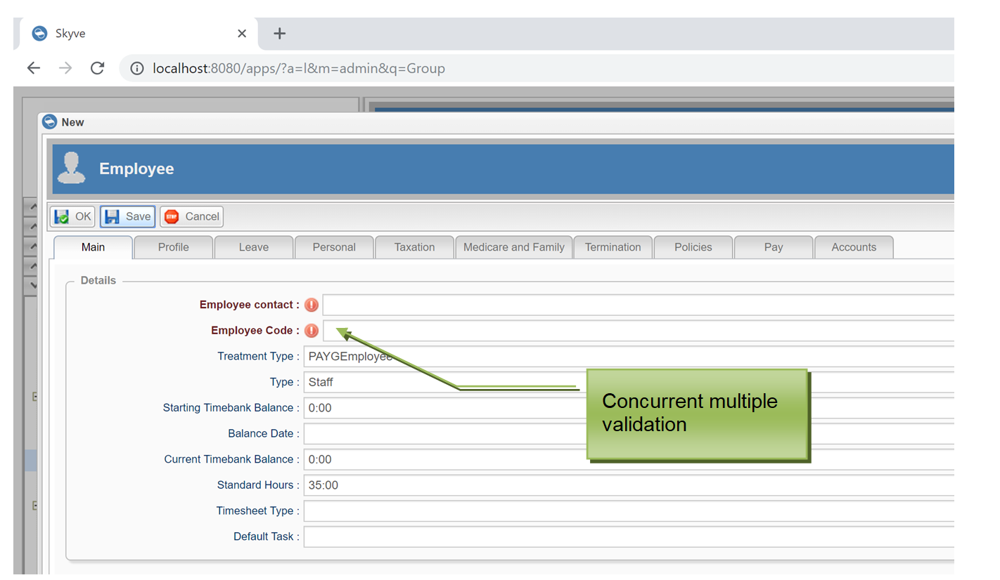
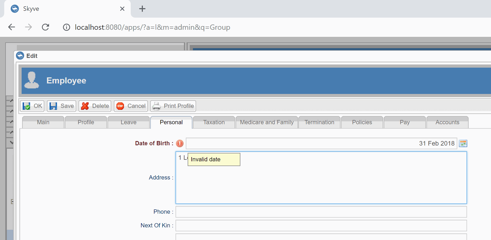
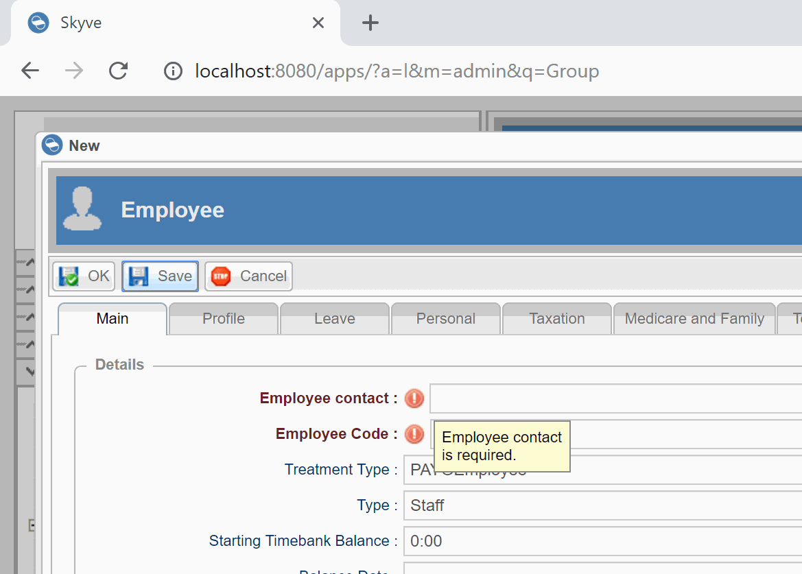

## Exception Handling

### Contents

* **[Chapter 5: Exception Handling](#exception-handling)**
  * [ValidationException 32](#validationexception)
  * [Concurrent Multiple Validation 32](#concurrent-multiple-validation)
  * [Data type validation 33](#data-type-validation)
  * [Mandatory field validation 33](#mandatory-field-validation)
  * [Business rule validation 33](#business-rule-validation)
  * [Building Applications 35](#building-applications)

Skyve provides powerful error management capabilities extending general
Java Exception handling.

Skyve natively supports a range of persistence related validations
including:

-   uniqueness constraints against documents or within collections
    (declared in the document metadata),
-   referential integrity violations,
-   data type violations, and
-   requiredness violations.

### ValidationException

In addition, the Skyve API provides the ValidationException class. A
ValidationException occurs when validation fails of data against the
specified type, or against specified business rules.

The associated class ValidationMessage allows the developer to specify a
binding context.

Skyve will attempt to locate the binding on the view when the
ValidationMessage is displayed. If the ValidationMessage is created with
a valid binding, the relevant data control will have the
ValidationMessage displayed with the native data validation warning icon
in-line with the data control. If an invalid (unmatched) or null binding
is specified, the ValidationMessage will be displayed as an alert in the
browser.

The native Skyve validation lifecycle event can be overridden in the
associated document Bizlet class. Developer validations will occur after
the native server side validation so that the Developer does not have to
code against implicit validation failures like requiredness – since this
has been handled by Skyve.

Note: Uniqueness constraints are not manifested as database constraints
as Skyve allows overriding of uniqueness for a specified scope (e.g.
Customer scope).

Developer API code may extend the native lifecycle event (validate
method) or be handled in other lifecycle event extensions (including
preExecute events).

### Concurrent Multiple Validation

Skyve supports concurrent multiple validation in the user interface
display.

The native validate() method is called by the platform with an existing
ValidationException container and additional validations may be added
using the .getSubordinates().add pattern. If the subordinates do not
have valid bindings supplied, Skyve will automatically list all
validation messages in a `<ul>`



_Figure 11 - Concurrent Multiple Validation_

### Data type validation

Data type validation is handled automatically and natively by Skyve.

Skyve provides a number of thread-safe data types (e.g. Boolean, Date,
DateTime, Integer, Decimal2, Decimal5 etc) but also including rich and
complex types such as association, content and markup.

Skyve employs the following methods for data type validation:

-   Conversion hints provided inline in the data controls,
-   Client side validation,
-   Automatic conversion using specified thread-safe converters
    reflecting the system interpretation of the value entered,
-   Native Server side validation which can be extended by the
    developer.



_Figure 12 - Data type validation is handled automatically by Skyve both
client side and server side._

The automatic data type validation occurs before any API validation to
ensure that the developer does not have to code against obvious
violations.

### Mandatory field validation

Mandatory fields (i.e. requiredness) are specified within the
document.xml to ensure the requiredness is handled pervasively within
the application tier.

Where attributes are declared with property required=”true”, Skyve will
automatically display associated user interface controls with bold
labels.

Requiredness is automatically validated in the client and server side
before developer API validation overrides so that the developer is not
required to duplicate obvious and implicit validations.



_Figure 13 - Requiredness violations are displayed consistently within the UI_

### Business rule validation

Developers may extend the native Skyve lifecycle validation method, or
throw validation exceptions in any other class, however if the
ValidationException cannot be thrown within the context of the code
execution, a general exception will result (as per normal Java exception
handling).

Developers may throw other exception types in additional to the
ValidationException and these will occur in the UI as general browser
alerts.

The API also allows for developers to call the native validation using
the Validator Utility class, for example:

```java
@Override
public ServerSideActionResult execute(ChangePassword bean, WebContext webContext) throws Exception {
  Persistence persistence = CORE.getPersistence();
  User user = persistence.getUser();
  Customer customer = user.getCustomer();
  Module module = customer.getModule(ChangePassword.MODULE_NAME);
  Document changePasswordDocument = module.getDocument(customer, ChangePassword.DOCUMENT_NAME);

  Validator.validateBeanAgainstDocument(changePasswordDocument, bean);
}
```
_Figure 14 - The Validator Utility class provides access to the native
Validation capability_

**[⬆ back to top](#contents)**

---
**Next Chapter 6: Customers**  
**Previous [Chapter 4: Security, Persistence and Access control](./chapters/security-persistence-and-access-control.md)**
