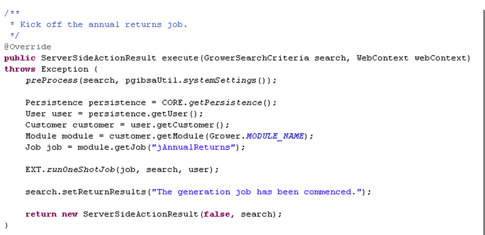

## Jobs

### Contents

* **[Chapter 14: Jobs](#jobs)**
  * [Job Classes](#job-classes)

Skyve provides a mechanism for executing and scheduling offline Jobs
(i.e. Jobs processed irrespective of the state of the conversation or
session).

Jobs are declared in the *module.xml* file in the *jobs* section.

{width="6.439583333333333in"
height="1.3486111111111112in"}

Figure 71 Example job declaration within the module.xml file

Job declaration includes logical name, *displayName* and *className.*

The *className* nominates the specific class file to be executed.

Once jobs have been declared, they are available to be scheduled at
run-time via the *admin* module job scheduler function.

The *admin* module provides comprehensive job scheduling functionality,
including assignment of the user under whose privileges the Job will be
executed.

Scheduling Jobs from the *admin* module requires the *JobMaintainer*
role.

### Job Classes

Job classes must extend the *BizHubJob* abstract class. Custom job code
is located in the *execute*() method.

{width="5.0152777777777775in"
height="3.2576388888888888in"}

Figure 72 Example Job class

Jobs can be scheduled in action or *Bizlet* code using the
*JobScheduler* class.

{width="5.802777777777778in"
height="2.7118055555555554in"}

Figure 73 Example action class code to run a one-shot Job

As Jobs are run within the context of a user so that Skyve’s embedded
comprehensive security model can be enforced.

Developers must consider whether a user context will have sufficient
privileges for the Job to be executed.

**[⬆ back to top](#contents)**

---
**Next [Chapter 15: Utility Classes](./../chapters/utility-classes.md)**  
**Previous [Chapter 13: Reports](./../chapters/reports.md)**
