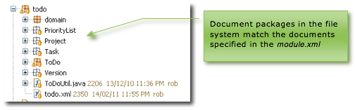
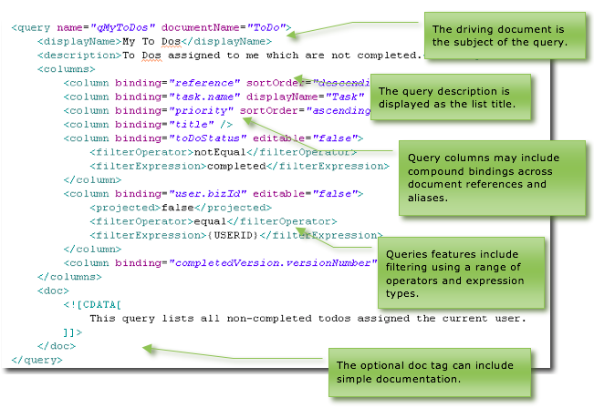
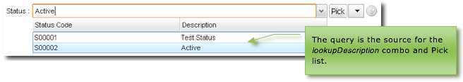
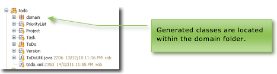
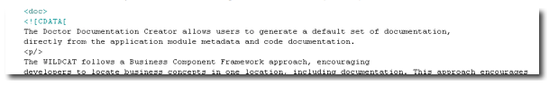
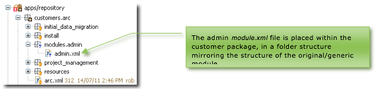

## Modules

### Contents

* **[Chapter 7: Modules](#modules)**
  * [Defining the `module.xml`](#defining-the-module.xml)
    * [Module header](#module-header)
  * [Documents](#documents)
  * [Queries](#queries)
  * [Generic Queries](#generic-queries)
  * [Declaring Queries](#declaring-queries)
    * [Query Column Definition](#query-column-definition)
    * [Queries for Reference Attributes](#queries-for-reference-attributes)
  * [Roles](#roles)
    * [Document Scope](#document-scope)
  * [Worked Example](#worked-example)
    * [Requirement](#requirement)
    * [Implementation](#implementation)
    * [Results](#results)
    * [Role Documentation](#role-documentation)
  * [Menus](#menus)
  * [Module Documentation](#module-documentation)
  * [Overriding Modules](#overriding-modules)
  * [Java Implementation](#java-implementation)

Modules define self-contained application pieces and correspond to menus
within the system accordion menu pane. The repository/apps folder
contains all application metadata and code, organised as application
modules.

Each module folder contains a `module.xml` manifest file (declaring the
existence of the module components including jobs, documents, queries,
roles and menus) document packages (one package per document) and a
domain folder (which contains the generated domain classes).

Code in the domain folder is never manipulated by the developer
directly; all application changes are done via metadata and API-level
code.

_Figure 17 - Skyve in the Eclipse IDE_

The `module.xml` file is located in the top level directory of the
module and defines the following:

  Attribute/Section | Definition
  ----------------- | ----------
  name              | The name used by the developer to define and distinguish the module.
  title             | The title of the module as presented in the user interface. The module title will be the label shown on the accordion pane containing the module menu.
  homeRef           | Whether the homeDocument (see below) will open in list or edit view. This attribute is optional – if not included Skyve assumes a homeRef of *list* (i.e. a list view rather than a detail view).
  homeDocument      | The document which will open by default when the module is accessed by the user.
  documents         | The list of documents. Documents may be persistent or transient. Each persistent document maps to a database table. (Transient documents exist only in memory.)
  queries           | The queries referenced within the application metadata. Each list view is based on a metadata query specified in the `module.xml` and any queries referenced within document metadata (e.g. for collections or references) must be declared here. Skyve will generate default queries for each document unless a specific metadata query is declared.
  roles             | The user roles specified for the application. Each role specifies permission levels for each document and actions which that role is permitted to execute.
  menu              | The menu specifies which menu items are applicable for each role specified in the roles section.

_Table 2 - Module.xml sections_

### Defining the `module.xml`

#### Module header

An example module header is provided below. Note the key attributes of
*schemaLocation*, name, title *homeRef* and *homeDocument*.

_Figure 18 - Module definition header_

### Documents

The `module.xml` includes declarations for each document.

If documents from another module are referenced, the source module must
be nominated as *moduleRef*. Document privileges and scoping is always
only defined in the home module, to avoid the potential of conflicting
scoping or permissions.

_Figure 19 - Module definition - document manifest_

Documents listed in the `module.xml` may reference documents from other
modules (*moduleRef*) or are matched with document packages within the
module folder.

_Figure 20 - Document packages_

### Queries

The `module.xml` file can include definitions of queries used in the
application. Queries declared in the `module.xml` are called *metadata
queries* to distinguish them from other queries which may exist as views
on the database server or as insecure SQL strings within developer code.

Each document can specify a *defaultQueryName* – which is the name of
the metadata query to use by default wherever lists of document
instances may be required (e.g. lists and lookups for document
references).

If a query name is not supplied Skyve will generate a default or
*generic* query which will include all columns for all document
attributes.

### Generic Queries

When Skyve generates a query (in the situation where a query is required
but none has been specified), this *generic* query will contain all
document attributes for the *driving document* and the *bizKey* value
for all references. Columns will be in the order of document attributes
(as specified in the *document.xml*) with ascending ordering applied to
the first column. All columns will be non-editable inline in the list.

### Declaring Queries

Skyve metadata queries use object references, rather than SQL.

Metadata queries must specify the *documentName*; the name of the
document which is the subject of the query.

If the query is the basis of a *listGrid*, then double-clicking in the
listGrid will zoom to the *driving document*.

_Figure 21 - Metadata query definition_

_Figure 22 - Query description displays as the list title_

#### Query Column Definition

  Query Column Attributes | Description
  ----------------------- | -----------
  binding                 | The document value to be shown in the query column. A compound binding can be used where the value to be shown is in a related document.
  displayName             | An alias for the query column. If no displayName is specified in the query, the list column title will be the displayName specified for the document attribute.
  editable                | Whether the column is editable in the list view inline. By default editable is set to false.
  expression              | A valid OQL expression which defines the value to be shown in the list column.
  filterable              | Whether a filter can be applied to this column in the list view.
  filterExpression        | A literal value or one of a number of expressions. Defined expressions include: 
    -   {DATE} - current date
    -   {DATETIME} - current date and time
    -   {USERID} - bizId of the current user
    -   {USER} – the userName of the current user
    -   {CONTACTID} – the id of the contact who is the current user
    -   {DATAGROUPID} – the id of the data group of the current user
    -   {CUSTOMER} – the name of the customer context in which the current user operates
  filterOperator          | One of the following operators:

                            -   equal, notEqual,
                            -   greater, less,
                            -   greaterEqual, lessEqual,
                            -   like, notLike,
                            -   notNull, isNull,
                            -   nullOrEqual, nullOrNotEqual,
                            -   nullOrGreater, nullOrLess,
                            -   nullOrGreaterEqual, nullOrLessEqual,
                            -   nullOrLike, nullOrNotLike;

  hidden                    Whether the query column will be hidden by default in a list view.

                            Hidden columns are hidden by default, but can be un-hidden by the user unless the column has projected=false.

  name                      You can include calculated or derived values in a query however you must create a non-persistent field in the driving document to hold the value. The *name* is the name of the non-persistent document field which holds the calculated value.

                            Note that the name must correspond to a transient (i.e. non persistent) field in the document which describes other aspects of the expression result (such as type, length, display format etc.).

  projected                 Whether the column will exist in the result set.

                            By default all query columns are projected unless this attribute is *false*.

  sortable                  Whether the query can be sorted by this column in the list view.

  sortOrder                 The sorting order (ascending or descending) to use by default when this query is displayed.

                            If the column is sortable, the user will be able to re-sort the list results.
  ---------------------------------------------------------------------------------------------------------------------------------------------------------------------------------------------------------------------------------------------------------------------------

Table 3 Query column definitions

Driving documents can be the subject of many queries.

Queries defined in the `module.xml` are also available to developers in
*Bizlet* code. Queries can also be declared as the source for document
attribute associations and collections. When used in this way, the query
determines eligible references for membership in the association or
collection.

### Queries for Reference Attributes {#queries-for-reference-attributes .Sectionheading}

If a query is specified for an association attribute, Skyve will use
that query for association selections in the application user interface.
This can also be overridden by specifying a query in the view.

For an association, the query will be used for record selection in the
view.

For example, selecting a document association normally uses a
*lookupDescription* widget. The *lookupDescription* combo will display a
list of the *bizKeys* of the driving document instances in the same
order as the default query (or ordered by the first column if no query
is specified).

{width="6.211805555555555in" height="0.89375in"}

Figure 23 Queries as a source for record selection

However, *lookupDescription* combos can display multiple columns (as
above) if a query is specified for the *lookupDescription* in the view.

\
Roles {#roles .Chaptersubheading}
-----

The `module.xml` declares roles for the module.

Each role specifies the privilege levels for documents the role will
access (and associated actions). The role name is the name displayed
when assigning roles to user security groups in the admin module.

Roles specified within the module.xml are available for selection within
the admin module at run-time.

{width="2.60625in" height="2.0in"} {#section-8 .Picture}
--------------------------------------------------------

Figure 24 Assigning roles

For each document, the privilege level is specified in terms of C
(Create) R (Read) U (Update) D (Delete) L (List) P (Pick) and the
document scope access level, either G, C, D or U. The underscore
character (\_) means no permission is granted.

{width="4.863888888888889in" height="2.5305555555555554in"} {#section-9 .Picture}
---------------------------------------------------------------------------------

Figure 25 Example role declaration

For example, a document privilege of CRUDLPC means the role has access
to *Create*, *Read*, *Update*, *Delete*, *List* and *Pick* the document,
and that the document is scoped C (i.e. *Customer*) so for that role,
the document is available to all users within the customer context.

A document privilege of *\_R\_\_LPU* means that the role will only have
access to *Read*, *List* and *Pick* the document. In this case, the
document is scoped U (i.e. *User*), which means that for this role, each
document instance will only be accessible to the user who created it.

Role privileges are applied to all select statements generated
internally by Skyve. This means that privileges automatically apply to
developer code (except for insecure SQL). The benefit of this is that
developer code does not have to handle security issues and therefore the
developer is not able to make inadvertent security holes.

### Document Scope {#document-scope .Sectionheading}

While document privileges define what type of activities a role may
perform on a document, the document scope defines which document
instances are accessible to that role. As such, document scoping is a
method to provide pervasive row-level security, declaratively.

Document scope criteria are applied to all select statements generated
internally by Skyve. This means that document scoping applies
automatically to developer code (except for insecure SQL).

Documents may be scoped *Global* (G), *Customer* (C), *DataGroup* (D) or
*User* (U).

*Customer* scope means all data created within the customer context is
accessible for that role.

A *Global* scope entitles the role to access data across all customers –
this is useful for reference documents like Post Code lists which can be
shared across customers within the Skyve instance.

*DataGroup* scope means that the role only has access to data created
within the same *DataGroup* context as the user.

A *User* scope means that for that role, only data created within a
user’s context can be viewed by that user.

Worked Example {#worked-example .Chaptersubheading}
--------------

### Requirement {#requirement .Sectionheading}

An application must allow each user to create and manage but not delete
their personal preferences securely, while allowing administrators to
maintain read, update and delete but not create preferences.

### Implementation {#implementation .Sectionheading}

The module.xml declares two roles, User and Administrator:

{width="4.439583333333333in"
height="1.5756944444444445in"}

Figure 26 Worked document scope example: role declaration in the
module.xml

The user is assigned privileges (CRU\_LPU) to create, read, update, list
and pick their own (i.e user-scoped) personal preference document.

The administrator role has privileges (\_RUDLPC) to documents within the
customer scope.

### Results {#results .Sectionheading}

Skyve will guarantee the no user activity or developer code can bypass
the declared permissions.

Users can only access document instances within their user scope, while
administrators have access to all personal preference document instances
within the customer context.

If a user is given both roles, the privileges are added and result in
(CRUDLPC) which equates to all privileges within the customer context.
Administrator users, if they also require personal preferences, are
assigned both roles.

### Role Documentation {#role-documentation .Sectionheading}

Role definition can include documentation within a &lt;doc&gt; tag which
is available to the application and to the documentation generation
module (Doctor).

{width="5.863888888888889in" height="2.4694444444444446in"} {#section-10 .Picture}
---------------------------------------------------------------------------------

Menus {#menus .Chaptersubheading}
-----

The application menu is defined in terms of groups and items. A menu
group is an expandable menu (submenu).

{width="4.257638888888889in" height="1.9548611111111112in"} {#section-11 .Picture}
---------------------------------------------------------------------------------

Figure 27 Menu definition

{width="1.89375in" height="1.1819444444444445in"} {#section-12 .Picture}
-----------------------------------------------------------------------

Figure 28 Menu display

Roles included in the menu item stanza have access to that menu item. If
the menu item specifies a role, then users with that role will see the
menu item.

Module Documentation {#module-documentation .Chaptersubheading}
--------------------

Module definition can include detailed documentation about the module
within the *&lt;doc&gt;* tag. This documentation is used by the
documentation generation module (Doctor).

{width="6.878472222222222in" height="0.8638888888888889in"} {#section-13 .Picture}
---------------------------------------------------------------------------------

Figure 29 Example of detailed module documentation

Overriding Modules {#overriding-modules .Chaptersubheading}
------------------

Module definitions can be overridden to provide a bespoke experience of
the application.

All aspects of the module can be overridden including:

-   inclusion or exclusion of documents,

-   jobs,

-   queries,

-   roles,

-   document scoping, and

-   menus (structure, names and targets).

To override a `module.xml`, place the overriding `module.xml` file into
the customer package.

{width="2.651388888888889in" height="1.60625in"}

Figure 30 Example module override

As the `module.xml` file is a single artefact, it must contain all
elements of the module available for the bespoke experience and not
simply the components that differ. This is because the module override
can be subtractive, by not including elements contained within the
generic module.

Java Implementation {#java-implementation .Chaptersubheading}
-------------------

Java classes are contained within the domain folder situated within the
module package.

{width="2.3333333333333335in"
height="1.242361111111111in"}

Figure 31 Domain classes are located within the module package

The domain folder includes a Hibernate object-relational mapping
definition file for the module, named *&lt;module&gt;\_orm.hbm.xml*, as
well as classes for all module documents.

Where the `module.xml` is overridden for a customer within a
multi-tenant paradigm, a mapping file will be generated into the
customer module override folder, within the customer package.

All domain classes are regenerated by the *generateDomain* ant task and
should not be modified in any way by developers. However, inspection of
the domain classes can be a useful process to analyse validation
problems within the module.
