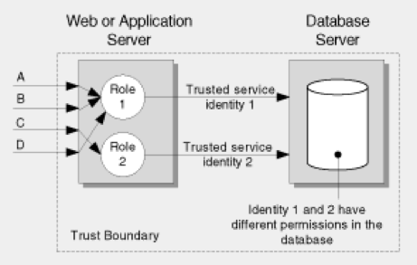

## Security, Persistence and Access control

### Contents

* [Chapter 1: Architectural Overview](../README.md)
* [Chapter 2: Concepts](./../chapters/concepts.md)
* **[Chapter 3: Security, Persistence and Access control](#security-persistence-and-access-control)**
  * [3.1: Transaction Control](#transaction-control)
    * [Concurrent conversations and transactional demarcation](#concurrent-conversations-and-transactional-demarcation)
    * [Authorisation model - Summary of Options and Discussion](#authorisation-model---summary-of-options-and-discussion)
* [Chapter 4: Exception Handling](./../chapters/exception-handling.md)
* [Chapter 5: Customers](./../chapters/customers.md)

### Transaction Control

Skyve implements consistent transaction control pervasively and provides
a Persistence utility class for specific transaction management where
this may be required.

Within the context of user interactions, Skyve supports n-level zoom
contained within a single transaction. The context for the transaction
is the document instance at the lowest zoom level (usually from the list
view), i.e. the starting document. Skyve automatically modifies default
actions depending on the zoom level or transaction context.

#### Concurrent conversations and transactional demarcation

Skyve supports conversation level transaction demarcation, meaning that
the user can have any number of concurrent browser conversations.

Conflicting actions between conversations (e.g. two attempts to update
the same record from within different browser windows, or by different
users) are handled within the conversation context, and users will be
notified if the action they are performing conflicts within an action
from another conversation. The usual rule of first-in-wins applies; the
first conversation to complete a transaction and commit will be
successful, and any subsequent concurrent transaction involving the same
record will be notified that their attempts to update the same record
are no longer valid.

Skyve application databases persist two columns to manage concurrent
conversation and optimistic locking protocols:

* bizLock, and
* bizVersion

The bizLock and bizVersion columns exists for each tuple. BizLock
records the time of the last successful transaction and the user
principal responsible for that transaction. BizVersion is compared by
Skyve against the value of the version at the time when the record was
accessed within the current user gesture. If the version value in memory
does not match the persisted version value Skyve determines that another
conversation has modified the record, and therefore the current
conversation cannot commit without loss of information.

#### Authorisation model - Summary of Options and Discussion

There are three common authorisation models:

* Impersonation model
* Trusted subsystem model
* Hybrid model

***Impersonation Model***

The impersonation model offers the most granular authorisation, however
“the approach suffers from poor application scalability because
effective connection pooling for database access is not possible."
(Refer to MSDN Library - Improving Web Application Security: Threats and
Countermeasures, Chapter 4 Design Guidelines for Secure Web
Applications, extracted from
http://msdn.microsoft.com/en-us/library/ff649874.aspx on 2013-09-17)

The impersonation model is shown below.

_Figure 8 - Impersonation model providing per end user authorisation
granularity_

Skyve does not adopt this model for a number of reasons:

-   This model does not suit agile development methods where user access
    requirements are not well known because identification of the end
    user set is unclear and an overhead exists in managing authorisation
    levels in multiple places,

-   The method does not scale well (as per the Microsoft quote above),

-   This model is not feasible for public web applications and SAAS
    environments where user populations are constantly changing and not
    known in advance, and

-   This model requires a large overhead in terms of managing
    implementation specific database permissions and access which does
    not confom to the Skyve principle of portability.

***Trusted subsystem model***

This model uses the application’s process identity to access the
persistence layer. This model was selected for GPS because:

-   Database connection pooling is supported which means that the
    > application is scalable,

-   This model has the least overhead in terms of permissions management
    > making it the most effective for agile development where
    > requirements and the user population is not clearly defined, and

-   This model is widely used and therefore assumed to be acceptable in
    > an otherwise unknown policy and strategy environment.

_Figure 9 Trusted subsystem model that supports database connection
pooling_

***Hybrid Model***

Under the hybrid model, a combination of both of the above models is
implemented. Skyve does not adopt this method natively because:

-   According (for example) to Microsoft “creating multiple thread
    access tokens used to establish different security contexts for
    downstream resource access using Windows authentication is a
    privileged operation that requires privileged process accounts. This
    is counter to the principle of least privilege.", and

-   User access requirements for GPS were not clearly identified so
    decisions about the specifics of the Trusted service access was not
    able to be ascertained.

_Figure 10 - The hybrid model_

Additionally, Skyve supports sophisticated declarative group, row and
column level security modelling and enforces these declarations
pervasively and consistently throughout any Skyve application.

**[⬆ back to top](#contents)**

---
**Next [Chapter 5: Exception Handling](./../chapters/exception-handling.md)**  
**Previous [Chapter 3: Identifying the Skyve Version](./../chapters/concepts.md)**  
