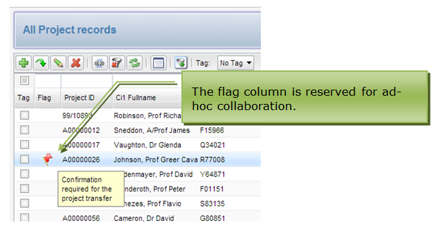

# Persistence

## Skyve Persistence Mechanisms

### Contents

* [Section 3: Persistence](#persistence)
  * **[Chapter 17: Skyve Persistence Mechanisms](#skyve-persistence-mechanisms)**
    * [Generic Naming Conventions](#generic-naming-conventions)
      * [Relationship naming convention](#relationship-naming-convention)
      * [Ordering and bizOrdinal](#ordering-and-bizordinal)
    * [UUID Enterprise-level Guaranteed Uniqueness](#uuid-enterprise-level-guaranteed-uniqueness)
    * [Optimistic Lock concurrency controls](#optimistic-lock-concurrency-controls)
    * [Enterprise-wide consistent reference representation](#enterprise-wide-consistent-reference-representation)
    * [Multi-tenant Support](#multi-tenant-support)
    * [Collaborative record flagging](#collaborative-record-flagging)
    * [Document scoping row-level security & source identification](#document-scoping-row-level-security-source-identification)

## Persistence

### Skyve Persistence Mechanisms

The Skyve Enterprise Platform mandates support for a number of
best-practice Web design features on every logical table within the
application persistence model including:

-   Generic naming conventions for generic mechanisms,

-   UUID enterprise-level guaranteed key uniqueness,

-   Optimistic Lock concurrency controls,

-   Document scoping - declarative row-level security & source
    identification,

-   Multi-tenancy,

-   Enterprise-wide consistent reference representation, and

-   Collaborative record flagging.

### Generic Naming Conventions

As a general principle Skyve adopts generic naming conventions wherever
possible particularly with respect to mandated persistence mechanisms.

To reduce the potential for generic mechanism names to clash with
instance-specific business concepts, Skyve specific mechanisms are
prefixed “biz”.

Skyve mandates the existence of the following named columns on all
primary data rows in a Skyve managed database:

Column Name | Purpose | Comments 
------------|---------|----------
bizId       | Enterprise wide unique identifier  | The use of UUID guarantees consistency and means no performance costs for assigning IDs, also means that IDs can be generated in external source applications without the need for re-keying when importing into a Skyve application store.
bizVersion  | Optimistic lock concurrency control | Skyve compares the persisted version number at the time the bean is loaded with the version number when attempting to save. If the numbers are different, the bean has been changed by another conversation.
bizLock     | Optimistic lock concurrency control | Skyve keeps the timestamp and user principal of the last successful transaction.
bizKey      | Enterprise-wide consistent reference representation   bizKey is an enterprise wide way of representing an entire tuple as a string - similar to the “.toString” concept available for most OO classes and suitable for displaying relationships particularly where multi-column display is not possible in the UI.
bizCustomer | Multi-tenancy | Skyve supports multi-tenant security. Each row is owned by a customer.
bizFlagComment | Collaborative record flagging | Used in the generic list capability allows collaboration between users to flag issues or reminders on specific rows.
bizDataGroupId | Document scoping - declarative row level security | For sub-organisational row-level security, bizDataGroupId records the data group context in which the record was created.
bizUserId  | Document scoping - source identification |For individual user security, bizUserId maintains the user context in which the record was created.

## Relationship naming convention

In Skyve, relationships are declared as attributes within the document
declaration. To make clear the special nature of the attribute within
the persistence context, relationship attributes are suffixed “\_id”.

For example, if a Contact document declared an attribute called
“address” which represented a one-many or one-one relationship to the
Address document, the persisted attribute name will be “address\_id” and
an index will be created for this key.

Similarly, all child entities have a generic reference to their parent
and the persisted name for this attribute called “parent\_id”.

For many-many relationships a separate joining table is used which will
always have columns “owner\_id” and “entity\_id” where these represent
the semantic nature of each relationship.

## Ordering and bizOrdinal

Column Name |  Purpose  |  Comments 
------------| ----------|-----------
bizOrdinal  | Generic collection ordinal position | bizOrdinal is used for implicit ordering where collections are declared “ordered”.

Where collections are declared to be ordered, Skyve maintains the
ordinal position of each record in the collection with a persisted
column named “bizOrdinal”.

The bizOrdinal field is used where implicit ordering is required (for
example in an orderable drag-drop datagrid) but is also available to
developers for other tasks.

bizOrdinal starts at position 0.

Skyve will cope if legacy data has bizOrdinal values that are
incomplete, null or non-consecutive. Next time the collection is saved,
Skyve will update bizOrdinals and make them consecutive. So if legacy
data has bizOrdinals of 2,5,5 and 11 and there are only 4 rows, Skyve
will still order them for presentation, but the next time the collection
is saved, they will be reset to 0,1,2 and 3.

### UUID Enterprise-level Guaranteed Uniqueness

To guarantee enterprise-wide uniqueness, Skyve generally uses
Universally Unique Identifier (UUID) for all key identifiers named
generically “bizId”.

A universally unique identifier (UUID) is an identifier standard used in
software construction, standardized by the Open Software Foundation
(OSF) as part of the Distributed Computing Environment (DCE).

The intent of UUIDs is to enable distributed systems to uniquely
identify information without significant central coordination.
Information labelled with UUIDs can therefore be later combined into a
single database without needing to resolve identifier (ID) conflicts.

The use of UUIDs means minimal architectural considerations are
necessary to support distributed key management and persistence level
performance is not challenged by the need for central key coordination.

However, because the Skyve mandated bizId field is a String field, any
ID up to the column size of 36 characters can be used, provided it is
unique within the context of the database table.

For example, if data originates in another system, the originating
system ID can be placed into the bizId field, provided it will be unique
in the table context under all circumstances and provided it is up to 36
characters.

### Optimistic Lock concurrency controls

Skyve supports multi-conversation interactions allowing each user to
maintain multiple conversational interactions with the application,
either with multiple windows/tabs in the same browser or interacting via
several browsers and devices concurrently.

To guarantee best-practice optimistic concurrency control, Skyve
persists bizVersion and bizLock values.

Skyve compares the persisted version number (bizVersion) at the time the
bean is loaded with the version number when attempting to save. If the
numbers are different, the bean has been changed by another
conversation.

Skyve keeps the timestamp and user principal of the last successful
transaction as the bizLock column. This is useful for a range of
auditing and process inspection requirements.

### Enterprise-wide consistent reference representation

In Object Oriented applications, most classes will implement a
“.toString” method as a consistent scalar representation of complex
objects.

While natural keys are useful in an application context they are often
of limited use in the user experience, where more information is
generally required to uniquely and correctly identify the record being
referred to.

Skyve mandates the existence of a bizKey attribute for all entities to
support enterprise-wide consistency and this is especially useful where
relationships are represented by single-column selects or static text
type controls.

The bizKey is persisted to allow performant scaling of large data sets
so that the more complex key representation can be used in common ad-hoc
searching, filtering and sorting.

### Multi-tenant Support

Skyve supports multi-tenant security. Each row is owned by a customer
and created within a customer context.

Skyve enforces multi-tenant specific security implicitly including via
data interactions at the API level – however Skyve also allows the use
of insecure SQL where required for performance reasons and where
vendor-specific persistence layer functionality is required.

In a simple standalone application the bizCustomer column is technically
unnecessary, but to enforce the portability principle is still mandated
by the platform in case requirements change.

### Collaborative record flagging

To support ad-hoc collaboration of data users, Skyve provides a
text-based flag for every entity/record within the application.
bizFlagComment will be represented in the list by a flag icon with the
hover gesture displaying the persisted comment.

_Figure 87 Example of the result of hover action over the flag icon_

 ### Document scoping row-level security & source identification

Skyve supports declarative row-level security which is enforced
pervasively and implicitly across all development contexts. Documents
are declared with a scope for each application role.

Four scope levels are supported – User, Data group, Customer and Global.
To ensure the correct scope is respected in a multi-role,
multi-conversation environment, Skyve persists the owning context of
each record at the customer level (bizCustomer column), data group
(bizDataGroupId column) or user (bizUserId) level. These values are then
inspected as required to resolve whether the record can be accessed
legitimately.

The data group concept is for sub-organisational, departmental or
business unit specific security contexts. When user accounts are created
a data group may be specified. If specified, any data interactions for
that user-role combination will occur and be interpreted by Skyve as
within that data group context. User-role combinations without a
specified data group are interpreted as having authority to interact
across data group contexts.
