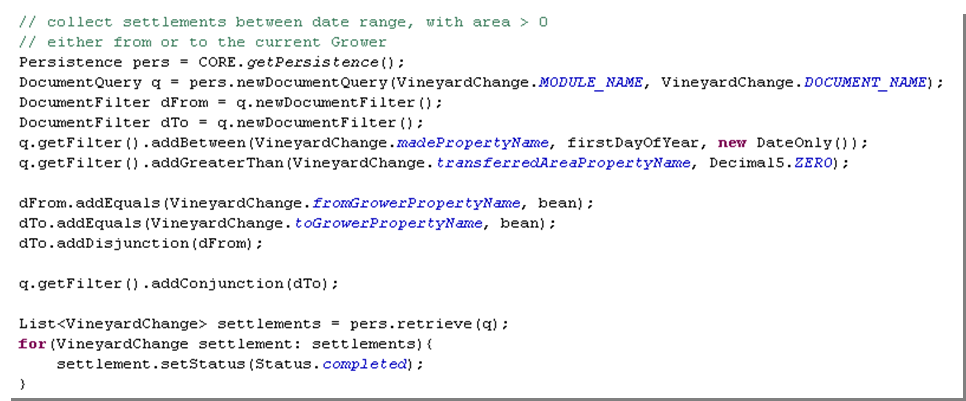

## Utility Classes

### Contents

* **[Chapter 15: Utility Classes](#utility-classes)**
  * [Persistence](#persistence)
    * [Insecure SQL](#insecure-sql)
  * [DocumentQuery](#documentquery)

Skyve provides the following utility classes:

  Class/Library | Description
  --------------| -------------------------------------------------------------------------------------------------------------------
  Util          | Bean-level generic utilities, including generic bean methods e.g. *cloneToTransientBySerialisation*().
  Binder        | Provides methods for generic bean binding manipulations, including:   <li>generic get() and set() methods for a bean with nominated binding, <li>*createCompoundBinding*() for correctly constructing compound bindings (i.e. across document references), and <li>read and interpret the nature of bean properties.
  ModulesUtil   |  Contains a number of business-focused methods and enumerations for cross-module functionality, including:   <li>*getNextDocumentNumber*() to create unique formatted serial document identifiers, <li> methods for working with business periods (month, quarter, half-year etc.) and frequency, <li> *currentAdminUser*() which identifies the current conversation user as an admin module user, <li> coalesce methods, and <li> basic Tax and loan calculation methods.
  JobScheduler  |  Provides methods to schedule declared jobs, e.g. *runOneShotJob*().
  Persistence   |  Provides access to interact directly with the persistence mechanism (detailed below).
  DocumentQuery  | Provides methods for constructing object queries without resorting to constructing OQL or SQL strings.

_Table 21 Utility classes and libraries_

### Persistence

The *Persistence* class provides access to persistence-specific
functionality which may be required by developers, while ensuring that
developer code will comply with security and threading mandates.

Key persistence methods are:

  Method  | Description
  --------| ------------------
  get                |          Instantiates a *Persistence* object
  getUser             |         Gets the current conversation *metadata.user*.
  begin, rollback, commit   |   Control the state of the current transaction.
  evictAllCached,    evitCached           |     Evict beans from cached memory.  These methods are useful where code interactions with *persistentBeans* may be in contention with default actions resulting from user activity (like pressing the Save button).   For example, if a user executes an action which impacts on the bean displayed in the view, and modified beans are not evicted, the user’s action will be in contention with the action. In this case, the user’s subsequent attempt to Save the bean will be met with a message stating that the current bean has already been modified by the user and can’t be saved.    Evicting cached beans at the conclusion of the action will avoid such a contention issue.
 executeDML,   executeInsecureSQLDML   |    Execute persistence data manipulation language queries, either object DML or Insecure SQL DML.
  upsertBeanTuple,   upsertCollectionTuples | Persists values only within the top-most level of the bean structure.   During an *upsert*, no bean validation is performed, and reference ID values are persisted without traversing into the related bean.
  retrieve(ProjectionQuery),   retrieveInsecureSQL |  Retrieve a bean or collection of beans using a project query or via Insecure SQL
  retrieve(Bean) | Retrieve the current bean as it was last persisted.

_Table 22 Key methods of the Persistence Utility class_

#### Insecure SQL

Methods using SQL are provided, but not recommended and are to be used
with care. Unlike object query methods, SQL is implementation specific,
but more importantly, the Skyve platform cannot assert automatic
customer scoping and other platform features in insecure SQL.

### DocumentQuery

*DocumentQuery* extends *ProjectionQuery* and provides the ability to
retrieve persisted beans in a type-safe and secure way, without building
SQL or OQL Strings.

_Figure 74 - Example DocumentQuery_

In the example provided in Figure 74 above, the DocumentQuery is used to
retrieve all VineyardChange beans. The beans are returned in a typed
List and document permissions and scoping rules are automatically
enforced by Skyve.

The use of DocumentFilter allows for correct enforcement of types at
compile-time to reduce the possibility of errors arising from implicit
type conversion which may arise if SQL strings were used.

**[⬆ back to top](#contents)**

---
**Next [Chapter 16: Common Patterns](./../chapters/common-patterns.md)**
**Previous [Chapter 14: Jobs](./../chapters/jobs.md)**  
