## Views

### Contents

* **[Chapter 11: Views](#views)**
  * [Containers](#containers)
    * [Autofit Behaviour](#autofit-behaviour)
  * [Form](#form)
    * [Form Example](#form-example)
  * [Table](#table)
  * [Item](#item)
  * [Widget](#widget)
  * [OnChange Event Action (Client-side Events)](#onchange-event-action-client-side-events)
  * [The lookupDescription Widget in Detail](#the-lookupdescription-widget-in-detail)
    * [Multi-column Drop-down/Combo](#multi-column-drop-downcombo)
    * [Filter Parameters](#filter-parameters)
    * [OnChange Handlers](#onchange-handlers)
  * [dataGrid](#datagrid)
    * [Columns](#columns)
  * [listGrid](#listgrid)
    * [Filter Parameters](#filter-parameters-1)
  * [Actions](#actions)
  * [Report Action](#report-action)
  * [New Parameter](#new-parameter)

View definition files override the default detail view (generated by
Skyve).

View files are located within the *views* folder in the document
package. Typically, users interact with a detail view after zooming into
the document from a list.

Two detail views can be declared for each document.

  View        | Description
  ----------- | -----------
  edit.xml    | The basic view definition for detail editing of a bean (normally accessed by zooming into a row from a list).  Menu items can also target edit views directly. In this case the menu item will trigger newInstance() and a new document instance will be returned (and therefore displayed). To show a singleton (a document instance which is the only applicable existing instance within the context), the newInstance() method can be overridden to select and return an existing bean in place of the newly created instance.  If a *create.xml* is supplied, the *edit.xml* file is only used after the document is created.
  create.xml  | A special case of edit view which is used if *create.xml* supplied and if *isCreated*() is false.

_Table 10 - View definition files_

### Containers

Containers are layout devices which contain other elements.

Containers share basic properties:

  Property          | Description
  ----------------- | ------------
  invisible         | Whether the container (and contents) are invisible to the user.  Invisibility may be set to *true*, *false* or the result of a declared condition.
  percentageHeight  | Percentage of the vertical visible area over which the container (and contents) will be stretched.
  percentageWidth   | Percentage of the horizontal visible area over which the container (and contents) will be stretched.
  pixelWidth        | Width of the container in pixels.
  pixelHeight       | Height of the container in pixels.

_Table 11 - Basic container properties_

#### Autofit Behaviour

Rendering behaviour is specific to browsers, however Skyve will attempt
to render the view as declared. Unless pixel sizes are specified, Skyve
will stretch view elements to cover the available window size, according
to the proportions and layout properties defined in the view.

Where the absolute size of the view exceeds the window space available,
the view will render with scroll bars. Containers may overflow if the
view definition doesn’t adequately take account of the number and nature
of items contained.

Container | Description | Specific Properties | Example
----------|-------------|---------------------|----------
hbox | Elements are laid out horizontally in the view and may contain other containers. | <li>border – whether a border is displayed<li>borderTitle – the text to be displayed as a border title <li> pixelMemberPadding – padding (in pixels) between members <li>pixelPadding – padding (in pixels) around all members <li> | 
vbox | Elements are laid out vertically in the view and may contain other containers. | <li>border – whether a border is visible <li> borderTitle – the text to be displayed as a border title <li>pixelMemberPadding – padding (in pixels) between members <li>pixelPadding – padding (in pixels) around all members | 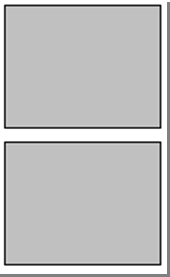
tabPane, tab | A tab pane contains tabs.   Tabs may contain other containers. | <li>name – a logical way of referring to the tabPane <li>disabled – whether the tabPane is disabled <li>disabled (tab) – whether the tab is disabled. A disabled tab will display the tab header, but cannot be accessed. <li>title (tab) – the title of the tab <li>selected (tab) – whether the tab is opened by default when the view is accessed. Selected can be set to *true*, *false* or the result of a defined condition. | 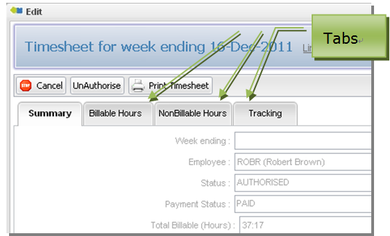

_Table 12 - View containers_

### Form

Forms contain columns and rows. Rows may only contain items.

Columns may be defined with or without *pixelWidth* or
*percentageWidth*. If no width type is displayed, the column will be
sized according to the impact of other elements of the view.
p*ercentageWidth* will size the column accordingly, provided this is
possible.

#### Form Example

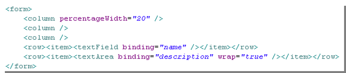

_Figure 50 - Example form definition_

In the above example, 3 columns are declared. The two rows contain only
a single widget, however the textField and textArea widgets include
labels. These widgets therefore fill the two leftmost columns, leaving
the third column empty. Together the 3 columns stretch the width of the
entire available horizontal window space.

")

_Figure 51 - Example form with 3 columns and 2 rows (with dotted lines
showing column boundaries)_

Most widgets span two columns – one for the widget label and one for the
actual widget itself. If the number of columns exceeds the number of
columns declared in the form, the row will overflow to another row. The
*spacer* widget is provided to allow position of widgets to odd columns
and for widgets with no label component.

Items within rows always fill from the leftmost available column. The
*spacer* widget is provided to allow items to fill from other than the
leftmost column.

If two unsized columns are defined, they will be stretched so that each
column will fill the available horizontal space. If one column is sized
and the other is not, the unsized column will stretch to fill the rest
of the available horizontal space.

***Tip:*** To allow the view to autofit and resize correctly, leave at
least one column unsized.

### Table

Deprecated. This feature is now met by using a disabled dataGrid.

### Item

  Property     | Description
  ------------ | ------------
  align        | Controls alignment of the item (left, right or centre).
  colspan      | The number of columns which the item spans.
  label        | A label to be displayed irrespective of the type of widget the item contains.
  labelAlign   | Controls the alignment of the item label.
  required     | Whether the contained widget must have a value set before any actions can be completed.
  rowspan      | The number of rows which the item spans.
  showHelp     | Whether the contained widget will include a tooltip help icon button, for a widget with an attribute which has a *shortDescription* defined.
  showLabel    | Whether the label of the contained widget will be displayed.

_Table 13 - Item properties_

### Widget

Skyve provides a number of view widgets, which can also be defined as
document attribute defaultWidget. When widgets contain labels, the label
will be displayed in bold type if the attribute is required.

  Widget | Description | Example
  ------ | ----------- | -------
  button             | can be placed within the view when the *inActionPanel* flag for an Action is set to *false*  If the Action is declared to be in the Action Panel, then no button widget is required to be declared.| 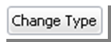
  checkBox           | Tri-state check box | 
  colourPicker       | displays a text box containing the colour code value together with a sample square of the colour  Clicking on the sample square activates a colour selector popup. | 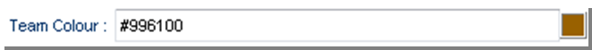 In this example, the colour button at the RHS will open a colour selector as shown below:  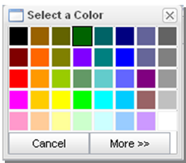
  combo              | drop-down selector for enumerations or where a domain type is specified for the document attribute | 
  contentImage       | displays the loaded image along with an upload action | 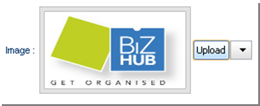
  contentLink        | displays a hyperlink to open the content in a new browers window together with an upload action | 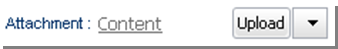
default            | If used in a view, this will render whatever the default widget is.  Either the *defaultWidget* declared on the document attribute or the Skyve default control for the attribute type.
dialogButton       | Not yet implemented.
geoLocator         | Geolocator will render a Map button, when pressed, a Geolocation window will appear with a pointer to the address or position bound to the Geolocator widget.    A new address or location can be selected within the Geolocator Map if the Geolocator is not disabled.   The Geolocator Widget has multiple bindings which interact with the map:<ul><li>addressBinding<li>cityBinding<li>stateBinding<li>postcodeBinding<li>countryBinding<li>latitudeBinding<li>longitudeBinding</ul> | In this example, the Map button is displayed. When clicked, the geolocator (shown below) will be displayed in a modal window. 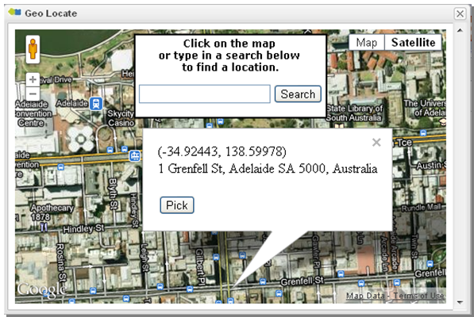
html | displays HTML content together with an Edit button    When the edit button is clicked, a popup HTML editor window is displayed allowing users to create rich HTML. | 
label | Simple text. | 
lookup | Deprecated. | 
lookupDescription | *lookupDescription* is used to display an association to another document, and combines a combo with a pick button.    Users may select a value from the combo, or type values into the text box which will locate a matching value in the combo drop-down list if found.    When the pick button is pressed, a Pick window containing a listGrid is displayed, showing eligible values as declared in the document association.    Whereas normally double-clicking in a grid will zoom into the row, double-clicking in a Pick grid will select that value, close the popup and set the value of the *lookupDescription* combo next to the Pick button.    The down-arrow button reveals options to Edit (i.e. Zoom), New or Clear the reference.   More features of the *lookupDescription* are explained in the next section. |    In this example the *bizKey* of the currently associated document instance is displayed in the control. To use another attribute change the lookupDescription’s *descriptionBinding* attribute.   If the Pick button is clicked, a listGrid of eligible document instances is shown in a modal window.      The down-arrow selector button will display options for Edit (edit the referenced document on-the-fly), New (create a new potential reference on-the-fly) and Clear (clear the reference).   
password | a textField which obfuscates the entered value | 
progressBar | Not yet implemented.|
radio | radio selector for enumerations or for document attributes where a domain type is specified     Radios may be laid out vertically or horizontally, using the property *vertical*. | 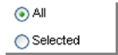   Vertical arrangement is the default arrangement for radio selectors when no arrangement is specified.
richText | provides a rich text area together with formatting toolbar |                  
slider | Numeric slider.    Properties include:   <li> min <li> max <li> numberOfDiscreteValues <li> roundingPrecision   May be displayed vertically when *vertical* is set to *true*. | 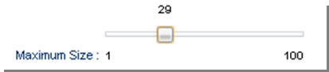   
spacer | a widget provided to fill a column when no other widget is required    Items within rows always fill from the leftmost available column. The spacer widget is provided to allow items to fill from other than the leftmost column.| The spacer widget displays nothing.
spinner | numeric spinner allowing users to either type or select a value using the arrows   Properties include:<li>min<li>max<li>step – the amount to increment/decrement for each arrow button press | 
staticImage | displays a static image |  
staticLink | hyperlink to a static URL  Properties:<li>ref – the URL<li>value - the value displayed in the link, this defaults to the URL if not supplied.<li>newWindow – whether the target will be displayed in a new window|  Not yet implemented.
textArea | basic data entry field for long text  textArea provides a *wrap* property to control whether the contained text is word wrapped. |
textField | provides basic data entry for text attributes    *textField* responds to the type of the bound attribute, and will display converter hint if the value is null.  For *date* and *dateTime* types, a calendar selector is displayed.|    This example is a *textField* widget bound to a text type attribute.   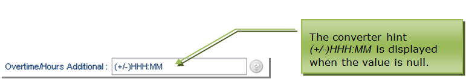   This example is a *textField* widget bound to a time attribute using the *HH\_MM* converter.      This example is a *textField* widget bound to a *date* or *dateTime* attribute. The calendar tool on the right will either include time or not depending on which of these types the attribute is.

### OnChange Event Action (Client-side Events)

*OnChange* event actions can be defined for the change of value of
widgets defined within a view.

  Event Action      Description
  ----------------- ------------------------------------------------------------------------------------------
  rerender          hits the server, reevaluates the UI conditions, but maintains user edits.
  server            executes a server-side action.
  setDisabled       sets the widget to disabled based on a condition.
  toggleDisabled    checks the state of the widget pointed to by the binding and toggles the disabled state.
  setInvisible      sets the widget to invisible based on a condition.
  toggleInvisible   checks the state of the widget pointed to by the binding and toggles the disabled state.

_Table 14 - OnChange Event Actions_

Multiple event actions can be defined for the single event, and the
order of execution will follow the order in which the handlers are
defined.

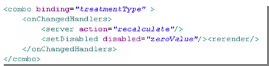-

_Figure 52 - Example of multiple onChangeHandlers_

### The lookupDescription Widget in Detail

The *lookupDescription* widget is unique to Skyve and offers
comprehensive ability to display and select document references.

  Property            | Description
  ------------------- | ---------------------
  binding             | The association attribute to which the widget is bound.
  descriptionBinding  | The binding in the associated document which will be displayed in the text box when an reference is selected. In most cases, the *descriptionBinding* will be set to the *bizKey* attribute of the reference, which defines a short text representation of the entire document being referenced.  *bizKey* is always available for query based widgets and does not need to be declared as a column within the query definition.
  disabled            | Controls whether all aspects of the widget are disabled.
  disableAdd          | Controls whether the Add function (New) is disabled (allowing on-the-fly creation of the foreign reference).
  disableClear        | Controls whether the Clear function is disable (clearing the reference).
  disableEdit         | Controls whether the Edit function is disabled (allowing on-the-fly editing of the foreign reference).
  disablePick         | Controls whether the Pick list is accessible.
  invisible           | Controls whether the entire widget is invisible.
  pixelWidth          | Width of the text box component in pixels.
  query               | By default, a *lookupDescription* will use the *defaultQuery* for the document specified in the association attribute declaration for both the combo/drop-down and pick list. If the association nominates a metadata query then this query will be used. If the widget nominates a query in this attribute, this query will be used.  Note that *bizKey* is always available for queries and does not need to be declared as a column in the query.

_Table 15 - Basic properties of the lookupDescription_

#### Multi-column Drop-down/Combo

By default the *lookupDescription* will display only the *bizKey* for
each row returned by the effective query in the drop-down. However,
*lookupDescription* can alternatively nominate a subset of query columns
for display in the drop-down.

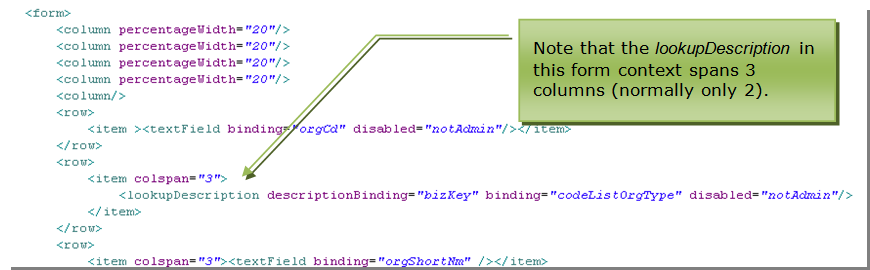

Figure 53 Example multi-column drop-down

Figure 54 Example rendering of the lookupDescription

#### Filter Parameters

Filter parameters can be applied to the *lookupDescription* widget,
which will apply additional filtering (over and above any filtering
defined in the applicable query). Filter parameters can be value (for a
static value) or binding (filtering the list of eligible references by
the value of a binding from the document being viewed).

Figure 55 Example of filter parameters

If *filterParameters* have been defined and the user creates a reference
on-the-fly (using the *Add*/*New* action), the created document will
have the *filterParameter* values set by default.

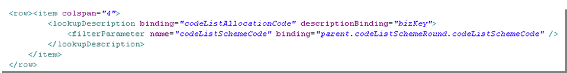
Figure 56 - Example lookupDescription with filterParameter_

In Figure 56 above, the *lookupDescription* for binding
*codeListAllocationCode* has a *filterParameter* using the current
document binding of *parent.codeListSchemeRound.codeListSchemeCode* used
as the filtering value on the column named *codeListSchemeCode* in the
related data set or query (using the name of the reference implies the
use of the *bizId* field).

If the user opts to create a new *codeListAllocationCode* reference,
then the attribute called *codeListSchemeCode* in the new
*codeListAllocationCode* instance will be set to the value of
*parent.codeListSchemeRound.codeListSchemeCode.*

Note that any number of *filterParameters* can be declared.

#### OnChange Handlers

Rather than a generic *OnChange* action event, the *lookupDescription*
offers the ability to define actions for each type of event which the
widget supports.

The available event handlers are:

-   *onAddedHandlers*,

-   *onClearedHandlers*,

-   *onEditedHandlers*, and

-   *onPickedHandlers*.

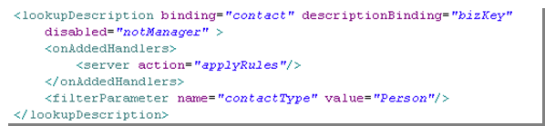

Figure 57 Example application of an onAddedHandler event action

In the above example, if the user sets a reference by creating a
document on-the-fly, the server-side action *applyRules* will be
executed after the Add action is completed.

The action events available are the same as for all other event actions
as described in Table 14. As with all *OnChanged* handlers, multiple
event actions can be executed for the same event.

### dataGrid

A *dataGrid* displays members of a collection.

The *dataGrid* widget has the following properties.

  Property                          | Description
  --------------------------------- | --------------------------------
  binding                           | the collection to which the grid is bound
  disabled                          | an overall control disabling all aspects of the grid  This setting overrides all other settings if *disabled* = true.
  disableAdd                        | disables the ability to add members to the collection (add button and context Add are disabled)
  disableEdit                       | disables the ability to edit within the grid (edit button and context Edit)
  disableRemove                     | disables the ability to remove members from the collection (remove button and context Remove are disabled)
  disableZoom                       | disables the ability to zoom into the member
  editable                          | removes all access to the grid toolbar
  inline                            | allows editing of the grid row in-line rather than by zooming into the member’s edit view
  invisible                         | hides the grid
  percentageHeight, percentageWidth | height and Width in terms of percentage of available space
  pixelHeight, pixelWidth           | height and Width in terms of pixels
  wrap                              | default setting for contained widgets which controls whether the display of text should wrap (expanding row sizes) or whether text should truncate (so that only text which fits in the column width is displayed)

_Table 16 - dataGrid properties_

By default, the *dataGrid* widget displays with an action tool bar
relevant for managing the collection. d*atagrids* support drag-drop for
ordering, provided this is allowed as per the declaration of the
collection.

_Figure 59 Example dataGrid definition of the dataGrid above._

#### Columns

Grid columns are bound to attributes of the collection member document –
the document specified in the declaration of the collection. If no input
widget is declared the column will use the default widget for the
attribute, or the default widget for the attribute type.

Column properties include:

  Property      | Description
  ------------- | -----------------------------------------------
  binding       | document attribute to which the column is bound
  title         | a column title to use instead of the attribute’s *displayName*
  editable      | controls whether the attribute is editable within the *dataGrid*
  pixelWidth    | width of the column in pixels
  textAlignment | alignment of the text displayed in the column (left, right or centre)
  type          | a default rendering hint for the value of the attribute

_Table 17 - dataGrid column properties_

Columns may also contain an input element, which defines the preferred
input widget when the value is edited, in preference to the default
widget.

### listGrid

Views may also contain an embedded *listGrid* which is identical to the
main list feature. A *listGrid* can be used for showing collections of
loosely related documents, for example, if the Contact view was required
to include a list of other Contacts with the same Post Code (even though
no formal relationship to a Post Code document is implemented).

*listGrid* events are not managed within the same transaction as other
events in the view.

For example, if a user zooms into a row of a *listGrid* the edit view
zoomed to will display *OK* and *Save* actions by default (unless the
edit view declares otherwise). Changes to the zoomed to document will be
in a separate transaction to any activity on the document in the view
where the *listGrid* is located.

  Property                           | Description
  ---------------------------------- | ---------------------------
  query                              | the query defining the results displayed in the grid. Unlike *lookupDescriptions*, which can use default document queries, *listGrid* must have a query nominated (and therefore declared in the *module.xml*)
  disabled                           | an overall control disabling all aspects of the grid
  disableAdd                         | disables the ability to add members to the collection (i.e. the *Add* button and context menu item *Add* are disabled)
  disableEdit                        | disables the ability to edit within the grid (i.e. the *Edit* button and context menu item *Edit*)
  disableRemove                      | disables the ability to remove members from the collection (i.e. the *Remove* button and context menu item Remove are disabled)
  disableZoom                        | disables the ability to zoom into the member
  invisible                          | hides the grid
  percentageHeight, percentageWidth  | height and width in terms of percentage of available space
  pixelHeight, pixelWidth            | height and width in terms of pixels
  title                              | the title of the *listGrid* (displayed above the *listGrid*)

_Table 18 - listGrid properties_

The ability to edit individual column values will be as declared by the
query unless the grid is disabled or editing is disabled using the
*disableEdit* property.

#### Filter Parameters

Filter parameters can be applied to the *listGrid* widget which will
apply additional filtering (over and above any filtering defined in the
applicable query).

Filter parameters can be *value* (for a static value) or *binding*
(filtering the list of eligible references by the value of a binding
from the document being viewed).

If *filterParameters* have been defined and the user creates a new
document from the grid (using the grid *Add* action), the created
document will have the *filterParameter* values set by default.

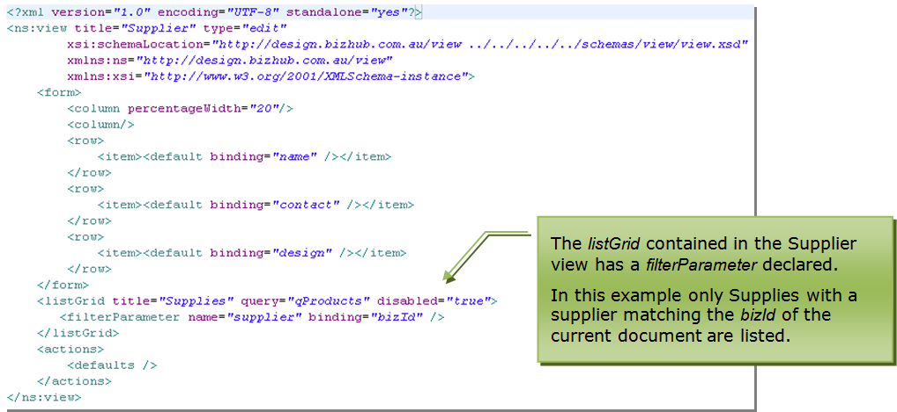

_Figure 60 Example listGrid with filterParameters_

In the example shown above, the *filterParameter* name “supplier”
corresponds to the binding of the “qProducts” query column being
filtered. The *filterParameter* binding “bizId” refers to the binding in
the current document view which provides the value for the filter (in
this case *bizId*). Note that the binding does not need to be included
in the view declaration to be able to be used for a *filterParameter*.

In the example above, the effect of filtering by binding bizId is that
the listGrid will only display products from the *qProducts* query where
the supplier column matches the supplier displayed in the view.

### Actions

The action section of the view declares which actions will be available
to the user and under what conditions.

There are three kinds of actions which can be declared: *Implicit*,
*Custom* or *Report*.

*Implicit* actions (determined automatically by Skyve) can be included
in the view as a group using the *&lt;defaults/&gt;* action declaration
(which provides a default set of *Implicit* actions implied by the
current user’s context and permissions).

Alternatively, default actions can be declared individually (e.g. *OK*,
*Save*, *Cancel* etc.).

*Custom* actions (defined as Java action classes) can also be included
in the view but must be declared in this section, even if the action
button will not be displayed in the *ActionPanel* but elsewhere in the
view.

*Report* actions (described below) provide access to defined report
objects and must also be declared in the actions section of the view.

_Figure 61 Example ActionPanel including Implicit, Custom and Report
actions_

***Tip:*** You must declare all actions in the action section even if
they will not appear in the ActionPanel.

Property | Description |
---------| ------------|
inActionPanel | controls whether the action button is included in the Action Panel at the top of the view   If a button is not to be displayed in the *ActionPanel* a button widget will be required elsewhere within the view for the action to be accessible.
displayName | the text which will appear on the button
className | the name of the Java action class to be executed when the button is pressed
confirm | a confirmation message to be displayed requesting confirmation by the user  If no confirmation message is supplied, no confirmation is requested.
disabled | whether the button is shown in a disabled state
invisible | whether the button is visible
relativeIconFileName | the filename of an icon which will be displayed together with the *displayName* on the button          Filenames are usually relative allowing the Skyve overriding mechanism to locate the absolute path to the file based on the context of the user.
toolTip | tooltip help to be displayed for the button

_Table 19 - View definition Action properties_

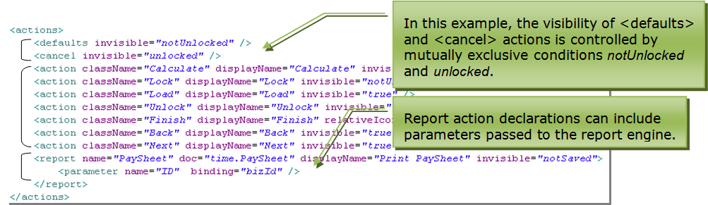
_Figure 62 - Example action declaration including Default, Custom and Report actions_

The example declaration in Figure 62 above declares default actions
using the *&lt;defaults&gt;* action set and the *&lt;cancel&gt;* action,
using mutually exclusive conditions. Numerous *Custom* actions are
declared as well as a report action.

### Report Action

*Report* actions declared in a view must reference valid reports
(*\*.jrxml* files) and are a special case of actions.

*Report* actions declarations can include parameters passed to the
report engine (see Figure 62).

Report parameter declarations can be in terms of bindings (within the
currently viewed document) or static values. Report parameters are
matched using the name attribute with parameters declared in the report.

In addition to the generic action properties, *Report* actions must
include a *doc* attribute which declares the location of the report
template file relative to the *module.document* package.

Report actions are not declared within role definitions in the
*module.xml*.

### New Parameter

The *newParameter* section enables the context of one view to be passed
to another view, when new documents are being created.

For example, if a view contains a *listGrid* which is filtered for
Contacts of type *Person* and the user adds a row to the *listGrid* in
that context, the fact that this new row implicitly belongs to a
filtered set needs to be passed, and so the *Person* type value should
be set by default in the new Contact. (It would be unexpected for
example, to add a new row to a list of *Person* type Contacts which is
not a *Person* type Contact.)

For parameters to be passed in this way, the *newParameters* named in
the target view must match the names of the *filterParameters* being
passed.

The name of each *newParameter* in the target view matches a binding in
the document of the target view. The binding does not need to be present
in the target view definition, but it must be a valid binding in the
target document.

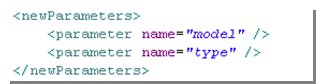

_Figure 63 - Example newParameters section_

**[⬆ back to top](#contents)**

---
**Next [Chapter 12: Actions](./../chapters/actions.md)**  
**Previous [Chapter 10: Bizlets](./../chapters/bizlets.md)**
