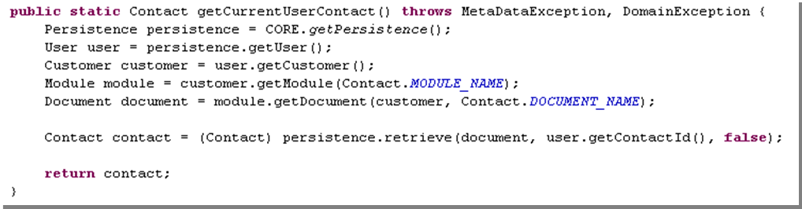
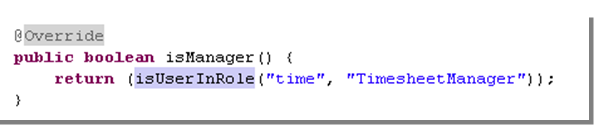
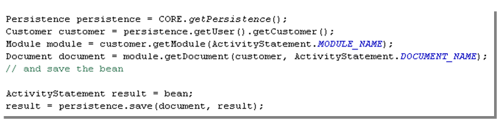
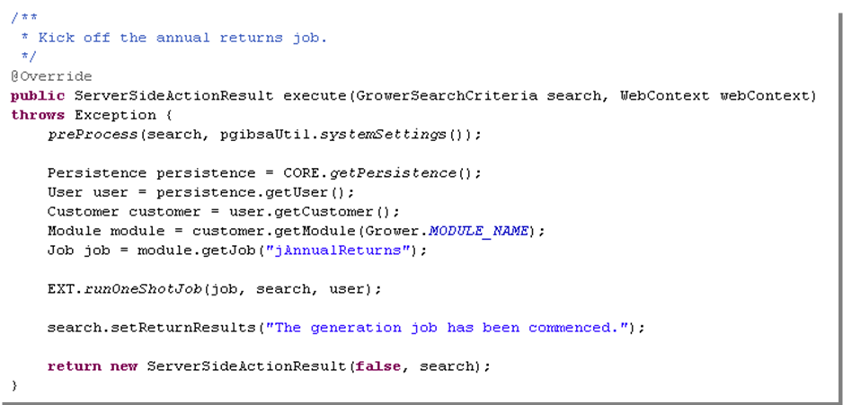
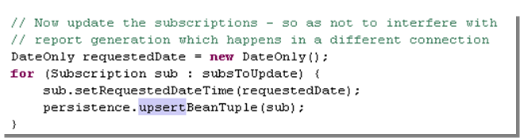
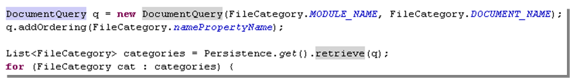
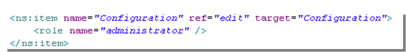
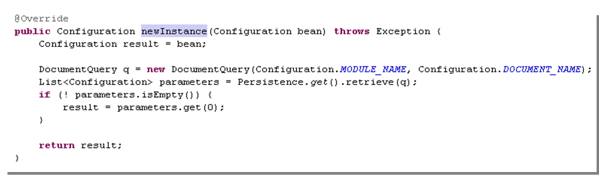

## Views

### Contents

[Views](#views)

[Containers](#containers)

[Autofit Behaviour](#autofit-behaviour)

[Form](#form)

[Form Example](#form-example)

[Table](#table)

[Item](#item)

[Widget](#widget)

[OnChange Event Action (Client-side Events)](#onchange-event-action-client-side-events)

[The lookupDescription Widget in Detail](#the-lookupdescription-widget-in-detail)

[Multi-column Drop-down/Combo](#multi-column-drop-downcombo)

[Filter Parameters](#filter-parameters)

[OnChange Handlers](#onchange-handlers)

[dataGrid](#datagrid)

[Columns](#columns)

[listGrid](#listgrid)

[Filter Parameters](#filter-parameters-1)

[Actions](#actions-1)

[Report Action](#report-action)

[New Parameter](#new-parameter)

[Actions](#actions-2)

[OnChange Event Actions (Client-side Events)](#onchange-event-actions-client-side-events)

[Reports](#reports)

[Custom Reports](#custom-reports)

[Automatic Customer Resource Parameter](#automatic-customer-resource-parameter)

[Object data source](#object-data-source)

[Ad-hoc Reports](#ad-hoc-reports)

[Offline Reporting Jobs](#offline-reporting-jobs)

[Jobs](#jobs)

[Job Classes](#job-classes)

[Utility Classes](#utility-classes)

[Persistence](#persistence)

[Insecure SQL](#insecure-sql)

[DocumentQuery](#documentquery)

[Common Patterns](#common-patterns)

[Identify Current User Contact](#identify-current-user-contact)

[Identify if Current User has Role](#identify-if-current-user-has-role)

[Save a Document Instance](#save-a-document-instance)

[Instantiate a New Document Instance](#instantiate-a-new-document-instance)

[Building a Variant Domain List](#building-a-variant-domain-list)

[Schedule an Offline Job](#schedule-an-offline-job)

[Persist Scalar Values Without Traversing Bean Structure](#persist-scalar-values-without-traversing-bean-structure)

[Retrieve and Iterate Through Beans](#retrieve-and-iterate-through-beans)

[Singleton Documents (Parameter /Configuration Documents)](#singleton-documents-parameter-configuration-documents)

[User-scoped Documents (Personal preferences Documents)](#user-scoped-documents-personal-preferences-documents)

[Customise Document and Document Attribute Names](#customise-document-and-document-attribute-names)

[Persistence](#persistence-1)

[Skyve Persistence Mechanisms](#skyve-persistence-mechanisms)

[Generic Naming Conventions](#generic-naming-conventions)

[Relationship naming convention](#relationship-naming-convention)

[Ordering and bizOrdinal](#ordering-and-bizordinal)

[UUID Enterprise-level Guaranteed Uniqueness](#uuid-enterprise-level-guaranteed-uniqueness)

[Optimistic Lock concurrency controls](#optimistic-lock-concurrency-controls)

[Enterprise-wide consistent reference representation](#enterprise-wide-consistent-reference-representation)

[Multi-tenant Support](#multi-tenant-support)

[Collaborative record flagging](#collaborative-record-flagging)

[Document scoping row-level security & source identification](#document-scoping-row-level-security-source-identification)

[Platform Tools](#platform-tools)

[Ant Utilities](#ant-utilities)

[Generate Domain](#generate-domain)

[Generate a Default Edit View](#generate-a-default-edit-view)

[Generating a Deployable Archive - copyProdEAR](#generating-a-deployable-archive---copyprodear)

[Javadoc](#javadoc)

[Content Repository Tools](#content-repository-tools)

[Backing up the Repository](#backing-up-the-repository)

[Reindexing the Repository](#reindexing-the-repository)

[Bizport](#bizport-1)

[Working With Bizport](#working-with-bizport)

[Using Bizport](#using-bizport)

[To enter bulk data using Bizport](#to-enter-bulk-data-using-bizport)

[To remove bulk data using Bizport](#to-remove-bulk-data-using-bizport)

[WILDCAT Conversion Tool](#wildcat-conversion-tool)

[NOTE: Refer to the WCT developer guide for full details. Using the Skyve Converstion Tool (WCT)](#note-refer-to-the-wct-developer-guide-for-full-details.-using-the-skyve-converstion-tool-wct)

[Development Approach and Roundtripping](#development-approach-and-roundtripping)

[Report Conversion](#report-conversion)

[Appendix](#appendix)

[Appendix 1. Deploying a Skyve Application](#deploying-a-skyve-application)

[Appendix 2. Installing and configuring the Skyve Development Environment](#installing-and-configuring-the-skyve-development-environment)

[Prerequisites checklist](#prerequisites-checklist)

[Configuring Java](#configuring-java)

[Configuring the IDE (Windows example)](#configuring-the-ide-windows-example)

[Configuring the workspace](#configuring-the-workspace)

[Importing Projects](#importing-projects)

[Creating the server](#creating-the-server)

[Configuring JBoss](#configuring-jboss)

[Starting the server](#starting-the-server)

[Deploying your solution](#deploying-your-solution)

[Appendix 3. Example Deployment Instructions with Single Sign-on](#example-deployment-instructions-with-single-sign-on)

View definition files override the default detail view (generated by
Skyve).

View files are located within the *views* folder in the document
package. Typically, users interact with a detail view after zooming into
the document from a list.

Two detail views can be declared for each document.

  ----------------------------------------------------------------------------------------------------------------------------------------------------------------------------------------------------------------------------------------------------------------------------------------------------------------------------------------------------------------------------------------------------------------------------------
  View         Description
  ------------ ---------------------------------------------------------------------------------------------------------------------------------------------------------------------------------------------------------------------------------------------------------------------------------------------------------------------------------------------------------------------------------------------------------------------
  edit.xml     The basic view definition for detail editing of a bean (normally accessed by zooming into a row from a list).

               Menu items can also target edit views directly. In this case the menu item will trigger newInstance() and a new document instance will be returned (and therefore displayed). To show a singleton (a document instance which is the only applicable existing instance within the context), the newInstance() method can be overridden to select and return an existing bean in place of the newly created instance.

               If a *create.xml* is supplied, the *edit.xml* file is only used after the document is created.

  create.xml   A special case of edit view which is used if *create,xml* supplied and if *isCreated*() is false.
  ----------------------------------------------------------------------------------------------------------------------------------------------------------------------------------------------------------------------------------------------------------------------------------------------------------------------------------------------------------------------------------------------------------------------------------

Table 10 View definition files

Containers {#containers .Chaptersubheading}
----------

Containers are layout devices which contain other elements.

Containers share basic properties:

  -------------------------------------------------------------------------------------------------------------------------
  Property           Description
  ------------------ ------------------------------------------------------------------------------------------------------
  invisible          Whether the container (and contents) are invisible to the user.

                     Invisibility may be set to *true*, *false* or the result of a declared condition.

  percentageHeight   Percentage of the vertical visible area over which the container (and contents) will be stretched.

  percentageWidth    Percentage of the horizontal visible area over which the container (and contents) will be stretched.

  pixelWidth         Width of the container in pixels.

  pixelHeight        Height of the container in pixels.
  -------------------------------------------------------------------------------------------------------------------------

Table 11 Basic container properties

### Autofit Behaviour {#autofit-behaviour .Sectionheading}

Rendering behaviour is specific to browsers, however Skyve will attempt
to render the view as declared. Unless pixel sizes are specified, Skyve
will stretch view elements to cover the available window size, according
to the proportions and layout properties defined in the view.

Where the absolute size of the view exceeds the window space available,
the view will render with scroll bars. Containers may overflow if the
view definition doesn’t adequately take account of the number and nature
of items contained.

  ----------------------------------------------------------------------------------------------------------------------------------------------------------------------------------------------------------------------------------------------------------------------------------------------------------------------------------------------------------
  Container      Description                                                                        Specific Properties                                                                                                                                                 Example
  -------------- ---------------------------------------------------------------------------------- ------------------------------------------------------------------------------------------------------------------------------------------------------------------- ------------------------------------------------------------------------------------
  hbox           Elements are laid out horizontally in the view and may contain other containers.   -   border – whether a border is displayed

                                                                                                    -   borderTitle – the text to be displayed as a border title

                                                                                                    -   pixelMemberPadding – padding (in pixels) between members

                                                                                                    -   pixelPadding – padding (in pixels) around all members

  vbox           Elements are laid out vertically in the view and may contain other containers.     -   border – whether a border is visible

                                                                                                    -   borderTitle – the text to be displayed as a border title

                                                                                                    -   pixelMemberPadding – padding (in pixels) between members

                                                                                                    -   pixelPadding – padding (in pixels) around all members

  tabPane, tab   A tab pane contains tabs.                                                          -   name – a logical way of referring to the tabPane                                                                                                                {width="3.5305555555555554in" height="2.2270833333333333in"}

                 Tabs may contain other containers.                                                 -   disabled – whether the tabPane is disabled

                                                                                                    -   disabled (tab) – whether the tab is disabled. A disabled tab will display the tab header, but cannot be accessed.

                                                                                                    -   title (tab) – the title of the tab

                                                                                                    -   selected (tab) – whether the tab is opened by default when the view is accessed. Selected can be set to *true*, *false* or the result of a defined condition.

  ----------------------------------------------------------------------------------------------------------------------------------------------------------------------------------------------------------------------------------------------------------------------------------------------------------------------------------------------------------

Table 12 View containers

Form {#form .Chaptersubheading}
----

Forms contain columns and rows. Rows may only contain items.

Columns may be defined with or without *pixelWidth* or
*percentageWidth*. If no width type is displayed, the column will be
sized according to the impact of other elements of the view.
p*ercentageWidth* will size the column accordingly, provided this is
possible.

### Form Example {#form-example .Sectionheading}

{width="4.711805555555555in"
height="0.9395833333333333in"}

Figure 50 Example form definition

In the above example, 3 columns are declared. The two rows contain only
a single widget, however the textField and textArea widgets include
labels. These widgets therefore fill the two leftmost columns, leaving
the third column empty. Together the 3 columns stretch the width of the
entire available horizontal window space.

{width="5.136111111111111in"
height="1.1513888888888888in"}

Figure 51 Example form with 3 columns and 2 rows (with dotted lines
showing column boundaries)

Most widgets span two columns – one for the widget label and one for the
actual widget itself. If the number of columns exceeds the number of
columns declared in the form, the row will overflow to another row. The
*spacer* widget is provided to allow position of widgets to odd columns
and for widgets with no label component.

Items within rows always fill from the leftmost available column. The
*spacer* widget is provided to allow items to fill from other than the
leftmost column.

If two unsized columns are defined, they will be stretched so that each
column will fill the available horizontal space. If one column is sized
and the other is not, the unsized column will stretch to fill the rest
of the available horizontal space.

***Tip:*** To allow the view to autofit and resize correctly, leave at
least one column unsized.

Table {#table .Chaptersubheading}
-----

Deprecated. This feature is now met by using a disabled dataGrid.

Item {#item .Chaptersubheading}
----

  Property     Description
  ------------ ----------------------------------------------------------------------------------------------------------------------------------------------
  align        Controls alignment of the item (left, right or centre).
  colspan      The number of columns which the item spans.
  label        A label to be displayed irrespective of the type of widget the item contains.
  labelAlign   Controls the alignment of the item label.
  required     Whether the contained widget must have a value set before any actions can be completed.
  rowspan      The number of rows which the item spans.
  showHelp     Whether the contained widget will include a tooltip help icon button, for a widget with an attribute which has a *shortDescription* defined.
  showLabel    Whether the label of the contained widget will be displayed.

Table 13 Item properties

 {#section-15 .Chaptersubheading}

Widget {#widget .Chaptersubheading}
------

Skyve provides a number of view widgets, which can also be defined as
document attribute defaultWidget. When widgets contain labels, the label
will be displayed in bold type if the attribute is required.

  ------------------------------------------------------------------------------------------------------------------------------------------------------------------------------------------------------------------------------------------------------------------------------------------------------------------------------------------------------------------------------------------------------------------------------------------------
  Widget              Description                                                                                                                                                                                                             Example
  ------------------- ----------------------------------------------------------------------------------------------------------------------------------------------------------------------------------------------------------------------- ----------------------------------------------------------------------------------------------------------------------------------------------------------------------------------------------------
  button              can be placed within the view when the *inActionPanel* flag for an Action is set to *false*

                      If the Action is declared to be in the Action Panel, then no button widget is required to be declared.

  checkBox            Tri-state check box

  colourPicker        displays a text box containing the colour code value together with a sample square of the colour                                                                                                                        In this example, the colour button at the RHS will open a colour selector as shown below:

                      Clicking on the sample square activates a colour selector popup.

  combo               drop-down selector for enumerations or where a domain type is specified for the document attribute

  contentImage        displays the loaded image along with an upload action

  contentLink         displays a hyperlink to open the content in a new browers window together with an upload action

  default             If used in a view, this will render whatever the default widget is.

                      Either the *defaultWidget* declared on the document attribute or the Skyve default control for the attribute type.

  dialogButton        Not yet implemented.

  geoLocator          Geolocator will render a Map button, when pressed, a Geolocation window will appear with a pointer to the address or position bound to the Geolocator widget.                                                           In this example, the Map button is displayed. When clicked, the geolocator (shown below) will be displayed in a modal window.

                      A new address or location can be selected within the Geolocator Map if the Geolocator is not disabled.                                                                                                                  {width="4.302777777777778in" height="2.863888888888889in"}

                      The Geolocator Widget has multiple bindings which interact with the map:

                      -   addressBinding

                      -   cityBinding

                      -   stateBinding

                      -   postcodeBinding

                      -   countryBinding

                      -   latitudeBinding

                      -   longitudeBinding

  html                displays HTML content together with an Edit button                                                                                                                                                                      {width="5.636111111111111in" height="3.060416666666667in"}

                      When the edit button is clicked, a popup HTML editor window is displayed allowing users to create rich HTML.

  label               Simple text.                                                                                                                                                                                                            {width="0.9243055555555556in" height="0.21180555555555555in"}

  lookup              Deprecated.

  lookupDescription   *lookupDescription* is used to display an association to another document, and combines a combo with a pick button.                                                                                                     In this example the *bizKey* of the currently associated document instance is displayed in the control. To use another attribute change the lookupDescription’s *descriptionBinding* attribute.

                      Users may select a value from the combo, or type values into the text box which will locate a matching value in the combo drop-down list if found.                                                                      If the Pick button is clicked, a listGrid of eligible document instances is shown in a modal window.

                      When the pick button is pressed, a Pick window containing a listGrid is displayed, showing eligible values as declared in the document association.                                                                     {width="5.409027777777778in" height="3.0756944444444443in"}

                      Whereas normally double-clicking in a grid will zoom into the row, double-clicking in a Pick grid will select that value, close the popup and set the value of the *lookupDescription* combo next to the Pick button.   The down-arrow selector button will display options for Edit (edit the referenced document on-the-fly), New (create a new potential reference on-the-fly) and Clear (clear the reference).

                      The down-arrow button reveals options to Edit (i.e. Zoom), New or Clear the reference.                                                                                                                                  {width="1.4243055555555555in" height="0.7881944444444444in"}

                      More features of the *lookupDescription* are explained in the next section.

  password            a textField which obfuscates the entered value

  progressBar         Not yet implemented.

  radio               radio selector for enumerations or for document attributes where a domain type is specified                                                                                                                             Vertical arrangement is the default arrangement for radio selectors when no arrangement is specified.

                      Radios may be laid out vertically or horizontally, using the property *vertical*.

  richText            provides a rich text area together with formatting toolbar                                                                                                                                                              {width="4.151388888888889in" height="0.8784722222222222in"}

  slider              Numeric slider.

                      Properties include:

                      -   min

                      -   max

                      -   numberOfDiscreteValues

                      -   roundingPrecision

                      May be displayed vertically when *vertical* is set to *true*.

  spacer              a widget provided to fill a column when no other widget is required                                                                                                                                                     The spacer widget displays nothing.

                      Items within rows always fill from the leftmost available column. The spacer widget is provided to allow items to fill from other than the leftmost column.

  spinner             numeric spinner allowing users to either type or select a value using the arrows

                      Properties include:

                      -   min

                      -   max

                      -   step – the amount to increment/decrement for each arrow button press

  staticImage         displays a static image                                                                                                                                                                                                 {width="1.2881944444444444in" height="0.8784722222222222in"}

  staticLink          hyperlink to a static URL                                                                                                                                                                                               Not yet implemented.

                      Properties:

                      -   ref – the URL

                      -   value - the value displayed in the link, this defaults to the URL if not supplied.

                      -   newWindow – whether the target will be displayed in a new window

  textArea            basic data entry field for long text                                                                                                                                                                                    {width="4.560416666666667in" height="0.8180555555555555in"}

                      textArea provides a *wrap* property to control whether the contained text is word wrapped.

  textField           provides basic data entry for text attributes                                                                                                                                                                           This example is a *textField* widget bound to a text type attribute.

                      *textField* responds to the type of the bound attribute, and will display converter hint if the value is null.                                                                                                          This example is a *textField* widget bound to a time attribute using the *HH\_MM* converter.

                      For *date* and *dateTime* types, a calendar selector is displayed.                                                                                                                                                      This example is a *textField* widget bound to a *date* or *dateTime* attribute. The calendar tool on the right will either include time or not depending on which of these types the attribute is.
  ------------------------------------------------------------------------------------------------------------------------------------------------------------------------------------------------------------------------------------------------------------------------------------------------------------------------------------------------------------------------------------------------------------------------------------------------

 {#section-16 .Chaptersubheading}

OnChange Event Action (Client-side Events) {#onchange-event-action-client-side-events .Chaptersubheading}
------------------------------------------

*OnChange* event actions can be defined for the change of value of
widgets defined within a view.

  Event Action      Description
  ----------------- ------------------------------------------------------------------------------------------
  rerender          hits the server, reevaluates the UI conditions, but maintains user edits.
  server            executes a server-side action.
  setDisabled       sets the widget to disabled based on a condition.
  toggleDisabled    checks the state of the widget pointed to by the binding and toggles the disabled state.
  setInvisible      sets the widget to invisible based on a condition.
  toggleInvisible   checks the state of the widget pointed to by the binding and toggles the disabled state.

[]{#_Ref316474931 .anchor}Table 14 OnChange Event Actions

Multiple event actions can be defined for the single event, and the
order of execution will follow the order in which the handlers are
defined.

{width="3.484722222222222in" height="0.7881944444444444in"} {#section-17 .Picture}
----------------------------------------------------------------------------------

Figure 52 Example of multiple onChangeHandlers

The lookupDescription Widget in Detail {#the-lookupdescription-widget-in-detail .Chaptersubheading}
--------------------------------------

The *lookupDescription* widget is unique to Skyve and offers
comprehensive ability to display and select document references.

  ------------------------------------------------------------------------------------------------------------------------------------------------------------------------------------------------------------------------------------------------------------------------------------------------------------------------------------------------------------
  Property             Description
  -------------------- ---------------------------------------------------------------------------------------------------------------------------------------------------------------------------------------------------------------------------------------------------------------------------------------------------------------------------------------
  binding              The association attribute to which the widget is bound.

  descriptionBinding   The binding in the associated document which will be displayed in the text box when an reference is selected. In most cases, the *descriptionBinding* will be set to the *bizKey* attribute of the reference, which defines a short text representation of the entire document being referenced.

                       *bizKey* is always available for query based widgets and does not need to be declared as a column within the query definition.

  disabled             Controls whether all aspects of the widget are disabled.

  disableAdd           Controls whether the Add function (New) is disabled (allowing on-the-fly creation of the foreign reference).

  disableClear         Controls whether the Clear function is disable (clearing the reference).

  disableEdit          Controls whether the Edit function is disabled (allowing on-the-fly editing of the foreign reference).

  disablePick          Controls whether the Pick list is accessible.

  invisible            Controls whether the entire widget is invisible.

  pixelWidth           Width of the text box component in pixels.

  query                By default, a *lookupDescription* will use the *defaultQuery* for the document specified in the association attribute declaration for both the combo/drop-down and pick list. If the association nominates a metadata query then this query will be used. If the widget nominates a query in this attribute, this query will be used.

                       Note that *bizKey* is always available for queries and does not need to be declared as a column in the query.
  ------------------------------------------------------------------------------------------------------------------------------------------------------------------------------------------------------------------------------------------------------------------------------------------------------------------------------------------------------------

Table 15 Basic properties of the lookupDescription

### Multi-column Drop-down/Combo {#multi-column-drop-downcombo .Sectionheading}

By default the *lookupDescription* will display only the *bizKey* for
each row returned by the effective query in the drop-down. However,
*lookupDescription* can alternatively nominate a subset of query columns
for display in the drop-down.

{width="6.878472222222222in"
height="2.0756944444444443in"}

Figure 53 Example multi-column drop-down

{width="5.151388888888889in"
height="1.757638888888889in"}

Figure 54 Example rendering of the lookupDescription

### Filter Parameters {#filter-parameters .Sectionheading}

Filter parameters can be applied to the *lookupDescription* widget,
which will apply additional filtering (over and above any filtering
defined in the applicable query). Filter parameters can be value (for a
static value) or binding (filtering the list of eligible references by
the value of a binding from the document being viewed).

{width="4.136111111111111in"
height="0.5152777777777777in"}

Figure 55 Example of filter parameters

If *filterParameters* have been defined and the user creates a reference
on-the-fly (using the *Add*/*New* action), the created document will
have the *filterParameter* values set by default.

{width="6.969444444444444in"
height="0.7881944444444444in"}

[]{#_Ref320182505 .anchor}Figure 56 Example lookupDescription with
filterParameter

In Figure 56 above, the *lookupDescription* for binding
*codeListAllocationCode* has a *filterParameter* using the current
document binding of *parent.codeListSchemeRound.codeListSchemeCode* used
as the filtering value on the column named *codeListSchemeCode* in the
related data set or query (using the name of the reference implies the
use of the *bizId* field).

If the user opts to create a new *codeListAllocationCode* reference,
then the attribute called *codeListSchemeCode* in the new
*codeListAllocationCode* instance will be set to the value of
*parent.codeListSchemeRound.codeListSchemeCode.*

Note that any number of *filterParameters* can be declared.

### OnChange Handlers {#onchange-handlers .Sectionheading}

Rather than a generic *OnChange* action event, the *lookupDescription*
offers the ability to define actions for each type of event which the
widget supports.

The available event handlers are:

-   *onAddedHandlers*,

-   *onClearedHandlers*,

-   *onEditedHandlers*, and

-   *onPickedHandlers*.

{width="4.302777777777778in"
height="0.9548611111111112in"}

Figure 57 Example application of an onAddedHandler event action

In the above example, if the user sets a reference by creating a
document on-the-fly, the server-side action *applyRules* will be
executed after the Add action is completed.

The action events available are the same as for all other event actions
as described in Table 14. As with all *OnChanged* handlers, multiple
event actions can be executed for the same event.

dataGrid {#datagrid .Chaptersubheading}
--------

A *dataGrid* displays members of a collection.

The *dataGrid* widget has the following properties.

  --------------------------------------------------------------------------------------------------------------------------------------------------------------------------------------------------------------------------------------------------------
  Property                            Description
  ----------------------------------- --------------------------------------------------------------------------------------------------------------------------------------------------------------------------------------------------------------------
  binding                             the collection to which the grid is bound

  disabled                            an overall control disabling all aspects of the grid

                                      This setting overrides all other settings if *disabled* = true.

  disableAdd                          disables the ability to add members to the collection (add button and context Add are disabled)

  disableEdit                         disables the ability to edit within the grid (edit button and context Edit)

  disableRemove                       disables the ability to remove members from the collection (remove button and context Remove are disabled)

  disableZoom                         disables the ability to zoom into the member

  editable                            removes all access to the grid toolbar

  inline                              allows editing of the grid row in-line rather than by zooming into the member’s edit view

  invisible                           hides the grid

  percentageHeight, percentageWidth   height and Width in terms of percentage of available space

  pixelHeight, pixelWidth             height and Width in terms of pixels

  wrap                                default setting for contained widgets which controls whether the display of text should wrap (expanding row sizes) or whether text should truncate (so that only text which fits in the column width is displayed)
  --------------------------------------------------------------------------------------------------------------------------------------------------------------------------------------------------------------------------------------------------------

Table 16 dataGrid properties

By default, the *dataGrid* widget displays with an action tool bar
relevant for managing the collection. d*atagrids* support drag-drop for
ordering, provided this is allowed as per the declaration of the
collection.

{width="6.075694444444444in"
height="1.6819444444444445in"}

Figure 58 Example dataGrid

Columns may contain a specific input widget if required (e.g. textFied)
or use the default widget for that attribute type (shown above) when not
specified.

The above *dataGrid* could also be declared in the view (e.g. *edit.xml*
file) with a specific input as follows:

{width="4.89375in" height="1.1819444444444445in"}

Figure 59 Example dataGrid definition of the dataGrid above.

### Columns {#columns .Sectionheading}

Grid columns are bound to attributes of the collection member document –
the document specified in the declaration of the collection. If no input
widget is declared the column will use the default widget for the
attribute, or the default widget for the attribute type.

Column properties include:

  Property        Description
  --------------- -----------------------------------------------------------------------
  binding         document attribute to which the column is bound
  title           a column title to use instead of the attribute’s *displayName*
  editable        controls whether the attribute is editable within the *dataGrid*
  pixelWidth      width of the column in pixels
  textAlignment   alignment of the text displayed in the column (left, right or centre)
  type            a default rendering hint for the value of the attribute

Table 17 dataGrid column properties

Columns may also contain an input element, which defines the preferred
input widget when the value is edited, in preference to the default
widget.

listGrid {#listgrid .Chaptersubheading}
--------

Views may also contain an embedded *listGrid* which is identical to the
main list feature. A *listGrid* can be used for showing collections of
loosely related documents, for example, if the Contact view was required
to include a list of other Contacts with the same Post Code (even though
no formal relationship to a Post Code document is implemented).

*listGrid* events are not managed within the same transaction as other
events in the view.

For example, if a user zooms into a row of a *listGrid* the edit view
zoomed to will display *OK* and *Save* actions by default (unless the
edit view declares otherwise). Changes to the zoomed to document will be
in a separate transaction to any activity on the document in the view
where the *listGrid* is located.

  Property                            Description
  ----------------------------------- ----------------------------------------------------------------------------------------------------------------------------------------------------------------------------------------------------------------
  query                               the query defining the results displayed in the grid. Unlike *lookupDescriptions*, which can use default document queries, *listGrid* must have a query nominated (and therefore declared in the *module.xml*)
  disabled                            an overall control disabling all aspects of the grid
  disableAdd                          disables the ability to add members to the collection (i.e. the *Add* button and context menu item *Add* are disabled)
  disableEdit                         disables the ability to edit within the grid (i.e. the *Edit* button and context menu item *Edit*)
  disableRemove                       disables the ability to remove members from the collection (i.e. the *Remove* button and context menu item Remove are disabled)
  disableZoom                         disables the ability to zoom into the member
  invisible                           hides the grid
  percentageHeight, percentageWidth   height and width in terms of percentage of available space
  pixelHeight, pixelWidth             height and width in terms of pixels
  title                               the title of the *listGrid* (displayed above the *listGrid*)

Table 18 listGrid properties

The ability to edit individual column values will be as declared by the
query unless the grid is disabled or editing is disabled using the
*disableEdit* property.

### Filter Parameters {#filter-parameters-1 .Sectionheading}

Filter parameters can be applied to the *listGrid* widget which will
apply additional filtering (over and above any filtering defined in the
applicable query).

Filter parameters can be *value* (for a static value) or *binding*
(filtering the list of eligible references by the value of a binding
from the document being viewed).

If *filterParameters* have been defined and the user creates a new
document from the grid (using the grid *Add* action), the created
document will have the *filterParameter* values set by default.

{width="6.211805555555555in"
height="3.363888888888889in"}

Figure 60 Example listGrid with filterParameters

In the example shown above, the *filterParameter* name “supplier”
corresponds to the binding of the “qProducts” query column being
filtered. The *filterParameter* binding “bizId” refers to the binding in
the current document view which provides the value for the filter (in
this case *bizId*). Note that the binding does not need to be included
in the view declaration to be able to be used for a *filterParameter*.

In the example above, the effect of filtering by binding bizId is that
the listGrid will only display products from the *qProducts* query where
the supplier column matches the supplier displayed in the view.

Actions {#actions-1 .Chaptersubheading}
-------

The action section of the view declares which actions will be available
to the user and under what conditions.

There are three kinds of actions which can be declared: *Implicit*,
*Custom* or *Report*.

*Implicit* actions (determined automatically by Skyve) can be included
in the view as a group using the *&lt;defaults/&gt;* action declaration
(which provides a default set of *Implicit* actions implied by the
current user’s context and permissions).

Alternatively, default actions can be declared individually (e.g. *OK*,
*Save*, *Cancel* etc.).

*Custom* actions (defined as Java action classes) can also be included
in the view but must be declared in this section, even if the action
button will not be displayed in the *ActionPanel* but elsewhere in the
view.

*Report* actions (described below) provide access to defined report
objects and must also be declared in the actions section of the view.

{width="4.439583333333333in"
height="1.9243055555555555in"}

Figure 61 Example ActionPanel including Implicit, Custom and Report
actions

***Tip:*** You must declare all actions in the action section even if
they will not appear in the ActionPanel.

  ----------------------------------------------------------------------------------------------------------------------------------------------------------------------------
  Property               Description
  ---------------------- -----------------------------------------------------------------------------------------------------------------------------------------------------
  inActionPanel          controls whether the action button is included in the Action Panel at the top of the view

                         If a button is not to be displayed in the *ActionPanel* a button widget will be required elsewhere within the view for the action to be accessible.

  displayName            the text which will appear on the button

  className              the name of the Java action class to be executed when the button is pressed

  confirm                a confirmation message to be displayed requesting confirmation by the user

                         If no confirmation message is supplied, no confirmation is requested.

  disabled               whether the button is shown in a disabled state

  invisible              whether the button is visible

  relativeIconFileName   the filename of an icon which will be displayed together with the *displayName* on the button

                         Filenames are usually relative allowing the Skyve overriding mechanism to locate the absolute path to the file based on the context of the user.

  toolTip                tooltip help to be displayed for the button
  ----------------------------------------------------------------------------------------------------------------------------------------------------------------------------

[[]{#_Ref316463427 .anchor}]{#_Ref316463423 .anchor}Table 19 View
definition Action properties

{width="6.227083333333334in"
height="1.8486111111111112in"}

[]{#_Ref316498559 .anchor}Figure 62 Example action declaration including
Default, Custom and Report actions

The example declaration in Figure 62 above declares default actions
using the *&lt;defaults&gt;* action set and the *&lt;cancel&gt;* action,
using mutually exclusive conditions. Numerous *Custom* actions are
declared as well as a report action.

Report Action {#report-action .Chaptersubheading}
-------------

*Report* actions declared in a view must reference valid reports
(*\*.jrxml* files) and are a special case of actions.

*Report* actions declarations can include parameters passed to the
report engine (see Figure 62).

Report parameter declarations can be in terms of bindings (within the
currently viewed document) or static values. Report parameters are
matched using the name attribute with parameters declared in the report.

In addition to the generic action properties, *Report* actions must
include a *doc* attribute which declares the location of the report
template file relative to the *module.document* package.

Report actions are not declared within role definitions in the
*module.xml*.

New Parameter {#new-parameter .Chaptersubheading}
-------------

The *newParameter* section enables the context of one view to be passed
to another view, when new documents are being created.

For example, if a view contains a *listGrid* which is filtered for
Contacts of type *Person* and the user adds a row to the *listGrid* in
that context, the fact that this new row implicitly belongs to a
filtered set needs to be passed, and so the *Person* type value should
be set by default in the new Contact. (It would be unexpected for
example, to add a new row to a list of *Person* type Contacts which is
not a *Person* type Contact.)

For parameters to be passed in this way, the *newParameters* named in
the target view must match the names of the *filterParameters* being
passed.

The name of each *newParameter* in the target view matches a binding in
the document of the target view. The binding does not need to be present
in the target view definition, but it must be a valid binding in the
target document.

{width="2.2270833333333333in"
height="0.5451388888888888in"}

Figure 63 Example newParameters section

Actions {#actions-2 .ChapterHeading}
=======

*Implicit Actions* are actions which are provided by Skyve by default
based on the context of the current user gesture. By default, a Skyve
view will contain a default collection of *Implicit* actions.

Skyve provides the following Implicit Actions:

  ImplicitActionName   Description
  -------------------- -------------------------------------------------------------------------------------------------
  DEFAULTS             A way to refer to the default set of *Implicit* actions for the view type and gesture context
  OK                   *OK* button pressed by user while viewing the document edit view
  Save                 *Save* button pressed by user while viewing the document edit view
  Delete               *Delete* button pressed by user while viewing the document edit view
  Add                  *Add* button pressed by user while viewing the child document edit view
  ZoomOut              *Zoom Out* button pressed by user while viewing the child document edit view
  Cancel               *Cancel* button pressed by user either at document or child-document edit view
  Remove               *Remove* button pressed by user while viewing the document edit view
  New                  user adds a new item to the list view
  Edit                 user edits an item from the list view
  Report               user presses a Report action button (useful for dialog and prompts before the report is opened)
  Navigate             user navigates to a binding within a conversation
  BizImport            user attempts to import data using the *Bizport* capability
  BizExport            user attempts to export data using the *Bizport* capability

[]{#_Ref316468758 .anchor}Table 20 Implicit Actions

In addition to implicit actions provided by Skyve, developers can create
*Custom* actions, or override *Implicit* action behaviour in the
document *Bizlet*.

To create a new action behaviour, developers create an action class and
set permissions to execute the action within the role definitions
section of the *module.xml* file.

When a user has access to execute an action (declared via role
permissions) Skyve will generate a button by default in the detail view.
When a view definition is supplied the view definition will control
visibility and other properties of the action button.

The trivial *ServerSideAction* causes the view to be refreshed.

Action classes implement *ServerSideAction* and are located within the
actions folder in a document package and correlate to action buttons in
the user interface.

{width="6.227083333333334in"
height="2.1215277777777777in"}

Figure 64 Example trivial action

Note that actions can also be triggered by declaring onChangeHandlers
for a specific widget in a view.

When a view declaration is supplied, the action must be declared in the
*actions* section of the *view.xml*.

{width="6.090972222222222in"
height="0.9243055555555556in"}

Figure 65 Example action section of a view definition

The action element of the view definition indicates the *className* of
the action as well as the *displayName* (button text). Action properties
are explained in full in Table 19.

Note that the action section of a view definition also includes implicit
actions.

{width="6.969444444444444in"
height="1.7118055555555556in"}

[]{#_Ref320187254 .anchor}Figure 66 Example customisation of the Save
Implicit action

In Figure 66 above, the *Implicit* action *Save* (i.e. when the user
presses the *Save* button) is customised to determine and set the state
of the *eligibility* attribute. This code will be executed prior to the
usual *Implicit Save* behaviour.

Note that the behaviour above is initiated by the use of the Save button
in the view, and this is a separate event to the bean’s preSave.

OnChange Event Actions (Client-side Events) {#onchange-event-actions-client-side-events .Chaptersubheading}
-------------------------------------------

Skyve provides a number of client-side events actions which can be
assigned to widgets. Details of *OnChange* event actions are provided in
Table 14 (above).

Reports {#reports .ChapterHeading}
=======

Skyve provides extensive ad-hoc reporting functions via the export
capabilities available within every *listGrid* and list view, however,
where highly formatted reports are required, these are provided via
Jasper Reports.

Custom Reports {#custom-reports .Chaptersubheading}
--------------

Jasper report templates, created using iReport, are located within the
reports folder of the driving document.

{width="2.7729166666666667in"
height="1.0756944444444445in"}

Figure 67 Report objects are located within the reports folder for the
applicable document

Report actions must be declared in a view for reports to be accessible
to the user. If no view has yet been defined, use the *generateEditView*
ant task to generate a default view definition and then add the required
report actions to the action section.

By default, report actions are displayed with the printer icon.

{width="1.136111111111111in"
height="0.27291666666666664in"}

Figure 68 Example report action button

To ensure all reports are valid and can be run, use the *compileReports*
ant task to recompile all Jasper reports.

When reports are requested by the user (using the report action button)
Skyve will offer the user a choice of formats in which the report will
be rendered.

{width="4.075694444444444in"
height="2.651388888888889in"}

Figure 69 Selecting a report format

It is the responsibility of the report designer to consider the
implications of the user selecting a format which the designer has not
catered for.

### Automatic Customer Resource Parameter {#automatic-customer-resource-parameter .Sectionheading}

Skyve automatically passes a contextual parameter named *RESOURCE\_DIR*
containing the location of the customer resource folder to the reporting
engine, evaluated at run-time.

This parameter does not need to be declared within the report action
declaration however Skyve cannot enforce that these parameters are
declared within the report template. If developers wish to make use of
these report parameters they must ensure they are declared within the
report template.

The parameter *RESOURCE\_DIR* is evaluated at the time the report is
requested by the user (i.e. at run-time).

As this parameter points to the central repository for customer
resources, it is useful for logo files and other images and objects
which might be part of highly formatted reports. By passing the specific
customer resource location (evaluated at run-time) references to these
types of items can be used generically for all customers.

### Object data source {#object-data-source .Sectionheading}

Skyve provides an object data source which can be used in place of SQL
as the driving query for the report. The object data source provides the
state of the beans in memory, whereas SQL queries will only return
persisted (i.e. saved) values.

If the bean passed to the report has collections, these can be used as
the basis for grouped detail rows, as with SQL data sources.

{width="5.378472222222222in"
height="2.484722222222222in"}

Figure 70 Example report query using the object data source declared in
iReport.

Ad-hoc Reports {#ad-hoc-reports .Chaptersubheading}
--------------

Ad-hoc reports, created by the user from the *listGrid* *export table
data* function tool, are created on-the-fly by Skyve.

The report title will be the query *displayName*. Ad-hoc report
definitions are generated in code and passed directly to the reporting
engine.

Offline Reporting Jobs {#offline-reporting-jobs .Chaptersubheading}
----------------------

Jobs can be declared to create reports offline, including bulk report
generation. Jobs are described in the next section.

Jobs {#jobs .ChapterHeading}
====

Skyve provides a mechanism for executing and scheduling offline Jobs
(i.e. Jobs processed irrespective of the state of the conversation or
session).

Jobs are declared in the *module.xml* file in the *jobs* section.

{width="6.439583333333333in"
height="1.3486111111111112in"}

Figure 71 Example job declaration within the module.xml file

Job declaration includes logical name, *displayName* and *className.*

The *className* nominates the specific class file to be executed.

Once jobs have been declared, they are available to be scheduled at
run-time via the *admin* module job scheduler function.

The *admin* module provides comprehensive job scheduling functionality,
including assignment of the user under whose privileges the Job will be
executed.

Scheduling Jobs from the *admin* module requires the *JobMaintainer*
role.

### Job Classes {#job-classes .Sectionheading}

Job classes must extend the *BizHubJob* abstract class. Custom job code
is located in the *execute*() method.

{width="5.0152777777777775in"
height="3.2576388888888888in"}

Figure 72 Example Job class

Jobs can be scheduled in action or *Bizlet* code using the
*JobScheduler* class.

{width="5.802777777777778in"
height="2.7118055555555554in"}

Figure 73 Example action class code to run a one-shot Job

As Jobs are run within the context of a user so that Skyve’s embedded
comprehensive security model can be enforced.

Developers must consider whether a user context will have sufficient
privileges for the Job to be executed.

Utility Classes {#utility-classes .ChapterHeading}
===============

Skyve provides the following utility classes:

  -----------------------------------------------------------------------------------------------------------------------------------
  Class/Library   Description
  --------------- -------------------------------------------------------------------------------------------------------------------
  Util            Bean-level generic utilities, including generic bean methods e.g. *cloneToTransientBySerialisation*().

  Binder          Provides methods for generic bean binding manipulations, including:

                  -   generic get() and set() methods for a bean with nominated binding,

                  -   *createCompoundBinding*() for correctly constructing compound bindings (i.e. across document references), and

                  -   read and interpret the nature of bean properties.

  ModulesUtil     Contains a number of business-focused methods and enumerations for cross-module functionality, including:

                  -   *getNextDocumentNumber*() to create unique formatted serial document identifiers,

                  -   methods for working with business periods (month, quarter, half-year etc.) and frequency,

                  -   *currentAdminUser*() which identifies the current conversation user as an admin module user,

                  -   coalesce methods, and

                  -   basic Tax and loan calculation methods.

  JobScheduler    Provides methods to schedule declared jobs, e.g. *runOneShotJob*().

  Persistence     Provides access to interact directly with the persistence mechanism (detailed below).

  DocumentQuery   Provides methods for constructing object queries without resorting to constructing OQL or SQL strings.
  -----------------------------------------------------------------------------------------------------------------------------------

Table 21 Utility classes and libraries

Persistence {#persistence .Chaptersubheading}
-----------

The *Persistence* class provides access to persistence-specific
functionality which may be required by developers, while ensuring that
developer code will comply with security and threading mandates.

Key persistence methods are:

  ------------------------------------------------------------------------------------------------------------------------------------------------------------------------------------------------------------------------------------------------------------------------------------------------------------------------------------------------------------------------------------------------------
  Method                       Description
  ---------------------------- -------------------------------------------------------------------------------------------------------------------------------------------------------------------------------------------------------------------------------------------------------------------------------------------------------------------------------------------------------------------------
  get                          Instantiates a *Persistence* object

  getUser                      Gets the current conversation *metadata.user*.

  begin, rollback, commit      Control the state of the current transaction.

  evictAllCached,              Evict beans from cached memory.

  evitCached                   These methods are useful where code interactions with *persistentBeans* may be in contention with default actions resulting from user activity (like pressing the Save button).

                               For example, if a user executes an action which impacts on the bean displayed in the view, and modified beans are not evicted, the user’s action will be in contention with the action. In this case, the user’s subsequent attempt to Save the bean will be met with a message stating that the current bean has already been modified by the user and can’t be saved.

                               Evicting cached beans at the conclusion of the action will avoid such a contention issue.

  executeDML,                  Execute persistence data manipulation language queries, either object DML or Insecure SQL DML.

  executeInsecureSQLDML

  upsertBeanTuple,             Persists values only within the top-most level of the bean structure.

  upsertCollectionTuples       During an *upsert*, no bean validation is performed, and reference ID values are persisted without traversing into the related bean.

  retrieve(ProjectionQuery),   Retrieve a bean or collection of beans using a project query or via Insecure SQL

  retrieveInsecureSQL

  retrieve(Bean)               Retrieve the current bean as it was last persisted.
  ------------------------------------------------------------------------------------------------------------------------------------------------------------------------------------------------------------------------------------------------------------------------------------------------------------------------------------------------------------------------------------------------------

Table 22 Key methods of the Persistence Utility class

### Insecure SQL {#insecure-sql .Sectionheading}

Methods using SQL are provided, but not recommended and are to be used
with care. Unlike object query methods, SQL is implementation specific,
but more importantly, the Skyve platform cannot assert automatic
customer scoping and other platform features in insecure SQL.

DocumentQuery {#documentquery .Chaptersubheading}
-------------

*DocumentQuery* extends *ProjectionQuery* and provides the ability to
retrieve persisted beans in a type-safe and secure way, without building
SQL or OQL Strings.

{width="6.969444444444444in"
height="2.8180555555555555in"}

[]{#_Ref316508483 .anchor}Figure 74 Example DocumentQuery

In the example provided in Figure 74 above, the DocumentQuery is used to
retrieve all VineyardChange beans. The beans are returned in a typed
List and document permissions and scoping rules are automatically
enforced by Skyve.

The use of DocumentFilter allows for correct enforcement of types at
compile-time to reduce the possibility of errors arising from implicit
type conversion which may arise if SQL strings were used.

Common Patterns {#common-patterns .ChapterHeading}
===============

Identify Current User Contact {#identify-current-user-contact .Chaptersubheading}
-----------------------------

To identify the current user in Bizlet code, instantiate the Persistence
class. The Persistence class provides the *getUser*() method.

{width="5.878472222222222in"
height="1.5152777777777777in"}

Figure 75 Example code to retrieve the current user contact

In the example above, the method first obtains the Persistence
mechanism, then the current user, the customer context in which that
user is logged in, and the application module and document of the
Contact to be retrieved.

When the bean is retrieved from the persistence layer, the bean is
correctly typed.

Identify if Current User has Role {#identify-if-current-user-has-role .Chaptersubheading}
---------------------------------

{width="3.6972222222222224in"
height="0.6666666666666666in"}

Figure 76 Example of isUserInRole

The above example establishes whether the current user has the role of
TimesheetManager in the time module.

Save a Document Instance {#save-a-document-instance .Chaptersubheading}
------------------------

To save a document instance, you must identify the module and document
of the bean.

{width="5.242361111111111in"
height="1.1513888888888888in"}

Figure 77 Example code to save a bean

Instantiate a New Document Instance {#instantiate-a-new-document-instance .Chaptersubheading}
-----------------------------------

{width="5.348611111111111in"
height="0.8784722222222222in"}

Figure 78 Example code to instantiate a new document instance

Building a Variant Domain List {#building-a-variant-domain-list .Chaptersubheading}
------------------------------

{width="5.863888888888889in"
height="2.5756944444444443in"}

Figure 79 Example code to create a variant domain set

The above example creates a list of domain values (for a selection)
where the relationship to invoices has not been modelled or is ad-hoc.

Normally, generating a result list is not required, or can be handled
automatically by specifying a relationship and relying on the
defaultQuery. However in some circumstances it may be useful to generate
domain lists via code (as above).

Schedule an Offline Job {#schedule-an-offline-job .Chaptersubheading}
-----------------------

Declare the Job within the *module.xml* file and the Job class
(extending *BizHubJob*).

{width="5.802777777777778in"
height="2.7118055555555554in"}

Figure 80 Example code to schedule a oneShot Job

Note when scheduling a Job, the customer and user context must be
established so that the job will run correctly within the specified
security architecture.

Persist Scalar Values Without Traversing Bean Structure {#persist-scalar-values-without-traversing-bean-structure .Chaptersubheading}
-------------------------------------------------------

Usually, when saving beans, Skyve traverses the entire structure of the
bean to enforce specified validation rules. However for performance
reasons, this may not be required.

Use the *upsertBeanTuple*() method to save the values of the top-most
attributes of the bean, without traversing the entire bean structure.
This is useful if the task requires updates of trivial nature to beans
with substantial complexity.

{width="4.045138888888889in"
height="0.9548611111111112in"}

Figure 81 Example upsertBeanTuple()

Retrieve and Iterate Through Beans {#retrieve-and-iterate-through-beans .Chaptersubheading}
----------------------------------

{width="5.6819444444444445in"
height="0.6972222222222222in"}

Figure 82 Example code to retrieve and iterate through a list of beans

Singleton Documents (Parameter /Configuration Documents) {#singleton-documents-parameter-configuration-documents .Chaptersubheading}
--------------------------------------------------------

A singleton document is a document of which there should only ever be
one instance within the current scope or context.

Singletons are commonly used for configuration or preference documents
which contain module configuration/preference settings. For example, a
Timesheet module may have a preference document specifying the expected
number of hours to be completed.

First, in the *module.xml* file, add a menu item for the document which
has a ref of edit.

{width="4.151388888888889in"
height="0.3784722222222222in"}

Figure 83 Example edit menu target

Next, override the *newInstance*() method in the document *Bizlet* to
set the bean to be the first bean returned from *DocumentQuery*. Using
*DocumentQuery* will ensure that appropriate document scoping and
permissions will automatically be applied, restricting the beans
returned as declared.

{width="6.151388888888889in"
height="1.6666666666666667in"}

Figure 84 Example newInstance method which sets the current Bean

Because the document will always show in edit mode (i.e. is not accessed
from a list), the view should not offer the OK action as this implies
“save and return to the list”. The developer must consider whether each
action is sensible in the particular context.

User-scoped Documents (Personal preferences Documents) {#user-scoped-documents-personal-preferences-documents .Chaptersubheading}
------------------------------------------------------

Create a singleton document (as described above), but additionally scope
the document to User scope in the *module.xml*.

Generally for this type of document, the *Delete* permission is not
assigned.

{width="3.7118055555555554in"
height="0.15138888888888888in"}

Figure 85 Example of user scoped document permission

For example, a Timesheet module may have a User-scoped preference
document allowing users to set their default task (which could be set
during newInstance in the Timesheet *Bizlet* class).

Customise Document and Document Attribute Names {#customise-document-and-document-attribute-names .Chaptersubheading}
-----------------------------------------------

To customise document attribute names, place an override of the
*document.xml* file into the customer package and modify the document
attribute *displayName* and *shortDescription* values accordingly.

To complete the customisation, also place an override of *module.xml*
for each module and update query, role and menu text as required.

{width="3.3027777777777776in"
height="5.3180555555555555in"}

Figure 86 Example of customer override of the Contact document, Bizlet
and view

Validation will ensure that both the “vanilla” and overridden artefacts
are consistent with the rest of the application module.

Persistence
===========

Skyve Persistence Mechanisms {#skyve-persistence-mechanisms .ChapterHeading}
============================

The Skyve Enterprise Platform mandates support for a number of
best-practice Web design features on every logical table within the
application persistence model including:

-   Generic naming conventions for generic mechanisms,

-   UUID enterprise-level guaranteed key uniqueness,

-   Optimistic Lock concurrency controls,

-   Document scoping - declarative row-level security & source
    identification,

-   Multi-tenancy,

-   Enterprise-wide consistent reference representation, and

-   Collaborative record flagging.

Generic Naming Conventions {#generic-naming-conventions .Chaptersubheading}
--------------------------

As a general principle Skyve adopts generic naming conventions wherever
possible particularly with respect to mandated persistence mechanisms.

To reduce the potential for generic mechanism names to clash with
instance-specific business concepts, Skyve specific mechanisms are
prefixed “biz”.

Skyve mandates the existence of the following named columns on all
primary data rows in a Skyve managed database:

  Column Name      Purpose                                               Comments
  ---------------- ----------------------------------------------------- --------------------------------------------------------------------------------------------------------------------------------------------------------------------------------------------------------------------------------------------------------------
  bizId            Enterprise wide unique identifier                     The use of UUID guarantees consistency and means no performance costs for assigning IDs, also means that IDs can be generated in external source applications without the need for re-keying when importing into a Skyve application store.
  bizVersion       Optimistic lock concurrency control                   Skyve compares the persisted version number at the time the bean is loaded with the version number when attempting to save. If the numbers are different, the bean has been changed by another conversation.
  bizLock          Optimistic lock concurrency control                   Skyve keeps the timestamp and user principal of the last successful transaction.
  bizKey           Enterprise-wide consistent reference representation   bizKey is an enterprise wide way of representing an entire tuple as a string - similar to the “.toString” concept available for most OO classes and suitable for displaying relationships particularly where multi-column display is not possible in the UI.
  bizCustomer      Multi-tenancy                                         Skyve supports multi-tenant security. Each row is owned by a customer.
  bizFlagComment   Collaborative record flagging                         Used in the generic list capability allows collaboration between users to flag issues or reminders on specific rows.
  bizDataGroupId   Document scoping - declarative row level security     For sub-organisational row-level security, bizDataGroupId records the data group context in which the record was created.
  bizUserId        Document scoping - source identification              For individual user security, bizUserId maintains the user context in which the record was created.

### Relationship naming convention {#relationship-naming-convention .Sectionheading}

In Skyve, relationships are declared as attributes within the document
declaration. To make clear the special nature of the attribute within
the persistence context, relationship attributes are suffixed “\_id”.

For example, if a Contact document declared an attribute called
“address” which represented a one-many or one-one relationship to the
Address document, the persisted attribute name will be “address\_id” and
an index will be created for this key.

Similarly, all child entities have a generic reference to their parent
and the persisted name for this attribute called “parent\_id”.

For many-many relationships a separate joining table is used which will
always have columns “owner\_id” and “entity\_id” where these represent
the semantic nature of each relationship.

### Ordering and bizOrdinal {#ordering-and-bizordinal .Sectionheading}

  Column Name   Purpose                               Comments
  ------------- ------------------------------------- ------------------------------------------------------------------------------------
  bizOrdinal    Generic collection ordinal position   bizOrdinal is used for implicit ordering where collections are declared “ordered”.

Where collections are declared to be ordered, Skyve maintains the
ordinal position of each record in the collection with a persisted
column named “bizOrdinal”.

The bizOrdinal field is used where implicit ordering is required (for
example in an orderable drag-drop datagrid) but is also available to
developers for other tasks.

bizOrdinal starts at position 0.

Skyve will cope if legacy data has bizOrdinal values that are
incomplete, null or non-consecutive. Next time the collection is saved,
Skyve will update bizOrdinals and make them consecutive. So if legacy
data has bizOrdinals of 2,5,5 and 11 and there are only 4 rows, Skyve
will still order them for presentation, but the next time the collection
is saved, they will be reset to 0,1,2 and 3.

UUID Enterprise-level Guaranteed Uniqueness {#uuid-enterprise-level-guaranteed-uniqueness .Chaptersubheading}
-------------------------------------------

To guarantee enterprise-wide uniqueness, Skyve generally uses
Universally Unique Identifier (UUID) for all key identifiers named
generically “bizId”.

A universally unique identifier (UUID) is an identifier standard used in
software construction, standardized by the Open Software Foundation
(OSF) as part of the Distributed Computing Environment (DCE).

The intent of UUIDs is to enable distributed systems to uniquely
identify information without significant central coordination.
Information labelled with UUIDs can therefore be later combined into a
single database without needing to resolve identifier (ID) conflicts.

The use of UUIDs means minimal architectural considerations are
necessary to support distributed key management and persistence level
performance is not challenged by the need for central key coordination.

However, because the Skyve mandated bizId field is a String field, any
ID up to the column size of 36 characters can be used, provided it is
unique within the context of the database table.

For example, if data originates in another system, the originating
system ID can be placed into the bizId field, provided it will be unique
in the table context under all circumstances and provided it is up to 36
characters.

Optimistic Lock concurrency controls {#optimistic-lock-concurrency-controls .Chaptersubheading}
------------------------------------

Skyve supports multi-conversation interactions allowing each user to
maintain multiple conversational interactions with the application,
either with multiple windows/tabs in the same browser or interacting via
several browsers and devices concurrently.

To guarantee best-practice optimistic concurrency control, Skyve
persists bizVersion and bizLock values.

Skyve compares the persisted version number (bizVersion) at the time the
bean is loaded with the version number when attempting to save. If the
numbers are different, the bean has been changed by another
conversation.

Skyve keeps the timestamp and user principal of the last successful
transaction as the bizLock column. This is useful for a range of
auditing and process inspection requirements.

Enterprise-wide consistent reference representation {#enterprise-wide-consistent-reference-representation .Chaptersubheading}
---------------------------------------------------

In Object Oriented applications, most classes will implement a
“.toString” method as a consistent scalar representation of complex
objects.

While natural keys are useful in an application context they are often
of limited use in the user experience, where more information is
generally required to uniquely and correctly identify the record being
referred to.

Skyve mandates the existence of a bizKey attribute for all entities to
support enterprise-wide consistency and this is especially useful where
relationships are represented by single-column selects or static text
type controls.

The bizKey is persisted to allow performant scaling of large data sets
so that the more complex key representation can be used in common ad-hoc
searching, filtering and sorting.

Multi-tenant Support {#multi-tenant-support .Chaptersubheading}
--------------------

Skyve supports multi-tenant security. Each row is owned by a customer
and created within a customer context.

Skyve enforces multi-tenant specific security implicitly including via
data interactions at the API level – however Skyve also allows the use
of insecure SQL where required for performance reasons and where
vendor-specific persistence layer functionality is required.

In a simple standalone application the bizCustomer column is technically
unnecessary, but to enforce the portability principle is still mandated
by the platform in case requirements change.

Collaborative record flagging {#collaborative-record-flagging .Chaptersubheading}
-----------------------------

To support ad-hoc collaboration of data users, Skyve provides a
text-based flag for every entity/record within the application.
bizFlagComment will be represented in the list by a flag icon with the
hover gesture displaying the persisted comment.

{width="2.939583333333333in" height="2.515277777777778in"} {#section-18 .Picture}
---------------------------------------------------------------------------------

Figure 87 Example of the result of hover action over the flag icon

 Document scoping row-level security & source identification {#document-scoping-row-level-security-source-identification .Chaptersubheading}
------------------------------------------------------------

Skyve supports declarative row-level security which is enforced
pervasively and implicitly across all development contexts. Documents
are declared with a scope for each application role.

Four scope levels are supported – User, Data group, Customer and Global.
To ensure the correct scope is respected in a multi-role,
multi-conversation environment, Skyve persists the owning context of
each record at the customer level (bizCustomer column), data group
(bizDataGroupId column) or user (bizUserId) level. These values are then
inspected as required to resolve whether the record can be accessed
legitimately.

The data group concept is for sub-organisational, departmental or
business unit specific security contexts. When user accounts are created
a data group may be specified. If specified, any data interactions for
that user-role combination will occur and be interpreted by Skyve as
within that data group context. User-role combinations without a
specified data group are interpreted as having authority to interact
across data group contexts.

Platform Tools
==============

Ant Utilities {#ant-utilities .ChapterHeading}
=============

Specific to the Java implementation of Skyve, Skyve projects include a
build.xml file which contains a number of utilities to assist
developers. To access the utilities, drag the build.xml file into the
ant view in Eclipse.

{width="6.969444444444444in"
height="5.227083333333334in"}

Figure 88 Accessing the ant utilities

The default target is generateDomain – which performs model validation
and generates the domain classes.

{width="2.10625in" height="1.8180555555555555in"}

Figure 89 Ant tasks

Developers can customise the build.xml, adding their own targets as
required, or customising those provided.

### Generate Domain {#generate-domain .Sectionheading}

From the ant view, double-click the *generateDomain* target to validate
the application model and generate domain classes. The *generateDomain*
target parameter is the path to the src folder being validated (normally
“src/”).

### Generate a Default Edit View {#generate-a-default-edit-view .Sectionheading}

To save time, it can be useful when creating a custom view to start with
the default view as Skyve would generate for a document on-the-fly.

From the ant view, edit the target and nominate the customer, module and
document arguments.

{width="4.454861111111111in"
height="1.0909722222222222in"}

Figure 90 Setting the parameters to create a default edit view

When you run the target, a file generatedEdit.xml will be created at the
in the file system at the top level of the project.

{width="4.909027777777778in"
height="1.8027777777777778in"}

Figure 91 Locating the generated edit view

### Generating a Deployable Archive - copyProdEAR {#generating-a-deployable-archive---copyprodear .Sectionheading}

The copyProdEAR target copies all files required for deployment, without
the associated git or subversion files into a deployment ear folder in
the project prod folder.

{width="2.136111111111111in"
height="2.045138888888889in"}

Figure 92 Creating a deployable archive

### \
Javadoc {#javadoc .Sectionheading}

Skyve provides a javadoc ant target which generates a documentation set
incorporating:

-   doc metadata attributes as specified in the Skyve metadata,

-   generic javadoc, and

-   logical model graph, generated using graphviz “dot” application.

{width="6.969444444444444in"
height="6.060416666666667in"}

To ensure that graphviz can generate model graphs, ensure that
..\\Graphviz\\bin is in your environment path.

Custom javadoc can also be created using the usual doclet interface.

The javadoc utility includes a combination of the application metadata
formatted and combined with the embedded documentation.

{width="5.621527777777778in"
height="3.8180555555555555in"}

Figure 93 Example of formatted application specification combining
metadata and embedded documentation

Skyve includes documentation attributes at every level of application
metadata.

Users can include basic html-style documentation within the metadata
"doc" attributes. The utility assembles this html and combines it with
self-describing metadata (like tool-tip definitions already embedded in
the metadata), according to the concepts inherent in the platform.

The utility creates a full documentation set including:

-   Titles,

-   Overviews,

-   Indexes and Table of Contents for each section,

-   Automatic numbered references for each section, table and figure,

-   Internal links, and

-   External links.

Because the utility generates documentation for every part of the
application specification, it encourages developers and technical
writers to be thorough and cover all aspects of the application they are
documenting.

{width="6.954861111111111in"
height="2.863888888888889in"}

Figure 94 Customise the javadoc task to specify the package and
destination directory

Content Repository Tools {#content-repository-tools .ChapterHeading}
========================

Backing up the Repository {#backing-up-the-repository .Chaptersubheading}
-------------------------

A backup batch file is located in &lt; Project Home Directory
&gt;/prod/backup/

Reindexing the Repository {#reindexing-the-repository .Chaptersubheading}
-------------------------

Skyve manages content (including full-text searching) using the
Jackrabbit implementation of the Java Content Repository (JCR)
specification. Skyve is database (& version) and operating system
agnostic.

In Skyve, whether a document attribute is indexed is declared directly
in the domain model.

When indexed, each piece of content is stored as subnodes in a tree
(i.e. the repository) holding the UUID of the document instance which
owns the piece of indexed data. The tree structure matches the
object/document structure as declared in the domain model which allows
Skyve to determine the context in which a match occurs and redirect the
user to see the document context in which the matching content resides.

For example, a user searches on the word "nanotechnology", the tree is
inspected and matches are found in a number of document attributes and
content files. Because the tree contains the path to each match, Skyve
can determine the document context in which each match occurs and take
the user (in the UI) to the document instance where the match occurs.

Skyve needs to be able to create files and folders within the
&lt;Project Home Directory&gt;\\content\\ directory because Skyve does
not store content as blobs in the database (which would be too closely
coupled to particular DB implementations). Content is stored within a
content folder in the file system. Indexes are also held on the file
system and when the indexation occurs, folders and files are created
(for example &lt;Project Home
Directory&gt;\\content\\workspaces\\arc\\index\\).

The CONTENT tables in the database are part of the implementation of
JCR. These hold the serialised node information (the paths to the
attributes). This means that Skyve needs to have CRUD permission on the
CONTENT tables within the project database.

Indexes are maintained automatically by Skyve, however if data is
inserted into the database by other means, the indexes will not be
updated automatically.

To reindex the repository, run the reindex.bat file located at &lt;
Project Home Directory &gt;/prod/backup/

Bizport {#bizport-1 .ChapterHeading}
=======

Working With Bizport {#working-with-bizport .Chaptersubheading}
--------------------

*Bizport* is a powerful feature to allow sophisticated bulk data
manipulation and offline data maintenance. If existing data is exported,
the internal UUIDs will be exported in an Excel workbook, in the *bizId*
column and also where references between records exist.

On import, if the *bizId* of the row of data is recognised by the
system, the system interprets this as an attempt to update the data row.
If the UUID is not recognised, the system assumes that the value in the
*bizId* is actually a business key which will need to be replaced with a
UUID to guarantee uniqueness.

For safety, Bizport does not support data deletion.

To bulk-delete data, export and remove the data you want from the
*Bizport* workbook then delete the source data completely. Then import
the workbook. Note that once the source data has been deleted, the
*bizId* values in the workbook will no longer be recognised and new
UUIDs will be assigned.

Re-importing deleted data is effectively the same as creating an
entirely new data.

Using Bizport {#using-bizport .Chaptersubheading}
-------------

Enter the data into the template workbook ensuring that you enter values
into the *bizId* columns of each sheet.

Where data in other sheets is referenced, ensure that you reference the
data using the value you entered in the *bizId* column in the source
sheet.

Importing the workbook will create a new data because the values you
entered into the *bizId* columns will not be recognised, and new UUID
values will be generated.

To enter bulk data using Bizport {#to-enter-bulk-data-using-bizport .Chaptersubheading}
--------------------------------

Export the data.

Enter the data into the workbook ensuring that you enter values into the
*bizId* columns of each sheet.

Where data in other sheets is referenced, ensure that you reference the
data using the value you entered in the *bizId* column in the source
sheet.

Import the data. Any new records will be inserted because the system
will not recognise the values you have entered into the *bizId* and
reference columns.

Note however that once the new data has been imported, new UUIDs will be
generated for each row. To continue to manipulate this new data once it
has been imported, you need to export the data again so that you have
the newly created UUIDs.

To remove bulk data using Bizport {#to-remove-bulk-data-using-bizport .Chaptersubheading}
---------------------------------

Export the data.

Once the data has been successfully exported, delete the data from the
system, update the workbook and re-import the data. Because the source
data has been deleted from the system, only the data present in the
workbook will be imported.

Note that on import, the data will not be recognised by the system
because the source data was deleted. Even though your workbook may have
UUIDs in the *bizId* columns, these UUIDs will not be recognised and new
UUIDs will be created as the data is imported.

WILDCAT Conversion Tool {#wildcat-conversion-tool .ChapterHeading}
=======================

NOTE: Refer to the WCT developer guide for full details.\
Using the Skyve Converstion Tool (WCT) {#note-refer-to-the-wct-developer-guide-for-full-details.-using-the-skyve-converstion-tool-wct .Chaptersubheading}
---------------------------------------------------------

Application metadata may be created using WCT. WCT combines ETL
capabilities with generation of *Bizlet* code and application metadata.

Because WCT performs data migration, it is important that developers
working on a WCT solution approach application development with the
final data migration in mind.

WCT provides the capability for an iterative generate, transform,
migrate cycle.

WCT relies on Skyve to automatically manage database schema updates via
Hibernate and so does not create Data Definition Language (DDL) tasks or
create or manage database objects directly.

WCT creates a number of artefacts to allow developers to adjust the
process at each step.

The development method using WCT is as follows:

  ----------------------------------------------------------------------------------------------------------------------------------------------------------------------------------------------------------------------------------------------------------
  WCT process      Description                                                                                                                                                                                  Artefacts
  ---------------- -------------------------------------------------------------------------------------------------------------------------------------------------------------------------------------------- --------------------------------------------
  Analysis         WCT performs analysis of the source database using the Table Inclusion file and Hints file.                                                                                                  Table Inclusion file

                                                                                                                                                                                                                Hints file

  Transformation   WCT creates a default Transformation file                                                                                                                                                    Transformation file

  Generation       WCT generates application metadata and Bizlet code.                                                                                                                                          Skyve application metadata and Bizlet code

                   Skyve performs schema updates according to the application metadata, resulting in an updated destination DB schema.

  Migration Plan   WCT creates a default migration plan (as a mapping file), which includes SQL update statements for references. A postload file is also created, containing just the SQL update statements.   Mapping file

                   SQL updates run after the data is migrated to the destination DB and use legacy fields as staging mechanisms.                                                                                Postload file

                   The postload file can be used to ensure referential integrity after subsequent data manipulations during the development process.

  Migration        WCT either migrates the data directly from the source DB to the destination DB, or creates a data load file.                                                                                 Data load file (optionally)
  ----------------------------------------------------------------------------------------------------------------------------------------------------------------------------------------------------------------------------------------------------------

{width="5.863888888888889in"
height="9.302777777777777in"}

Figure 96 Detailed Conversion Process and Artefacts

\
Development Approach and Roundtripping {#development-approach-and-roundtripping .Chaptersubheading}
--------------------------------------

Generally, a number of cycles are completed to establish an application
baseline.

From here, developers work directly with the application metadata,
rather than re-generating the data via WCT.

To ensure the integrity of the data migration process, if changes to the
metadata impact basic data model, developers:

-   update the WCT Hints file, recreate a transformation and mapping
    file ready for migration, and

-   hand-craft DDL and SQL updates if work will progress before another
    migration.

Generally, developers will also need to hand-craft a number of SQL
statements for data cleansing, modifying data values and for
manipulations of data not within the WCT migration scope. These SQL
statements should be maintained in a separate file to be run after the
migration step.

Deprecated legacy fields should not be removed from the model or
database until after the final data migration and go-live.

For example, a change to the nature of the relationship between two
objects originating from the source DB will require a modification to
the WCT Hints file so that data will be correctly loaded in subsequent
migrations.

A change to the nature of relationship between objects outside of the
scope of the originating DB requires no change to the WCT artefacts.
Data loading from legacy tuples to new tuples and data cleansing tasks
need to be recorded to be re-run after the final data migration and
go-live, but don’t impact WTC artefacts.

Report Conversion {#report-conversion .Chaptersubheading}
-----------------

WCT includes capability for conversion of MS Access report templates to
iReport template files, including basic conversion of MS Access via
“query explosion”, where Access reports reference multi-level queries
(implemented as separate queries in MS Access), WCT recursively converts
SQL from MS Access to SQL in the selected destination dialect.

Report conversion is a separate process and can happen in parallel with
application development and Skyve round-tripping.

Appendix
========

Deploying a Skyve Application {#deploying-a-skyve-application .Appendix}
=============================

Skyve applications are deployed in two parts, the application metadata
and the Skyve enterprise archive.

Application metadata is deployed by copying the metadata Apps package to
the destination location. The Enterprise Archive is deployed by copying
the .ear package to the application server deployment area.

For example, to deploy a Skyve application to a Windows server:

-   Install JBoss 6.0 or later,

Copy the application metadata package to C:\\\_\\ ,

Copy the Skyve .ear package and the \*ds.xml file to
&lt;jboss&gt;\\server\\default\\deploy\\ ,

Update the \*ds.xml with a valid connection string,

Update the \\Apps\\content\\repository.xml,
\\Apps\\content\\workspaces\\&lt;workspace&gt;\\workspace.xml with a
valid JDBC connection string, (usually the same connection string in the
\*ds.xml file), and

Touch the server.

Additional steps may be required for single sign-on configuration, and
the creation of service user accounts, SPNs and port configuration as
required.

Installing and configuring the Skyve Development Environment {#installing-and-configuring-the-skyve-development-environment .Appendix}
============================================================

These instructions describe the process required to install and
configure the development environment for Skyve.

### Prerequisites checklist {#prerequisites-checklist .Sectionheading}

Before you begin, ensure you have the following:

Java ([www.oracle.com](http://www.oracle.com)), at least JRE 1.6

Eclipse ([www.eclipse.org](http://www.eclipse.org)) with Subclipse
(<http://subclipse.tigris.org/update_1.6.x>), so that the installation
is in C:\\eclipse\\

JBoss 4.0.5.GA or greater ([www.redhat.com](http://www.redhat.com)) to
C:\\ so that the installation is in C:\\jboss-4.0.5.GA\\

A RDBMS which is supported by Hibernate
([www.hibernate.org](http://www.hibernate.org)) – ensure you record the
administrator username and password

It is generally also a good idea to install Tortoise
(tortoisesvn.tigris.org) to resolve occasional problems with Subclipse.
You also need to have the username/password for the Skyve subversion
repository.

### Configuring Java {#configuring-java .Sectionheading}

Copy jaxb-api.jar from bizhub/bizhub.ear/lib/ to
&lt;java-home&gt;/jre/lib/endorsed/ or to
&lt;jboss-home&gt;/lib/endorsed depending on java property
java.endorsed.dirs - which can be found in jboss boot.log

Configuring the IDE (Windows example) {#configuring-the-ide-windows-example .Chaptersubheading}
-------------------------------------

### Configuring the workspace {#configuring-the-workspace .Sectionheading}

Create C:\\\_\\

Start eclipse using C:\\eclipse\\eclipse.exe

Select C:\\\_\\ as the workspace location and check 'Use as default
option - do not ask again'

Cancel the welcome wizard

Close the welcome tab in the editor frame.

Change compiler compliance level to 6.0 (Window -&gt; Preferences -&gt;
Java -&gt; Compiler) press apply - press Yes for full build, and then
press OK.

### Importing Projects {#importing-projects .Sectionheading}

From eclipse, import the projects from the repository (in eclipse,
File-&gt;Import-&gt;SVN-&gt;Checkout Projects from SVN)

{width="4.757638888888889in" height="3.8333333333333335in"} {#section-19 .Picture}
----------------------------------------------------------------------------------

Follow the steps to connect to the repository and import the nominated
project.

Project -&gt; Clean - Select clean all projects and press OK - wait for
activity to cease in bottom right corner of the eclipse window.

### Creating the server {#creating-the-server .Sectionheading}

Window -&gt; Show View -&gt; Other... -&gt; JBoss IDE -&gt; Server
Navigator - press OK.

Right click in Server Navigator View (docked at bottom of editor by
default) and select Configuration

Select JBoss 4.0.x and press \[New\]

Change name, select JBoss home directory as C:\\jboss-4.0.5.GA and
select default as the server configuration.

Go to Start tab and enter

-Djavax.management.builder.initial=org.jboss.system.server.jmx.MBeanServerBuilderImpl
-Djboss.platform.mbeanserver -Dcom.sun.management.jmxremote -Xms128m
-Xmx512m -XX:PermSize=128m

in the VM Arguments field

Press apply, then close.

Window -&gt; Preferences -&gt; JBoss IDE -&gt; deployer -&gt; Add -&gt;
Local JBoss Main Deployer \[Localhost:8080\] -&gt; OK and OK again

There should now be a JBoss server instance in the Server Navigator
view.

{width="6.757638888888889in" height="1.3333333333333333in"} {#section-20 .Picture}
----------------------------------------------------------------------------------

### Configuring JBoss {#configuring-jboss .Sectionheading}

Refer to JBoss documentation.

### Starting the server {#starting-the-server .Sectionheading}

In Server Navigator, click the start widget or right-click on the server
and select start - look for errors in the log output.

Select bizhub project directory in the package explorer and select
Project -&gt; Clean - check Clean projects selected below and press OK

Select bizhub/bizhub.ear in package explorer and press
&lt;Ctrl&gt;-&lt;Shift&gt;-&lt;F3&gt; to deploy it to the JBoss server.

Select local JBoss main deployer as the target (NOT THE FILE DEPLOYER)

Open a browser and attempt to access
[http://localhost:8080/&lt;projectname&gt;/init.biz](http://localhost:8080/%3cprojectname%3e/init.biz)

Drag the following ant task files to the Ant view:

C:\\\_\\&lt;projectname&gt;\\build.xml

{width="2.10625in" height="1.8180555555555555in"} {#section-21 .Picture}
------------------------------------------------------------------------

Other run configurations made need the jaxb libraries added to their
bootstrap classpath.

### Deploying your solution {#deploying-your-solution .Sectionheading}

To deploy new application changes, choose *generateDomain* (from the
Apps ant task), select the Apps folder and press F5 (to refresh) and
then the touch target.

Example Deployment Instructions with Single Sign-on {#example-deployment-instructions-with-single-sign-on .Appendix}
===================================================

The following steps are to install an instance of XXX onto a vanilla
Windows 7.

--JAVA

Install Java - jdk-6u25-windows-i586

Set JAVA\_HOME to location of the Java root directory - e.g.
C:\\Java\\jdk1.6.0\_25

Set Path to include Java\\bin - e.g. C:\\Java\\jdk1.6.0\_25\\bin

copy sqljdbc4.jar and sqljdbc\_auth.dll to java\\jdk\\jre\\lib\\ext

--JBOSS

Install jboss (unzip and copy to c:\\)

either: jboss-4.0.5.GA.zip or jboss-as-distribution-6.0.0.Final.zip

check/update jboss\\bin\\run.conf settings for memory -
JAVA\_OPTS="-Xms1024m -Xmx1024m -XX:MaxPermSize=512m (1 occurence)

check/update jboss\\bin\\service.bat settings for calls to run.bat to
include the options -c default -b 0.0.0.0 (2 occurrences)

e.g. call run.bat -c default -b 0.0.0.0 &lt; .r.lock &gt;&gt; run.log
2&gt;&1

as administrator, install service (from command prompt, in jboss\\bin\\
"service install"

set service to run as XXX\\svc.jboss user (from service msc, change user
and startup type - don't check name as it will try to resolve as
svc.jboss@NET.XXX)

--KERBEROS

copy krb5.conf to jboss\\bin

copy spnego-r7.jar to jboss\\server\\default\\lib\\

add clauses from web.xml\_amendment.txt
(jboss\\..deploy\\jbossweb.sar\\web.xml or
jboss\\..\\deploy\\jbossweb-tomcat55.sar\\conf\\web.xml)

add clauses from login-config.xml\_amendment.txt
(jboss\\..\\default\\conf\\login-config.xml)

copy hello\_spnego.jsp jboss\\..\\root.war

check HTTP SPNs added to both svc.jboss user and machine

--DEPLOYMENT

Stop JBoss service

Copy \\\\dev\\C\$\\\_\\Example to C:\\\_\\Example

check C:\\\_\\Example\\javaee\\arc\_ds.xml connection string

check C:\\\_\\Example\\content\\repository.xml connection strings (x2)

check C:\\\_\\Example\\content\\workspaces\\arc\\workspace.xml
connection string

check C:\\\_\\Example\\content\\workspaces\\default\\workspace.xml
connection string

check C:\\\_\\Example\\apps\\repository\\customers\\arc\\arc.xml icon

Copy C:\\\_\\Example\\javaee\\arc.ear & arc\_ds.xml to
C:\\jbossxxx\\server\\default\\deploy\\

Start JBoss service

--CHECKS

check http://&lt;server&gt;.net.arc:8080/hello\_spnego.jsp

if "Failure unspecified at GSS-API level (Mechanism level: Checksum
failed)- check SPNs

check http://&lt;server&gt;.net.arc:8080/arc/init.biz

if error - check that you have an account in XXX, check
C:\\jbossxxx\\server\\default\\log\\server.log to see your user
principal is being recognised

  ----------------------------------------------------------------------------------------------------------------
  **More information**

  For more information, email **info@bizhub.com.au** or call us on **+61 (0) 433 209 943**.
  ----------------------------------------------------------------------------------------------------------------
  **Brought to you by Biz Hub Australia Pty Ltd.**

  **1, Northcote St, Torrensville, SA, 5031, AUSTRALIA.**

  **www.bizhub.com.au**

  {width="2.636111111111111in" height="0.9243055555555556in"}
  ----------------------------------------------------------------------------------------------------------------
